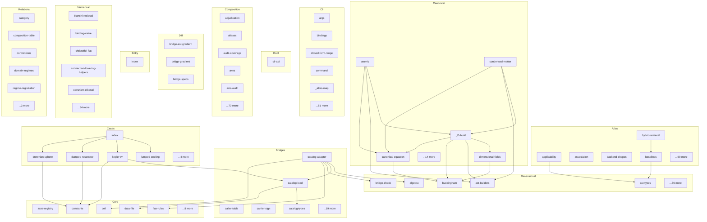

<!-- repo-map:no-verification -->
<!-- GENERATED FILE -- do not edit by hand. Edit the generator at
     tools/create-dependency-graph/create-dependency-graph.ts, then run
     `npm run docs:deps`. Hand edits are caught by the docs-fresh job. -->

# universal-physics-tensor - Dependency Graph

**Version**: 9.0.0

This document provides a comprehensive dependency graph of all files, components, imports, functions, and variables in the codebase.

---

## Table of Contents

1. [Overview](#overview)
2. [Atlas Dependencies](#atlas-dependencies)
3. [Bridges Dependencies](#bridges-dependencies)
4. [Canonical Dependencies](#canonical-dependencies)
5. [Cases Dependencies](#cases-dependencies)
6. [Cli Dependencies](#cli-dependencies)
7. [Root Dependencies](#root-dependencies)
8. [Composition Dependencies](#composition-dependencies)
9. [Core Dependencies](#core-dependencies)
10. [Diff Dependencies](#diff-dependencies)
11. [Dimensional Dependencies](#dimensional-dependencies)
12. [Entry Dependencies](#entry-dependencies)
13. [Numerical Dependencies](#numerical-dependencies)
14. [Relations Dependencies](#relations-dependencies)
15. [Dependency Matrix](#dependency-matrix)
16. [Circular Dependency Analysis](#circular-dependency-analysis)
17. [Visual Dependency Graph](#visual-dependency-graph)
18. [Summary Statistics](#summary-statistics)

---

## Overview

The codebase is organized into the following modules:

- **atlas**: 74 files
- **bridges**: 24 files
- **canonical**: 19 files
- **cases**: 9 files
- **cli**: 56 files
- **root**: 1 file
- **composition**: 75 files
- **core**: 13 files
- **diff**: 3 files
- **dimensional**: 41 files
- **entry**: 1 file
- **numerical**: 39 files
- **relations**: 8 files

---

## Atlas Dependencies

### `src/atlas/applicability.ts` - Atlas Phase 4, S4.1 — the applicability checker.

**Internal Dependencies:**
| File | Imports | Type |
|------|---------|------|
| `../dimensional/ast-types.js` | `ExprNode` | Import (type-only) |
| `../dimensional/validator.js` | `validate` | Import |
| `./model.js` | `AtlasModel` | Import (type-only) |
| `./types.js` | `Conventions` | Import (type-only) |
| `./conventions.js` | `checkConventions, unknownConventionKeys` | Import |

**Exports:**
- Interfaces: `ApplicabilityFinding`, `ApplicabilityInput`
- Functions: `checkApplicability`, `blockingFindings`

---

### `src/atlas/association.ts` - Atlas Phase 1 — the association registry.

**Exports:**
- Interfaces: `Association`
- Functions: `associationFor`
- Constants: `ASSOCIATIONS`

---

### `src/atlas/benchmark/backend-shapes.ts` - Atlas Phase 5, S5.3 — request and response SHAPES for the out-of-process

**Internal Dependencies:**
| File | Imports | Type |
|------|---------|------|
| `../types.js` | `RelationType` | Import (type-only) |

**Exports:**
- Interfaces: `BenchmarkBackendRequest`, `BenchmarkBackendResponse`, `BackendShapeError`
- Functions: `parseBackendResponse`

---

### `src/atlas/benchmark/baselines.ts` - Atlas Phase 5, S5.3 — the deterministic, in-tree BASELINE conditions and the

**Internal Dependencies:**
| File | Imports | Type |
|------|---------|------|
| `../../dimensional/ast-types.js` | `ExprNode` | Import (type-only) |
| `./leakage.js` | `leakageKey` | Import |

**Exports:**
- Interfaces: `CorpusRecord`, `RetrievalQuery`
- Functions: `rankByTextOverlap`, `rankBySymbolOverlap`, `rankByStructure`, `recallAtK`

---

### `src/atlas/benchmark/hybrid-retrieval.ts` - Optional embedding retrieval. An embedder proposes an order. `rankByStructure`

**Internal Dependencies:**
| File | Imports | Type |
|------|---------|------|
| `../../canonical/registry.js` | `CANONICAL_EQUATIONS` | Import |
| `./baselines.js` | `rankByStructure, CorpusRecord, RetrievalQuery` | Import |

**Exports:**
- Classes: `EmbeddingUnavailable`
- Interfaces: `OllamaEmbedderOptions`, `HybridRetrieval`
- Functions: `queryInput`, `stubVector`, `cosine`, `rankByCosine`, `decodeFloat32`, `canonicalRetrievalCorpus`, `ollamaEmbedder`, `retrieveHybrid`
- Constants: `EMBEDDING_INSTRUCTION`, `OLLAMA_EMBEDDING_MODEL`, `FROZEN_VECTOR_DIMS`, `FROZEN_VECTOR_SHA256`, `OLLAMA_TIMEOUT_MS`, `ATLAS_ONLY_NOTE`, `PROPOSAL_NOTE`, `stubEmbedder`

---

### `src/atlas/benchmark/leakage.ts` - Atlas Phase 5, S5.1 — leakage checks for the invalid-bridge benchmark.

**Internal Dependencies:**
| File | Imports | Type |
|------|---------|------|
| `../../canonical/normal-form.js` | `normalForm` | Import |
| `../../dimensional/ast-types.js` | `ExprNode` | Import (type-only) |
| `../../dimensional/types.js` | `Dimension` | Import (type-only) |
| `./types.js` | `BenchmarkItem` | Import (type-only) |

**Exports:**
- Interfaces: `LeakageCollision`, `VariantProblem`
- Functions: `leakageKey`, `findCrossSplitLeakage`, `checkRenamedVariants`

---

### `src/atlas/benchmark/loader.ts` - Atlas Phase 5, S5.1 — load and validate benchmark items.

**Node.js Built-in Dependencies:**
| Module | Import |
|--------|--------|
| `fs` | `readFileSync` |
| `path` | `join` |

**Internal Dependencies:**
| File | Imports | Type |
|------|---------|------|
| `./types.js` | `HELD_OUT_FAMILY` | Import |
| `./types.js` | `BenchmarkItem` | Import (type-only) |

**Exports:**
- Classes: `BenchmarkAdmissionError`
- Interfaces: `ItemProblem`
- Functions: `validateItems`, `loadFrozenItems`, `loadContestedDrafts`

---

### `src/atlas/benchmark/run-atlas.ts` - Atlas Phase 5, S5.2 — the ATLAS condition of the invalid-bridge benchmark.

**Internal Dependencies:**
| File | Imports | Type |
|------|---------|------|
| `../applicability.js` | `checkApplicability` | Import |
| `../applicability.js` | `ApplicabilityFindingKind` | Import (type-only) |
| `../composition-table.js` | `composeRelation, NO_COMPOSITE_CLAIM` | Import |
| `../regime.js` | `regimeHolds` | Import |
| `../types.js` | `RelationType` | Import (type-only) |
| `./types.js` | `BenchmarkItem, FailureKind` | Import (type-only) |

**Exports:**
- Interfaces: `AtlasVerdict`, `AtlasRunConfig`
- Functions: `runAtlasOnItem`, `runAtlasCondition`
- Constants: `FULL_CONFIG`, `ABLATION_CONFIGS`

---

### `src/atlas/benchmark/stats.ts` - Atlas Phase 5, S5.4 — the benchmark's statistics and power report.

**Exports:**
- Interfaces: `Interval`, `PairedTable`, `McNemarResult`, `PowerReport`
- Functions: `wilsonInterval`, `mcnemar`, `pairedDifferenceInterval`, `cohensKappa`, `powerReport`
- Constants: `Z95`

---

### `src/atlas/benchmark/study.ts` - Atlas Phase 6, S6.1 — scoring a benchmark condition against the answer key.

**Internal Dependencies:**
| File | Imports | Type |
|------|---------|------|
| `./types.js` | `FAILURE_KINDS` | Import |
| `./types.js` | `FailureKind` | Import (type-only) |
| `./stats.js` | `mcnemar, pairedDifferenceInterval, wilsonInterval` | Import |
| `./stats.js` | `Interval, McNemarResult` | Import (type-only) |

**Exports:**
- Interfaces: `ConditionAnswer`, `ItemLabel`, `LabelProblem`, `ConditionMetrics`, `PairedRejection`, `AblationRow`
- Functions: `validateLabels`, `scoreCondition`, `pairedRejection`, `scoreAblation`

---

### `src/atlas/benchmark/types.ts` - Atlas Phase 5, S5.1 — the invalid-bridge benchmark's item schema.

**Internal Dependencies:**
| File | Imports | Type |
|------|---------|------|
| `../../dimensional/ast-types.js` | `ExprNode` | Import (type-only) |
| `../types.js` | `Conventions, RegimeInequality, RelationType` | Import (type-only) |

**Exports:**
- Interfaces: `BenchmarkItem`
- Constants: `FAILURE_KINDS`, `HELD_OUT_FAMILY`, `HELD_OUT_MARKERS`

---

### `src/atlas/bridge-record.ts` - One catalog bridge, joined to the canonical foreign key and the generated

**Internal Dependencies:**
| File | Imports | Type |
|------|---------|------|
| `../bridges/evaluators.js` | `BRIDGE_EVALUATORS` | Import |
| `../canonical/registry.js` | `CANONICAL_EQUATIONS` | Import |
| `../composition/descriptor.js` | `getBridge` | Import |
| `./catalog-formal-ref.js` | `catalogFormalRef` | Import |

**Exports:**
- Functions: `catalogBridgeRecord`

---

### `src/atlas/catalog-formal-ref.ts` - Catalog formal references.

**Internal Dependencies:**
| File | Imports | Type |
|------|---------|------|
| `../relations/types.js` | `FormalRef` | Import (type-only) |
| `../bridges/catalog-load.js` | `catalogEntry` | Import |
| `./physjs-ref.js` | `physjsFormalRef` | Import |

**Exports:**
- Functions: `catalogFormalRef`

---

### `src/atlas/chain-pipeline.ts` - Internal bridge-discovery pipeline.

**Internal Dependencies:**
| File | Imports | Type |
|------|---------|------|
| `../dimensional/validator.js` | `ExprNode` | Import (type-only) |
| `../dimensional/types.js` | `Dimension` | Import (type-only) |
| `../dimensional/types.js` | `DIMENSIONLESS` | Import |
| `../dimensional/algebra.js` | `equals` | Import |
| `../dimensional/symbolic-constants.js` | `CONSTANTS` | Import |
| `../composition/edge.js` | `BridgeEdge` | Import (type-only) |
| `../composition/enumerate.js` | `enumerateCompositionsWithRefusals` | Import |
| `../composition/buckingham-filter.js` | `buckinghamFilter` | Import |
| `../composition/chain-match.js` | `matchChain` | Import |
| `../composition/chain-candidate.js` | `compareChainEdgeIds, ChainCandidate` | Import |
| `../composition/chain-result.js` | `chainOrderKey, orderChainRecords, ChainRecord` | Import |
| `../composition/chain-regime.js` | `joinRegimeMismatch, ChainRegimeMismatch` | Import |
| `./physjs-ref.js` | `bridgeSeedKeys, physjsTheorem` | Import |
| `./proof-target.js` | `emitProofTarget` | Import |
| `../composition/mathts-scalar-symbols.js` | `scalarSymbolsFromMathTs` | Import |

**Exports:**
- Interfaces: `ChainConfirmationRecord`, `ChainRestatementRecord`, `ChainStubRecord`, `ChainCompositionRefusal`
- Functions: `governingOf`, `renderChainRecord`, `runChainPipeline`

---

### `src/atlas/composition-table.ts` - Re-export of the composition table. The table lives in

**Internal Dependencies:**
| File | Imports | Type |
|------|---------|------|
| `../relations/composition-table.js` | `COMPOSITION_TABLE, composeRelation, NO_COMPOSITE_CLAIM` | Re-export |

**Exports:**
- Re-exports: `COMPOSITION_TABLE`, `composeRelation`, `NO_COMPOSITE_CLAIM`

---

### `src/atlas/conventions.ts` - Re-export of the convention comparison. The implementation lives in

**Internal Dependencies:**
| File | Imports | Type |
|------|---------|------|
| `../relations/conventions.js` | `checkConventions, unknownConventionKeys` | Re-export |
| `../relations/conventions.js` | `ConventionKey` | Re-export |

**Exports:**
- Re-exports: `checkConventions`, `unknownConventionKeys`, `ConventionKey`

---

### `src/atlas/coverage.ts` - Atlas Phase 1, S1.3 — evidence coverage, counted BY TAG.

**Internal Dependencies:**
| File | Imports | Type |
|------|---------|------|
| `./types.js` | `ALL_EVIDENCE_TAGS` | Import |
| `./types.js` | `EvidenceTag` | Import (type-only) |
| `./types.js` | `ALL_EVIDENCE_TAGS` | Re-export |

**Exports:**
- Interfaces: `EvidenceCoverage`, `OverlayCoverage`, `OverlayBearing`, `ReviewStatusBearing`
- Functions: `summarizeEvidence`, `overlayCoverage`
- Re-exports: `ALL_EVIDENCE_TAGS`

---

### `src/atlas/derivation.ts` - Atlas Phase 3 — `Derivation` (a hyperedge) and multicategory composition.

**Internal Dependencies:**
| File | Imports | Type |
|------|---------|------|
| `./composition-table.js` | `composeRelation, NO_COMPOSITE_CLAIM` | Import |
| `./composition-table.js` | `CompositionResult` | Import (type-only) |
| `./statement.js` | `statementContextUnion` | Import |
| `./statement.js` | `ContextUnionResult, Statement, StatementId` | Import (type-only) |
| `./types.js` | `RelationType` | Import (type-only) |

**Exports:**
- Classes: `DerivationCompositionError`
- Interfaces: `Derivation`, `CompositeFormed`, `CompositeRefused`
- Functions: `makeDerivation`, `composeDerivations`, `composeDerivationsOrThrow`

---

### `src/atlas/derive-evidence.ts` - Atlas Phase 1, S1.3 — evidence tags, DERIVED AT READ TIME.

**Internal Dependencies:**
| File | Imports | Type |
|------|---------|------|
| `./types.js` | `Conventions, EvidenceTag, FormalFidelity, FormalRefKind` | Import (type-only) |
| `./catalog-formal-ref.js` | `catalogFormalRef` | Import |

**Exports:**
- Interfaces: `WitnessLike`, `CounterexampleLike`, `RejectionLike`, `EvidenceInput`
- Functions: `counterexamplesWithRejection`, `deriveEvidence`, `provedWithUnresolvedCounterexample`, `catalogEvidenceInput`, `deriveEvidenceForVerdict`, `deriveCompositeEvidence`
- Constants: `NO_PASSING_WITNESSES`

---

### `src/atlas/diffusion/bridges-closure.ts` - Atlas Phase 4 — the five diffusion-family bridges added to close Sprint 4's

**Internal Dependencies:**
| File | Imports | Type |
|------|---------|------|
| `../../dimensional/types.js` | `ENERGY, LENGTH, MASS, TIME, VELOCITY` | Import |
| `../oscillators/bridges-limits.js` | `makeApproximation` | Import |
| `../oscillators/dimensions.js` | `DAMPING` | Import |
| `../regime.js` | `deriveRegimeGroups` | Import |
| `../physjs-ref.js` | `physjsFormalRef` | Import |
| `../types.js` | `AtlasBridge` | Import (type-only) |
| `../waves/models.js` | `WAVENUMBER` | Import |
| `./dimensions.js` | `DENSITY, DIFFUSIVITY, SPECIFIC_HEAT, THERMAL_CONDUCTIVITY` | Import |
| `./models.js` | `DIFFUSION_FAMILY_NAME, VISCOSITY` | Import |
| `./numerics.js` | `telegraphSlowRateRatio, telegraphWaveFrequencyRatio` | Import |

**Exports:**
- Constants:

  ```text
  LANGEVIN_MAX_TAU_RATIO, TELEGRAPH_FICK_MAX_EPS, TELEGRAPH_WAVE_MIN_EPS, STEADY_MIN_FOURIER,
  BRIDGE_LANGEVIN_DIFFUSION, BRIDGE_STOKES_EINSTEIN, BRIDGE_TELEGRAPH_DIFFUSION,
  BRIDGE_TELEGRAPH_WAVE, BRIDGE_HEAT_LAPLACE, DIFFUSION_CLOSURE_BRIDGES
  ```


---

### `src/atlas/diffusion/bridges.ts` - Atlas Phase 4, S4.4 — the three bridges of the diffusion family.

**Internal Dependencies:**
| File | Imports | Type |
|------|---------|------|
| `../../dimensional/types.js` | `LENGTH, MASS, ACTION, TIME` | Import |
| `../regime.js` | `deriveRegimeGroups` | Import |
| `../types.js` | `AtlasBridge` | Import (type-only) |
| `./dimensions.js` | `DENSITY, DIFFUSIVITY, SPECIFIC_HEAT, THERMAL_CONDUCTIVITY` | Import |
| `./models.js` | `DIFFUSION_FAMILY_NAME` | Import |

**Exports:**
- Constants: `WALK_MAX_STEP_FRACTION`, `BRIDGE_WALK_DIFFUSION`, `BRIDGE_HEAT_DIFFUSION`, `BRIDGE_SCHRODINGER_DIFFUSION`, `DIFFUSION_BRIDGES`

---

### `src/atlas/diffusion/dimensions.ts` - Dimension constants the diffusion family needs that the canonical entry

**Internal Dependencies:**
| File | Imports | Type |
|------|---------|------|
| `../../dimensional/ast-builders.js` | `dim` | Import |
| `../../dimensional/types.js` | `Dimension` | Import (type-only) |

**Exports:**
- Constants: `DIFFUSIVITY`, `THERMAL_CONDUCTIVITY`, `DENSITY`, `SPECIFIC_HEAT`

---

### `src/atlas/diffusion/index.ts` - Diffusion-family assembly (Atlas Phase 4, S4.4).

**Internal Dependencies:**
| File | Imports | Type |
|------|---------|------|
| `../family.js` | `AtlasFamily` | Import (type-only) |
| `./bridges.js` | `DIFFUSION_BRIDGES` | Import |
| `./bridges-closure.js` | `DIFFUSION_CLOSURE_BRIDGES` | Import |
| `./models.js` | `DIFFUSION_FAMILY_NAME, DIFFUSION_MODELS` | Import |

**Exports:**
- Constants: `DIFFUSION_FAMILY`

---

### `src/atlas/diffusion/models.ts` - Atlas Phase 4, S4.4 — the four models of the diffusion family.

**Internal Dependencies:**
| File | Imports | Type |
|------|---------|------|
| `../../dimensional/buckingham.js` | `DimensionalVariable` | Import (type-only) |
| `../../dimensional/types.js` | `ACTION, ENERGY, LENGTH, MASS, TIME` | Import |
| `../../dimensional/ast-builders.js` | `dim` | Import |
| `../../dimensional/types.js` | `Dimension` | Import (type-only) |
| `../oscillators/dimensions.js` | `DAMPING` | Import |
| `../model.js` | `AtlasModel` | Import (type-only) |
| `../regime.js` | `deriveRegimeGroups` | Import |
| `./dimensions.js` | `DENSITY, DIFFUSIVITY, SPECIFIC_HEAT, THERMAL_CONDUCTIVITY` | Import |

**Exports:**
- Functions: `getDiffusionModel`
- Constants: `DIFFUSION_FAMILY_NAME`, `VISCOSITY`, `DIFFUSION_MODELS`

---

### `src/atlas/diffusion/numerics.ts` - Atlas Phase 4, S4.4 — the numerics behind the diffusion family's witnesses.

**External Dependencies:**
| Package | Import |
|---------|--------|
| `@danielsimonjr/mathts-functions` | `solveODESystem` |

**Exports:**
- Interfaces: `HeatFixture`, `WickFixture`, `LangevinFixture`, `SteadyStateFixture`
- Functions:

  ```text
  diffusionKernel, randomWalkCentralDensity, randomWalkDensity, gaussianSpread, heatFtcsCentre,
  wickHeatResidual, wickKernelSquaredNorm, langevinMsdRatio, telegraphSlowRateRatio,
  telegraphWaveFrequencyRatio, heatSteadyDeviation
  ```


---

### `src/atlas/error-algebra.ts` - The Phase 0 error algebra: composition of Lipschitz-plus-offset bounds.

**Internal Dependencies:**
| File | Imports | Type |
|------|---------|------|
| `./types.js` | `MissingLipschitzError` | Import |

**Exports:**
- Interfaces: `BoundPair`, `ComposedPath`
- Functions: `composeBounds`, `composeBoundPath`
- Constants: `IDENTITY_BOUND`

---

### `src/atlas/export.ts` - Atlas Phase 6, S6.4 — the versioned export: one combined JSON artifact for

**Internal Dependencies:**
| File | Imports | Type |
|------|---------|------|
| `./family.js` | `AtlasFamily` | Import (type-only) |
| `./serialize.js` | `AtlasRecordJson` | Import (type-only) |
| `./serialize.js` | `toAtlasJson` | Import |
| `./witness-artifact.js` | `WitnessResultsArtifact` | Import (type-only) |

**Exports:**
- Interfaces: `QudtResolution`, `CombinedAtlasJson`
- Functions: `toCombinedAtlasJson`, `toAtlasJsonLd`
- Constants: `ATLAS_ID_PREFIX`

---

### `src/atlas/families.ts` - Every registered atlas family, in the order they were built.

**Internal Dependencies:**
| File | Imports | Type |
|------|---------|------|
| `./diffusion/index.js` | `DIFFUSION_FAMILY` | Import |
| `./oscillators/index.js` | `OSCILLATOR_FAMILY` | Import |
| `./waves/index.js` | `WAVES_FAMILY` | Import |
| `./family.js` | `AtlasFamily` | Import (type-only) |
| `./regime.js` | `admitApproximation` | Import |

**Exports:**
- Functions: `admitFamilies`
- Constants: `ATLAS_FAMILIES`

---

### `src/atlas/family.ts` - The shape of one atlas family. A leaf module: every family index, the

**Internal Dependencies:**
| File | Imports | Type |
|------|---------|------|
| `./model.js` | `AtlasModel` | Import (type-only) |
| `./types.js` | `AtlasBridge, AtlasRejection` | Import (type-only) |

---

### `src/atlas/index.ts` - Atlas Phase 0 barrel — the oscillator pilot.

**Internal Dependencies:**
| File | Imports | Type |
|------|---------|------|
| `./types.js` | `RelationType, EvidenceTag, LimitCharacter, RegimeInequality, Regime, ApproximationBound, Witness, Counterexample, AtlasBridge, AtlasRejection, FormalFidelity, FormalRef, FormalRefKind, NormTransport` | Re-export |
| `./types.js` | `MissingDeltaAtError, MissingHorizonError, MissingLipschitzError` | Re-export |
| `./types.js` | `ALL_EVIDENCE_TAGS` | Re-export |
| `./derive-evidence.js` | `deriveCompositeEvidence, deriveEvidence, deriveEvidenceForVerdict, NO_PASSING_WITNESSES, provedWithUnresolvedCounterexample` | Re-export |
| `./derive-evidence.js` | `CounterexampleLike, EvidenceInput, MembershipVerdict, RejectionLike, WitnessLike` | Re-export |
| `./composition-table.js` | `composeRelation, COMPOSITION_TABLE, NO_COMPOSITE_CLAIM` | Re-export |
| `./composition-table.js` | `CompositionResult, NoCompositeClaim` | Re-export |
| `./path-bound.js` | `boundPath, findAtlasPath, findPath, horizonOnRoute, routeEntryModels` | Re-export |
| `./path-bound.js` | `AppliedTransport, NoClaimReason, PathBoundClaim, PathBoundResult, PathNoClaim` | Re-export |
| `./model.js` | `AtlasModel, ModelId` | Re-export |
| `./error-algebra.js` | `composeBounds, composeBoundPath, IDENTITY_BOUND` | Re-export |
| `./error-algebra.js` | `BoundPair, ComposedPath` | Re-export |
| `./regime.js` | `deriveRegimeGroups, regimeHolds` | Re-export |
| `./regime.js` | `RegimeCheck` | Re-export |
| `./oscillators/dimensions.js` | `CAPACITANCE, CUBIC_STIFFNESS, DAMPING, INDUCTANCE, RESISTANCE, SPRING_CONSTANT` | Re-export |
| `./oscillators/models.js` | `ATLAS_MODELS, getAtlasModel` | Re-export |
| `./oscillators/index.js` | `OSCILLATOR_FAMILY` | Re-export |
| `./family.js` | `AtlasFamily` | Re-export |
| `./serialize.js` | `toAtlasJson, ATLAS_RECORD_SCHEMA_VERSION` | Re-export |
| `./serialize.js` | `AtlasRecordJson, JsonValue` | Re-export |
| `./applicability.js` | `blockingFindings, checkApplicability` | Re-export |
| `./applicability.js` | `ApplicabilityFinding, ApplicabilityFindingKind, ApplicabilityInput, ApplicabilitySeverity` | Re-export |
| `./witness-result.js` | `passingWitnessIds` | Re-export |
| `./witness-result.js` | `UnresolvedReason, WitnessRunResult, WitnessStatus` | Re-export |
| `./families.js` | `ATLAS_FAMILIES` | Re-export |
| `./link-prediction.js` | `runLinkPrediction` | Re-export |
| `./export.js` | `ATLAS_ID_PREFIX, toAtlasJsonLd, toCombinedAtlasJson` | Re-export |
| `./export.js` | `QudtResolution` | Re-export |
| `./link-prediction.js` | `LinkPredictionResult, LinkPredictionTrial` | Re-export |
| `./diffusion/index.js` | `DIFFUSION_FAMILY` | Re-export |
| `./diffusion/bridges.js` | `BRIDGE_HEAT_DIFFUSION, BRIDGE_SCHRODINGER_DIFFUSION, BRIDGE_WALK_DIFFUSION, DIFFUSION_BRIDGES` | Re-export |
| `./diffusion/models.js` | `DIFFUSION_MODELS, getDiffusionModel` | Re-export |
| `./waves/index.js` | `WAVES_FAMILY` | Re-export |
| `./waves/bridges.js` | `BRIDGE_KLEIN_GORDON_WAVE, BRIDGE_SOUND_SPEED, BRIDGE_STRING_WAVE, BRIDGE_WAVE_DALEMBERT, WAVE_BRIDGES` | Re-export |
| `./waves/models.js` | `WAVE_MODELS` | Re-export |
| `./diffusion/bridges-closure.js` | `DIFFUSION_CLOSURE_BRIDGES` | Re-export |
| `./waves/bridges-closure.js` | `WAVE_CLOSURE_BRIDGES` | Re-export |
| `./benchmark/types.js` | `FAILURE_KINDS, HELD_OUT_FAMILY, HELD_OUT_MARKERS` | Re-export |
| `./benchmark/types.js` | `Authorship, BenchmarkItem, BenchmarkSplit, FailureKind` | Re-export |
| `./benchmark/leakage.js` | `checkRenamedVariants, findCrossSplitLeakage, leakageKey` | Re-export |
| `./benchmark/leakage.js` | `LeakageCollision, VariantProblem` | Re-export |
| `./benchmark/run-atlas.js` | `ABLATION_CONFIGS, FULL_CONFIG, runAtlasCondition, runAtlasOnItem` | Re-export |
| `./benchmark/run-atlas.js` | `AtlasRunConfig, AtlasVerdict` | Re-export |
| `./benchmark/baselines.js` | `rankBySymbolOverlap, rankByStructure, rankByTextOverlap, recallAtK` | Re-export |
| `./benchmark/baselines.js` | `CorpusRecord, Ranking, RetrievalQuery` | Re-export |
| `./benchmark/hybrid-retrieval.js` | `ATLAS_ONLY_NOTE, EMBEDDING_INSTRUCTION, FROZEN_VECTOR_DIMS, FROZEN_VECTOR_SHA256, OLLAMA_EMBEDDING_MODEL, OLLAMA_TIMEOUT_MS, PROPOSAL_NOTE, EmbeddingUnavailable, canonicalRetrievalCorpus, cosine, decodeFloat32, ollamaEmbedder, queryInput, rankByCosine, retrieveHybrid, stubEmbedder, stubVector` | Re-export |
| `./benchmark/hybrid-retrieval.js` | `Embedder, EmbeddingFallbackReason, HybridRetrieval, OllamaEmbedderOptions` | Re-export |
| `./benchmark/backend-shapes.js` | `parseBackendResponse` | Re-export |
| `./benchmark/stats.js` | `cohensKappa, mcnemar, pairedDifferenceInterval, powerReport, wilsonInterval, Z95` | Re-export |
| `./benchmark/stats.js` | `Interval, McNemarResult, PairedTable, PowerReport` | Re-export |
| `./benchmark/study.js` | `pairedRejection, scoreAblation, scoreCondition` | Re-export |
| `./benchmark/study.js` | `AblationRow, ConditionAnswer, ConditionMetrics, ItemLabel, PairedRejection` | Re-export |
| `./benchmark/backend-shapes.js` | `BackendShapeError, BenchmarkBackendRequest, BenchmarkBackendResponse` | Re-export |
| `./witness-artifact.js` | `runWitnessRegistry, artifactPassingWitnessIds` | Re-export |
| `./witness-artifact.js` | `WitnessResultRecord, WitnessResultsArtifact` | Re-export |
| `./witness-specs.js` | `WITNESS_REGISTRY` | Re-export |
| `./witness-specs.js` | `RegisteredNumericWitness, RegisteredSymbolicWitness, RegisteredWitness` | Re-export |
| `./witness-symbolic.js` | `runSymbolicWitness` | Re-export |
| `./witness-symbolic.js` | `SymbolicSimplifier, SymbolicWitnessSpec` | Re-export |
| `./witness-numeric.js` | `runNumericWitness` | Re-export |
| `./witness-numeric.js` | `Convergence, NumericWitnessRunResult, NumericWitnessSpec` | Re-export |
| `./statement.js` | `contextUnion, statementContextUnion` | Re-export |
| `./statement.js` | `Context, ContextUnionFormed, ContextUnionRefused, ContextUnionResult, NoUnionReason, Statement, StatementId` | Re-export |
| `./derivation.js` | `composeDerivations, composeDerivationsOrThrow, DerivationCompositionError, makeDerivation` | Re-export |
| `./derivation.js` | `CompositeFormed, CompositeRefused, Derivation, DerivationCompositionResult, DerivationId, DerivationSpec, NoCompositeReason` | Re-export |

**Exports:**
- Re-exports:

  ```text
  RelationType, EvidenceTag, LimitCharacter, RegimeInequality, Regime, ApproximationBound, Witness,
  Counterexample, AtlasBridge, AtlasRejection, FormalFidelity, FormalRef, FormalRefKind,
  NormTransport, MissingDeltaAtError, MissingHorizonError, MissingLipschitzError, ALL_EVIDENCE_TAGS,
  deriveCompositeEvidence, deriveEvidence, deriveEvidenceForVerdict, NO_PASSING_WITNESSES,
  provedWithUnresolvedCounterexample, CounterexampleLike, EvidenceInput, MembershipVerdict,
  RejectionLike, WitnessLike, composeRelation, COMPOSITION_TABLE, NO_COMPOSITE_CLAIM,
  CompositionResult, NoCompositeClaim, boundPath, findAtlasPath, findPath, horizonOnRoute,
  routeEntryModels, AppliedTransport, NoClaimReason, PathBoundClaim, PathBoundResult, PathNoClaim,
  AtlasModel, ModelId, composeBounds, composeBoundPath, IDENTITY_BOUND, BoundPair, ComposedPath,
  deriveRegimeGroups, regimeHolds, RegimeCheck, CAPACITANCE, CUBIC_STIFFNESS, DAMPING, INDUCTANCE,
  RESISTANCE, SPRING_CONSTANT, ATLAS_MODELS, getAtlasModel, OSCILLATOR_FAMILY, AtlasFamily,
  toAtlasJson, ATLAS_RECORD_SCHEMA_VERSION, AtlasRecordJson, JsonValue, blockingFindings,
  checkApplicability, ApplicabilityFinding, ApplicabilityFindingKind, ApplicabilityInput,
  ApplicabilitySeverity, passingWitnessIds, UnresolvedReason, WitnessRunResult, WitnessStatus,
  ATLAS_FAMILIES, runLinkPrediction, ATLAS_ID_PREFIX, toAtlasJsonLd, toCombinedAtlasJson,
  QudtResolution, LinkPredictionResult, LinkPredictionTrial, DIFFUSION_FAMILY, BRIDGE_HEAT_DIFFUSION,
  BRIDGE_SCHRODINGER_DIFFUSION, BRIDGE_WALK_DIFFUSION, DIFFUSION_BRIDGES, DIFFUSION_MODELS,
  getDiffusionModel, WAVES_FAMILY, BRIDGE_KLEIN_GORDON_WAVE, BRIDGE_SOUND_SPEED, BRIDGE_STRING_WAVE,
  BRIDGE_WAVE_DALEMBERT, WAVE_BRIDGES, WAVE_MODELS, DIFFUSION_CLOSURE_BRIDGES, WAVE_CLOSURE_BRIDGES,
  FAILURE_KINDS, HELD_OUT_FAMILY, HELD_OUT_MARKERS, Authorship, BenchmarkItem, BenchmarkSplit,
  FailureKind, checkRenamedVariants, findCrossSplitLeakage, leakageKey, LeakageCollision,
  VariantProblem, ABLATION_CONFIGS, FULL_CONFIG, runAtlasCondition, runAtlasOnItem, AtlasRunConfig,
  AtlasVerdict, rankBySymbolOverlap, rankByStructure, rankByTextOverlap, recallAtK, CorpusRecord,
  Ranking, RetrievalQuery, ATLAS_ONLY_NOTE, EMBEDDING_INSTRUCTION, FROZEN_VECTOR_DIMS,
  FROZEN_VECTOR_SHA256, OLLAMA_EMBEDDING_MODEL, OLLAMA_TIMEOUT_MS, PROPOSAL_NOTE,
  EmbeddingUnavailable, canonicalRetrievalCorpus, cosine, decodeFloat32, ollamaEmbedder, queryInput,
  rankByCosine, retrieveHybrid, stubEmbedder, stubVector, Embedder, EmbeddingFallbackReason,
  HybridRetrieval, OllamaEmbedderOptions, parseBackendResponse, cohensKappa, mcnemar,
  pairedDifferenceInterval, powerReport, wilsonInterval, Z95, Interval, McNemarResult, PairedTable,
  PowerReport, pairedRejection, scoreAblation, scoreCondition, AblationRow, ConditionAnswer,
  ConditionMetrics, ItemLabel, PairedRejection, BackendShapeError, BenchmarkBackendRequest,
  BenchmarkBackendResponse, runWitnessRegistry, artifactPassingWitnessIds, WitnessResultRecord,
  WitnessResultsArtifact, WITNESS_REGISTRY, RegisteredNumericWitness, RegisteredSymbolicWitness,
  RegisteredWitness, runSymbolicWitness, SymbolicSimplifier, SymbolicWitnessSpec, runNumericWitness,
  Convergence, NumericWitnessRunResult, NumericWitnessSpec, contextUnion, statementContextUnion,
  Context, ContextUnionFormed, ContextUnionRefused, ContextUnionResult, NoUnionReason, Statement,
  StatementId, composeDerivations, composeDerivationsOrThrow, DerivationCompositionError,
  makeDerivation, CompositeFormed, CompositeRefused, Derivation, DerivationCompositionResult,
  DerivationId, DerivationSpec, NoCompositeReason
  ```


---

### `src/atlas/link-prediction.ts` - Atlas Phase 6, S6.3 — link prediction over the typed model graph: ONE result,

**Internal Dependencies:**
| File | Imports | Type |
|------|---------|------|
| `./family.js` | `AtlasFamily` | Import (type-only) |
| `./model.js` | `AtlasModel` | Import (type-only) |

**Exports:**
- Interfaces: `LinkPredictionTrial`, `LinkPredictionResult`
- Functions: `runLinkPrediction`

---

### `src/atlas/model.ts` - The `Model` record — Phase 3's promotion of the Phase 0 `AtlasModel`.

**Internal Dependencies:**
| File | Imports | Type |
|------|---------|------|
| `../dimensional/buckingham.js` | `DimensionalVariable` | Import (type-only) |
| `./types.js` | `Regime` | Import (type-only) |

---

### `src/atlas/oscillators/bridges-coarse.ts` - Bridge 5 of the oscillator pilot: the COARSE-GRAINING bridge from the

**Internal Dependencies:**
| File | Imports | Type |
|------|---------|------|
| `../../dimensional/types.js` | `LENGTH, MASS, VELOCITY` | Import |
| `../regime.js` | `deriveRegimeGroups` | Import |
| `../types.js` | `AtlasBridge, RelationContract` | Import (type-only) |
| `./bridges-exact.js` | `relationContractOf` | Import |
| `./dimensions.js` | `SPRING_CONSTANT` | Import |

**Exports:**
- Functions: `latticeDispersion`, `continuumDispersion`, `chainWaveSpeed`, `latticeBandEdge`, `dispersionErrorApproximation`
- Constants: `BRIDGE_CHAIN_WAVE`, `CONTRACT_CHAIN_WAVE`

---

### `src/atlas/oscillators/bridges-exact.ts` - The two Phase 0 `exact-equivalence` bridges of design note §3.

**Internal Dependencies:**
| File | Imports | Type |
|------|---------|------|
| `../physjs-ref.js` | `physjsFormalRef` | Import |
| `../regime.js` | `deriveRegimeGroups` | Import |
| `./models.js` | `getAtlasModel` | Import |
| `../types.js` | `AtlasBridge, Regime, RelationContract` | Import (type-only) |
| `./norm-transport.js` | `SPRING_LC_RELATIVE_PERIOD_TRANSPORT` | Import |

**Exports:**
- Functions: `relationContractOf`
- Constants: `BRIDGE_SPRING_LC`, `BRIDGE_DAMPED_RLC`, `CONTRACT_SPRING_LC`, `CONTRACT_DAMPED_RLC`

---

### `src/atlas/oscillators/bridges-limits.ts` - The two Phase 0 APPROXIMATION bridges — design note §3, bridges 3 and 4.

**Internal Dependencies:**
| File | Imports | Type |
|------|---------|------|
| `../physjs-ref.js` | `physjsFormalRef` | Import |
| `../regime.js` | `deriveRegimeGroups` | Import |
| `../types.js` | `MissingHorizonError` | Import |
| `../types.js` | `ApproximationBound, AtlasBridge, RelationContract, Regime` | Import (type-only) |
| `./bridges-exact.js` | `relationContractOf` | Import |
| `./dimensions.js` | `DAMPING, SPRING_CONSTANT` | Import |
| `./norms.js` | `RELATIVE_PERIOD_NORM` | Import |
| `../../dimensional/types.js` | `ACCELERATION, LENGTH, MASS` | Import |

**Exports:**
- Functions: `makeApproximation`, `agm`, `pendulumPeriodErrorAt`, `dampedOffsetBoundAt`
- Constants: `AB_PENDULUM_LINEAR`, `AB_DAMPED_MASSLESS`, `LIMIT_BRIDGES`, `CONTRACT_PENDULUM_LINEAR`, `CONTRACT_DAMPED_MASSLESS`, `LIMIT_CONTRACTS`

---

### `src/atlas/oscillators/dimensions.ts` - Dimension constants the oscillator pilot needs that the canonical entry

**Internal Dependencies:**
| File | Imports | Type |
|------|---------|------|
| `../../dimensional/ast-builders.js` | `dim` | Import |
| `../../dimensional/types.js` | `Dimension` | Import (type-only) |

**Exports:**
- Constants: `CAPACITANCE`, `INDUCTANCE`, `RESISTANCE`, `SPRING_CONSTANT`, `DAMPING`, `CUBIC_STIFFNESS`

---

### `src/atlas/oscillators/index.ts` - Oscillator-family assembly (Atlas Phase 0, S0.6).

**Internal Dependencies:**
| File | Imports | Type |
|------|---------|------|
| `../family.js` | `AtlasFamily` | Import (type-only) |
| `./models.js` | `ATLAS_MODELS` | Import |
| `./bridges-exact.js` | `BRIDGE_SPRING_LC, BRIDGE_DAMPED_RLC` | Import |
| `./bridges-limits.js` | `LIMIT_BRIDGES` | Import |
| `./bridges-coarse.js` | `BRIDGE_CHAIN_WAVE` | Import |
| `./rejections.js` | `ATLAS_REJECTIONS` | Import |

**Exports:**
- Constants: `OSCILLATOR_FAMILY`

---

### `src/atlas/oscillators/limit-witnesses.ts` - The measurements behind the in-process witnesses of the three oscillator

**External Dependencies:**
| Package | Import |
|---------|--------|
| `@danielsimonjr/mathts-functions` | `solveODESystem` |

**Internal Dependencies:**
| File | Imports | Type |
|------|---------|------|
| `./norm-transport-witness.js` | `quarterPeriod` | Import |

**Exports:**
- Functions: `measurePendulumPeriodRatio`, `measureMasslessOffset`, `measureChainDispersionError`
- Constants: `W7_FIXTURE`, `W8B_FIXTURE`, `W9_FIXTURE`

---

### `src/atlas/oscillators/models.ts` - The nine oscillator models of design note §3.

**Internal Dependencies:**
| File | Imports | Type |
|------|---------|------|
| `../../dimensional/types.js` | `ACCELERATION, LENGTH, MASS, VELOCITY` | Import |
| `../regime.js` | `deriveRegimeGroups` | Import |
| `../model.js` | `AtlasModel` | Import (type-only) |
| `../../dimensional/buckingham.js` | `DimensionalVariable` | Import (type-only) |
| `./dimensions.js` | `CAPACITANCE, CUBIC_STIFFNESS, DAMPING, INDUCTANCE, RESISTANCE, SPRING_CONSTANT` | Import |

**Exports:**
- Functions: `getAtlasModel`
- Constants: `ATLAS_MODELS`

---

### `src/atlas/oscillators/norm-transport-witness.ts` - The measurement behind W1τ, `ab-spring-lc`'s relative-period norm transport

**Internal Dependencies:**
| File | Imports | Type |
|------|---------|------|
| `./pendulum-motion.js` | `rk4Step` | Import |
| `./norm-transport.js` | `W1TAU_FIXTURE` | Import |

**Exports:**
- Interfaces: `TransportCircuit`
- Functions: `quarterPeriod`, `measureTransportedPeriodError`

---

### `src/atlas/oscillators/norm-transport.ts` - `ab-spring-lc`'s declared norm transport: the spring → LC map carries a bound

**Internal Dependencies:**
| File | Imports | Type |
|------|---------|------|
| `../types.js` | `NormTransport` | Import (type-only) |
| `./norms.js` | `RELATIVE_PERIOD_NORM` | Import |

**Exports:**
- Constants: `SPRING_LC_TRANSPORT_TEST`, `W1TAU_FIXTURE`, `SPRING_LC_RELATIVE_PERIOD_TRANSPORT`

---

### `src/atlas/oscillators/norms.ts` - Norm names the oscillator records share, so a bound and the transport that

**Exports:**
- Constants: `RELATIVE_PERIOD_NORM`

---

### `src/atlas/oscillators/pendulum-motion.ts` - The pendulum and its linear oscillator, integrated and read off, for the

**External Dependencies:**
| Package | Import |
|---------|--------|
| `@danielsimonjr/mathts-functions` | `solveODESystem` |

**Internal Dependencies:**
| File | Imports | Type |
|------|---------|------|
| `./bridges-limits.js` | `agm, pendulumPeriodErrorAt` | Import |

**Exports:**
- Functions: `rk4Step`, `crossingTimes`, `phaseAt`, `theta0OfPeriodError`, `pendulumNome`
- Constants: `W2`, `pendulumAccel`, `linearAccel`

---

### `src/atlas/oscillators/phase-carriage.ts` - `ab-spring-lc`'s declaration that its map carries the PHASE unchanged, so

**Internal Dependencies:**
| File | Imports | Type |
|------|---------|------|
| `../translation.js` | `ObservableCarriage` | Import (type-only) |
| `../witness-numeric.js` | `NumericWitnessSpec` | Import (type-only) |
| `./pendulum-motion.js` | `phaseAt, rk4Step` | Import |

**Exports:**
- Functions: `measureCarriedPhaseError`
- Constants: `SPRING_LC_PHASE_CARRIAGE`

---

### `src/atlas/oscillators/phase-translation.ts` - `ab-pendulum-linear`'s declared translation from its bound's quantity, the

**Internal Dependencies:**
| File | Imports | Type |
|------|---------|------|
| `../translation.js` | `ObservableTranslation` | Import (type-only) |
| `./bridges-limits.js` | `pendulumPeriodErrorAt` | Import |
| `./pendulum-motion.js` | `crossingTimes, linearAccel, pendulumAccel, phaseAt, theta0OfPeriodError` | Import |

**Exports:**
- Functions: `measurePhaseHorizon`, `measurePhaseHorizonWithin`
- Constants: `PHASE_POINT_MAX_PERIODS`, `PENDULUM_PHASE_TRANSLATION`

---

### `src/atlas/oscillators/position-translation.ts` - `ab-pendulum-linear`'s declared translation from its bound's quantity, the

**Internal Dependencies:**
| File | Imports | Type |
|------|---------|------|
| `../translation.js` | `ObservableTranslation` | Import (type-only) |
| `../witness-dominance.js` | `DominanceWitnessSpec` | Import (type-only) |
| `../witness-numeric.js` | `NumericWitnessSpec` | Import (type-only) |
| `./bridges-limits.js` | `pendulumPeriodErrorAt` | Import |
| `./pendulum-motion.js` | `linearAccel, pendulumAccel, pendulumNome, rk4Step, theta0OfPeriodError` | Import |

**Exports:**
- Functions: `waveformBound`, `fundamentalCoefficient`, `measureFundamental`, `fourierSeriesCheck`
- Constants: `POSITION_POINT_MAX_PERIODS`, `FOURIER_SERIES_THETA0S`, `PENDULUM_POSITION_TRANSLATION`

---

### `src/atlas/oscillators/rejections.ts` - The Phase 0 REJECTION record: a claimed bridge the atlas records as refuted,

**Internal Dependencies:**
| File | Imports | Type |
|------|---------|------|
| `../types.js` | `AtlasRejection` | Import (type-only) |

**Exports:**
- Functions: `getAtlasRejection`
- Constants: `ATLAS_REJECTIONS`

---

### `src/atlas/path-bound.ts` - Routes through an atlas family, and the error bound a route carries.

**Internal Dependencies:**
| File | Imports | Type |
|------|---------|------|
| `./error-algebra.js` | `composeBoundPath, IDENTITY_BOUND` | Import |
| `./error-algebra.js` | `BoundPair` | Import (type-only) |
| `./composition-table.js` | `composeRelation, NO_COMPOSITE_CLAIM` | Import |
| `./composition-table.js` | `CompositionResult` | Import (type-only) |
| `./types.js` | `AtlasBridge, NormTransport, RelationType` | Import (type-only) |
| `./families.js` | `ATLAS_FAMILIES` | Import |
| `./family.js` | `AtlasFamily` | Import (type-only) |
| `./error-algebra.js` | `IDENTITY_BOUND` | Re-export |

**Exports:**
- Interfaces: `RouteEnumeration`, `PathBoundClaim`, `AppliedTransport`, `PathNoClaim`
- Functions: `findPath`, `findAtlasPath`, `enumerateAtlasRoutes`, `enumerateRoutes`, `boundPath`, `routeEntryModels`, `familyChangeBlocksHorizon`, `horizonOnRoute`
- Re-exports: `IDENTITY_BOUND`

---

### `src/atlas/physjs-entries.generated.ts` - Generated from `formal/physjs/manifest.json` and `formal/physjs/theorem-files.json`.

**Exports:**
- Constants: `PHYSJS_COMMIT`, `PHYSJS_TOOLCHAIN`, `PHYSJS_MATHLIB`, `PHYSJS_PHYS_LIB`, `PHYSJS_ENTRIES`

---

### `src/atlas/physjs-ref.ts` - Reviewed `formalRef`s keyed by the vendored PhysJS bridge manifest.

**Node.js Built-in Dependencies:**
| Module | Import |
|--------|--------|
| `crypto` | `createHash` |

**Internal Dependencies:**
| File | Imports | Type |
|------|---------|------|
| `./types.js` | `FormalFidelity, FormalRef, FormalRefKind` | Import (type-only) |
| `../relations/types.js` | `FORMAL_REF_KINDS` | Import |
| `../bridges/catalog-load.js` | `catalogEntries, catalogIdNumber` | Import |
| `./physjs-reviewed.js` | `PHYSJS_REVIEWED_ROWS, PHYSJS_SANITY_LEMMA_KEYS` | Import |
| `./physjs-entries.generated.js` | `PHYSJS_COMMIT, PHYSJS_MATHLIB, PHYSJS_PHYS_LIB, PHYSJS_TOOLCHAIN, PHYSJS_ENTRIES` | Import |
| `./physjs-entries.generated.js` | `PHYSJS_COMMIT` | Re-export |

**Exports:**
- Interfaces: `PhysjsManifestEntry`, `PhysjsManifestFile`, `PhysjsReviewedRow`
- Functions:

  ```text
  physjsNestedStatements, physjsTheorem, physjsLeanFile, physjsFileUrl, physjsAheadOfCatalog,
  bridgeSeedKeys, physjsKeysAheadOfCatalog, physjsManifestRow, physjsRowHash, physjsFidelity,
  physjsFormalRef, physjsManifestProblems
  ```

- Re-exports: `PHYSJS_COMMIT`

---

### `src/atlas/physjs-reviewed.ts` - The reviewed PhysJS manifest rows, pinned per key.

**Exports:**
- Constants: `PHYSJS_SANITY_LEMMA_KEYS`, `PHYSJS_REVIEWED_ROWS`

---

### `src/atlas/poster/associations.ts` - Atlas Phase 3 — the poster's two association-only lines.

**Internal Dependencies:**
| File | Imports | Type |
|------|---------|------|
| `../association.js` | `Association` | Import (type-only) |
| `../statement.js` | `StatementId` | Import (type-only) |

**Exports:**
- Constants: `UNSPECIFIED_TARGET`, `POSTER_ASSOCIATIONS`, `ASSOCIATION_ONLY_PAIRS`

---

### `src/atlas/poster/derivations.ts` - Atlas Phase 3 — the poster's typed edges.

**Internal Dependencies:**
| File | Imports | Type |
|------|---------|------|
| `../derivation.js` | `makeDerivation` | Import |
| `../derivation.js` | `Derivation, DerivationId` | Import (type-only) |
| `../statement.js` | `StatementId` | Import (type-only) |
| `../types.js` | `Witness` | Import (type-only) |
| `./associations.js` | `POSTER_ASSOCIATIONS, ASSOCIATION_ONLY_PAIRS` | Import |
| `./statements.js` | `POSTER_REGISTRY, posterId` | Import |

**Exports:**
- Interfaces: `PosterConstraint`, `PosterLine`, `PosterProblem`
- Functions: `validatePosterRelations`
- Constants: `POSTER_DERIVATIONS`, `POSTER_CONSTRAINTS`, `POSTER_WITNESSES`, `POSTER_LINES`

---

### `src/atlas/poster/statements.ts` - Atlas Phase 3 — the poster's sixteen entries, its five hidden supporting

**Internal Dependencies:**
| File | Imports | Type |
|------|---------|------|
| `../statement.js` | `Context, Statement, StatementId` | Import (type-only) |
| `../model.js` | `ModelId` | Import (type-only) |

**Exports:**
- Classes: `PosterStatementError`
- Interfaces: `PosterEntry`
- Functions: `buildPosterRegistry`, `posterEntry`, `posterId`
- Constants: `POSTER_MODEL_UNRECORDED`, `UNIDENTIFIED`, `POSTER_5_IDENTIFICATION_NOTE`, `POSTER_ENTRIES`, `HIDDEN_NODES`, `SUPPORTING_STATEMENTS`, `POSTER_ALL_STATEMENTS`, `POSTER_REGISTRY`

---

### `src/atlas/proof-target.ts` - Lean statement skeleton for one chain candidate.

**Internal Dependencies:**
| File | Imports | Type |
|------|---------|------|
| `../composition/chain-candidate.js` | `ChainCandidate` | Import (type-only) |
| `../relations/types.js` | `FormalRefKind` | Import (type-only) |
| `./physjs-ref.js` | `physjsTheorem` | Import |

**Exports:**
- Interfaces: `ProofTargetDraft`
- Functions: `proofTargetDraft`, `emitProofTarget`
- Constants: `PROOF_TARGET_DRAFT_BEGIN`, `PROOF_TARGET_DRAFT_END`

---

### `src/atlas/public.ts` - The PUBLIC atlas surface — reached as the `atlas` namespace of the package

**External Dependencies:**
| Package | Import |
|---------|--------|
| `universal-physics-tensor` | `atlas` |

**Internal Dependencies:**
| File | Imports | Type |
|------|---------|------|
| `./types.js` | `ApproximationBound, AtlasRejection, Counterexample, EvidenceTag, LimitCharacter, Regime, RegimeInequality, RelationType, Witness` | Re-export |
| `./types.js` | `MissingDeltaAtError, MissingHorizonError, MissingLipschitzError` | Re-export |
| `./model.js` | `AtlasModel` | Re-export |
| `./regime.js` | `regimeHolds` | Re-export |
| `./regime.js` | `RegimeCheck` | Re-export |
| `./error-algebra.js` | `composeBoundPath, composeBounds, IDENTITY_BOUND` | Re-export |
| `./error-algebra.js` | `BoundPair, ComposedPath` | Re-export |
| `./composition-table.js` | `composeRelation, COMPOSITION_TABLE, NO_COMPOSITE_CLAIM` | Re-export |
| `./composition-table.js` | `CompositionResult, NoCompositeClaim` | Re-export |

**Exports:**
- Re-exports:

  ```text
  ApproximationBound, AtlasRejection, Counterexample, EvidenceTag, LimitCharacter, Regime,
  RegimeInequality, RelationType, Witness, MissingDeltaAtError, MissingHorizonError,
  MissingLipschitzError, AtlasModel, regimeHolds, RegimeCheck, composeBoundPath, composeBounds,
  IDENTITY_BOUND, BoundPair, ComposedPath, composeRelation, COMPOSITION_TABLE, NO_COMPOSITE_CLAIM,
  CompositionResult, NoCompositeClaim
  ```


---

### `src/atlas/regime.ts` - Regime admission, and the re-export of the vocabulary half.

**Internal Dependencies:**
| File | Imports | Type |
|------|---------|------|
| `./types.js` | `AtlasBridge` | Import (type-only) |
| `./types.js` | `MissingDeltaAtError, MissingHorizonError` | Import |
| `../relations/regime.js` | `collidingRegimeGroups, deriveRegimeGroups, intersectRegimes, regimeOverlap, uncoveredRegions` | Re-export |
| `../relations/regime.js` | `RegimeBearing, RegimeOverlap, RegionSample` | Re-export |
| `../relations/regime.js` | `regimeHolds` | Re-export |

**Exports:**
- Functions: `admitApproximation`
- Re-exports:

  ```text
  collidingRegimeGroups, deriveRegimeGroups, intersectRegimes, regimeOverlap, uncoveredRegions,
  RegimeBearing, RegimeOverlap, RegionSample, regimeHolds
  ```


---

### `src/atlas/serialize.ts` - JSON projection of an atlas family (Atlas Phase 0, S0.6).

**Internal Dependencies:**
| File | Imports | Type |
|------|---------|------|
| `../dimensional/buckingham.js` | `PiGroup` | Import (type-only) |
| `./types.js` | `ApproximationBound, AtlasBridge, AtlasRejection, Regime` | Import (type-only) |
| `./model.js` | `AtlasModel` | Import (type-only) |
| `./family.js` | `AtlasFamily` | Import (type-only) |
| `./derive-evidence.js` | `deriveEvidence` | Import |
| `./witness-artifact.js` | `WitnessResultsArtifact` | Import (type-only) |
| `./witness-artifact.js` | `artifactPassingWitnessIds` | Import |

**Exports:**
- Interfaces: `AtlasRecordJson`
- Functions: `toAtlasJson`
- Constants: `ATLAS_RECORD_SCHEMA_VERSION`

---

### `src/atlas/statement.ts` - Atlas Phase 3 — `Statement`, `Context`, and the CHECKED context union.

**Internal Dependencies:**
| File | Imports | Type |
|------|---------|------|
| `./conventions.js` | `checkConventions` | Import |
| `./conventions.js` | `ConventionKey` | Import (type-only) |
| `./types.js` | `Conventions` | Import (type-only) |
| `./model.js` | `ModelId` | Import (type-only) |
| `../dimensional/ast-types.js` | `ExprNode` | Import (type-only) |

**Exports:**
- Interfaces: `Context`, `Statement`, `ContextUnionFormed`, `ContextUnionRefused`
- Functions: `contextUnion`, `statementContextUnion`

---

### `src/atlas/translation-registry.ts` - Every declared observable translation (`./translation.ts`), and every

**Internal Dependencies:**
| File | Imports | Type |
|------|---------|------|
| `./oscillators/phase-carriage.js` | `SPRING_LC_PHASE_CARRIAGE` | Import |
| `./oscillators/phase-translation.js` | `PENDULUM_PHASE_TRANSLATION` | Import |
| `./oscillators/position-translation.js` | `PENDULUM_POSITION_TRANSLATION` | Import |
| `./translation.js` | `ObservableCarriage, ObservableTranslation, TranslationCheck` | Import (type-only) |
| `./witness-dominance.js` | `runDominanceWitness` | Import |
| `./witness-numeric.js` | `runNumericWitness` | Import |
| `./witness-result.js` | `WitnessRunResult` | Import (type-only) |

**Exports:**
- Functions: `translationsOf`, `carriageOf`, `runTranslationCheck`
- Constants: `OBSERVABLE_TRANSLATIONS`, `OBSERVABLE_CARRIAGES`

---

### `src/atlas/translation.ts` - A bridge's declared translation of its bound's quantity into ANOTHER

**Internal Dependencies:**
| File | Imports | Type |
|------|---------|------|
| `./types.js` | `Witness` | Import (type-only) |
| `./witness-dominance.js` | `DominanceWitnessSpec` | Import (type-only) |
| `./witness-numeric.js` | `NumericWitnessSpec` | Import (type-only) |

---

### `src/atlas/types.ts` - Atlas record types.

**Internal Dependencies:**
| File | Imports | Type |
|------|---------|------|
| `../relations/types.js` | `FormalRef` | Import (type-only) |
| `../relations/types.js` | `Conventions, FormalFidelity, FormalRef, FormalRefKind, RelationContract` | Re-export |
| `../relations/types.js` | `ALL_EVIDENCE_TAGS` | Re-export |

**Exports:**
- Classes: `MissingHorizonError`, `MissingDeltaAtError`, `MissingLipschitzError`
- Interfaces: `Witness`, `NormTransport`, `AtlasBridge`, `AtlasRejection`
- Re-exports: `Conventions`, `FormalFidelity`, `FormalRef`, `FormalRefKind`, `RelationContract`, `ALL_EVIDENCE_TAGS`

---

### `src/atlas/waves/bridges-closure.ts` - Atlas Phase 4 — the three wave-family bridges added to close Sprint 4's

**Internal Dependencies:**
| File | Imports | Type |
|------|---------|------|
| `../../dimensional/types.js` | `Dimension` | Import (type-only) |
| `../../dimensional/types.js` | `ACTION, FORCE, FREQUENCY, MASS, VELOCITY` | Import |
| `../oscillators/bridges-limits.js` | `makeApproximation` | Import |
| `../oscillators/dimensions.js` | `SPRING_CONSTANT` | Import |
| `../regime.js` | `deriveRegimeGroups` | Import |
| `../physjs-ref.js` | `physjsFormalRef` | Import |
| `../types.js` | `AtlasBridge` | Import (type-only) |
| `./models.js` | `FLEXURAL_RIGIDITY, LINEAR_DENSITY, WAVENUMBER, WAVES_FAMILY_NAME` | Import |
| `./numerics.js` | `kgNonrelativisticError, stiffStringPhaseError` | Import |

**Exports:**
- Constants: `KG_NR_MAX_X`, `STIFF_MAX_BETA`, `BRIDGE_KG_SCHRODINGER`, `BRIDGE_KG_OSCILLATOR`, `BRIDGE_STIFF_STRING`, `WAVE_CLOSURE_BRIDGES`

---

### `src/atlas/waves/bridges.ts` - Atlas Phase 4, S4.5 — the four bridges of the wave family.

**Internal Dependencies:**
| File | Imports | Type |
|------|---------|------|
| `../../dimensional/types.js` | `FORCE, FREQUENCY, VELOCITY` | Import |
| `../diffusion/dimensions.js` | `DENSITY` | Import |
| `../oscillators/bridges-limits.js` | `makeApproximation` | Import |
| `../regime.js` | `deriveRegimeGroups` | Import |
| `../physjs-ref.js` | `physjsFormalRef` | Import |
| `../types.js` | `AtlasBridge` | Import (type-only) |
| `./models.js` | `LINEAR_DENSITY, PRESSURE, WAVENUMBER, WAVES_FAMILY_NAME` | Import |
| `./numerics.js` | `kleinGordonPhaseError` | Import |

**Exports:**
- Constants: `SOUND_MAX_PERTURBATION`, `KG_MAX_DISPERSION_RATIO`, `BRIDGE_STRING_WAVE`, `BRIDGE_WAVE_DALEMBERT`, `BRIDGE_SOUND_SPEED`, `BRIDGE_KLEIN_GORDON_WAVE`, `WAVE_BRIDGES`

---

### `src/atlas/waves/index.ts` - Wave-family assembly (Atlas Phase 4, S4.5).

**Internal Dependencies:**
| File | Imports | Type |
|------|---------|------|
| `../family.js` | `AtlasFamily` | Import (type-only) |
| `./bridges.js` | `WAVE_BRIDGES` | Import |
| `./bridges-closure.js` | `WAVE_CLOSURE_BRIDGES` | Import |
| `./models.js` | `WAVE_MODELS, WAVES_FAMILY_NAME` | Import |

**Exports:**
- Constants: `WAVES_FAMILY`

---

### `src/atlas/waves/models.ts` - Atlas Phase 4, S4.5 — the models of the wave family.

**Internal Dependencies:**
| File | Imports | Type |
|------|---------|------|
| `../../dimensional/ast-builders.js` | `dim` | Import |
| `../../dimensional/buckingham.js` | `DimensionalVariable` | Import (type-only) |
| `../../dimensional/types.js` | `Dimension` | Import (type-only) |
| `../../dimensional/types.js` | `FORCE, FREQUENCY, VELOCITY` | Import |
| `../diffusion/dimensions.js` | `DENSITY` | Import |
| `../model.js` | `AtlasModel` | Import (type-only) |
| `../regime.js` | `deriveRegimeGroups` | Import |

**Exports:**
- Constants: `WAVES_FAMILY_NAME`, `LINEAR_DENSITY`, `PRESSURE`, `FLEXURAL_RIGIDITY`, `WAVENUMBER`, `WAVE_MODELS`

---

### `src/atlas/waves/numerics.ts` - Atlas Phase 4, S4.5 — the numerics behind the wave family's witnesses.

**Exports:**
- Interfaces: `StringFixture`, `DalembertFixture`, `AcousticFixture`
- Functions:

  ```text
  stringLeapfrogMidpoint, dalembert, dalembertResidual, adiabaticSlope, acousticLeapfrogQuarter,
  soundSpeeds, kleinGordonPhaseError, kleinGordonPhaseVelocity, kgNonrelativisticError,
  kgUniformModeValue, stiffStringPhaseError, stiffStringPhaseVelocity
  ```


---

### `src/atlas/witness-artifact.ts` - Atlas Phase 4, S4.3 — the witness-results ARTIFACT: its shape, the run that

**Internal Dependencies:**
| File | Imports | Type |
|------|---------|------|
| `./witness-numeric.js` | `Convergence` | Import (type-only) |
| `./witness-numeric.js` | `runNumericWitness` | Import |
| `./witness-result.js` | `UnresolvedReason, WitnessRunResult, WitnessStatus` | Import (type-only) |
| `./witness-symbolic.js` | `SymbolicSimplifier` | Import (type-only) |
| `./witness-symbolic.js` | `runSymbolicWitness` | Import |
| `./witness-specs.js` | `RegisteredWitness` | Import (type-only) |
| `./witness-specs.js` | `WITNESS_REGISTRY` | Import |

**Exports:**
- Interfaces: `WitnessResultRecord`, `WitnessResultsArtifact`
- Functions: `runWitnessRegistry`, `artifactPassingWitnessIds`

---

### `src/atlas/witness-dominance.ts` - The dominance witness runner: a claimed UPPER BOUND checked against a

**Internal Dependencies:**
| File | Imports | Type |
|------|---------|------|
| `./witness-result.js` | `WitnessRunResult` | Import (type-only) |

**Exports:**
- Interfaces: `DominanceWitnessSpec`, `DominanceRunResult`
- Functions: `runDominanceWitness`

---

### `src/atlas/witness-numeric.ts` - Atlas Phase 4, S4.2 — the numeric witness runner.

**Internal Dependencies:**
| File | Imports | Type |
|------|---------|------|
| `./witness-result.js` | `WitnessRunResult` | Import (type-only) |

**Exports:**
- Interfaces: `Convergence`, `NumericWitnessSpec`, `NumericWitnessRunResult`
- Functions: `runNumericWitness`

---

### `src/atlas/witness-result.ts` - Atlas Phase 4, S4.2 — the shape a witness run reports.

**Exports:**
- Interfaces: `WitnessRunResult`
- Functions: `passingWitnessIds`

---

### `src/atlas/witness-specs.ts` - Atlas Phase 4, S4.3 — the EXECUTABLE witness registry.

**Internal Dependencies:**
| File | Imports | Type |
|------|---------|------|
| `../dimensional/ast-types.js` | `ExprNode` | Import (type-only) |
| `../dimensional/ast-builders.js` | `sym` | Import |
| `../dimensional/types.js` | `DIMENSIONLESS, ENERGY, LENGTH, MASS` | Import |
| `../composition/expr-subst.js` | `substitute` | Import |
| `./oscillators/dimensions.js` | `CAPACITANCE, DAMPING, INDUCTANCE, RESISTANCE, SPRING_CONSTANT` | Import |
| `./diffusion/numerics.js` | `heatSteadyDeviation, langevinMsdRatio, telegraphSlowRateRatio, telegraphWaveFrequencyRatio, diffusionKernel, gaussianSpread, heatFtcsCentre, randomWalkCentralDensity, wickHeatResidual` | Import |
| `./diffusion/numerics.js` | `HeatFixture, LangevinFixture, SteadyStateFixture, WickFixture` | Import (type-only) |
| `./diffusion/dimensions.js` | `DENSITY, DIFFUSIVITY, SPECIFIC_HEAT, THERMAL_CONDUCTIVITY` | Import |
| `./diffusion/models.js` | `VISCOSITY` | Import |
| `./witnesses/quantum-support.js` | `wickRotatedFreeKernel` | Import |
| `./waves/numerics.js` | `kgNonrelativisticError, kgUniformModeValue, stiffStringPhaseVelocity, acousticLeapfrogQuarter, dalembertResidual, kleinGordonPhaseVelocity, stringLeapfrogMidpoint` | Import |
| `./waves/numerics.js` | `AcousticFixture, DalembertFixture, StringFixture` | Import (type-only) |
| `./oscillators/bridges-limits.js` | `pendulumPeriodErrorAt` | Import |
| `./oscillators/norm-transport.js` | `SPRING_LC_RELATIVE_PERIOD_TRANSPORT, W1TAU_FIXTURE` | Import |
| `./oscillators/norm-transport-witness.js` | `measureTransportedPeriodError` | Import |
| `./oscillators/bridges-limits.js` | `dampedOffsetBoundAt` | Import |
| `./oscillators/bridges-coarse.js` | `dispersionErrorApproximation` | Import |
| `./oscillators/limit-witnesses.js` | `measureChainDispersionError, measureMasslessOffset, measurePendulumPeriodRatio, W7_FIXTURE, W8B_FIXTURE, W9_FIXTURE` | Import |
| `./witness-numeric.js` | `NumericWitnessSpec` | Import (type-only) |
| `./witness-symbolic.js` | `SymbolicWitnessSpec` | Import (type-only) |

**Exports:**
- Interfaces: `RegisteredSymbolicWitness`, `RegisteredNumericWitness`
- Constants:

  ```text
  WD1_FIXTURE, WD2_FIXTURE, WD3_FIXTURE, WS1_FIXTURE, WS2_FIXTURE, WS3_FIXTURE, WS4_FIXTURE,
  WD4_FIXTURE, WD6_FIXTURE, WD7_FIXTURE, WD8_FIXTURE, WS5_FIXTURE, WS6_FIXTURE, WS7_FIXTURE,
  WITNESS_REGISTRY
  ```


---

### `src/atlas/witness-symbolic.ts` - Atlas Phase 4, S4.2 — the symbolic witness runner.

**Internal Dependencies:**
| File | Imports | Type |
|------|---------|------|
| `../dimensional/ast-types.js` | `ExprNode` | Import (type-only) |
| `../composition/expr-simplify.js` | `isSimplifierAvailable, simplifyExpr` | Import |
| `./witness-result.js` | `WitnessRunResult` | Import (type-only) |

**Exports:**
- Interfaces: `SymbolicWitnessSpec`
- Functions: `runSymbolicWitness`

---

### `src/atlas/witnesses/quantum-support.ts` - Quantum-side support functions for Phase 3's `deformation-quantization` and

**Exports:**
- Interfaces: `WickRotatedCoefficients`
- Functions: `chirpedGaussianUncertaintyProduct`, `wickRotatedSchrodingerCoefficients`, `wickRotatedFreeKernel`

---

## Bridges Dependencies

### `src/bridges/caller-table.ts` - A confrontation that exists only when the caller supplies a measured table

**Internal Dependencies:**
| File | Imports | Type |
|------|---------|------|
| `./observations/types.js` | `residualInSigma, ConfrontationOutcome` | Import |

**Exports:**
- Interfaces: `MeasuredCouplingRow`, `RunningProcedureRecord`, `RunningProcedure`, `CallerTableRequest`, `CallerTableRefusal`, `CallerTableHit`
- Functions: `requestCallerTableConfrontation`

---

### `src/bridges/carrier-sign.ts` - One sign rule for a positive transport coefficient built from a carrier

**Exports:**
- Classes: `CarrierSignError`
- Functions: `resetCarrierSignPolicyCalls`, `readCarrierSignPolicyCalls`, `applyCarrierSignPolicy`

---

### `src/bridges/catalog-adapter.ts` - Catalog adapter: ingests `BRIDGE_EQUATIONS` into the v0.7-p2 sparse

**Internal Dependencies:**
| File | Imports | Type |
|------|---------|------|
| `./index.js` | `BridgeEquationEntry, BridgeEquationStatus` | Import (type-only) |
| `../core/cell.js` | `BridgeCell, CellConfidence` | Import (type-only) |
| `../core/tensor.js` | `UniversalTensor` | Import (type-only) |
| `../core/flux-rules.js` | `FluxDiagnostic, FluxReport` | Import (type-only) |
| `../dimensional/bridge-check.js` | `EXPECTED_DIMENSION_BY_BRIDGE` | Import |
| `./catalog-load.js` | `catalogEntries` | Import |
| `../dimensional/algebra.js` | `format` | Import |
| `../core/types.js` | `PhysicalScale, TensorIndices` | Import (type-only) |

**Exports:**
- Classes: `CatalogIngestionError`
- Interfaces: `CatalogEntryStatus`, `CatalogIngestionReport`
- Functions: `catalogToCells`, `scanCatalog`, `ingestCatalog`, `ingestionReportToFluxReport`

---

### `src/bridges/catalog-load.ts` - The catalog loader. This module is the only place that parses a bridge id

**Internal Dependencies:**
| File | Imports | Type |
|------|---------|------|
| `../core/data-file.js` | `checkedDataFile` | Import |
| `./catalog-types.js` | `CatalogConfrontation, CatalogConfrontationRecord, CatalogEntry, CatalogEvaluator, CatalogEvaluatorParameter, CatalogFile, CatalogFileRecord, CatalogRejection, CatalogRelation` | Import (type-only) |
| `./observations/types.js` | `ConfrontationOutcome` | Import (type-only) |

**Exports:**
- Functions:

  ```text
  loadCatalog, bridgeCatalog, catalogEntries, catalogRelations, catalogEvaluators,
  catalogConfrontations, catalogRejections, catalogEntry, relationsForCatalog, primaryRelation,
  catalogIdNumber, parseBridgeId, catalogEdgeKey
  ```


---

### `src/bridges/catalog-types.ts` - Catalog record shapes. The file `data/bridge-catalog.json` is the source.

**Internal Dependencies:**
| File | Imports | Type |
|------|---------|------|
| `../dimensional/types.js` | `Dimension` | Import (type-only) |
| `./observations/types.js` | `ConfrontationOutcome` | Import (type-only) |
| `./types.js` | `BridgeEquationEntry, BridgeEquationStatus` | Import (type-only) |

---

### `src/bridges/coefficient-statement.ts` - Sign of the one-loop coefficient, read from the catalog expression.

**Internal Dependencies:**
| File | Imports | Type |
|------|---------|------|
| `./catalog-load.js` | `catalogEntries, primaryRelation` | Import |
| `./expr-parse.js` | `evaluateFormula` | Import |

**Exports:**
- Interfaces: `OneLoopCoefficientStatement`
- Functions: `oneLoopCoefficientStatement`

---

### `src/bridges/confrontation-coverage.ts` - Catalog ids with a committed real-data confrontation.

**Internal Dependencies:**
| File | Imports | Type |
|------|---------|------|
| `./confrontations.js` | `CONFRONTATIONS` | Import |

**Exports:**
- Constants: `DATA_CONFRONTED_IDS`

---

### `src/bridges/confrontations.ts` - Confrontations projected from the catalog. The outcome is the recorded

**Internal Dependencies:**
| File | Imports | Type |
|------|---------|------|
| `./observations/types.js` | `ConfrontationOutcome, ObservationKind` | Import (type-only) |
| `./catalog-load.js` | `catalogConfrontations` | Import |

**Exports:**
- Interfaces: `ConfrontationEntry`
- Functions: `confrontationRigor`, `rigorDistribution`, `listConfrontations`, `runConfrontation`
- Constants: `CONFRONTATION_RIGOR`, `CONFRONTATIONS`

---

### `src/bridges/evaluation-errors.ts` - The errors one evaluation throws, in the order it checks: the bindings

**Exports:**
- Classes: `MissingInputError`, `UnknownInputError`, `InputTypeError`, `NonFiniteInputError`, `ConstantInputError`, `DuplicateInputError`, `DomainViolationError`
- Functions: `isInputContractError`

---

### `src/bridges/evaluator-inputs.ts` - `key=value[unit]` arguments → an evaluator's numeric inputs, through the

**Internal Dependencies:**
| File | Imports | Type |
|------|---------|------|
| `../dimensional/units.js` | `affineReadingNote, unitConventionNotes, UnitError, TemperatureReading` | Import |
| `../dimensional/formula-names.js` | `resolveQuantityName, synonymGroup, synonymDisagreement, temperatureQuantityRole` | Import |
| `../numerical/binding-value.js` | `readNamedBinding, NamedBindingSibling` | Import |
| `./evaluators.js` | `EvaluatorParameter` | Import (type-only) |
| `./evaluation-errors.js` | `DuplicateInputError, UnknownInputError` | Import |

**Exports:**
- Interfaces: `ResolvedInput`
- Functions: `resolveEvaluatorInputs`

---

### `src/bridges/evaluators.ts` - Closed-form evaluators projected from the catalog. `run` evaluates the

**Internal Dependencies:**
| File | Imports | Type |
|------|---------|------|
| `../dimensional/formula-names.js` | `FORMULA_NAMED` | Import |
| `./catalog-load.js` | `catalogEntries, catalogEntry, catalogEvaluators, primaryRelation` | Import |
| `./catalog-types.js` | `CatalogEvaluator, CatalogEvaluatorOutput, CatalogEvaluatorParameter, CatalogRelation` | Import (type-only) |
| `./expr-parse.js` | `evaluateFormula, formulaVariables, parseCatalogExpression, reservedFormulaNames` | Import |
| `../dimensional/ast-types.js` | `ExprNode` | Import (type-only) |
| `./relation-eval.js` | `evaluateCatalogRelation, relationHolds` | Import |
| `./evaluation-errors.js` | `DomainViolationError` | Import |
| `./input-contract.js` | `checkInputs, inputContract, EvaluationWant, InputContract, InputSlot` | Import |

**Exports:**
- Interfaces: `ParameterAlternate`, `EvaluatorParameter`, `EvaluatorSpec`
- Functions: `unusedInputKeys`, `buildEvaluatorSpec`, `missingEvaluatorMessage`, `evaluateBridge`
- Constants: `BRIDGE_EVALUATORS`

---

### `src/bridges/expr-parse.ts` - One expression parser for a catalog formula: MathTS.

**Internal Dependencies:**
| File | Imports | Type |
|------|---------|------|
| `../dimensional/types.js` | `DIMENSIONLESS, Dimension` | Import |
| `../dimensional/ast-types.js` | `ExprNode, TranscendentalFn` | Import (type-only) |
| `../dimensional/symbolic-constants.js` | `CONSTANTS` | Import |
| `../dimensional/formula-names.js` | `FORMULA_NAMED` | Import |
| `../dimensional/hyphen-names.js` | `rewriteCatalogHyphens` | Import |
| `../dimensional/quantity-registry.js` | `allQuantityRecords` | Import |
| `../numerical/formula-mathts.js` | `parseFormula` | Import |
| `../numerical/formula-dimension.js` | `parseFormulaPNode, FormulaPNode` | Import |
| `./evaluation-errors.js` | `ConstantInputError` | Import |

**Exports:**
- Functions: `formulaNames`, `reservedFormulaNames`, `formulaScope`, `formulaVariables`, `withoutUnreadConstants`, `evaluateFormula`, `parseCatalogExpression`

---

### `src/bridges/holds.ts` - Interpreter for a catalog validity condition.

**External Dependencies:**
| Package | Import |
|---------|--------|
| `@danielsimonjr/mathts-functions` | `parse` |

**Internal Dependencies:**
| File | Imports | Type |
|------|---------|------|
| `../dimensional/hyphen-names.js` | `rewriteCatalogHyphens` | Import |
| `./evaluation-errors.js` | `ConstantInputError` | Import |

**Exports:**
- Classes: `HoldsError`
- Functions: `holds`

---

### `src/bridges/index.ts` - Bridge catalog projection. The rows are loaded from

**Internal Dependencies:**
| File | Imports | Type |
|------|---------|------|
| `./types.js` | `BridgeEquationEntry` | Import (type-only) |
| `./catalog-load.js` | `catalogEntries` | Import |
| `./types.js` | `BridgeEquationEntry, BridgeEquationStatus, BridgeIssueFixable, BridgeIssueSeverity, KnownIssue` | Re-export |
| `../core/constants.js` | `BCS_GAP_RATIO, JOSEPHSON_CONSTANT_SI, LANE_EMDEN_OMEGA3, LORENZ_NUMBER_SI, M_PROTON_SI, THOMSON_CROSS_SECTION_SI, VON_KLITZING_SI` | Re-export |
| `./carrier-sign.js` | `CarrierSignError` | Re-export |
| `./evaluation-errors.js` | `ConstantInputError` | Re-export |

**Exports:**
- Constants: `BRIDGE_EQUATIONS`
- Re-exports:

  ```text
  BridgeEquationEntry, BridgeEquationStatus, BridgeIssueFixable, BridgeIssueSeverity, KnownIssue,
  BCS_GAP_RATIO, JOSEPHSON_CONSTANT_SI, LANE_EMDEN_OMEGA3, LORENZ_NUMBER_SI, M_PROTON_SI,
  THOMSON_CROSS_SECTION_SI, VON_KLITZING_SI, CarrierSignError, ConstantInputError
  ```


---

### `src/bridges/input-contract.ts` - The one check of a binding record against an id's declared inputs.

**Internal Dependencies:**
| File | Imports | Type |
|------|---------|------|
| `./evaluation-errors.js` | `DuplicateInputError, InputTypeError, MissingInputError, NonFiniteInputError, UnknownInputError` | Import |

**Exports:**
- Interfaces: `ContractAlternate`, `InputSlot`, `InputContract`
- Functions: `inputContract`, `checkInputs`

---

### `src/bridges/membership.ts` - Bridge-membership criterion (v0.8.0 G-2) — the computable form.

**Internal Dependencies:**
| File | Imports | Type |
|------|---------|------|
| `./index.js` | `BridgeEquationEntry` | Import (type-only) |
| `./rejected.js` | `REJECTED_BRIDGE_ADJUDICATIONS, REJECTED_BRIDGE_IDS, RejectedBridgeAdjudication` | Import |

**Exports:**
- Interfaces: `CatalogAdjudicationReport`
- Functions: `adjudicateBridgeEntry`, `adjudicateCatalog`

---

### `src/bridges/notices.ts` - The caveats printed beside a relation's value: the record's own notice, and

**Internal Dependencies:**
| File | Imports | Type |
|------|---------|------|
| `../dimensional/symbolic-constants.js` | `constantNotes` | Import |
| `./catalog-types.js` | `CatalogRelation` | Import (type-only) |

**Exports:**
- Functions: `relationNotices`

---

### `src/bridges/observations/types.ts` - Typed observation + confrontation-outcome layer for `upt confront`.

**Exports:**
- Interfaces: `ObservationProvenance`, `SigmaComponent`, `ConfrontationDataHandling`, `ConsistencyComparison`
- Functions: `residualInSigma`, `consistencyComparison`, `combineInQuadrature`

---

### `src/bridges/rejected.ts` - Negative catalog — NOT-A-BRIDGE adjudications, projected from the

**Internal Dependencies:**
| File | Imports | Type |
|------|---------|------|
| `./catalog-load.js` | `catalogRejections` | Import |

**Exports:**
- Interfaces: `RejectedBridgeAdjudication`
- Constants: `REJECTED_BRIDGE_ADJUDICATIONS`, `REJECTED_BRIDGE_IDS`

---

### `src/bridges/relation-eval.ts` - Evaluate one catalog relation: validity condition, carrier-sign policy,

**Internal Dependencies:**
| File | Imports | Type |
|------|---------|------|
| `../dimensional/quantity-registry.js` | `quantityRecord` | Import |
| `./carrier-sign.js` | `applyCarrierSignPolicy, CarrierSignError` | Import |
| `./catalog-types.js` | `CatalogRelation` | Import (type-only) |
| `./expr-parse.js` | `evaluateFormula, formulaNames, formulaScope` | Import |
| `./holds.js` | `holds, HoldsError` | Import |

**Exports:**
- Functions: `relationHolds`, `evaluateCatalogRelation`

---

### `src/bridges/rhs-registry.ts` - Right-hand side of each catalog id that has a relation, projected from

**Internal Dependencies:**
| File | Imports | Type |
|------|---------|------|
| `../dimensional/ast-types.js` | `ExprNode` | Import (type-only) |
| `./catalog-load.js` | `catalogEntries, parseBridgeId, primaryRelation` | Import |
| `./expr-parse.js` | `parseCatalogExpression` | Import |

**Exports:**
- Constants: `BRIDGE_RHS_BY_ID`

---

### `src/bridges/sensitivity.ts` - Deciding-measurement elasticity for value-kind confrontations. For each

**Internal Dependencies:**
| File | Imports | Type |
|------|---------|------|
| `./catalog-load.js` | `catalogConfrontations` | Import |
| `./catalog-types.js` | `CatalogPrediction` | Import (type-only) |
| `./evaluators.js` | `BRIDGE_EVALUATORS` | Import |

**Exports:**
- Interfaces: `Elasticity`
- Functions: `predictedAt`, `decidingMeasurement`

---

### `src/bridges/tensor-index.ts` - §VI.6.1 tensor-index component for a catalog category.

**Exports:**
- Functions: `tensorIndexComponent`
- Constants: `TENSOR_INDEX_PATTERN`, `TENSOR_INDEX_BY_CATEGORY`

---

### `src/bridges/types.ts` - Catalog entry types. The rows themselves live in `data/bridge-catalog.json`.

**Internal Dependencies:**
| File | Imports | Type |
|------|---------|------|
| `../relations/types.js` | `Conventions, Counterexample, Regime, RelationContract` | Import (type-only) |

---

## Canonical Dependencies

### `src/canonical/canonical-equation.ts` - Canonical (textbook) physics equations — the ground-truth L-layer of the

**Internal Dependencies:**
| File | Imports | Type |
|------|---------|------|
| `../dimensional/validator.js` | `ExprNode` | Import (type-only) |
| `../dimensional/buckingham.js` | `DimensionalVariable` | Import (type-only) |
| `../core/types.js` | `TensorIndices` | Import (type-only) |
| `../dimensional/einstein-equation.js` | `EinsteinFieldEquationNode` | Import (type-only) |
| `../relations/types.js` | `Conventions` | Import (type-only) |

---

### `src/canonical/dimensional-fields.ts` - Compute the L0 dimensional fields of a canonical entry FROM the Buckingham-π

**Internal Dependencies:**
| File | Imports | Type |
|------|---------|------|
| `../dimensional/buckingham.js` | `dimensionallyDetermines, buckinghamPi` | Import |
| `../dimensional/buckingham.js` | `DimensionalVariable` | Import (type-only) |

**Exports:**
- Functions: `dimensionalFields`

---

### `src/canonical/entries/_l1-build.ts` - Shared builders for L1 (scalar-AST) canonical entries. Keeps the entry files

**Internal Dependencies:**
| File | Imports | Type |
|------|---------|------|
| `../canonical-equation.js` | `CanonicalEquation` | Import (type-only) |
| `../../dimensional/validator.js` | `ExprNode` | Import (type-only) |
| `../../dimensional/buckingham.js` | `DimensionalVariable` | Import (type-only) |
| `../../dimensional/types.js` | `DIMENSIONLESS` | Import |
| `../../dimensional/ast-builders.js` | `sym` | Import |
| `../dimensional-fields.js` | `dimensionalFields` | Import |
| `../../dimensional/ast-builders.js` | `dim` | Re-export |

**Exports:**
- Constants: `op`, `pow`, `l1`
- Re-exports: `dim`

---

### `src/canonical/entries/atomic.ts` - L1 (scalar-AST) canonical entries — atomic-scale derived constants and

**Internal Dependencies:**
| File | Imports | Type |
|------|---------|------|
| `../canonical-equation.js` | `CanonicalEquation` | Import (type-only) |
| `../../dimensional/ast-builders.js` | `sym` | Import |
| `../../dimensional/types.js` | `MASS, VELOCITY, ENERGY, LENGTH, AREA, ACTION, CHARGE, FREQUENCY, DIMENSIONLESS` | Import |
| `./_l1-build.js` | `dim, op, pow, l1` | Import |

**Exports:**
- Constants: `ATOMIC`

---

### `src/canonical/entries/condensed-matter.ts` - L1 (scalar-AST) canonical entries — condensed-matter physics. The PILOT batch

**Internal Dependencies:**
| File | Imports | Type |
|------|---------|------|
| `../canonical-equation.js` | `CanonicalEquation` | Import (type-only) |
| `../../dimensional/ast-builders.js` | `sym` | Import |
| `../../dimensional/types.js` | `MASS, VELOCITY, ENERGY, TIME, FREQUENCY, CHARGE` | Import |
| `./_l1-build.js` | `dim, op, pow, l1` | Import |

**Exports:**
- Constants: `CONDENSED_MATTER`

---

### `src/canonical/entries/dimensional-classics.ts` - L0 (dimensional) canonical entries — the 9 textbook equations recovered by

**Internal Dependencies:**
| File | Imports | Type |
|------|---------|------|
| `../canonical-equation.js` | `CanonicalEquation` | Import (type-only) |
| `../../dimensional/ast-builders.js` | `dim` | Import |
| `../../dimensional/types.js` | `LENGTH, TIME, MASS, VELOCITY, ACCELERATION, FORCE, ACTION, ENTROPY, TEMPERATURE` | Import |

**Exports:**
- Constants: `DIMENSIONAL_CLASSICS`

---

### `src/canonical/entries/electromagnetism.ts` - L1 (scalar-AST) canonical entries — electromagnetism & circuits. The standard

**Internal Dependencies:**
| File | Imports | Type |
|------|---------|------|
| `../canonical-equation.js` | `CanonicalEquation` | Import (type-only) |
| `../../dimensional/ast-builders.js` | `sym` | Import |
| `../../dimensional/types.js` | `MASS, VELOCITY, ACCELERATION, ENERGY, POWER, LENGTH, AREA, TIME, FREQUENCY, CHARGE, FORCE, DIMENSIONLESS` | Import |
| `./_l1-build.js` | `dim, op, pow, l1` | Import |

**Exports:**
- Constants: `ELECTROMAGNETISM`

---

### `src/canonical/entries/fluids-waves.ts` - L1 (scalar-AST) canonical entries — fluids & waves (classical mechanics).

**Internal Dependencies:**
| File | Imports | Type |
|------|---------|------|
| `../canonical-equation.js` | `CanonicalEquation` | Import (type-only) |
| `../../dimensional/ast-builders.js` | `sym` | Import |
| `../../dimensional/types.js` | `MASS, VELOCITY, ACCELERATION, FORCE, LENGTH, AREA, FREQUENCY, ENERGY` | Import |
| `./_l1-build.js` | `dim, op, pow, l1` | Import |

**Exports:**
- Constants: `FLUIDS_WAVES`

---

### `src/canonical/entries/mechanics.ts` - L1 (scalar-AST) canonical entries — classical mechanics. The foundational

**Internal Dependencies:**
| File | Imports | Type |
|------|---------|------|
| `../canonical-equation.js` | `CanonicalEquation` | Import (type-only) |
| `../../dimensional/ast-builders.js` | `sym` | Import |
| `../../dimensional/types.js` | `MASS, VELOCITY, ENERGY, FORCE, ACCELERATION, LENGTH, TIME, POWER, FREQUENCY, DIMENSIONLESS` | Import |
| `./_l1-build.js` | `dim, op, pow, l1` | Import |

**Exports:**
- Constants: `MECHANICS`

---

### `src/canonical/entries/nonmonomial.ts` - L1-sum tier — the FIRST canonical entries whose RHS is a genuine

**Internal Dependencies:**
| File | Imports | Type |
|------|---------|------|
| `../canonical-equation.js` | `CanonicalEquation` | Import (type-only) |
| `../../dimensional/ast-builders.js` | `sym` | Import |
| `../../dimensional/types.js` | `DIMENSIONLESS, TIME` | Import |
| `./_l1-build.js` | `dim, op, pow, l1` | Import |

**Exports:**
- Constants: `NONMONOMIAL`

---

### `src/canonical/entries/relativity.ts` - Relativity canonical entries: the Einstein field equation (L2 — a structural

**Internal Dependencies:**
| File | Imports | Type |
|------|---------|------|
| `../canonical-equation.js` | `CanonicalEquation` | Import (type-only) |
| `../../dimensional/einstein-equation.js` | `EinsteinFieldEquationNode` | Import (type-only) |
| `../../dimensional/curvature.js` | `EinsteinTensorNode` | Import (type-only) |
| `../../dimensional/stress-energy-validators.js` | `StressEnergyTensorNode, CosmologicalConstantNode` | Import (type-only) |
| `../../dimensional/metric-validators.js` | `MetricTensorNode` | Import (type-only) |
| `../../dimensional/connection-validators.js` | `RiemannTensorNode` | Import (type-only) |
| `../../dimensional/metric.js` | `metric` | Import |
| `../../dimensional/tensor.js` | `tsym` | Import |
| `../../dimensional/ast-builders.js` | `sym` | Import |
| `../../dimensional/types.js` | `LENGTH, DIMENSIONLESS, MASS, VELOCITY, ACTION, ENTROPY, TEMPERATURE, AREA, FORCE` | Import |
| `./_l1-build.js` | `dim, op, pow, l1` | Import |

**Exports:**
- Constants: `RELATIVITY`

---

### `src/canonical/entries/statistical-mechanics.ts` - L1 (scalar-AST) canonical entries — statistical mechanics. 4 standard

**Internal Dependencies:**
| File | Imports | Type |
|------|---------|------|
| `../canonical-equation.js` | `CanonicalEquation` | Import (type-only) |
| `../../dimensional/ast-builders.js` | `sym` | Import |
| `../../dimensional/types.js` | `MASS, VELOCITY, ENERGY, TEMPERATURE` | Import |
| `./_l1-build.js` | `dim, op, l1` | Import |

**Exports:**
- Constants: `STATISTICAL_MECHANICS`

---

### `src/canonical/entries/thermo-nuclear-cosmo.ts` - L1 (scalar-AST) canonical entries — thermodynamic, statistical, nuclear, and

**Internal Dependencies:**
| File | Imports | Type |
|------|---------|------|
| `../canonical-equation.js` | `CanonicalEquation` | Import (type-only) |
| `../../dimensional/ast-builders.js` | `sym` | Import |
| `../../dimensional/types.js` | `MASS, VELOCITY, ENERGY, LENGTH, TIME, FREQUENCY, TEMPERATURE, ENTROPY, DIMENSIONLESS` | Import |
| `./_l1-build.js` | `dim, op, pow, l1` | Import |

**Exports:**
- Constants: `THERMO_NUCLEAR_COSMO`

---

### `src/canonical/linkage.ts` - Bridge↔canonical linkage (Sub-project B) — the "validate against standard

**Internal Dependencies:**
| File | Imports | Type |
|------|---------|------|
| `../dimensional/validator.js` | `ExprNode` | Import (type-only) |
| `../dimensional/types.js` | `Dimension` | Import (type-only) |
| `../composition/expr-eval.js` | `evalExpr` | Import |
| `../dimensional/symbolic-constants.js` | `CONSTANTS` | Import |
| `./canonical-equation.js` | `CanonicalEquation` | Import (type-only) |
| `./registry.js` | `CANONICAL_EQUATIONS, canonicalById` | Import |
| `./normal-form.js` | `canonicalQuantityName, normalForm` | Import |
| `./structural.js` | `bridgeShapes, classifyStructure` | Import |
| `./structural.js` | `BridgeShape` | Import (type-only) |

**Exports:**
- Interfaces: `RecoveryOutcome`, `LinkageResult`
- Functions: `numericalRecovery`, `classifyLinkage`, `scanLinkages`

---

### `src/canonical/normal-form.ts` - Normalized structural form of a scalar `ExprNode`, **up to dimensionless

**Internal Dependencies:**
| File | Imports | Type |
|------|---------|------|
| `../dimensional/validator.js` | `ExprNode` | Import (type-only) |
| `../dimensional/types.js` | `Dimension` | Import (type-only) |
| `../dimensional/algebra.js` | `equals` | Import |
| `../dimensional/formula-names.js` | `DIMENSION_RENAMES, quantityIdForSpelling` | Import |
| `../dimensional/symbolic-constants.js` | `CONSTANTS, piMultipleValue` | Import |

**Exports:**
- Functions: `canonicalQuantityName`, `normalForm`, `structurallyEqual`

---

### `src/canonical/registry.ts` - The canonical-equation registry — the queryable index of the L-layer.

**Internal Dependencies:**
| File | Imports | Type |
|------|---------|------|
| `./canonical-equation.js` | `CanonicalEquation, CanonicalDomain` | Import (type-only) |
| `../bridges/index.js` | `BRIDGE_EQUATIONS` | Import |
| `./entries/dimensional-classics.js` | `DIMENSIONAL_CLASSICS` | Import |
| `./entries/relativity.js` | `RELATIVITY` | Import |
| `./entries/mechanics.js` | `MECHANICS` | Import |
| `./entries/electromagnetism.js` | `ELECTROMAGNETISM` | Import |
| `./entries/fluids-waves.js` | `FLUIDS_WAVES` | Import |
| `./entries/thermo-nuclear-cosmo.js` | `THERMO_NUCLEAR_COSMO` | Import |
| `./entries/atomic.js` | `ATOMIC` | Import |
| `./entries/condensed-matter.js` | `CONDENSED_MATTER` | Import |
| `./entries/statistical-mechanics.js` | `STATISTICAL_MECHANICS` | Import |
| `./entries/nonmonomial.js` | `NONMONOMIAL` | Import |

**Exports:**
- Functions: `canonicalById`, `canonicalByDomain`, `canonicalByTarget`, `partneredBridgeIds`, `bridgesWithoutCanonicalPartner`
- Constants: `CANONICAL_EQUATIONS`, `CANONICAL_BY_ID`

---

### `src/canonical/residual.ts` - Residual form of a canonical equation: `target − scalarAst`.

**Internal Dependencies:**
| File | Imports | Type |
|------|---------|------|
| `../dimensional/ast-types.js` | `ExprNode` | Import (type-only) |
| `./canonical-equation.js` | `CanonicalEquation` | Import (type-only) |

**Exports:**
- Functions: `canonicalResidual`

---

### `src/canonical/seed-l-layer.ts` - Seed the canonical-equation registry into the tensor's L-layer (Π = L + B + E)

**Internal Dependencies:**
| File | Imports | Type |
|------|---------|------|
| `./canonical-equation.js` | `CanonicalEquation` | Import (type-only) |
| `../core/types.js` | `PhysicalLaw, TensorConfig` | Import (type-only) |
| `../core/tensor.js` | `UniversalTensor` | Import |
| `./registry.js` | `CANONICAL_EQUATIONS` | Import |

**Exports:**
- Functions: `canonicalToLaw`, `seedCanonicalLaws`
- Constants: `CANONICAL_TENSOR_CONFIG`

---

### `src/canonical/structural.ts` - Structural half of a bridge↔canonical comparison, shared with the chain

**Internal Dependencies:**
| File | Imports | Type |
|------|---------|------|
| `../dimensional/validator.js` | `ExprNode` | Import (type-only) |
| `../dimensional/types.js` | `Dimension` | Import (type-only) |
| `../dimensional/validator.js` | `validate` | Import |
| `../bridges/rhs-registry.js` | `BRIDGE_RHS_BY_ID` | Import |
| `./registry.js` | `CANONICAL_EQUATIONS` | Import |
| `./normal-form.js` | `normalForm` | Import |

**Exports:**
- Interfaces: `StructuralPair`, `StructuralRelation`, `ChainConfirmation`, `ChainRestatement`, `ChainProvisional`, `BridgeShape`
- Functions: `bridgeShapes`, `classifyStructure`, `classifyStructure`, `classifyStructure`

---

## Cases Dependencies

### `src/cases/brownian-sphere.ts` - Applied case: a Brownian sphere tracked in a fluid — the diffusion

**Internal Dependencies:**
| File | Imports | Type |
|------|---------|------|
| `../core/constants.js` | `K_B_SI` | Import |
| `./quadrature.js` | `adaptiveSimpson` | Import |
| `./types.js` | `check, requirePositive, signedRelativeDifference, AppliedCase` | Import |

**Exports:**
- Functions: `ballisticDeficit`, `hydrodynamicMsdRatio`, `faxenParallel`, `brennerPerpendicular`
- Constants:

  ```text
  G_STANDARD, MAX_RE, MAX_TAU_P_RATIO, MAX_MEMORY_CORRECTION, MAX_DRIFT_RATIO, MAX_WALL_CORRECTION,
  MAX_FAXEN_LAST_TERM, MAX_WALL_EXCURSION, BROWNIAN_SPHERE_CASE
  ```


---

### `src/cases/damped-resonator.ts` - Applied case: the free ring-down of a damped resonator, read out over a

**Internal Dependencies:**
| File | Imports | Type |
|------|---------|------|
| `../core/constants.js` | `K_B_SI` | Import |
| `./types.js` | `check, requirePositive, AppliedCase` | Import |

**Exports:**
- Functions: `windowedLinewidthHz`
- Constants: `MIN_Q_LORENTZIAN`, `MAX_RESOLUTION_RATIO`, `MAX_THERMAL_RATIO`, `DAMPED_RESONATOR_CASE`

---

### `src/cases/index.ts` - The applied-case registry behind `upt evaluate case-<id>`.

**Internal Dependencies:**
| File | Imports | Type |
|------|---------|------|
| `./brownian-sphere.js` | `BROWNIAN_SPHERE_CASE` | Import |
| `./damped-resonator.js` | `DAMPED_RESONATOR_CASE` | Import |
| `./kepler-rv.js` | `KEPLER_RV_CASE` | Import |
| `./lumped-cooling.js` | `LUMPED_COOLING_CASE` | Import |
| `./resistor-noise.js` | `RESISTOR_NOISE_CASE` | Import |
| `./skin-depth.js` | `SKIN_DEPTH_CASE` | Import |
| `./types.js` | `AppliedCase, CaseResult` | Import (type-only) |
| `../bridges/input-contract.js` | `checkInputs, inputContract, InputContract` | Import |
| `./types.js` | `AppliedCase, CaseCheck, CaseComparison, CaseExample, CaseOutput, CaseResult` | Re-export |

**Exports:**
- Functions: `runAppliedCase`
- Constants: `APPLIED_CASES`, `CASE_CONTRACTS`
- Re-exports: `AppliedCase`, `CaseCheck`, `CaseComparison`, `CaseExample`, `CaseOutput`, `CaseResult`

---

### `src/cases/kepler-rv.ts` - Applied case: the radial-velocity semi-amplitude of a star orbited by a

**Internal Dependencies:**
| File | Imports | Type |
|------|---------|------|
| `../core/constants.js` | `C_SI, G_SI` | Import |
| `../bridges/catalog-load.js` | `catalogRelations` | Import |
| `../bridges/relation-eval.js` | `evaluateCatalogRelation` | Import |
| `./types.js` | `check, requirePositive, AppliedCase` | Import |

**Exports:**
- Constants: `JULIAN_YEAR_S`, `MAX_MASS_RATIO`, `MAX_RADIUS_RATIO`, `MAX_WEAK_FIELD`, `MAX_APSIDAL_MISFIT`, `KEPLER_RV_CASE`

---

### `src/cases/lumped-cooling.ts` - Applied case: a solid sphere cooling (or warming) in a fluid — its

**Internal Dependencies:**
| File | Imports | Type |
|------|---------|------|
| `../core/constants.js` | `C_SI, H_SI, K_B_SI` | Import |
| `./types.js` | `check, requirePositive, signedRelativeDifference, AppliedCase` | Import |

**Exports:**
- Interfaces: `LumpedRadiating`
- Functions: `lumpedRadiatingTemperature`, `sphereEigenvalues`, `sphereSeries`
- Constants: `SIGMA_SB_SI`, `MAX_BIOT`, `MAX_RADIATION_RATIO`, `LUMPED_COOLING_CASE`

---

### `src/cases/quadrature.ts` - Adaptive Simpson quadrature for the parent-model comparisons of the applied

**Exports:**
- Functions: `adaptiveSimpson`

---

### `src/cases/resistor-noise.ts` - Applied case: the thermal (Johnson–Nyquist) noise voltage of a resistor as an

**Internal Dependencies:**
| File | Imports | Type |
|------|---------|------|
| `../core/constants.js` | `H_SI, K_B_SI` | Import |
| `../bridges/catalog-load.js` | `catalogRelations` | Import |
| `../bridges/relation-eval.js` | `evaluateCatalogRelation` | Import |
| `./quadrature.js` | `adaptiveSimpson` | Import |
| `./types.js` | `check, requirePositive, signedRelativeDifference, AppliedCase` | Import |

**Exports:**
- Constants: `CLASSICAL_MAX_X`, `FLAT_BAND_MAX_WRC`, `AMPLIFIER_MAX_REL_SIGMA`, `RESISTOR_NOISE_CASE`

---

### `src/cases/skin-depth.ts` - Applied case: the skin depth of a planar conductor driven at one frequency —

**Internal Dependencies:**
| File | Imports | Type |
|------|---------|------|
| `../core/constants.js` | `C_SI` | Import |
| `./types.js` | `check, requirePositive, signedRelativeDifference, AppliedCase` | Import |

**Exports:**
- Functions: `maxwellDepthFactor`
- Constants: `MU_0_SI`, `EPS_0_SI`, `MAX_DISPLACEMENT_RATIO`, `MAX_MFP_RATIO`, `MAX_OMEGA_TAU`, `MIN_THICKNESS_RATIO`, `SKIN_DEPTH_CASE`

---

### `src/cases/types.ts` - An applied case: one complete measurement problem, qualified end to end.

**Internal Dependencies:**
| File | Imports | Type |
|------|---------|------|
| `../bridges/evaluators.js` | `EvaluatorParameter` | Import (type-only) |

**Exports:**
- Interfaces: `CaseOutput`, `CaseCheck`, `CaseComparison`, `CaseExample`, `CaseResult`, `AppliedCase`
- Functions: `signedRelativeDifference`, `requirePositive`
- Constants: `check`

---

## Cli Dependencies

### `src/cli/args.ts` - Hand-written declarative flag parser for the UPT CLI.

**Internal Dependencies:**
| File | Imports | Type |
|------|---------|------|
| `./errors.js` | `UsageError` | Import |

**Exports:**
- Interfaces: `FlagSpec`, `ParsedArgs`
- Functions: `optionTokens`, `parseArgs`
- Constants: `END_OF_OPTIONS`

---

### `src/cli/bindings.ts` - The one reader of `name=value` tokens for every command that takes them

**Internal Dependencies:**
| File | Imports | Type |
|------|---------|------|
| `./errors.js` | `CliError, UsageError` | Import |

**Exports:**
- Interfaces: `Assignment`
- Functions: `splitAssignments`

---

### `src/cli/closed-form-range.ts` - The closed-form range `upt evaluate` prints, read from the evaluator

**Internal Dependencies:**
| File | Imports | Type |
|------|---------|------|
| `../bridges/evaluators.js` | `BRIDGE_EVALUATORS` | Import |

**Exports:**
- Functions: `formatClosedFormRange`, `closedFormRangeLabel`

---

### `src/cli/command.ts` - Command registry + the `Command`/`CommandCtx` contract for the UPT CLI.

**Internal Dependencies:**
| File | Imports | Type |
|------|---------|------|
| `./args.js` | `ParsedArgs, FlagSpec` | Import (type-only) |
| `../cli-api.js` | `* as cliApi` | Import (type-only) |

**Exports:**
- Interfaces: `CommandCtx`, `CommandSub`, `Command`
- Functions: `registerCommand`, `resolveCommand`, `listCommandNames`, `registerForTest`, `clearRegistryForTest`

---

### `src/cli/commands/_atlas-map.ts` - `upt map --route=FROM,TO` and `upt map --family=NAME` — focused maps of the

**Node.js Built-in Dependencies:**
| Module | Import |
|--------|--------|
| `child_process` | `execFileSync` |
| `fs` | `readFileSync` |
| `path` | `join` |
| `url` | `fileURLToPath` |

**Internal Dependencies:**
| File | Imports | Type |
|------|---------|------|
| `../command.js` | `CommandCtx` | Import (type-only) |
| `../errors.js` | `CliError` | Import |
| `../published-url.js` | `publishedUrl` | Import |
| `../../cli-api.js` | `AppliedTransport, AtlasBridge, AtlasModel` | Import (type-only) |
| `../../atlas/types.js` | `EvidenceTag, RelationType` | Import (type-only) |
| `./regime.js` | `showInequality` | Import |
| `./_atlas-route.js` | `claimReport, explainsRefusal, missingForComposite, routeClaim, selectRoute, transportReport, TransportReport` | Import |

**Exports:**
- Interfaces:

  ```text
  EquationLink, ModelView, EvidenceView, WitnessResultRow, StoredProvenance, WitnessResults,
  WitnessOutcomes, ResultsTally, BridgeView, RouteView, CompositeEvidenceView, RoutesView,
  ObservableView, AtlasEvidenceView, AtlasFilter, AtlasFilterStats, FamilyView
  ```

- Functions:

  ```text
  storedResultsFile, loadStoredResults, runResults, parseRoute, buildRouteView, buildRoutesView,
  buildObservableView, buildAtlasEvidenceView, atlasEvidenceText, formatAtlasFilterLegend,
  bridgeIdsOf, buildFamilyView, resultsLine, routeText, familyText, routesText, observableText,
  viewLegend, toMermaid, toDot
  ```

- Constants: `ATLAS_SOURCE`, `LINK_SOURCE`, `STORED_RESULTS_PATH`, `DEFAULT_MAX_ROUTES`, `MAX_ROUTES_CEILING`

---

### `src/cli/commands/_atlas-route.ts` - The atlas route between two models, and what composing it yields — shared by

**Internal Dependencies:**
| File | Imports | Type |
|------|---------|------|
| `../command.js` | `CommandCtx` | Import (type-only) |
| `../errors.js` | `CliError` | Import |
| `../../cli-api.js` | `AppliedTransport, AtlasBridge` | Import (type-only) |
| `../published-url.js` | `publishedUrl` | Import |

**Exports:**
- Functions: `selectRoute`, `routeClaim`, `missingForComposite`, `explainsRefusal`, `transportReport`, `claimReport`

---

### `src/cli/commands/_discovery-opts.ts` - Shared `--max-orders`/`--anchor` parsing — used by both `discover` and

**Internal Dependencies:**
| File | Imports | Type |
|------|---------|------|
| `../args.js` | `ParsedArgs` | Import (type-only) |
| `../command.js` | `CommandCtx` | Import (type-only) |
| `../errors.js` | `CliError, UsageError` | Import |
| `../../composition/discovery.js` | `DiscoveryOptions` | Import (type-only) |
| `../../dimensional/types.js` | `Dimension` | Import (type-only) |

**Exports:**
- Functions: `parseDiscoveryOpts`

---

### `src/cli/commands/atlas.ts` - `upt atlas [<bridge-id>]` — one atlas bridge with EVERY qualification visible.

**Internal Dependencies:**
| File | Imports | Type |
|------|---------|------|
| `../args.js` | `FlagSpec` | Import (type-only) |
| `../command.js` | `registerCommand, Command, CommandCtx` | Import |
| `../flag-help.js` | `commandHelp, JSON_FLAG` | Import |
| `../errors.js` | `CliError, EXIT_CHECK_FAILED` | Import |
| `../output.js` | `emitJson` | Import |
| `./_atlas-map.js` | `atlasEvidenceText, buildAtlasEvidenceView, loadStoredResults, runResults, WitnessResults` | Import |
| `../published-url.js` | `publishedUrl` | Import |

**Exports:**
- Functions: `summarizeWitnessRuns`
- Constants: `command`

---

### `src/cli/commands/audit.ts` - `upt audit` — try to derive every bridge equation by dimensions. Transposed

**Internal Dependencies:**
| File | Imports | Type |
|------|---------|------|
| `../args.js` | `FlagSpec` | Import (type-only) |
| `../command.js` | `registerCommand, Command, CommandCtx` | Import |
| `../flag-help.js` | `commandHelp, JSON_FLAG, sourceFlag` | Import |
| `../graphs.js` | `resolveGraph` | Import |
| `../output.js` | `emitJson` | Import |

**Exports:**
- Constants: `command`

---

### `src/cli/commands/axes.ts` - `upt axes` — the axis-discrimination audit. Reproduces from the CLI the

**Internal Dependencies:**
| File | Imports | Type |
|------|---------|------|
| `../args.js` | `FlagSpec` | Import (type-only) |
| `../command.js` | `registerCommand, Command, CommandCtx` | Import |
| `../flag-help.js` | `commandHelp, JSON_FLAG` | Import |
| `../output.js` | `emitJson` | Import |
| `../published-url.js` | `publishedUrl` | Import |

**Exports:**
- Constants: `command`

---

### `src/cli/commands/candidates.ts` - `upt candidates` — propose candidate cross-cluster links (quantities of the

**Internal Dependencies:**
| File | Imports | Type |
|------|---------|------|
| `../args.js` | `FlagSpec` | Import (type-only) |
| `../command.js` | `registerCommand, Command, CommandCtx` | Import |
| `../flag-help.js` | `commandHelp, JSON_FLAG, sourceFlag` | Import |
| `../graphs.js` | `resolveGraph, coreAnchor, coreLine` | Import |
| `../output.js` | `emitJson` | Import |
| `../published-url.js` | `adjudicationSourceUrls` | Import |

**Exports:**
- Constants: `command`

---

### `src/cli/commands/canonical.ts` - `upt canonical` — list the canonical-equation (standard-physics L-layer)

**Internal Dependencies:**
| File | Imports | Type |
|------|---------|------|
| `../args.js` | `FlagSpec` | Import (type-only) |
| `../command.js` | `registerCommand, Command, CommandCtx` | Import |
| `../flag-help.js` | `commandHelp, JSON_FLAG` | Import |
| `../output.js` | `emitJson` | Import |

**Exports:**
- Constants: `command`

---

### `src/cli/commands/chain.ts` - `upt chain` names the chain orchestrator and does not run it.

**Internal Dependencies:**
| File | Imports | Type |
|------|---------|------|
| `../args.js` | `FlagSpec` | Import (type-only) |
| `../command.js` | `registerCommand, Command` | Import |
| `../flag-help.js` | `commandHelp` | Import |
| `../published-url.js` | `publishedUrl` | Import |

**Exports:**
- Constants: `command`

---

### `src/cli/commands/confront.ts` - `upt confront` — run the catalog's committed real-data confrontations and

**Internal Dependencies:**
| File | Imports | Type |
|------|---------|------|
| `../args.js` | `FlagSpec` | Import (type-only) |
| `../command.js` | `registerCommand, Command, CommandCtx` | Import |
| `../flag-help.js` | `commandHelp, JSON_FLAG` | Import |
| `../errors.js` | `CliError, UsageError` | Import |
| `../output.js` | `emitJson` | Import |
| `../published-url.js` | `publishedUrl` | Import |
| `../../cli-api.js` | `RigorTier` | Import (type-only) |

**Exports:**
- Constants: `command`

---

### `src/cli/commands/connectors.ts` - `upt connectors` — of the isolated bridges, which could connect to the

**Internal Dependencies:**
| File | Imports | Type |
|------|---------|------|
| `../args.js` | `FlagSpec` | Import (type-only) |
| `../command.js` | `registerCommand, Command, CommandCtx` | Import |
| `../flag-help.js` | `commandHelp, JSON_FLAG, sourceFlag` | Import |
| `../graphs.js` | `resolveGraph, coreAnchor, coreLine` | Import |
| `../output.js` | `emitJson` | Import |
| `../published-url.js` | `publishedUrl` | Import |

**Exports:**
- Constants: `command`

---

### `src/cli/commands/coverage.ts` - `upt coverage` — audit the catalog's empirical grounding. Transposed

**Internal Dependencies:**
| File | Imports | Type |
|------|---------|------|
| `../args.js` | `FlagSpec` | Import (type-only) |
| `../command.js` | `registerCommand, Command, CommandCtx` | Import |
| `../flag-help.js` | `commandHelp, JSON_FLAG` | Import |
| `../output.js` | `emitJson` | Import |

**Exports:**
- Constants: `command`

---

### `src/cli/commands/derive.ts` - `upt derive` — derive the caller's own equation's dimensional form, and

**Internal Dependencies:**
| File | Imports | Type |
|------|---------|------|
| `../args.js` | `FlagSpec` | Import (type-only) |
| `../command.js` | `registerCommand, Command, CommandCtx` | Import |
| `../flag-help.js` | `commandHelp, JSON_FLAG` | Import |
| `../output.js` | `emitJson` | Import |
| `../errors.js` | `UsageError` | Import |
| `../determination.js` | `classifyDetermination` | Import |
| `../version.js` | `formulaParserLabel` | Import |
| `../euler-guard.js` | `FormulaUsageError` | Import |
| `../conventions.js` | `canonicalCheckFailed, conventionLines` | Import |
| `../../dimensional/types.js` | `Dimension` | Import (type-only) |

**Exports:**
- Constants: `command`

---

### `src/cli/commands/discover.ts` - `upt discover` — vet the link candidates through the inference suite, and

**Internal Dependencies:**
| File | Imports | Type |
|------|---------|------|
| `../args.js` | `FlagSpec` | Import (type-only) |
| `../command.js` | `registerCommand, Command, CommandCtx` | Import |
| `../flag-help.js` | `commandHelp, JSON_FLAG, sourceFlag` | Import |
| `../graphs.js` | `resolveGraph, groundTruthAnchor, groundTruthLine` | Import |
| `../output.js` | `emitJson` | Import |
| `./_discovery-opts.js` | `parseDiscoveryOpts` | Import |
| `../../composition/discovery.js` | `VettedCandidate` | Import (type-only) |
| `../../composition/adjudication.js` | `AnnotatedCandidate` | Import (type-only) |
| `../../bridges/catalog-types.js` | `AdjudicationVerdict` | Import (type-only) |
| `../library-defaults.js` | `DISCOVER_MAX_ORDERS_DEFAULT` | Import |
| `../published-url.js` | `adjudicationSourceUrls` | Import |
| `../../composition/consequence.js` | `ConsequenceSignal, ConsequenceEvidence` | Import (type-only) |

**Exports:**
- Constants: `command`

---

### `src/cli/commands/eval.ts` - `upt eval` — evaluate the caller's own scalar formula (safe — arithmetic

**Internal Dependencies:**
| File | Imports | Type |
|------|---------|------|
| `../args.js` | `FlagSpec` | Import (type-only) |
| `../command.js` | `registerCommand, Command, CommandCtx` | Import |
| `../flag-help.js` | `commandHelp, JSON_FLAG` | Import |
| `../output.js` | `emitJson` | Import |
| `../errors.js` | `CliError, UsageError` | Import |
| `../version.js` | `formulaParserLabel` | Import |
| `../euler-guard.js` | `FormulaUsageError` | Import |
| `../eval-numbers.js` | `codataScope` | Import |
| `../bindings.js` | `splitAssignments` | Import |
| `../../dimensional/natural-units.js` | `UnitMode` | Import (type-only) |

**Exports:**
- Constants: `command`

---

### `src/cli/commands/evaluate.ts` - `upt evaluate <be-NN | case-id> key=value …` — numerically evaluate a closed-form /

**Internal Dependencies:**
| File | Imports | Type |
|------|---------|------|
| `../args.js` | `FlagSpec` | Import (type-only) |
| `../command.js` | `registerCommand, Command, CommandCtx` | Import |
| `../flag-help.js` | `commandHelp, JSON_FLAG` | Import |
| `../output.js` | `emitJson` | Import |
| `../expr-print.js` | `coherentUnits, derivedUnitOf, siUnitOf` | Import |
| `../bindings.js` | `splitAssignments` | Import |
| `../errors.js` | `UsageError` | Import |
| `../errors.js` | `CliError` | Import |
| `../../cli-api.js` | `AppliedCase, CaseResult, EvaluatorParameter, PropagatedOutput` | Import (type-only) |
| `../closed-form-range.js` | `closedFormRangeLabel` | Import |

**Exports:**
- Constants: `command`

---

### `src/cli/commands/explain.ts` - `upt explain` — explain how the graph determines a quantity: the

**Internal Dependencies:**
| File | Imports | Type |
|------|---------|------|
| `../args.js` | `FlagSpec` | Import (type-only) |
| `../command.js` | `registerCommand, Command, CommandCtx` | Import |
| `../flag-help.js` | `commandHelp, JSON_FLAG, sourceFlag` | Import |
| `../graphs.js` | `resolveGraph` | Import |
| `../output.js` | `emitJson` | Import |
| `../bindings.js` | `splitAssignments` | Import |
| `../errors.js` | `UsageError, CliError` | Import |
| `../search-index.js` | `searchNameWords` | Import |

**Exports:**
- Constants: `command`

---

### `src/cli/commands/frontier.ts` - `upt frontier` — the two lists from the frontier and null-result design.

**Internal Dependencies:**
| File | Imports | Type |
|------|---------|------|
| `../args.js` | `FlagSpec` | Import (type-only) |
| `../command.js` | `registerCommand, Command, CommandCtx` | Import |
| `../flag-help.js` | `commandHelp, JSON_FLAG` | Import |
| `../output.js` | `emitJson` | Import |

**Exports:**
- Constants: `command`

---

### `src/cli/commands/ground.ts` - `upt ground <quantityA> <quantityB>` — the epistemic-grounding ledger for a

**Internal Dependencies:**
| File | Imports | Type |
|------|---------|------|
| `../args.js` | `FlagSpec` | Import (type-only) |
| `../command.js` | `registerCommand, Command, CommandCtx` | Import |
| `../flag-help.js` | `commandHelp, JSON_FLAG, sourceFlag` | Import |
| `../graphs.js` | `resolveGraph, groundTruthAnchor, groundTruthLine, SourceName` | Import |
| `../output.js` | `emitJson` | Import |
| `../errors.js` | `UsageError, CliError` | Import |
| `./_discovery-opts.js` | `parseDiscoveryOpts` | Import |
| `../library-defaults.js` | `DISCOVER_MAX_ORDERS_DEFAULT` | Import |

**Exports:**
- Constants: `command`

---

### `src/cli/commands/index.ts` - Side-effect barrel: importing this module registers every ported CLI

**Internal Dependencies:**
| File | Imports | Type |
|------|---------|------|
| `./priority.js` | `*` | Import |
| `./audit.js` | `*` | Import |
| `./coverage.js` | `*` | Import |
| `./canonical.js` | `*` | Import |
| `./recover.js` | `*` | Import |
| `./connectors.js` | `*` | Import |
| `./predict.js` | `*` | Import |
| `./candidates.js` | `*` | Import |
| `./frontier.js` | `*` | Import |
| `./explain.js` | `*` | Import |
| `./symbolic.js` | `*` | Import |
| `./eval.js` | `*` | Import |
| `./derive.js` | `*` | Import |
| `./map.js` | `*` | Import |
| `./discover.js` | `*` | Import |
| `./confront.js` | `*` | Import |
| `./axes.js` | `*` | Import |
| `./evaluate.js` | `*` | Import |
| `./ground.js` | `*` | Import |
| `./probe.js` | `*` | Import |
| `./regime.js` | `*` | Import |
| `./path.js` | `*` | Import |
| `./atlas.js` | `*` | Import |
| `./chain.js` | `*` | Import |
| `./search.js` | `*` | Import |
| `./retrieve.js` | `*` | Import |
| `./metric.js` | `*` | Import |
| `./testplan.js` | `*` | Import |

---

### `src/cli/commands/map.ts` - `upt map` — how the equations LINK: the text linkage map, the visual

**Node.js Built-in Dependencies:**
| Module | Import |
|--------|--------|
| `fs` | `writeFileSync` |

**Internal Dependencies:**
| File | Imports | Type |
|------|---------|------|
| `../args.js` | `FlagSpec, ParsedArgs` | Import (type-only) |
| `../command.js` | `registerCommand, Command, CommandCtx` | Import |
| `../flag-help.js` | `commandHelp, JSON_FLAG, sourceFlag` | Import |
| `../graphs.js` | `resolveGraph, coreAnchor, coreLine, groundTruthAnchor, groundTruthLine, AnchorScope` | Import |
| `../output.js` | `emitJson` | Import |
| `../published-url.js` | `publishedUrl` | Import |
| `../errors.js` | `UsageError, CliError, EXIT_CHECK_FAILED` | Import |
| `../determination.js` | `classifyDetermination, Determination` | Import |
| `./_discovery-opts.js` | `parseDiscoveryOpts` | Import |
| `./_atlas-map.js` | `* as atlasMap` | Import |
| `../../cli-api.js` | `BridgeEdge, CanonicalComparison, EquationAnalysis, EvidenceTag, RelationType, VizJunction, VizModel` | Import (type-only) |
| `../conventions.js` | `canonicalCheckFailed, conventionLines` | Import |
| `../../cli-api.js` | `UnitMode` | Import (type-only) |
| `../map-evidence.js` | `withCatalogEvidence` | Import |
| `../library-defaults.js` | `DISCOVER_MAX_ORDERS_DEFAULT` | Import |

**Exports:**
- Functions: `neighbourhood`
- Constants: `command`

---

### `src/cli/commands/metric.ts` - `upt metric` — Christoffel symbols and curvature scalars for a named metric.

**Internal Dependencies:**
| File | Imports | Type |
|------|---------|------|
| `../args.js` | `FlagSpec` | Import (type-only) |
| `../command.js` | `registerCommand, Command, CommandCtx` | Import |
| `../flag-help.js` | `commandHelp, JSON_FLAG` | Import |
| `../output.js` | `emitJson` | Import |
| `../errors.js` | `CliError, UsageError` | Import |
| `../bindings.js` | `splitAssignments` | Import |
| `../../cli-api.js` | `MetricId` | Import (type-only) |

**Exports:**
- Constants: `command`

---

### `src/cli/commands/path.ts` - `upt path` — the route between two models of a family, and what that route

**Internal Dependencies:**
| File | Imports | Type |
|------|---------|------|
| `../args.js` | `FlagSpec` | Import (type-only) |
| `../command.js` | `registerCommand, Command, CommandCtx` | Import |
| `../flag-help.js` | `commandHelp, JSON_FLAG` | Import |
| `../errors.js` | `CliError, EXIT_CHECK_FAILED, UsageError` | Import |
| `../output.js` | `emitJson` | Import |
| `./regime.js` | `parseAt, resolveAtPoint, showInequality` | Import |
| `./_atlas-route.js` | `explainsRefusal, missingForComposite, routeClaim, selectRoute, transportReport, RouteClaim` | Import |

**Exports:**
- Interfaces: `ToleranceRequest`
- Functions: `parseSweep`, `judgeTolerance`, `parseTolerance`, `judgeObservable`, `judgeAtPoint`
- Constants: `command`

---

### `src/cli/commands/predict.ts` - `upt predict` — project the catalog onto the (scale × force) regime plane

**Internal Dependencies:**
| File | Imports | Type |
|------|---------|------|
| `../args.js` | `FlagSpec` | Import (type-only) |
| `../command.js` | `registerCommand, Command, CommandCtx` | Import |
| `../flag-help.js` | `commandHelp, JSON_FLAG, sourceFlag` | Import |
| `../graphs.js` | `resolveGraph` | Import |
| `../output.js` | `emitJson` | Import |

**Exports:**
- Constants: `command`

---

### `src/cli/commands/priority.ts` - `upt priority` — triage the speculative bridges by structural decidability

**Internal Dependencies:**
| File | Imports | Type |
|------|---------|------|
| `../args.js` | `FlagSpec` | Import (type-only) |
| `../command.js` | `registerCommand, Command, CommandCtx` | Import |
| `../flag-help.js` | `commandHelp, JSON_FLAG, sourceFlag` | Import |
| `../graphs.js` | `resolveGraph` | Import |
| `../output.js` | `emitJson` | Import |

**Exports:**
- Constants: `command`

---

### `src/cli/commands/probe.ts` - `upt probe <subverb>` — experimental Product B expression/residual search.

**Node.js Built-in Dependencies:**
| Module | Import |
|--------|--------|
| `fs` | `readFileSync, statSync` |

**Internal Dependencies:**
| File | Imports | Type |
|------|---------|------|
| `../args.js` | `FlagSpec` | Import (type-only) |
| `../command.js` | `registerCommand, Command, CommandCtx` | Import |
| `../flag-help.js` | `commandHelp, JSON_FLAG, sourceFlag` | Import |
| `../graphs.js` | `resolveGraph` | Import |
| `../output.js` | `emitJson` | Import |
| `../errors.js` | `UsageError, CliError` | Import |
| `../published-url.js` | `publishedUrl` | Import |
| `../library-defaults.js` | `PROBE_BUDGET_MS_DEFAULT, PROBE_CORRECTION_TERMS_MAX, PROBE_HOLDOUT_TOL_DEFAULT, PROBE_STUDY_ALPHA_DEFAULT` | Import |

**Exports:**
- Functions: `emptySearchableWarning`
- Constants: `command`

---

### `src/cli/commands/recover.ts` - `upt recover` — validate bridges against standard physics (bridge↔canonical

**Internal Dependencies:**
| File | Imports | Type |
|------|---------|------|
| `../args.js` | `FlagSpec` | Import (type-only) |
| `../command.js` | `registerCommand, Command, CommandCtx` | Import |
| `../flag-help.js` | `commandHelp, JSON_FLAG` | Import |
| `../output.js` | `emitJson` | Import |

**Exports:**
- Constants: `command`

---

### `src/cli/commands/regime.ts` - `upt regime` — where in parameter space a family's models are claimed to

**Internal Dependencies:**
| File | Imports | Type |
|------|---------|------|
| `../args.js` | `FlagSpec` | Import (type-only) |
| `../command.js` | `registerCommand, Command, CommandCtx` | Import |
| `../flag-help.js` | `commandHelp, JSON_FLAG` | Import |
| `../errors.js` | `CliError, EXIT_CHECK_FAILED, UsageError` | Import |
| `../output.js` | `emitJson` | Import |
| `../bindings.js` | `splitAssignments` | Import |

**Exports:**
- Functions: `parseAt`, `resolveAtPoint`, `showInequality`
- Constants: `command`

---

### `src/cli/commands/retrieve.ts` - `upt retrieve <claim>` — optional embedding proposals, atlas acceptance.

**Internal Dependencies:**
| File | Imports | Type |
|------|---------|------|
| `../args.js` | `FlagSpec` | Import (type-only) |
| `../command.js` | `registerCommand, Command, CommandCtx` | Import |
| `../flag-help.js` | `commandHelp, JSON_FLAG` | Import |
| `../errors.js` | `UsageError` | Import |
| `../output.js` | `emitJson` | Import |

**Exports:**
- Constants: `command`

---

### `src/cli/commands/search.ts` - `upt search <word> ...` — find a law, model, bridge or quantity by the words

**Internal Dependencies:**
| File | Imports | Type |
|------|---------|------|
| `../args.js` | `FlagSpec` | Import (type-only) |
| `../command.js` | `registerCommand, Command, CommandCtx` | Import |
| `../flag-help.js` | `commandHelp, JSON_FLAG` | Import |
| `../errors.js` | `CliError, UsageError` | Import |
| `../output.js` | `emitJson` | Import |
| `../search-index.js` | `buildSearchIndex, fold, matchEveryWord, queryWords, SEARCH_SECTIONS, STOP_WORDS` | Import |

**Exports:**
- Constants: `command`

---

### `src/cli/commands/symbolic.ts` - `upt symbolic` — compose bridges' SYMBOLIC (AST) forms, not just their

**Internal Dependencies:**
| File | Imports | Type |
|------|---------|------|
| `../args.js` | `FlagSpec` | Import (type-only) |
| `../command.js` | `registerCommand, Command, CommandCtx` | Import |
| `../flag-help.js` | `commandHelp, JSON_FLAG` | Import |
| `../output.js` | `emitJson` | Import |
| `../../dimensional/validator.js` | `ExprNode` | Import (type-only) |
| `../expr-print.js` | `EVAL_STUBS, printDisplay, printEval, printLatex, latexName, siUnitOf` | Import |

**Exports:**
- Constants: `command`

---

### `src/cli/commands/testplan.ts` - `upt testplan` — the measurement plan already stored on a case or a

**Internal Dependencies:**
| File | Imports | Type |
|------|---------|------|
| `../args.js` | `FlagSpec` | Import (type-only) |
| `../command.js` | `registerCommand, Command, CommandCtx` | Import |
| `../flag-help.js` | `commandHelp, JSON_FLAG` | Import |
| `../output.js` | `emitJson` | Import |
| `../errors.js` | `UsageError, CliError` | Import |
| `../../cases/types.js` | `AppliedCase` | Import (type-only) |
| `../../bridges/observations/types.js` | `ConfrontationOutcome` | Import (type-only) |

**Exports:**
- Constants: `command`

---

### `src/cli/conventions.ts` - Convention lines the CLI prints beside a comparison.

**Internal Dependencies:**
| File | Imports | Type |
|------|---------|------|
| `../canonical/registry.js` | `canonicalById` | Import |

**Exports:**
- Functions: `canonicalCheckFailed`, `conventionLines`

---

### `src/cli/determination.ts` - One exit for a result the user asked to have determined.

**Internal Dependencies:**
| File | Imports | Type |
|------|---------|------|
| `./errors.js` | `EXIT_CHECK_FAILED` | Import |

**Exports:**
- Interfaces: `Determination`
- Functions: `classifyDetermination`

---

### `src/cli/errors.ts` - Typed error classes and exit codes for the UPT CLI.

**Exports:**
- Classes: `UsageError`, `CliError`
- Constants: `EXIT_CHECK_FAILED`

---

### `src/cli/euler-guard.ts` - Name the active formula parser on an error a script can read.

**Internal Dependencies:**
| File | Imports | Type |
|------|---------|------|
| `./errors.js` | `UsageError` | Import |

**Exports:**
- Classes: `FormulaUsageError`

---

### `src/cli/eval-numbers.ts` - Numbers `upt eval` understands: a bare numeral, a numeral with a unit, and

**Internal Dependencies:**
| File | Imports | Type |
|------|---------|------|
| `../dimensional/symbolic-constants.js` | `constantScope` | Import |
| `../dimensional/natural-units.js` | `naturalConstantOverrides, UnitMode` | Import |

**Exports:**
- Functions: `codataScope`

---

### `src/cli/expr-print.ts` - The three printed forms of a scalar composed AST (`upt symbolic`, audit F12 and I10):

**Internal Dependencies:**
| File | Imports | Type |
|------|---------|------|
| `../dimensional/validator.js` | `ExprNode` | Import (type-only) |
| `../dimensional/types.js` | `Dimension` | Import (type-only) |

**Exports:**
- Interfaces: `CoherentUnit`
- Functions: `latexName`, `printLatex`, `coherentUnits`, `derivedUnitOf`, `siUnitOf`
- Constants: `EVAL_STUBS`, `printDisplay`, `printEval`

---

### `src/cli/flag-help.ts` - Flag text for `upt help` and for `docs/CLI.md`.

**Internal Dependencies:**
| File | Imports | Type |
|------|---------|------|
| `./args.js` | `FlagSpec` | Import (type-only) |

**Exports:**
- Functions: `sourceFlag`, `flagHeading`, `renderFlagCatalog`, `commandHelp`, `undocumentedFlags`
- Constants: `JSON_FLAG`, `GLOBAL_FLAGS`, `BUILTIN_VERBS`

---

### `src/cli/graphs.ts` - Shared `--source=catalog|canonical|both` graph resolution — replaces

**Internal Dependencies:**
| File | Imports | Type |
|------|---------|------|
| `../composition/edge.js` | `BridgeEdge` | Import (type-only) |
| `./args.js` | `ParsedArgs` | Import (type-only) |
| `./command.js` | `CommandCtx` | Import (type-only) |
| `./errors.js` | `CliError` | Import |

**Exports:**
- Interfaces: `AnchorScope`
- Functions: `resolveGraph`, `groundTruthAnchor`, `coreAnchor`, `groundTruthLine`, `coreLine`

---

### `src/cli/library-defaults.ts` - The defaults and limits a command's help states, read from the library constants that hold

**Internal Dependencies:**
| File | Imports | Type |
|------|---------|------|
| `../composition/discovery.js` | `DEFAULT_MAX_ORDERS_OF_MAGNITUDE` | Import |
| `../composition/probe/types.js` | `DEFAULT_HOLDOUT_TOL, DEFAULT_SEARCH_BUDGET` | Import |
| `../composition/probe/study.js` | `DEFAULT_ALPHA, MAX_CORRECTION_TERMS` | Import |

**Exports:**
- Constants: `DISCOVER_MAX_ORDERS_DEFAULT`, `PROBE_BUDGET_MS_DEFAULT`, `PROBE_HOLDOUT_TOL_DEFAULT`, `PROBE_STUDY_ALPHA_DEFAULT`, `PROBE_CORRECTION_TERMS_MAX`

---

### `src/cli/main.ts` - Verb-first dispatcher for the UPT CLI — `upt <command> [args...]`.

**Internal Dependencies:**
| File | Imports | Type |
|------|---------|------|
| `../cli-api.js` | `* as api` | Import |
| `./errors.js` | `UsageError, CliError` | Import |
| `./args.js` | `optionTokens, parseArgs` | Import |
| `./version.js` | `packageVersion` | Import |
| `./statuses.js` | `glossaryText` | Import |
| `./command.js` | `listCommandNames, resolveCommand, Command, CommandCtx` | Import |
| `./flag-help.js` | `GLOBAL_FLAGS` | Import |
| `./top-level-help.js` | `renderTopLevelHelp` | Import |
| `./record.js` | `recordInvocation, replayRecord, showRecord, Io` | Import |
| `./commands/index.js` | `*` | Import |

**Exports:**
- Functions: `runCli`

---

### `src/cli/map-evidence.ts` - Catalog evidence for `upt map`.

**Internal Dependencies:**
| File | Imports | Type |
|------|---------|------|
| `../relations/types.js` | `EvidenceTag` | Import (type-only) |
| `../atlas/derive-evidence.js` | `catalogEvidenceInput, deriveEvidenceForVerdict, NO_PASSING_WITNESSES` | Import |
| `../bridges/membership.js` | `adjudicateBridgeEntry` | Import |
| `../bridges/index.js` | `BRIDGE_EQUATIONS` | Import |

**Exports:**
- Functions: `deriveEdgeEvidence`, `withCatalogEvidence`

---

### `src/cli/output.ts` - JSON output envelope for the UPT CLI.

**Internal Dependencies:**
| File | Imports | Type |
|------|---------|------|
| `./statuses.js` | `definitionsFor` | Import |
| `./graphs.js` | `AnchorScope` | Import (type-only) |

**Exports:**
- Interfaces: `JsonEnvelope`
- Functions: `sanitize`, `emitJson`

---

### `src/cli/published-url.ts` - A path in this repository, as a GitHub blob URL on `master`.

**Internal Dependencies:**
| File | Imports | Type |
|------|---------|------|
| `../composition/adjudication.js` | `ADJUDICATIONS` | Import |

**Exports:**
- Functions: `publishedUrl`, `adjudicationSourceUrls`

---

### `src/cli/record-reach.ts` - Static attribution for an experiment record: which constants a command's code can reach

**Node.js Built-in Dependencies:**
| Module | Import |
|--------|--------|
| `crypto` | `createHash` |
| `fs` | `existsSync, readFileSync` |
| `path` | `dirname, join, resolve, sep` |

**Internal Dependencies:**
| File | Imports | Type |
|------|---------|------|
| `./record-tables.js` | `MODULE_EXT, SOURCE_ROOT, tableName, TableKind` | Import |

**Exports:**
- Interfaces: `Attribution`
- Functions: `sourceHash`, `moduleSources`, `staticReach`
- Constants: `REACH_METHOD`

---

### `src/cli/record-tables.ts` - The constant tables an experiment record fingerprints, each under its own name so replay can

**Node.js Built-in Dependencies:**
| Module | Import |
|--------|--------|
| `crypto` | `createHash` |
| `fs` | `readdirSync, statSync` |
| `path` | `extname, join, relative, sep` |
| `url` | `fileURLToPath, pathToFileURL` |

**Internal Dependencies:**
| File | Imports | Type |
|------|---------|------|
| `../composition/canonical-graph.js` | `CANONICAL_CONSTANTS` | Import |
| `../dimensional/symbolic-constants.js` | `CONSTANTS` | Import |
| `../dimensional/types.js` | `Dimension` | Import (type-only) |
| `../dimensional/units.js` | `unitTables` | Import |

**Exports:**
- Interfaces: `ConstantTable`
- Functions: `constantTables`
- Constants: `SOURCE_ROOT`, `MODULE_EXT`, `tableFingerprint`, `tableName`

---

### `src/cli/record.ts` - Experiment record and replay for the UPT CLI — the global options

**Node.js Built-in Dependencies:**
| Module | Import |
|--------|--------|
| `crypto` | `createHash` |
| `fs` | `appendFileSync, closeSync, existsSync, mkdtempSync, openSync, readFileSync, rmSync` |
| `os` | `tmpdir` |
| `path` | `basename, join` |

**Internal Dependencies:**
| File | Imports | Type |
|------|---------|------|
| `../cli-api.js` | `* as cliApi` | Import (type-only) |
| `./args.js` | `parseArgs` | Import |
| `./command.js` | `resolveCommand` | Import |
| `./commands/_atlas-map.js` | `storedResultsFile` | Import |
| `./errors.js` | `CliError, UsageError` | Import |
| `./output.js` | `emitJson` | Import |
| `./record-reach.js` | `moduleSources, staticReach, Attribution` | Import |
| `./record-tables.js` | `constantTables, tableFingerprint, ConstantTable` | Import |
| `../composition/canonical-json.js` | `canonicalJson, captureEnvironment` | Import |
| `./version.js` | `packageVersion, peerVersions` | Import |

**Exports:**
- Interfaces: `RecordEnvironment`, `RecordResult`, `RecordEntry`, `RecordInput`, `EnvironmentChange`, `StreamDifference`, `ReplayEntryReport`
- Functions: `entryFingerprint`, `recordInvocation`, `replayRecord`, `showRecord`
- Constants: `RECORD_SCHEMA`, `sha256`, `argvFingerprint`

---

### `src/cli/search-index.ts` - The word index behind `upt search`, shared with `upt explain`'s NOT COVERED answer (audit I5).

**Internal Dependencies:**
| File | Imports | Type |
|------|---------|------|
| `./command.js` | `CommandCtx` | Import (type-only) |

**Exports:**
- Interfaces: `SearchEntry`, `PrefixMatch`, `SearchMatch`
- Functions: `queryWords`, `buildSearchIndex`, `matchEveryWord`, `searchNameWords`
- Constants: `SEARCH_SECTIONS`, `STOP_WORDS`, `fold`

---

### `src/cli/statuses.ts` - The status words the CLI prints, defined once (audit I13).

**Exports:**
- Interfaces: `StatusDefinition`
- Functions: `definitionsFor`, `statusMeaning`, `glossaryText`
- Constants: `STATUS_GLOSSARY`

---

### `src/cli/top-level-help.ts` - `upt --help` is the registered commands' own help, not a second copy.

**Internal Dependencies:**
| File | Imports | Type |
|------|---------|------|
| `./args.js` | `FlagSpec` | Import (type-only) |
| `./command.js` | `Command` | Import (type-only) |
| `./flag-help.js` | `renderFlagCatalog` | Import |

**Exports:**
- Functions: `renderTopLevelHelp`

---

### `src/cli/version.ts` - Runtime package-version lookup for the UPT CLI (`upt --version`, etc.).

**Node.js Built-in Dependencies:**
| Module | Import |
|--------|--------|
| `fs` | `existsSync, readFileSync` |
| `module` | `createRequire` |
| `path` | `join` |

**Exports:**
- Functions: `packageVersion`, `peerVersions`, `formulaParserLabel`

---

## Root Dependencies

### `src/cli-api.ts` - CLI-facing barrel — the single stable entrypoint `bin/upt.mjs` imports.

**Internal Dependencies:**
| File | Imports | Type |
|------|---------|------|
| `./relations/domain-regimes.js` | `*` | Import |
| `./index.js` | `explainQuantity, CATALOG_GRAPH, CANONICAL_GRAPH, M_SUN_KG, composeSymbolic, format, equals, buildVizModel, renderDotToSvg, equationLanding, analyzeUserEquation, suggestQuantities, buckinghamPi, dimensionallyDetermines` | Re-export |
| `./index.js` | `composeEdges` | Re-export |
| `./composition/user-equation.js` | `formatConnectedSummary` | Re-export |
| `./composition/bridge-analysis.js` | `bridgePriority, attemptDerivation, dimensionalFreedom, linkageMap, proposeLinkCandidates, proposeOrphanConnectors` | Re-export |
| `./numerical/formula-registry.js` | `getFormulaParser, getFormulaParserKind, getFormulaDimensionChecker` | Re-export |
| `./dimensional/dimension-spec.js` | `parseDimensionSpec` | Re-export |
| `./composition/bridge-prediction.js` | `predictMissingBridges` | Re-export |
| `./composition/frontier-account.js` | `catalogFrontierAccount, formatFrontierAccount` | Re-export |
| `./composition/discovery.js` | `rankDiscoveries, ANCHOR_DEFAULT` | Re-export |
| `./bridges/index.js` | `BRIDGE_EQUATIONS` | Re-export |
| `./composition/audit-coverage.js` | `auditCoverage` | Re-export |
| `./bridges/confrontations.js` | `CONFRONTATIONS, listConfrontations, runConfrontation, confrontationRigor, rigorDistribution` | Re-export |
| `./bridges/caller-table.js` | `requestCallerTableConfrontation` | Re-export |
| `./bridges/catalog-load.js` | `catalogEntry, catalogIdNumber, parseBridgeId, primaryRelation` | Re-export |
| `./composition/catalog-graph.js` | `demonstrationEdges` | Re-export |
| `./bridges/confrontations.js` | `ConfrontationEntry, RigorTier` | Re-export |
| `./bridges/observations/types.js` | `consistencyComparison` | Re-export |
| `./bridges/observations/types.js` | `ConfrontationOutcome` | Re-export |
| `./bridges/sensitivity.js` | `decidingMeasurement` | Re-export |
| `./bridges/evaluators.js` | `BRIDGE_EVALUATORS, evaluateBridge` | Re-export |
| `./bridges/evaluation-errors.js` | `DuplicateInputError, InputTypeError, isInputContractError, MissingInputError, NonFiniteInputError, UnknownInputError` | Re-export |
| `./bridges/evaluators.js` | `EvaluatorSpec, EvaluatorParameter` | Re-export |
| `./bridges/evaluator-inputs.js` | `resolveEvaluatorInputs` | Re-export |
| `./cases/index.js` | `APPLIED_CASES, runAppliedCase` | Re-export |
| `./cases/index.js` | `AppliedCase, CaseCheck, CaseResult` | Re-export |
| `./dimensional/units.js` | `convertValue, UnitError, unitRows` | Re-export |
| `./composition/axis-audit.js` | `auditAxisDiscrimination` | Re-export |
| `./composition/axis-audit.js` | `AxisDiscrimination` | Re-export |
| `./composition/axes.js` | `AXES` | Re-export |
| `./composition/axes.js` | `AxisSpec` | Re-export |
| `./composition/expr-simplify.js` | `simplifyObservable, isSimplifierAvailable` | Re-export |
| `./canonical/registry.js` | `CANONICAL_EQUATIONS, bridgesWithoutCanonicalPartner` | Re-export |
| `./canonical/linkage.js` | `scanLinkages` | Re-export |
| `./composition/proposed-bridges.js` | `deriveProposedBridges` | Re-export |
| `./composition/consequence.js` | `describeDerivedClaim` | Re-export |
| `./composition/graph-viz.js` | `filterEdges, formatFilterLegend` | Re-export |
| `./cli/map-evidence.js` | `deriveEdgeEvidence` | Re-export |
| `./composition/probe/index.js` | `DEFAULT_SEARCH_BUDGET, scanFrontier, findFrontierGap, expressionSearchGaps, scanWithExpressionGaps, problemFromResidualGap, makeResidualGap, loadSearchProblemFromJson, resolveObservationsPath, parseExprJson, ProblemFileError, runProbeSearch, nodeWorkerArgv, formatProbeReport, loadStudyFromJson, loadStudyFile, runProbeStudy, formatProbeStudy, formatFrontierScan, formatFrontierGap, suggestDiscriminatingPoint, parseDesignBounds, runFalsification, rankPareto` | Re-export |
| `./composition/adjudication.js` | `annotateAdjudications, adjudicationFor, candidateId, ADJUDICATIONS` | Re-export |
| `./composition/adjudication.js` | `AnnotatedCandidate` | Re-export |
| `./bridges/catalog-types.js` | `CatalogAdjudication` | Re-export |
| `./composition/consequence.js` | `annotateConsequences` | Re-export |
| `./composition/consequence.js` | `ConsequenceAnnotatedCandidate, ConsequenceSignal, ConsequenceEvidence` | Re-export |
| `./atlas/conventions.js` | `checkConventions, unknownConventionKeys` | Re-export |
| `./atlas/conventions.js` | `ConventionKey` | Re-export |
| `./composition/grounding.js` | `describeGrounding, describeReadiness` | Re-export |
| `./composition/representative-values.js` | `REPRESENTATIVE_VALUES` | Re-export |
| `./composition/canonical-compare.js` | `compareWithCanonical, compareUserEquation, describeComparison, describeComparisons, describeKnownRelation, matchingCatalogEdges` | Re-export |
| `./composition/canonical-compare.js` | `CanonicalComparison, CatalogEdgeMatch` | Re-export |
| `./dimensional/symbolic-constants.js` | `CONSTANTS, CONSTANT_PROVENANCE` | Re-export |
| `./composition/grounding.js` | `CandidateGrounding, CandidateReadiness` | Re-export |
| `./atlas/oscillators/index.js` | `OSCILLATOR_FAMILY` | Re-export |
| `./atlas/families.js` | `ATLAS_FAMILIES` | Re-export |
| `./atlas/derive-evidence.js` | `deriveEvidence, deriveCompositeEvidence, NO_PASSING_WITNESSES, provedWithUnresolvedCounterexample` | Re-export |
| `./atlas/coverage.js` | `summarizeEvidence, ALL_EVIDENCE_TAGS` | Re-export |
| `./atlas/witness-artifact.js` | `runWitnessRegistry` | Re-export |
| `./atlas/witness-specs.js` | `WITNESS_REGISTRY` | Re-export |
| `./atlas/witness-numeric.js` | `runNumericWitness` | Re-export |
| `./atlas/translation-registry.js` | `OBSERVABLE_CARRIAGES, OBSERVABLE_TRANSLATIONS, carriageOf, runTranslationCheck, translationsOf` | Re-export |
| `./atlas/translation.js` | `ObservableCarriage, ObservableTranslation, PointCheck` | Re-export |
| `./atlas/family.js` | `AtlasFamily` | Re-export |
| `./atlas/regime.js` | `collidingRegimeGroups, regimeHolds, regimeOverlap, uncoveredRegions` | Re-export |
| `./relations/regime-registration.js` | `domainRegimeRegistrations` | Re-export |
| `./atlas/regime.js` | `RegimeCheck, RegimeOverlap, RegionSample` | Re-export |
| `./atlas/path-bound.js` | `familyChangeBlocksHorizon, findPath, findAtlasPath, enumerateAtlasRoutes, boundPath, horizonOnRoute, routeEntryModels` | Re-export |
| `./atlas/composition-table.js` | `composeRelation` | Re-export |
| `./atlas/path-bound.js` | `PathBoundResult, PathBoundClaim, PathNoClaim, AppliedTransport` | Re-export |
| `./atlas/types.js` | `AtlasBridge, RegimeInequality, Witness` | Re-export |
| `./atlas/types.js` | `MissingLipschitzError` | Re-export |
| `./atlas/model.js` | `AtlasModel, ModelId` | Re-export |
| `./atlas/catalog-formal-ref.js` | `catalogFormalRef` | Re-export |
| `./composition/composition-recovery.js` | `scanCompositionRecovery` | Re-export |
| `./numerical/spacetime-metrics.js` | `curvatureReport, kerrEquatorialCircular, kerrGeodesic, kerrTurningPointOrbit, MetricMassError, schwarzschildCircularOrbit, type MetricId` | Re-export |
| `./numerical/binding-value.js` | `readBinding, bindingInUnit, readNamedBinding, BindingNumberError, TemperatureBindingError` | Re-export |
| `./numerical/evaluator-uncertainty.js` | `propagateEvaluatorUncertainty, correlationIsPositiveSemidefinite` | Re-export |
| `./numerical/evaluator-uncertainty.js` | `PropagatedOutput, UncertaintyContribution` | Re-export |
| `./dimensional/symbolic-constants.js` | `constantAgreement, ConstantDisagreementError` | Re-export |
| `./numerical/formula-contract.js` | `FormulaError` | Re-export |
| `./composition/aliases.js` | `aliasesForTarget, nearQuantityNames, shareSynonyms` | Re-export |
| `./dimensional/formula-names.js` | `assertSynonymAgreement, expandSynonymValues` | Re-export |
| `./composition/canonical-prefactors.js` | `CANONICAL_GROUP_PREFACTORS` | Re-export |
| `./composition/explain.js` | `formatQuantity, formatExact` | Re-export |
| `./bridges/carrier-sign.js` | `CarrierSignError` | Re-export |
| `./dimensional/natural-units.js` | `naturalConstantOverrides` | Re-export |
| `./dimensional/natural-units.js` | `UnitMode` | Re-export |
| `./dimensional/hyphen-names.js` | `rewriteCatalogHyphens` | Re-export |
| `./composition/adjudication.js` | `candidateIdIfSlug` | Re-export |
| `./index.js` | `resolveQuantityName` | Re-export |
| `./composition/evaluate-relation.js` | `evaluatorOutput, resolveEvaluable` | Re-export |
| `./bridges/evaluators.js` | `unusedInputKeys` | Re-export |
| `./dimensional/formula-names.js` | `SynonymDisagreementError` | Re-export |
| `./atlas/benchmark/hybrid-retrieval.js` | `canonicalRetrievalCorpus, ollamaEmbedder, retrieveHybrid` | Re-export |
| `./numerical/formula-dimension.js` | `builtinFormulaDimensionChecker` | Re-export |
| `./bridges/evaluators.js` | `missingEvaluatorMessage` | Re-export |
| `./bridges/notices.js` | `relationNotices` | Re-export |
| `./dimensional/symbolic-constants.js` | `constantNotes` | Re-export |
| `./composition/edge.js` | `BridgeEdge` | Re-export |
| `./composition/graph-viz.js` | `VizJunction, VizModel` | Re-export |
| `./atlas/types.js` | `EvidenceTag, RelationType` | Re-export |
| `./composition/user-equation.js` | `EquationAnalysis` | Re-export |

**Exports:**
- Re-exports:

  ```text
  explainQuantity, CATALOG_GRAPH, CANONICAL_GRAPH, M_SUN_KG, composeSymbolic, format, equals,
  buildVizModel, renderDotToSvg, equationLanding, analyzeUserEquation, suggestQuantities,
  buckinghamPi, dimensionallyDetermines, composeEdges, formatConnectedSummary, bridgePriority,
  attemptDerivation, dimensionalFreedom, linkageMap, proposeLinkCandidates, proposeOrphanConnectors,
  getFormulaParser, getFormulaParserKind, getFormulaDimensionChecker, parseDimensionSpec,
  predictMissingBridges, catalogFrontierAccount, formatFrontierAccount, rankDiscoveries,
  ANCHOR_DEFAULT, BRIDGE_EQUATIONS, auditCoverage, CONFRONTATIONS, listConfrontations,
  runConfrontation, confrontationRigor, rigorDistribution, requestCallerTableConfrontation,
  catalogEntry, catalogIdNumber, parseBridgeId, primaryRelation, demonstrationEdges,
  ConfrontationEntry, RigorTier, consistencyComparison, ConfrontationOutcome, decidingMeasurement,
  BRIDGE_EVALUATORS, evaluateBridge, DuplicateInputError, InputTypeError, isInputContractError,
  MissingInputError, NonFiniteInputError, UnknownInputError, EvaluatorSpec, EvaluatorParameter,
  resolveEvaluatorInputs, APPLIED_CASES, runAppliedCase, AppliedCase, CaseCheck, CaseResult,
  convertValue, UnitError, unitRows, auditAxisDiscrimination, AxisDiscrimination, AXES, AxisSpec,
  simplifyObservable, isSimplifierAvailable, CANONICAL_EQUATIONS, bridgesWithoutCanonicalPartner,
  scanLinkages, deriveProposedBridges, describeDerivedClaim, filterEdges, formatFilterLegend,
  deriveEdgeEvidence, DEFAULT_SEARCH_BUDGET, scanFrontier, findFrontierGap, expressionSearchGaps,
  scanWithExpressionGaps, problemFromResidualGap, makeResidualGap, loadSearchProblemFromJson,
  resolveObservationsPath, parseExprJson, ProblemFileError, runProbeSearch, nodeWorkerArgv,
  formatProbeReport, loadStudyFromJson, loadStudyFile, runProbeStudy, formatProbeStudy,
  formatFrontierScan, formatFrontierGap, suggestDiscriminatingPoint, parseDesignBounds,
  runFalsification, rankPareto, annotateAdjudications, adjudicationFor, candidateId, ADJUDICATIONS,
  AnnotatedCandidate, CatalogAdjudication, annotateConsequences, ConsequenceAnnotatedCandidate,
  ConsequenceSignal, ConsequenceEvidence, checkConventions, unknownConventionKeys, ConventionKey,
  describeGrounding, describeReadiness, REPRESENTATIVE_VALUES, compareWithCanonical,
  compareUserEquation, describeComparison, describeComparisons, describeKnownRelation,
  matchingCatalogEdges, CanonicalComparison, CatalogEdgeMatch, CONSTANTS, CONSTANT_PROVENANCE,
  CandidateGrounding, CandidateReadiness, OSCILLATOR_FAMILY, ATLAS_FAMILIES, deriveEvidence,
  deriveCompositeEvidence, NO_PASSING_WITNESSES, provedWithUnresolvedCounterexample,
  summarizeEvidence, ALL_EVIDENCE_TAGS, runWitnessRegistry, WITNESS_REGISTRY, runNumericWitness,
  OBSERVABLE_CARRIAGES, OBSERVABLE_TRANSLATIONS, carriageOf, runTranslationCheck, translationsOf,
  ObservableCarriage, ObservableTranslation, PointCheck, AtlasFamily, collidingRegimeGroups,
  regimeHolds, regimeOverlap, uncoveredRegions, domainRegimeRegistrations, RegimeCheck, RegimeOverlap,
  RegionSample, familyChangeBlocksHorizon, findPath, findAtlasPath, enumerateAtlasRoutes, boundPath,
  horizonOnRoute, routeEntryModels, composeRelation, PathBoundResult, PathBoundClaim, PathNoClaim,
  AppliedTransport, AtlasBridge, RegimeInequality, Witness, MissingLipschitzError, AtlasModel,
  ModelId, catalogFormalRef, scanCompositionRecovery, curvatureReport, kerrEquatorialCircular,
  kerrGeodesic, kerrTurningPointOrbit, MetricMassError, schwarzschildCircularOrbit, type MetricId,
  readBinding, bindingInUnit, readNamedBinding, BindingNumberError, TemperatureBindingError,
  propagateEvaluatorUncertainty, correlationIsPositiveSemidefinite, PropagatedOutput,
  UncertaintyContribution, constantAgreement, ConstantDisagreementError, FormulaError,
  aliasesForTarget, nearQuantityNames, shareSynonyms, assertSynonymAgreement, expandSynonymValues,
  CANONICAL_GROUP_PREFACTORS, formatQuantity, formatExact, CarrierSignError, naturalConstantOverrides,
  UnitMode, rewriteCatalogHyphens, candidateIdIfSlug, resolveQuantityName, evaluatorOutput,
  resolveEvaluable, unusedInputKeys, SynonymDisagreementError, canonicalRetrievalCorpus,
  ollamaEmbedder, retrieveHybrid, builtinFormulaDimensionChecker, missingEvaluatorMessage,
  relationNotices, constantNotes, BridgeEdge, VizJunction, VizModel, EvidenceTag, RelationType,
  EquationAnalysis
  ```


---

## Composition Dependencies

### `src/composition/adjudication.ts` - Adjudication ledger for machine-surfaced discovery candidates.

**Internal Dependencies:**
| File | Imports | Type |
|------|---------|------|
| `./discovery.js` | `VettedCandidate` | Import (type-only) |
| `../bridges/catalog-load.js` | `bridgeCatalog` | Import |
| `../bridges/catalog-types.js` | `CatalogAdjudication` | Import (type-only) |

**Exports:**
- Functions: `candidateId`, `candidateIdIfSlug`, `adjudicationFor`, `annotateAdjudications`
- Constants: `ADJUDICATIONS`

---

### `src/composition/aliases.ts` - One record of what a typed name means.

**Internal Dependencies:**
| File | Imports | Type |
|------|---------|------|
| `./edge.js` | `BridgeEdge` | Import (type-only) |
| `../dimensional/formula-names.js` | `DIMENSION_RENAMES, SYNONYM_GROUPS, synonymDisagreement, DimensionRename` | Import |
| `../dimensional/quantity-registry.js` | `foldName` | Import |
| `../canonical/registry.js` | `CANONICAL_EQUATIONS` | Import |

**Exports:**
- Functions: `aliasesForTarget`, `editDistance`, `nearQuantityNames`, `shareSynonyms`, `collapseSynonymGovernors`
- Constants: `NAME_TABLE`

---

### `src/composition/audit-coverage.ts` - Empirical-spine coverage audit (Direction 4).

**Internal Dependencies:**
| File | Imports | Type |
|------|---------|------|
| `../bridges/index.js` | `BRIDGE_EQUATIONS` | Import |
| `../bridges/confrontation-coverage.js` | `DATA_CONFRONTED_IDS` | Import |
| `./catalog-graph.js` | `CATALOG_GRAPH` | Import |

**Exports:**
- Functions: `auditCoverage`

---

### `src/composition/axes.ts` - The extensible tensor-axis registry — the single source for UPT's classification

**Exports:**
- Interfaces: `AxisSpec`
- Constants: `SCALE_AXIS_VALUES`, `FORCE_AXIS_VALUES`, `INFORMATION_AXIS_VALUES`, `SYMMETRY_AXIS_VALUES`, `TOPOLOGY_AXIS_VALUES`, `STATISTICS_AXIS_VALUES`, `AXES`, `GATE_AXES`

---

### `src/composition/axis-audit.ts` - Axis-discrimination audit — the anti-inert-metadata gate for the extensible

**Internal Dependencies:**
| File | Imports | Type |
|------|---------|------|
| `./edge.js` | `BridgeEdge` | Import (type-only) |
| `./quantity.js` | `RegimeAttributes` | Import (type-only) |
| `./compose.js` | `QuantityIdentification` | Import (type-only) |
| `./axes.js` | `AXES` | Import |
| `./bridge-analysis.js` | `proposeLinkCandidates` | Import |
| `./compose.js` | `effectiveAttributes, QUANTITY_IDENTIFICATIONS` | Import |
| `./discovery.js` | `REGISTRY_ATTRIBUTES_BY_NAME` | Import |

**Exports:**
- Interfaces: `AxisDiscrimination`
- Functions: `auditAxisDiscrimination`

---

### `src/composition/bridge-analysis.ts` - Bridge-analysis — structural triage signals over the composition graph.

**Internal Dependencies:**
| File | Imports | Type |
|------|---------|------|
| `../dimensional/symbolic-constants.js` | `constantRecord` | Import |
| `../dimensional/buckingham.js` | `buckinghamPi, dimensionallyDetermines` | Import |
| `../dimensional/types.js` | `Dimension` | Import (type-only) |
| `../dimensional/types.js` | `DIMENSIONLESS` | Import |
| `../dimensional/algebra.js` | `equals, format` | Import |
| `./edge.js` | `BridgeEdge` | Import (type-only) |
| `./formula-shape.js` | `formulaShape` | Import |
| `../bridges/index.js` | `BRIDGE_EQUATIONS` | Import |
| `./compose.js` | `QUANTITY_IDENTIFICATIONS` | Import |
| `./enumerate.js` | `enumerateCompositions` | Import |
| `../bridges/confrontation-coverage.js` | `DATA_CONFRONTED_IDS` | Import |

**Exports:**
- Interfaces: `LinkCandidate`
- Functions: `dimensionalFreedom`, `attemptDerivation`, `bridgePriority`, `linkageMap`, `proposeLinkCandidates`, `proposeOrphanConnectors`

---

### `src/composition/bridge-prediction.ts` - Bridge prediction — make the namesake `UniversalTensor` operational

**Internal Dependencies:**
| File | Imports | Type |
|------|---------|------|
| `../core/tensor.js` | `UniversalTensor` | Import |
| `../core/types.js` | `PhysicalScale, Force, TensorIndices` | Import (type-only) |
| `./edge.js` | `BridgeEdge` | Import (type-only) |
| `./quantity.js` | `Quantity` | Import (type-only) |
| `./axes.js` | `FORCE_AXIS_VALUES, SCALE_AXIS_VALUES` | Import |

**Exports:**
- Functions: `regimeKey`, `placeQuantity`, `buildRegimeTensor`, `predictMissingBridges`

---

### `src/composition/buckingham-filter.ts` - Buckingham filter for one target and the variables that govern it.

**Internal Dependencies:**
| File | Imports | Type |
|------|---------|------|
| `../dimensional/algebra.js` | `equals` | Import |
| `../dimensional/buckingham.js` | `DimensionalDeterminationResult, DimensionalVariable` | Import (type-only) |
| `../dimensional/buckingham.js` | `buckinghamPi, dimensionallyDetermines` | Import |
| `../dimensional/types.js` | `DIMENSIONLESS` | Import |

**Exports:**
- Interfaces: `BuckinghamFilterRecord`
- Functions: `buckinghamFilter`

---

### `src/composition/canonical-compare.ts` - Compare a user's formula with the canonical (textbook) equation it restates.

**Internal Dependencies:**
| File | Imports | Type |
|------|---------|------|
| `../dimensional/validator.js` | `ExprNode` | Import (type-only) |
| `../dimensional/types.js` | `Dimension` | Import (type-only) |
| `../dimensional/algebra.js` | `equals` | Import |
| `../canonical/registry.js` | `CANONICAL_EQUATIONS` | Import |
| `../canonical/canonical-equation.js` | `CanonicalEquation` | Import (type-only) |
| `../dimensional/symbolic-constants.js` | `CONSTANTS, piMultipleValue` | Import |
| `./expr-eval.js` | `evalExpr` | Import |
| `./canonical-prefactors.js` | `CANONICAL_GROUP_PREFACTORS, canonicalPrefactor` | Import |
| `../dimensional/formula-names.js` | `formulaNameDimensions` | Import |
| `./aliases.js` | `NAME_TABLE` | Import |
| `./user-equation.js` | `parseUserEquation` | Import |
| `../dimensional/formula-names.js` | `resolveQuantityName` | Import |
| `../numerical/formula-registry.js` | `getFormulaParser, parsePhysics` | Import |
| `../numerical/formula-dimension.js` | `formulaSymbolDimension` | Import |
| `../numerical/formula-contract.js` | `CompiledFormula` | Import (type-only) |
| `./catalog-graph.js` | `CATALOG_GRAPH` | Import |
| `../dimensional/types.js` | `DIMENSIONLESS` | Import |

**Exports:**
- Interfaces: `CanonicalComparison`, `CatalogEdgeMatch`
- Functions: `compareWithCanonical`, `compareUserEquation`, `describeComparisons`, `matchingCatalogEdges`, `describeKnownRelation`, `describeComparison`

---

### `src/composition/canonical-graph.ts` - Canonical-only graph — project the standard-physics L-layer

**Internal Dependencies:**
| File | Imports | Type |
|------|---------|------|
| `./edge.js` | `BridgeEdge, ValidityDomain` | Import (type-only) |
| `./quantity.js` | `Quantity, RegimeAttributes` | Import (type-only) |
| `./quantity.js` | `regimeAttributesOf` | Import |
| `./axes.js` | `AXES` | Import |
| `../canonical/canonical-equation.js` | `CanonicalEquation` | Import (type-only) |
| `../canonical/registry.js` | `CANONICAL_EQUATIONS` | Import |
| `../bridges/carrier-sign.js` | `applyCarrierSignPolicy` | Import |
| `../dimensional/symbolic-constants.js` | `CONSTANT_REGISTRY, CONSTANTS, piMultipleValue` | Import |
| `../dimensional/types.js` | `Dimension` | Import (type-only) |
| `../core/types.js` | `InformationMeasure` | Import (type-only) |
| `../dimensional/types.js` | `CHARGE, DIMENSIONLESS, MASS` | Import |
| `../dimensional/algebra.js` | `equals` | Import |
| `../dimensional/validator.js` | `ExprNode` | Import (type-only) |
| `./canonical-prefactors.js` | `CANONICAL_GROUP_PREFACTORS, canonicalGroupPrefactor, canonicalPrefactor` | Import |
| `./expr-eval.js` | `evalExpr` | Import |
| `./formula-shape.js` | `monomialExponents` | Import |
| `../bridges/holds.js` | `HoldsError, holds` | Import |
| `../bridges/expr-parse.js` | `formulaNames, formulaScope` | Import |

**Exports:**
- Interfaces: `ConstantDef`
- Functions: `canonicalToEdges`
- Constants: `CANONICAL_CONSTANTS`, `CANONICAL_GRAPH`

---

### `src/composition/canonical-json.ts` - One canonical-JSON serializer with two named profiles.

**Node.js Built-in Dependencies:**
| Module | Import |
|--------|--------|
| `crypto` | `createHash` |

**Internal Dependencies:**
| File | Imports | Type |
|------|---------|------|
| `./probe/types.js` | `EnvironmentFingerprint` | Import (type-only) |

**Exports:**
- Interfaces: `RecordEnvironmentSources`, `RecordEnvironmentSnapshot`
- Functions: `canonicalJson`, `sha256Hex`, `hashCanonical`, `captureEnvironment`, `captureEnvironment`, `captureEnvironment`

---

### `src/composition/canonical-prefactors.ts` - Sourced prefactors of canonical equations, projected from the entries.

**Internal Dependencies:**
| File | Imports | Type |
|------|---------|------|
| `../canonical/registry.js` | `CANONICAL_EQUATIONS` | Import |

**Exports:**
- Interfaces: `CanonicalGroupPrefactor`
- Functions: `canonicalPrefactor`, `canonicalGroupPrefactor`
- Constants: `CANONICAL_GROUP_PREFACTORS`

---

### `src/composition/catalog-graph.ts` - The composition graph is the relation projection of the bridge catalog.

**Internal Dependencies:**
| File | Imports | Type |
|------|---------|------|
| `../bridges/catalog-load.js` | `catalogEntry, catalogRelations` | Import |
| `../bridges/expr-parse.js` | `parseCatalogExpression` | Import |
| `../bridges/relation-eval.js` | `evaluateCatalogRelation, relationHolds` | Import |
| `./edge.js` | `BridgeEdge` | Import (type-only) |
| `./edge.js` | `withBoundAliases` | Import |
| `./quantities.js` | `quantityByName` | Import |

**Exports:**
- Functions: `catalogEdge`, `demonstrationEdges`
- Constants: `CATALOG_GRAPH`

---

### `src/composition/chain-candidate.ts` - A chain candidate and the order the pipeline reads candidates in.

**Exports:**
- Interfaces: `ChainCandidate`
- Functions: `compareChainEdgeIds`, `orderChainCandidates`

---

### `src/composition/chain-match.ts` - Pipeline match for a chain of proved edges.

**Internal Dependencies:**
| File | Imports | Type |
|------|---------|------|
| `../dimensional/validator.js` | `ExprNode` | Import (type-only) |
| `../canonical/structural.js` | `classifyStructure, ChainClassification` | Import |

**Exports:**
- Functions: `matchChain`

---

### `src/composition/chain-regime.ts` - Regime gate for a chain that meets on a quantity name.

**Internal Dependencies:**
| File | Imports | Type |
|------|---------|------|
| `../bridges/index.js` | `BRIDGE_EQUATIONS` | Import |
| `../bridges/tensor-index.js` | `tensorIndexComponent, TensorIndexComponent` | Import |
| `../relations/regime.js` | `regimeOverlap` | Import |
| `./axes.js` | `GATE_AXES` | Import |
| `./compose.js` | `QUANTITY_IDENTIFICATIONS` | Import |
| `./edge.js` | `BridgeEdge` | Import (type-only) |
| `./quantity.js` | `Quantity` | Import (type-only) |

**Exports:**
- Interfaces: `ChainRegimeMismatch`
- Functions: `joinRegimeMismatch`
- Constants: `REGIME_MISMATCH_KIND`

---

### `src/composition/chain-result.ts` - One internal chain record.

**Internal Dependencies:**
| File | Imports | Type |
|------|---------|------|
| `../canonical/structural.js` | `ChainClassification` | Import (type-only) |
| `../relations/composition-table.js` | `CompositionResult` | Import (type-only) |
| `./buckingham-filter.js` | `BuckinghamFilterRecord` | Import (type-only) |
| `./chain-candidate.js` | `compareChainEdgeIds, ChainCandidateKind` | Import |
| `./chain-regime.js` | `ChainRegimeMismatch` | Import (type-only) |

**Exports:**
- Interfaces: `ChainRecord`
- Functions: `chainOrderKey`, `orderChainRecords`

---

### `src/composition/compose-surface.ts` - v0.11 surface barrel for the namespacing-gate symbols (keeps

**Internal Dependencies:**
| File | Imports | Type |
|------|---------|------|
| `./edge.js` | `CompositionAliasError` | Re-export |
| `./compose.js` | `SOURCE_ALIAS_DISPOSITIONS` | Re-export |
| `./compose.js` | `AliasDisposition` | Re-export |
| `./enumerate.js` | `DispositionRequired` | Re-export |

**Exports:**
- Re-exports: `CompositionAliasError`, `SOURCE_ALIAS_DISPOSITIONS`, `AliasDisposition`, `DispositionRequired`

---

### `src/composition/compose-symbolic.ts` - Symbolic bridge composition (v0.12 — the Observable contract).

**Internal Dependencies:**
| File | Imports | Type |
|------|---------|------|
| `../dimensional/algebra.js` | `equals, format` | Import |
| `../dimensional/validator.js` | `validate` | Import |
| `../dimensional/validator.js` | `ExprNode` | Import (type-only) |
| `../dimensional/types.js` | `Dimension` | Import (type-only) |
| `./edge.js` | `BridgeEdge` | Import (type-only) |
| `./compose.js` | `QuantityIdentification` | Import (type-only) |
| `./compose.js` | `QUANTITY_IDENTIFICATIONS` | Import |
| `./expr-subst.js` | `substitute` | Import |
| `./expr-eval.js` | `evalExpr, SymbolicEvalError` | Import |
| `../dimensional/symbolic-constants.js` | `CONSTANTS` | Import |
| `./mathts-scalar-symbols.js` | `scalarSymbolsFromMathTs` | Import |

**Exports:**
- Classes: `SymbolicCompositionError`
- Interfaces: `Observable`, `ComposeSymbolicOptions`
- Functions: `makeObservable`, `composeSymbolic`

---

### `src/composition/compose.ts` - Composition graph — the composition operator (v0.8.0 T2/T4, per

**Internal Dependencies:**
| File | Imports | Type |
|------|---------|------|
| `../dimensional/algebra.js` | `equals, format` | Import |
| `../dimensional/types.js` | `Dimension` | Import (type-only) |
| `../dimensional/validator.js` | `validate` | Import |
| `../dimensional/validator.js` | `ExprNode` | Import (type-only) |
| `./edge.js` | `BridgeEdge, EdgeConfidence` | Import (type-only) |
| `./quantity.js` | `Quantity, RegimeAttributes` | Import (type-only) |
| `./quantity.js` | `regimeAttributesOf` | Import |
| `./axes.js` | `AXES` | Import |
| `../dimensional/unit-convention.js` | `conventionFactor` | Import |
| `./edge.js` | `assertCoefficientSet, CompositionAliasError, CompositionDimensionError, CompositionJunctionError, UndefinedCompositionError` | Import |
| `../bridges/evaluation-errors.js` | `DomainViolationError` | Import |
| `./expr-subst.js` | `substitute` | Import |
| `./formula-shape.js` | `monomialExponents` | Import |
| `../relations/composition-table.js` | `composeRelation, NO_COMPOSITE_CLAIM` | Import |
| `../relations/conventions.js` | `checkConventions` | Import |
| `../relations/regime.js` | `intersectRegimes` | Import |
| `../relations/types.js` | `Conventions, Regime, RelationContract, RelationType` | Import (type-only) |

**Exports:**
- Interfaces: `QuantityIdentification`, `AliasDisposition`, `ComposeOptions`
- Functions: `effectiveAttributes`, `minConfidence`, `junctionDimensionsMatch`, `composeEdges`
- Constants: `QUANTITY_IDENTIFICATIONS`, `SOURCE_ALIAS_DISPOSITIONS`

---

### `src/composition/composition-recovery.ts` - Composition-derived recovery.

**Internal Dependencies:**
| File | Imports | Type |
|------|---------|------|
| `../canonical/registry.js` | `CANONICAL_EQUATIONS` | Import |
| `../canonical/normal-form.js` | `normalForm` | Import |
| `./catalog-graph.js` | `CATALOG_GRAPH` | Import |
| `./compose-symbolic.js` | `composeSymbolic, SymbolicCompositionError` | Import |
| `./edge.js` | `BridgeEdge` | Import (type-only) |

**Exports:**
- Interfaces: `CompositionRecoveryPair`, `CompositionRecoveryHit`, `CompositionRecoveryScan`
- Functions: `scanCompositionRecovery`

---

### `src/composition/consequence.ts` - Consequence propagation — the machine pre-classifier for the human

**Internal Dependencies:**
| File | Imports | Type |
|------|---------|------|
| `./discovery.js` | `VettedCandidate` | Import (type-only) |
| `./proposed-bridges.js` | `ProposedBridge` | Import (type-only) |
| `./proposed-bridges.js` | `deriveProposedBridges` | Import |
| `../canonical/normal-form.js` | `normalForm` | Import |
| `../canonical/registry.js` | `CANONICAL_EQUATIONS` | Import |
| `../canonical/canonical-equation.js` | `CanonicalEquation` | Import (type-only) |

**Exports:**
- Interfaces: `ConsequenceEvidence`, `DerivedClaim`
- Functions: `classifyProposal`, `describeDerivedClaim`, `annotateConsequences`

---

### `src/composition/consistency.ts` - Composition graph — shared-source consistency relations (v0.8.0

**Internal Dependencies:**
| File | Imports | Type |
|------|---------|------|
| `./edge.js` | `BridgeEdge` | Import (type-only) |
| `./edge.js` | `evaluateEdge` | Import |

**Exports:**
- Functions: `consistencyRatio`

---

### `src/composition/descriptor.ts` - Unified per-bridge descriptor — one lookup that JOINS the catalog's three

**Internal Dependencies:**
| File | Imports | Type |
|------|---------|------|
| `../bridges/index.js` | `BRIDGE_EQUATIONS, BridgeEquationEntry` | Import |
| `../bridges/rhs-registry.js` | `BRIDGE_RHS_BY_ID, parseBridgeId` | Import |
| `./catalog-graph.js` | `CATALOG_GRAPH` | Import |
| `./edge.js` | `BridgeEdge` | Import (type-only) |
| `../dimensional/validator.js` | `ExprNode` | Import (type-only) |

**Exports:**
- Functions: `getBridge`
- Constants: `BRIDGE_DESCRIPTORS`

---

### `src/composition/dimension-adjacency.ts` - Dimension-adjacency — a review surface for quantities that are absent from a

**Internal Dependencies:**
| File | Imports | Type |
|------|---------|------|
| `../dimensional/types.js` | `Dimension` | Import (type-only) |
| `../dimensional/types.js` | `DIMENSIONLESS` | Import |
| `../dimensional/algebra.js` | `equals, format` | Import |

**Exports:**
- Interfaces: `DimensionAdjacency`
- Functions: `dimensionAdjacency`

---

### `src/composition/discovery.ts` - Discovery loop — vet link candidates through the verification primitives

**Internal Dependencies:**
| File | Imports | Type |
|------|---------|------|
| `./edge.js` | `BridgeEdge` | Import (type-only) |
| `./compose.js` | `QuantityIdentification` | Import (type-only) |
| `./compose.js` | `QUANTITY_IDENTIFICATIONS, effectiveAttributes` | Import |
| `./axes.js` | `GATE_AXES` | Import |
| `./quantity.js` | `RegimeAttributes` | Import (type-only) |
| `./identifiability.js` | `classifyIdentifiability, forwardClosure` | Import |
| `./retrodiction.js` | `retrodict, retrodictNode, forwardEvaluate` | Import |
| `./bridge-analysis.js` | `proposeLinkCandidates` | Import |
| `./bridge-analysis.js` | `LinkCandidate` | Import (type-only) |
| `../core/constants.js` | `M_SUN_KG` | Import |
| `./representative-values.js` | `REPRESENTATIVE_VALUES` | Import |
| `./representative-values.js` | `RepresentativeValue` | Import (type-only) |
| `../dimensional/unit-convention.js` | `conventionScaleToSI` | Import |
| `./quantities.js` | `allQuantities` | Import |
| `../canonical/registry.js` | `CANONICAL_EQUATIONS` | Import |
| `../dimensional/algebra.js` | `format` | Import |

**Exports:**
- Interfaces: `VettedCandidate`, `DiscoveryOptions`, `DiscoveryContext`
- Functions: `buildDiscoveryContext`, `vetLinkCandidate`, `vetInContext`, `rankDiscoveries`
- Constants: `REGISTRY_ATTRIBUTES_BY_NAME`, `ANCHOR_DEFAULT`, `DEFAULT_MAX_ORDERS_OF_MAGNITUDE`

---

### `src/composition/edge.ts` - Composition graph — edges (bridges and laws) + validity domains

**Internal Dependencies:**
| File | Imports | Type |
|------|---------|------|
| `./quantity.js` | `Quantity` | Import (type-only) |
| `../dimensional/validator.js` | `ExprNode` | Import (type-only) |
| `./canonical-prefactors.js` | `CANONICAL_GROUP_PREFACTORS` | Import |
| `../relations/types.js` | `Conventions, Counterexample, Regime, RelationContract` | Import (type-only) |
| `../bridges/evaluation-errors.js` | `DomainViolationError` | Import |

**Exports:**
- Classes: `CompositionJunctionError`, `CompositionDimensionError`, `CoefficientUnsetError`, `CompositionAliasError`, `UndefinedCompositionError`
- Interfaces: `ValidityDomain`, `BridgeEdge`
- Functions: `assertCoefficientSet`, `withBoundAliases`, `evaluateEdge`

---

### `src/composition/enumerate.ts` - Phase-D novel-candidate enumeration (v0.10.0 T3 — Part-IX §6's

**Internal Dependencies:**
| File | Imports | Type |
|------|---------|------|
| `../dimensional/validator.js` | `ExprNode` | Import (type-only) |
| `./edge.js` | `BridgeEdge` | Import (type-only) |
| `./edge.js` | `CompositionAliasError, UndefinedCompositionError` | Import |
| `./compose.js` | `composeEdges` | Import |
| `./compose.js` | `ComposeOptions` | Import (type-only) |
| `./compose-symbolic.js` | `composeSymbolic` | Import |

**Exports:**
- Interfaces: `CompositionCandidate`, `DispositionRequired`, `RelationTableRefusal`, `EnumerationWithRefusals`, `EnumerationReport`
- Functions: `enumerateCompositions`, `enumerateCompositionsWithRefusals`
- Constants: `REGISTERED_COMPOSITION_IDS`

---

### `src/composition/evaluate-relation.ts` - One public evaluation of a catalog id or a canonical id.

**Internal Dependencies:**
| File | Imports | Type |
|------|---------|------|
| `../dimensional/bridge-check.js` | `EXPECTED_DIMENSION_BY_BRIDGE` | Import |
| `../dimensional/types.js` | `Dimension` | Import (type-only) |
| `../bridges/evaluators.js` | `BRIDGE_EVALUATORS, EvaluatorSpec` | Import |
| `../bridges/input-contract.js` | `checkInputs, inputContract, InputContract` | Import |
| `../bridges/catalog-load.js` | `catalogEdgeKey, parseBridgeId, primaryRelation` | Import |
| `../canonical/registry.js` | `CANONICAL_EQUATIONS` | Import |
| `./canonical-prefactors.js` | `CANONICAL_GROUP_PREFACTORS` | Import |
| `./canonical-graph.js` | `CANONICAL_GRAPH` | Import |
| `./catalog-graph.js` | `CATALOG_GRAPH` | Import |
| `./edge.js` | `CoefficientUnsetError, evaluateEdge, BridgeEdge` | Import |

**Exports:**
- Interfaces: `Evaluable`
- Functions: `evaluatorOutput`, `evaluableContract`, `resolveEvaluable`, `evaluateRelation`

---

### `src/composition/explain.ts` - "Explain this quantity" — the unified entry point over the three

**Internal Dependencies:**
| File | Imports | Type |
|------|---------|------|
| `./edge.js` | `BridgeEdge` | Import (type-only) |
| `./compose.js` | `QuantityIdentification` | Import (type-only) |
| `./compose.js` | `QUANTITY_IDENTIFICATIONS` | Import |
| `./identifiability.js` | `IdentifiabilityResult` | Import (type-only) |
| `./identifiability.js` | `classifyIdentifiability, forwardClosure` | Import |
| `./retrodiction.js` | `RetrodictionResult` | Import (type-only) |
| `./retrodiction.js` | `retrodictNode` | Import |
| `../dimensional/types.js` | `Dimension` | Import (type-only) |
| `./canonical-prefactors.js` | `CANONICAL_GROUP_PREFACTORS` | Import |
| `../canonical/registry.js` | `canonicalById` | Import |
| `../dimensional/buckingham.js` | `DimensionalDeterminationResult` | Import (type-only) |
| `../dimensional/buckingham.js` | `dimensionallyDetermines` | Import |
| `./aliases.js` | `collapseSynonymGovernors` | Import |
| `./formula-shape.js` | `formulaShape` | Import |

**Exports:**
- Interfaces: `DerivationExplanation`, `ExplainOptions`, `QuantityExplanation`
- Functions: `formatQuantity`, `formatExact`, `explainQuantity`

---

### `src/composition/expr-eval.ts` - Scalar `ExprNode` value evaluator (v0.12 symbolic composition).

**External Dependencies:**
| Package | Import |
|---------|--------|
| `@danielsimonjr/mathts-expression` | `createScalarBuilder, ScalarBuildError` |
| `@danielsimonjr/mathts-functions` | `evaluateScalar, ScalarEvalError` |

**Internal Dependencies:**
| File | Imports | Type |
|------|---------|------|
| `../dimensional/validator.js` | `ExprNode` | Import (type-only) |
| `../dimensional/symbolic-constants.js` | `CONSTANTS, piMultipleValue` | Import |
| `../dimensional/formula-names.js` | `FORMULA_NAMED` | Import |

**Exports:**
- Classes: `SymbolicEvalError`
- Functions: `evalExpr`

---

### `src/composition/expr-simplify.ts` - Symbolic simplification of a scalar `ExprNode` via MathTS (v0.12 — optional

**Internal Dependencies:**
| File | Imports | Type |
|------|---------|------|
| `../dimensional/validator.js` | `ExprNode` | Import (type-only) |
| `../dimensional/validator.js` | `validate` | Import |
| `../dimensional/algebra.js` | `equals` | Import |
| `../dimensional/types.js` | `Dimension` | Import (type-only) |
| `../dimensional/types.js` | `DIMENSIONLESS` | Import |
| `./expr-eval.js` | `evalExpr` | Import |
| `../dimensional/symbolic-constants.js` | `CONSTANTS` | Import |
| `./compose-symbolic.js` | `Observable` | Import (type-only) |
| `./compose-symbolic.js` | `makeObservable` | Import |
| `./mathts-scalar-symbols.js` | `renderScalarLeaf` | Import |
| `./mathts-quiet.js` | `quietly` | Import |

**Exports:**
- Functions: `isSimplifierAvailable`, `simplifyExpr`, `simplifyObservable`

---

### `src/composition/expr-subst.ts` - Scalar `ExprNode` substitution (v0.12 symbolic composition).

**Internal Dependencies:**
| File | Imports | Type |
|------|---------|------|
| `../dimensional/validator.js` | `ExprNode` | Import (type-only) |
| `./expr-eval.js` | `SymbolicEvalError` | Import |

**Exports:**
- Functions: `substitute`

---

### `src/composition/formula-shape.ts` - Whether an encoded formula is a product of powers, or a sum of dimensionful terms.

**Internal Dependencies:**
| File | Imports | Type |
|------|---------|------|
| `../dimensional/ast-types.js` | `ExprNode` | Import (type-only) |
| `../dimensional/algebra.js` | `divide, equals, multiply, power` | Import |
| `../dimensional/types.js` | `Dimension` | Import (type-only) |
| `../dimensional/types.js` | `DIMENSIONLESS` | Import |

**Exports:**
- Functions: `monomialExponents`, `formulaShape`

---

### `src/composition/frontier-account.ts` - Two lists the catalog already knows how to tell apart: records that were

**Internal Dependencies:**
| File | Imports | Type |
|------|---------|------|
| `./bridge-analysis.js` | `proposeLinkCandidates` | Import |
| `./catalog-graph.js` | `CATALOG_GRAPH` | Import |
| `./edge.js` | `BridgeEdge` | Import (type-only) |
| `./probe/frontier.js` | `scanFrontier` | Import |
| `./probe/expression-gaps.js` | `expressionSearchGaps` | Import |
| `./probe/types.js` | `FrontierGap` | Import (type-only) |
| `../bridges/rejected.js` | `REJECTED_BRIDGE_ADJUDICATIONS` | Import |
| `../bridges/confrontations.js` | `listConfrontations` | Import |

**Exports:**
- Interfaces: `ConfrontationMark`, `NullResultRow`, `FrontierAccountRow`, `FrontierAccount`, `FrontierAccountOptions`
- Functions: `marksFromEntries`, `accountFromGraph`, `catalogFrontierAccount`, `formatFrontierAccount`
- Constants: `CANDIDATE_NOT_A_BRIDGE_REASON`, `CONTESTED_BRIDGE_IDS`

---

### `src/composition/graph-viz-svg.ts` - SVG rendering for the physics map — render Graphviz DOT source to an SVG

**Exports:**
- Classes: `SvgRendererUnavailableError`
- Functions: `renderDotToSvg`

---

### `src/composition/graph-viz.ts` - Physics-map visualization — turn the composition hypergraph into Mermaid and

**Internal Dependencies:**
| File | Imports | Type |
|------|---------|------|
| `./edge.js` | `BridgeEdge` | Import (type-only) |
| `./compose.js` | `QUANTITY_IDENTIFICATIONS` | Import |
| `../relations/types.js` | `EvidenceTag, RelationType` | Import (type-only) |

**Exports:**
- Interfaces: `VizJunction`, `VizFilterStats`, `VizCluster`, `VizOptions`, `VizModel`
- Functions: `edgeToJunction`, `filterEdges`, `formatFilterLegend`, `buildVizModel`
- Constants: `ALL_VIZ_STATUSES`

---

### `src/composition/grounding.ts` - PI-instrument Phase 1 — the epistemic-grounding ledger. A pure, derived view

**Internal Dependencies:**
| File | Imports | Type |
|------|---------|------|
| `./discovery.js` | `VettedCandidate` | Import (type-only) |
| `./consequence.js` | `ConsequenceSignal` | Import (type-only) |

**Exports:**
- Interfaces: `CandidateGrounding`, `CandidateReadiness`
- Functions: `describeGrounding`, `describeReadiness`

---

### `src/composition/identifiability.ts` - Identifiability classifier (Consequence 1 of

**Internal Dependencies:**
| File | Imports | Type |
|------|---------|------|
| `./edge.js` | `BridgeEdge` | Import (type-only) |
| `./compose.js` | `QuantityIdentification` | Import (type-only) |
| `./compose.js` | `QUANTITY_IDENTIFICATIONS` | Import |

**Exports:**
- Interfaces: `IdentifiabilityOptions`, `IdentifiabilityResult`
- Functions: `forwardClosure`, `classifyIdentifiability`, `classifyAll`

---

### `src/composition/index.ts` - Composition graph (v0.8.0) — graph-lite `Quantity` / `BridgeEdge` /

**Internal Dependencies:**
| File | Imports | Type |
|------|---------|------|
| `./quantity.js` | `Quantity, RegimeAttributes` | Re-export |
| `./quantity.js` | `regimesDiffer` | Re-export |
| `./edge.js` | `BridgeEdge, EdgeConfidence, ValidityDomain` | Re-export |
| `./edge.js` | `CoefficientUnsetError, CompositionAliasError, CompositionDimensionError, CompositionJunctionError, UndefinedCompositionError, evaluateEdge` | Re-export |
| `../bridges/evaluation-errors.js` | `DomainViolationError, DuplicateInputError, InputTypeError, MissingInputError, NonFiniteInputError, UnknownInputError` | Re-export |
| `./compose.js` | `ComposeOptions, QuantityIdentification` | Re-export |
| `./compose.js` | `composeEdges, minConfidence, QUANTITY_IDENTIFICATIONS, SOURCE_ALIAS_DISPOSITIONS` | Re-export |
| `./compose.js` | `AliasDisposition` | Re-export |
| `./consistency.js` | `consistencyRatio` | Re-export |
| `../core/constants.js` | `M_SUN_KG` | Re-export |
| `./catalog-graph.js` | `catalogEdge, CATALOG_GRAPH` | Re-export |
| `./canonical-graph.js` | `CANONICAL_GRAPH, canonicalToEdges, CANONICAL_CONSTANTS` | Re-export |
| `./enumerate.js` | `CompositionCandidate, EnumerationReport` | Re-export |
| `./enumerate.js` | `enumerateCompositions, REGISTERED_COMPOSITION_IDS` | Re-export |
| `./uncertainty.js` | `UncertaintyResult` | Re-export |
| `./uncertainty.js` | `propagateUncertainty` | Re-export |
| `./identifiability.js` | `IdentifiabilityVerdict, IdentifiabilityResult, IdentifiabilityOptions` | Re-export |
| `./identifiability.js` | `classifyIdentifiability, classifyAll, forwardClosure` | Re-export |
| `./retrodiction.js` | `RetrodictionOutcome, RetrodictionPrediction, RetrodictionResult, RetrodictionRefusal, RetrodictionReport, RetrodictionOptions` | Re-export |
| `./retrodiction.js` | `retrodict, retrodictNode` | Re-export |
| `./explain.js` | `DerivationExplanation, ExplainOptions, QuantityExplanation` | Re-export |
| `./explain.js` | `explainQuantity` | Re-export |
| `./evaluate-relation.js` | `Evaluation` | Re-export |
| `./evaluate-relation.js` | `evaluateRelation` | Re-export |
| `./compose-symbolic.js` | `Observable, ComposeSymbolicOptions` | Re-export |
| `./compose-symbolic.js` | `composeSymbolic, SymbolicCompositionError` | Re-export |
| `./expr-eval.js` | `SymbolicEvalError` | Re-export |
| `./graph-viz.js` | `VizStatus, VizJunction, VizCluster, VizOptions, VizModel, VizFilterStats` | Re-export |
| `./graph-viz.js` | `buildVizModel, edgeToJunction` | Re-export |
| `./graph-viz-svg.js` | `renderDotToSvg, SvgRendererUnavailableError` | Re-export |
| `./dimension-adjacency.js` | `DimensionAdjacency` | Re-export |
| `./dimension-adjacency.js` | `dimensionAdjacency` | Re-export |
| `./user-equation.js` | `UserEquation, EquationLanding` | Re-export |
| `./user-equation.js` | `EquationAnalysis, EquationHint` | Re-export |
| `./user-equation.js` | `parseUserEquation, suggestQuantities, suggestByDimension, equationLanding, analyzeUserEquation, UserEquationError` | Re-export |
| `../dimensional/formula-names.js` | `resolveQuantityName, SynonymDisagreementError` | Re-export |

**Exports:**
- Re-exports:

  ```text
  Quantity, RegimeAttributes, regimesDiffer, BridgeEdge, EdgeConfidence, ValidityDomain,
  CoefficientUnsetError, CompositionAliasError, CompositionDimensionError, CompositionJunctionError,
  UndefinedCompositionError, evaluateEdge, DomainViolationError, DuplicateInputError, InputTypeError,
  MissingInputError, NonFiniteInputError, UnknownInputError, ComposeOptions, QuantityIdentification,
  composeEdges, minConfidence, QUANTITY_IDENTIFICATIONS, SOURCE_ALIAS_DISPOSITIONS, AliasDisposition,
  consistencyRatio, M_SUN_KG, catalogEdge, CATALOG_GRAPH, CANONICAL_GRAPH, canonicalToEdges,
  CANONICAL_CONSTANTS, CompositionCandidate, EnumerationReport, enumerateCompositions,
  REGISTERED_COMPOSITION_IDS, UncertaintyResult, propagateUncertainty, IdentifiabilityVerdict,
  IdentifiabilityResult, IdentifiabilityOptions, classifyIdentifiability, classifyAll, forwardClosure,
  RetrodictionOutcome, RetrodictionPrediction, RetrodictionResult, RetrodictionRefusal,
  RetrodictionReport, RetrodictionOptions, retrodict, retrodictNode, DerivationExplanation,
  ExplainOptions, QuantityExplanation, explainQuantity, Evaluation, evaluateRelation, Observable,
  ComposeSymbolicOptions, composeSymbolic, SymbolicCompositionError, SymbolicEvalError, VizStatus,
  VizJunction, VizCluster, VizOptions, VizModel, VizFilterStats, buildVizModel, edgeToJunction,
  renderDotToSvg, SvgRendererUnavailableError, DimensionAdjacency, dimensionAdjacency, UserEquation,
  EquationLanding, EquationAnalysis, EquationHint, parseUserEquation, suggestQuantities,
  suggestByDimension, equationLanding, analyzeUserEquation, UserEquationError, resolveQuantityName,
  SynonymDisagreementError
  ```


---

### `src/composition/mathts-quiet.ts` - Load the MathTS peer without its console chatter reaching stderr.

**Exports:**
- Functions: `quietlySync`, `quietly`

---

### `src/composition/mathts-scalar-symbols.ts` - Scalar leaves of an `ExprNode`, read from a MathTS AST.

**Node.js Built-in Dependencies:**
| Module | Import |
|--------|--------|
| `module` | `createRequire` |
| `url` | `fileURLToPath` |

**Internal Dependencies:**
| File | Imports | Type |
|------|---------|------|
| `./mathts-quiet.js` | `quietlySync` | Import |
| `../dimensional/validator.js` | `ExprNode` | Import (type-only) |
| `../dimensional/types.js` | `Dimension` | Import (type-only) |

**Exports:**
- Interfaces: `ScalarSymbol`
- Functions: `renderScalarLeaf`, `scalarSymbolsFromMathTs`

---

### `src/composition/not-composable-seeds.ts` - Proved atlas seeds that are not composition-graph edges.

**Exports:**
- Interfaces: `NotComposableSeed`
- Constants: `NOT_COMPOSABLE_SEEDS`

---

### `src/composition/probe/backend-protocol.ts` - Optional NDJSON worker protocol for expression-search backends.

**Node.js Built-in Dependencies:**
| Module | Import |
|--------|--------|
| `child_process` | `spawn` |

**Internal Dependencies:**
| File | Imports | Type |
|------|---------|------|
| `../../dimensional/ast-types.js` | `ExprNode` | Import (type-only) |

**Exports:**
- Interfaces: `BackendRequest`, `BackendCandidate`, `BackendResponse`, `WorkerProcess`
- Functions: `runBackendWorker`

---

### `src/composition/probe/candidate-store.ts` - Append-only Product B candidate store + rejection registry.

**Internal Dependencies:**
| File | Imports | Type |
|------|---------|------|
| `./types.js` | `ProbeCandidateRecord, ProbeCandidateStatus, ProbeRejectionRecord, StatusEvent` | Import (type-only) |

**Exports:**
- Classes: `ProbeCandidateStore`
- Functions: `canTransition`, `applyStatus`, `statusRank`

---

### `src/composition/probe/corpus.ts` - In-repo corpus comparison: canonical scalarAst + normalForm.

**Internal Dependencies:**
| File | Imports | Type |
|------|---------|------|
| `../../dimensional/ast-types.js` | `ExprNode` | Import (type-only) |
| `../../canonical/registry.js` | `CANONICAL_EQUATIONS` | Import |
| `../../canonical/normal-form.js` | `normalForm` | Import |
| `../../bridges/rhs-registry.js` | `BRIDGE_RHS_BY_ID` | Import |
| `./generator.js` | `monomialToExpr` | Import |
| `../expr-eval.js` | `evalExpr` | Import |
| `../../dimensional/algebra.js` | `equals` | Import |
| `../../dimensional/types.js` | `Dimension` | Import (type-only) |
| `../canonical-prefactors.js` | `canonicalPrefactor` | Import |

**Exports:**
- Interfaces: `CorpusMatch`, `CorpusComparisonResult`
- Functions: `compareToCorpus`, `corpusPrefactorNotes`, `corpusRelativeWording`

---

### `src/composition/probe/dataset.ts` - Observation adapters for Product B.

**Node.js Built-in Dependencies:**
| Module | Import |
|--------|--------|
| `fs` | `readFileSync` |

**Internal Dependencies:**
| File | Imports | Type |
|------|---------|------|
| `./types.js` | `DatasetRole, ObservationRow, ProbeDataset` | Import (type-only) |
| `./types.js` | `SCHEMA_VERSION` | Import |

**Exports:**
- Interfaces: `SplitFileDatasets`
- Functions: `datasetFromRows`, `asDatasetSafe`, `loadDatasetFromJson`, `loadSplitDatasetsFromJson`, `loadDatasetFromCsv`, `loadSplitCsv`

---

### `src/composition/probe/experiment-design.ts` - Cheap experiment-design suggestions for two competing hypotheses.

**Internal Dependencies:**
| File | Imports | Type |
|------|---------|------|
| `../../dimensional/ast-types.js` | `ExprNode` | Import (type-only) |
| `../expr-eval.js` | `evalExpr` | Import |

**Exports:**
- Interfaces: `DesignBounds`, `DesignSuggestion`
- Functions: `parseDesignBounds`, `suggestDiscriminatingPoint`

---

### `src/composition/probe/expression-gaps.ts` - Expression gaps a `upt probe scan` can hand to Product B.

**Internal Dependencies:**
| File | Imports | Type |
|------|---------|------|
| `../../cases/index.js` | `APPLIED_CASES` | Import |
| `./frontier.js` | `scanFrontier` | Import |
| `./problem.js` | `makeResidualGap` | Import |
| `./types.js` | `FrontierGap` | Import (type-only) |
| `../edge.js` | `BridgeEdge` | Import (type-only) |

**Exports:**
- Functions: `expressionSearchGaps`, `scanWithExpressionGaps`

---

### `src/composition/probe/falsify.ts` - Falsification batteries for probe candidates.

**Internal Dependencies:**
| File | Imports | Type |
|------|---------|------|
| `../../dimensional/ast-types.js` | `ExprNode` | Import (type-only) |
| `../../dimensional/validator.js` | `validate` | Import |
| `../expr-eval.js` | `evalExpr` | Import |
| `./limits.js` | `checkDeclaredLimits, LimitCheckResult` | Import |
| `./types.js` | `DeclaredLimit, FalsificationBattery, FalsificationRecord, ProbeDataset` | Import (type-only) |

**Exports:**
- Interfaces: `FalsifyInput`, `FalsifyResult`
- Functions: `runFalsification`
- Constants: `DEFAULT_BATTERIES`

---

### `src/composition/probe/fingerprint.ts` - Candidate fingerprints — `normalForm` is the cheap algebraic hash.

**Internal Dependencies:**
| File | Imports | Type |
|------|---------|------|
| `../../dimensional/ast-types.js` | `ExprNode` | Import (type-only) |
| `../../dimensional/validator.js` | `validate` | Import |
| `../../dimensional/algebra.js` | `format` | Import |
| `../../canonical/normal-form.js` | `normalForm` | Import |
| `./serialize.js` | `hashCanonical, sha256Hex` | Import |
| `./types.js` | `CandidateFingerprint, ComplexityMetrics, ProbeCandidateBody` | Import (type-only) |

**Exports:**
- Functions: `bodyExpression`, `countAstNodes`, `countOperators`, `maxPowerOrder`, `complexityOf`, `fingerprintExpr`

---

### `src/composition/probe/fit.ts` - Prefactor fit + holdout evaluation. Generation never sees holdout rows.

**Internal Dependencies:**
| File | Imports | Type |
|------|---------|------|
| `../../dimensional/ast-types.js` | `ExprNode` | Import (type-only) |
| `../expr-eval.js` | `evalExpr` | Import |
| `./types.js` | `DEFAULT_HOLDOUT_TOL, ProbeDataset` | Import |
| `./residual.js` | `scalarDiscrepancy` | Import |
| `./serialize.js` | `canonicalJson` | Import |

**Exports:**
- Interfaces: `FitResult`
- Functions: `fitPrefactor`

---

### `src/composition/probe/frontier.ts` - Frontier scanners — wrap Product A surfaces; residual gaps are Product B.

**Internal Dependencies:**
| File | Imports | Type |
|------|---------|------|
| `../bridge-analysis.js` | `proposeLinkCandidates, proposeOrphanConnectors` | Import |
| `../bridge-prediction.js` | `predictMissingBridges` | Import |
| `../compose.js` | `QUANTITY_IDENTIFICATIONS` | Import |
| `../adjudication.js` | `candidateId, candidateIdIfSlug` | Import |
| `../edge.js` | `BridgeEdge` | Import (type-only) |
| `./types.js` | `FrontierGap, ProbeDataset, SearchProblem` | Import (type-only) |

**Exports:**
- Functions: `wrapRelationLinkGaps`, `wrapConnectorGaps`, `wrapRegimeGaps`, `scanFrontier`, `findFrontierGap`, `problemFromResidualGap`

---

### `src/composition/probe/generator.ts` - Native bounded grammar enumerator — dimensional monomials via Buckingham-π.

**Internal Dependencies:**
| File | Imports | Type |
|------|---------|------|
| `../../dimensional/ast-types.js` | `ExprNode` | Import (type-only) |
| `../../dimensional/types.js` | `DIMENSIONLESS` | Import |
| `../../dimensional/ast-builders.js` | `sym` | Import |
| `../../dimensional/buckingham.js` | `dimensionallyDetermines, DimensionalDeterminationResult` | Import |
| `../../dimensional/validator.js` | `validate` | Import |
| `./types.js` | `DimensionalVariableRef, SearchBudget, SearchProblem` | Import (type-only) |
| `./search-budget.js` | `canEmitCandidate, BudgetState` | Import |

**Exports:**
- Interfaces: `RawCandidate`
- Functions: `monomialToExpr`, `nativeDetermination`

---

### `src/composition/probe/index.ts` - Experimental Product B barrel — expression / residual search.

**Internal Dependencies:**
| File | Imports | Type |
|------|---------|------|
| `./types.js` | `SCHEMA_VERSION, PROBE_SCHEMA_VERSION, DEFAULT_SEARCH_BUDGET` | Re-export |
| `./types.js` | `ProbeCandidateStatus, RelationKind, AuditState, DiscrepancyKind, DatasetRole, SearchStopReason, FrontierGapKind, IdentifiabilityKind, SearchBudget, DiscrepancyDefinition, ScientificRelationRef, IdentifiabilityAssessment, SearchabilityAssessment, GapEvidence, FrontierGap, ProbeCandidateOrigin, ProbeCandidateBody, StatusEvent, CandidateFingerprint, ComplexityMetrics, ProbeCandidateRecord, ProbeRejectionRecord, DiscoveryBackendDescriptor, EnvironmentFingerprint, NondeterminismSource, DiscoveryRunManifest, DimensionalVariableRef, ObservationRow, ProbeDataset, SearchProblem, ScoreVector, EvidenceAssessment, EvidenceProfile, DeclaredLimit, FalsificationBattery, FalsificationRecord, ScientificRelationRecord` | Re-export |
| `../canonical-json.js` | `canonicalJson, sha256Hex, hashCanonical, captureEnvironment` | Re-export |
| `./search-budget.js` | `openBudget, budgetStopReason, canEmitCandidate` | Re-export |
| `./search-budget.js` | `BudgetState` | Re-export |
| `./fingerprint.js` | `bodyExpression, countAstNodes, countOperators, maxPowerOrder, complexityOf, fingerprintExpr` | Re-export |
| `./residual.js` | `scalarDiscrepancy, rmse, ResidualError` | Re-export |
| `./run-manifest.js` | `openManifest, closeManifest` | Re-export |
| `./candidate-store.js` | `canTransition, applyStatus, statusRank, ProbeCandidateStore` | Re-export |
| `./generator.js` | `monomialToExpr, generateNative` | Re-export |
| `./generator.js` | `RawCandidate` | Re-export |
| `./frontier.js` | `wrapRelationLinkGaps, wrapConnectorGaps, wrapRegimeGaps, scanFrontier, findFrontierGap, problemFromResidualGap` | Re-export |
| `./expression-gaps.js` | `expressionSearchGaps, scanWithExpressionGaps` | Re-export |
| `./fit.js` | `fitPrefactor` | Re-export |
| `./fit.js` | `FitResult` | Re-export |
| `./scoring.js` | `scoreCandidate, rankPareto` | Re-export |
| `./scoring.js` | `RankedCandidate` | Re-export |
| `./corpus.js` | `compareToCorpus, corpusRelativeWording` | Re-export |
| `./corpus.js` | `CorpusMatch, CorpusComparisonResult` | Re-export |
| `./limits.js` | `checkDeclaredLimit, checkDeclaredLimits` | Re-export |
| `./limits.js` | `LimitCheckResult` | Re-export |
| `./falsify.js` | `runFalsification, DEFAULT_BATTERIES` | Re-export |
| `./falsify.js` | `FalsifyInput, FalsifyResult` | Re-export |
| `./dataset.js` | `datasetFromRows, asDatasetSafe, loadDatasetFromJson, loadSplitDatasetsFromJson, loadDatasetFromCsv, loadSplitCsv` | Re-export |
| `./dataset.js` | `SplitFileDatasets` | Re-export |
| `./experiment-design.js` | `suggestDiscriminatingPoint, parseDesignBounds` | Re-export |
| `./experiment-design.js` | `DesignBounds, DesignSuggestion` | Re-export |
| `./structure.js` | `detectMeanChangepoint, estimateScaleExponent, probeConservation` | Re-export |
| `./structure.js` | `ChangepointInput, ChangepointResult, ScaleSymmetryInput` | Re-export |
| `./backend-protocol.js` | `runBackendWorker` | Re-export |
| `./backend-protocol.js` | `BackendRequest, BackendCandidate, BackendResponse` | Re-export |
| `./metadata.js` | `setRelationMetadata, getRelationMetadata, listRelationMetadata, clearRelationMetadata` | Re-export |
| `./problem.js` | `makeResidualGap, loadSearchProblemFromJson, searchProblemFromFile, resolveObservationsPath, parseExprJson, ProblemFileError` | Re-export |
| `./problem.js` | `ProblemFile` | Re-export |
| `./pipeline.js` | `runProbeSearch, nodeWorkerArgv` | Re-export |
| `./pipeline.js` | `ProbeSearchOptions, ProbeSearchResult` | Re-export |
| `./report.js` | `formatProbeReport, formatFrontierScan, formatFrontierGap` | Re-export |
| `./study.js` | `parseStudy, loadStudyFromJson, loadStudyFile, attachReplication, studyCsvToRaw, runProbeStudy, formatProbeStudy, chiSquareSurvival, fSurvival, effectiveSigma, StudyRefusal` | Re-export |
| `./study.js` | `ProbeStudy, ProbeStudyOptions, ProbeStudyResult, StudyVerdict, ReplicationOutcome, StudyRole, StudyProvenance, StudyObservation, StudyBaseline, SetTest, ModelTest, CandidateTest, StudyDesignSuggestion, StudyCorrection, StudyCorrectionReport, CorrectionStep` | Re-export |

**Exports:**
- Re-exports:

  ```text
  SCHEMA_VERSION, PROBE_SCHEMA_VERSION, DEFAULT_SEARCH_BUDGET, ProbeCandidateStatus, RelationKind,
  AuditState, DiscrepancyKind, DatasetRole, SearchStopReason, FrontierGapKind, IdentifiabilityKind,
  SearchBudget, DiscrepancyDefinition, ScientificRelationRef, IdentifiabilityAssessment,
  SearchabilityAssessment, GapEvidence, FrontierGap, ProbeCandidateOrigin, ProbeCandidateBody,
  StatusEvent, CandidateFingerprint, ComplexityMetrics, ProbeCandidateRecord, ProbeRejectionRecord,
  DiscoveryBackendDescriptor, EnvironmentFingerprint, NondeterminismSource, DiscoveryRunManifest,
  DimensionalVariableRef, ObservationRow, ProbeDataset, SearchProblem, ScoreVector,
  EvidenceAssessment, EvidenceProfile, DeclaredLimit, FalsificationBattery, FalsificationRecord,
  ScientificRelationRecord, canonicalJson, sha256Hex, hashCanonical, captureEnvironment, openBudget,
  budgetStopReason, canEmitCandidate, BudgetState, bodyExpression, countAstNodes, countOperators,
  maxPowerOrder, complexityOf, fingerprintExpr, scalarDiscrepancy, rmse, ResidualError, openManifest,
  closeManifest, canTransition, applyStatus, statusRank, ProbeCandidateStore, monomialToExpr,
  generateNative, RawCandidate, wrapRelationLinkGaps, wrapConnectorGaps, wrapRegimeGaps, scanFrontier,
  findFrontierGap, problemFromResidualGap, expressionSearchGaps, scanWithExpressionGaps, fitPrefactor,
  FitResult, scoreCandidate, rankPareto, RankedCandidate, compareToCorpus, corpusRelativeWording,
  CorpusMatch, CorpusComparisonResult, checkDeclaredLimit, checkDeclaredLimits, LimitCheckResult,
  runFalsification, DEFAULT_BATTERIES, FalsifyInput, FalsifyResult, datasetFromRows, asDatasetSafe,
  loadDatasetFromJson, loadSplitDatasetsFromJson, loadDatasetFromCsv, loadSplitCsv, SplitFileDatasets,
  suggestDiscriminatingPoint, parseDesignBounds, DesignBounds, DesignSuggestion,
  detectMeanChangepoint, estimateScaleExponent, probeConservation, ChangepointInput,
  ChangepointResult, ScaleSymmetryInput, runBackendWorker, BackendRequest, BackendCandidate,
  BackendResponse, setRelationMetadata, getRelationMetadata, listRelationMetadata,
  clearRelationMetadata, makeResidualGap, loadSearchProblemFromJson, searchProblemFromFile,
  resolveObservationsPath, parseExprJson, ProblemFileError, ProblemFile, runProbeSearch,
  nodeWorkerArgv, ProbeSearchOptions, ProbeSearchResult, formatProbeReport, formatFrontierScan,
  formatFrontierGap, parseStudy, loadStudyFromJson, loadStudyFile, attachReplication, studyCsvToRaw,
  runProbeStudy, formatProbeStudy, chiSquareSurvival, fSurvival, effectiveSigma, StudyRefusal,
  ProbeStudy, ProbeStudyOptions, ProbeStudyResult, StudyVerdict, ReplicationOutcome, StudyRole,
  StudyProvenance, StudyObservation, StudyBaseline, SetTest, ModelTest, CandidateTest,
  StudyDesignSuggestion, StudyCorrection, StudyCorrectionReport, CorrectionStep
  ```


---

### `src/composition/probe/limits.ts` - Declared-limit checks for probe candidates.

**Internal Dependencies:**
| File | Imports | Type |
|------|---------|------|
| `../../dimensional/ast-types.js` | `ExprNode` | Import (type-only) |
| `./types.js` | `DeclaredLimit, ProbeDataset` | Import (type-only) |
| `../expr-eval.js` | `evalExpr` | Import |

**Exports:**
- Interfaces: `LimitCheckResult`
- Functions: `checkDeclaredLimit`, `checkDeclaredLimits`

---

### `src/composition/probe/metadata.ts` - Optional scientific-relation metadata overlay.

**Internal Dependencies:**
| File | Imports | Type |
|------|---------|------|
| `./types.js` | `ScientificRelationRecord, ScientificRelationRef` | Import (type-only) |

**Exports:**
- Functions: `setRelationMetadata`, `getRelationMetadata`, `listRelationMetadata`, `clearRelationMetadata`

---

### `src/composition/probe/pipeline.ts` - Product B search orchestrator.

**Internal Dependencies:**
| File | Imports | Type |
|------|---------|------|
| `../../dimensional/validator.js` | `validate` | Import |
| `../../dimensional/algebra.js` | `equals` | Import |
| `./types.js` | `ProbeCandidateRecord, ProbeRejectionRecord, SearchBudget, SearchProblem, SearchStopReason, DiscoveryRunManifest` | Import (type-only) |
| `./types.js` | `DEFAULT_HOLDOUT_TOL, DEFAULT_SEARCH_BUDGET, SCHEMA_VERSION` | Import |
| `./search-budget.js` | `openBudget, budgetStopReason, BudgetState` | Import |
| `./generator.js` | `generateNative, nativeDetermination, RawCandidate` | Import |
| `./fingerprint.js` | `fingerprintExpr, complexityOf, bodyExpression` | Import |
| `./corpus.js` | `compareToCorpus, corpusPrefactorNotes, corpusRelativeWording, CorpusComparisonResult` | Import |
| `./fit.js` | `fitPrefactor, FitResult` | Import |
| `./falsify.js` | `runFalsification, FalsifyResult` | Import |
| `./candidate-store.js` | `applyStatus, ProbeCandidateStore` | Import |
| `./run-manifest.js` | `openManifest, closeManifest` | Import |
| `./serialize.js` | `hashCanonical` | Import |
| `./scoring.js` | `scoreCandidate, rankPareto, RankedCandidate` | Import |
| `./backend-protocol.js` | `runBackendWorker` | Import |

**Exports:**
- Interfaces: `ProbeSearchOptions`, `ProbeSearchResult`
- Functions: `nodeWorkerArgv`, `runProbeSearch`
- Constants: `NO_HOLDOUT_WORDING`

---

### `src/composition/probe/problem.ts` - Search-problem construction and JSON loading for Product B.

**Node.js Built-in Dependencies:**
| Module | Import |
|--------|--------|
| `fs` | `readFileSync` |
| `path` | `dirname, isAbsolute, resolve` |

**Internal Dependencies:**
| File | Imports | Type |
|------|---------|------|
| `../../dimensional/dimension-spec.js` | `parseDimensionSpec` | Import |
| `../../dimensional/ast-types.js` | `ExprNode` | Import (type-only) |
| `./types.js` | `DimensionalVariableRef, DiscrepancyDefinition, FrontierGap, FrontierGapKind, ProbeDataset, SearchProblem` | Import (type-only) |
| `./frontier.js` | `problemFromResidualGap` | Import |
| `./dataset.js` | `asDatasetSafe, loadSplitDatasetsFromJson` | Import |

**Exports:**
- Classes: `ProblemFileError`
- Interfaces: `ProblemFile`
- Functions: `isGapKind`, `makeResidualGap`, `loadSearchProblemFromJson`, `resolveObservationsPath`, `searchProblemFromFile`, `parseExprJson`

---

### `src/composition/probe/report.ts` - Scientist-facing probe reports. Never prints a status stronger than the

**Internal Dependencies:**
| File | Imports | Type |
|------|---------|------|
| `./fingerprint.js` | `bodyExpression` | Import |
| `./corpus.js` | `corpusRelativeWording` | Import |
| `./pipeline.js` | `ProbeSearchResult` | Import (type-only) |
| `./types.js` | `FrontierGap, ProbeCandidateRecord, ProbeCandidateStatus` | Import (type-only) |

**Exports:**
- Functions: `formatProbeReport`, `formatFrontierScan`, `formatFrontierGap`

---

### `src/composition/probe/residual.ts` - Explicit residual / discrepancy evaluation. Does not replace

**Internal Dependencies:**
| File | Imports | Type |
|------|---------|------|
| `./types.js` | `DiscrepancyDefinition, DiscrepancyKind` | Import (type-only) |

**Exports:**
- Classes: `ResidualError`
- Functions: `scalarDiscrepancy`, `rmse`

---

### `src/composition/probe/run-manifest.ts` - Discovery-run manifest construction (schema v0).

**Internal Dependencies:**
| File | Imports | Type |
|------|---------|------|
| `./types.js` | `DiscoveryBackendDescriptor, DiscoveryRunManifest, SearchBudget, SearchStopReason` | Import (type-only) |
| `./types.js` | `DEFAULT_HOLDOUT_TOL, DEFAULT_SEARCH_BUDGET, SCHEMA_VERSION` | Import |
| `../canonical-json.js` | `captureEnvironment, hashCanonical` | Import |
| `../canonical-json.js` | `captureEnvironment` | Re-export |

**Exports:**
- Interfaces: `ManifestDraft`
- Functions: `openManifest`, `closeManifest`
- Re-exports: `captureEnvironment`

---

### `src/composition/probe/scoring.ts` - Pareto scoring for probe candidates. Does not touch `VettedCandidate.score`.

**Internal Dependencies:**
| File | Imports | Type |
|------|---------|------|
| `./types.js` | `ProbeCandidateRecord, ScoreVector` | Import (type-only) |
| `./falsify.js` | `FalsifyResult` | Import (type-only) |

**Exports:**
- Interfaces: `RankedCandidate`
- Functions: `scoreCandidate`, `rankPareto`

---

### `src/composition/probe/search-budget.ts` - Search-budget accounting for Product B. Product A (`rankDiscoveries`) is

**Internal Dependencies:**
| File | Imports | Type |
|------|---------|------|
| `./types.js` | `SearchBudget, SearchStopReason` | Import (type-only) |
| `./types.js` | `DEFAULT_SEARCH_BUDGET` | Import |
| `./types.js` | `DEFAULT_SEARCH_BUDGET` | Re-export |

**Exports:**
- Interfaces: `BudgetState`
- Functions: `openBudget`, `budgetStopReason`, `canEmitCandidate`
- Re-exports: `DEFAULT_SEARCH_BUDGET`

---

### `src/composition/probe/serialize.ts` - Probe-profile re-exports of the one canonical-JSON module.

**Internal Dependencies:**
| File | Imports | Type |
|------|---------|------|
| `../canonical-json.js` | `canonicalJson, sha256Hex, hashCanonical` | Re-export |

**Exports:**
- Re-exports: `canonicalJson`, `sha256Hex`, `hashCanonical`

---

### `src/composition/probe/structure.ts` - Cheap structure probes: regime changepoint, scale symmetry, conserved dQ/dt.

**Exports:**
- Interfaces: `ChangepointInput`, `ChangepointResult`, `ScaleSymmetryInput`
- Functions: `detectMeanChangepoint`, `estimateScaleExponent`, `probeConservation`

---

### `src/composition/probe/study.ts` - Falsification-oriented study over calibrated observations (audit §14 I19).

**Node.js Built-in Dependencies:**
| Module | Import |
|--------|--------|
| `fs` | `readFileSync` |

**Internal Dependencies:**
| File | Imports | Type |
|------|---------|------|
| `../../dimensional/types.js` | `DIMENSIONLESS, Dimension` | Import |
| `../../dimensional/ast-types.js` | `ExprNode` | Import (type-only) |
| `../../dimensional/algebra.js` | `equals, format` | Import |
| `../../dimensional/units.js` | `convertValue, parseUnit, UnitError` | Import |
| `../../numerical/formula-mathts.js` | `parseFormula` | Import |
| `../../numerical/formula-dimension.js` | `builtinFormulaDimensionChecker` | Import |
| `../expr-eval.js` | `evalExpr` | Import |
| `./types.js` | `SearchBudget, SearchStopReason` | Import (type-only) |
| `./types.js` | `SCHEMA_VERSION` | Import |
| `./dataset.js` | `datasetFromRows` | Import |
| `./frontier.js` | `problemFromResidualGap` | Import |
| `./problem.js` | `isGapKind, makeResidualGap` | Import |
| `./pipeline.js` | `NO_HOLDOUT_WORDING, runProbeSearch` | Import |
| `./fingerprint.js` | `bodyExpression` | Import |
| `./serialize.js` | `canonicalJson, hashCanonical` | Import |

**Exports:**
- Classes: `StudyRefusal`
- Interfaces:

  ```text
  StudyProvenance, StudyQuantity, StudyObservation, StudyCorrection, StudyBaseline, ProbeStudy,
  ClosenessTest, ReplicationIndependence, SetTest, ModelTest, CorrectionStep, CandidateTest,
  StudyCorrectionReport, StudyDesignSuggestion, ProbeStudyResult, ProbeStudyOptions
  ```

- Functions:

  ```text
  parseStudy, loadStudyFromJson, loadStudyFile, attachReplication, replicationIndependence,
  studyCsvToRaw, chiSquareSurvival, chiSquareCdf, fSurvival, effectiveSigma, runProbeStudy,
  formatProbeStudy
  ```

- Constants: `DEFAULT_ALPHA`, `MAX_CORRECTION_TERMS`

---

### `src/composition/probe/types.ts` - Product B (expression / residual search) experimental types.

**Internal Dependencies:**
| File | Imports | Type |
|------|---------|------|
| `../../dimensional/types.js` | `Dimension` | Import (type-only) |
| `../../dimensional/ast-types.js` | `ExprNode` | Import (type-only) |
| `../identifiability.js` | `IdentifiabilityResult` | Import (type-only) |

**Exports:**
- Interfaces:

  ```text
  SearchBudget, DiscrepancyDefinition, ScientificRelationRef, IdentifiabilityAssessment,
  SearchabilityAssessment, GapEvidence, FrontierGap, StatusEvent, CandidateFingerprint,
  ComplexityMetrics, ProbeCandidateRecord, ProbeRejectionRecord, DiscoveryBackendDescriptor,
  EnvironmentFingerprint, NondeterminismSource, DiscoveryRunManifest, DimensionalVariableRef,
  ProbeDataset, SearchProblem, DeclaredLimit, FalsificationRecord, ScientificRelationRecord,
  ScoreVector, EvidenceAssessment, EvidenceProfile
  ```

- Constants: `SCHEMA_VERSION`, `PROBE_SCHEMA_VERSION`, `DEFAULT_SEARCH_BUDGET`, `DEFAULT_HOLDOUT_TOL`

---

### `src/composition/proposed-bridges.ts` - Identity-consequence surfacer — turns a `promising` discovery identification

**Internal Dependencies:**
| File | Imports | Type |
|------|---------|------|
| `../dimensional/validator.js` | `ExprNode` | Import (type-only) |
| `../dimensional/validator.js` | `validate` | Import |
| `../dimensional/ast-builders.js` | `sym` | Import |
| `../dimensional/types.js` | `Dimension` | Import (type-only) |
| `../dimensional/types.js` | `DIMENSIONLESS` | Import |
| `../dimensional/algebra.js` | `equals, format` | Import |
| `../dimensional/buckingham.js` | `DimensionalVariable` | Import (type-only) |
| `../bridges/index.js` | `BridgeEquationStatus` | Import (type-only) |
| `../canonical/registry.js` | `canonicalByTarget, canonicalById` | Import |
| `../bridges/index.js` | `KnownIssue` | Import (type-only) |
| `../bridges/index.js` | `BRIDGE_EQUATIONS` | Import |
| `../bridges/catalog-load.js` | `catalogIdNumber` | Import |
| `../canonical/normal-form.js` | `normalForm` | Import |
| `../dimensional/symbolic-constants.js` | `CONSTANTS` | Import |
| `./expr-eval.js` | `evalExpr` | Import |
| `./discovery.js` | `rankDiscoveries` | Import |
| `./discovery.js` | `VettedCandidate` | Import (type-only) |
| `./canonical-graph.js` | `CANONICAL_GRAPH` | Import |
| `./catalog-graph.js` | `CATALOG_GRAPH` | Import |

**Exports:**
- Classes: `NotAMonomialError`, `MissingEvidenceError`
- Interfaces: `ProposedBridge`
- Functions: `toMonomial`, `fromMonomial`, `resolveSources`, `deriveProposedBridges`, `dedupByNormalForm`, `promoteProposal`, `toProposedEntry`
- Constants: `PROPOSED_BRIDGES`

---

### `src/composition/quantities.ts` - Graph quantity nodes, projected from the quantity registry.

**Internal Dependencies:**
| File | Imports | Type |
|------|---------|------|
| `../dimensional/quantity-registry.js` | `allQuantityRecords` | Import |
| `./quantity.js` | `Quantity` | Import (type-only) |
| `./quantity.js` | `regimeAttributesOf` | Import |

**Exports:**
- Functions: `allQuantities`, `quantityByName`

---

### `src/composition/quantity.ts` - Composition graph — quantity nodes (v0.8.0 T2, per

**Internal Dependencies:**
| File | Imports | Type |
|------|---------|------|
| `../dimensional/types.js` | `Dimension` | Import (type-only) |
| `./axes.js` | `ScaleAxis, ForceAxis, InformationAxis, SymmetryAxis, TopologyAxis, StatisticsAxis` | Import (type-only) |
| `./axes.js` | `AXES` | Import |

**Exports:**
- Interfaces: `RegimeAttributes`, `Quantity`
- Functions: `regimeAttributesOf`, `regimesDiffer`

---

### `src/composition/representative-values.ts` - Order-of-magnitude representative values for the discovery falsifier.

**Exports:**
- Interfaces: `RepresentativeValue`
- Functions: `representativeValue`
- Constants: `REPRESENTATIVE_VALUES`

---

### `src/composition/retrodiction.ts` - Retrodiction harness (Consequence 2 of

**Internal Dependencies:**
| File | Imports | Type |
|------|---------|------|
| `./edge.js` | `BridgeEdge` | Import (type-only) |
| `./canonical-prefactors.js` | `CANONICAL_GROUP_PREFACTORS` | Import |
| `./edge.js` | `CoefficientUnsetError, evaluateEdge` | Import |
| `../bridges/evaluation-errors.js` | `DomainViolationError` | Import |
| `../bridges/carrier-sign.js` | `CarrierSignError` | Import |
| `../numerical/formula-contract.js` | `FormulaError` | Import |
| `./compose.js` | `QuantityIdentification` | Import (type-only) |
| `./compose.js` | `QUANTITY_IDENTIFICATIONS` | Import |
| `../dimensional/unit-convention.js` | `conventionFactor` | Import |
| `./identifiability.js` | `classifyAll` | Import |

**Exports:**
- Interfaces: `RetrodictionPrediction`, `RetrodictionOptions`, `RetrodictionRefusal`, `RetrodictionResult`, `RetrodictionReport`
- Functions: `forwardEvaluate`, `retrodictNode`, `retrodict`

---

### `src/composition/uncertainty.ts` - First-order uncertainty propagation through composition edges

**External Dependencies:**
| Package | Import |
|---------|--------|
| `@danielsimonjr/mathts-functions` | `propagateUncertainty` |

**Internal Dependencies:**
| File | Imports | Type |
|------|---------|------|
| `./edge.js` | `BridgeEdge` | Import (type-only) |
| `./edge.js` | `evaluateEdge` | Import |
| `../relations/types.js` | `ApproximationBound` | Import (type-only) |

**Exports:**
- Interfaces: `UncertaintyOptions`, `UncertaintyResult`
- Functions: `propagateUncertainty`

---

### `src/composition/user-equation.ts` - User-equation injection — turn a free-form `TARGET = EXPR` string into a graph

**Internal Dependencies:**
| File | Imports | Type |
|------|---------|------|
| `../numerical/formula-registry.js` | `getFormulaParser, parsePhysics` | Import |
| `../numerical/formula-dimension.js` | `formulaSymbolDimension` | Import |
| `../dimensional/dimension-spec.js` | `CONSTANT_SPELLINGS` | Import |
| `../dimensional/symbolic-constants.js` | `CONSTANTS` | Import |
| `../dimensional/formula-names.js` | `formulaNameDimensions` | Import |
| `../dimensional/natural-units.js` | `naturalNote, naturalPowers, UnitMode` | Import |
| `./aliases.js` | `aliasesForTarget, editDistance` | Import |
| `../dimensional/formula-names.js` | `resolveQuantityName` | Import |
| `./catalog-graph.js` | `CATALOG_GRAPH` | Import |
| `./graph-viz.js` | `VizModel, VizJunction` | Import (type-only) |
| `../dimensional/types.js` | `Dimension` | Import (type-only) |
| `../dimensional/types.js` | `DIMENSIONLESS` | Import |
| `../dimensional/algebra.js` | `equals` | Import |
| `../dimensional/dimension-inference.js` | `inferUnknownDimension` | Import |
| `../dimensional/hyphen-names.js` | `rewriteCatalogHyphens` | Import |

**Exports:**
- Classes: `UserEquationError`
- Interfaces: `UserEquation`, `AnalyzeUserEquationOptions`, `EquationLanding`, `EquationHint`, `ShortBinding`, `EquationAnalysis`
- Functions: `hyphenSubtractHint`, `parseUserEquation`, `suggestQuantities`, `suggestByDimension`, `equationLanding`, `formatConnectedSummary`, `analyzeUserEquation`

---

## Core Dependencies

### `src/core/axes-registry.ts` - `Axes` singleton registry — module-load-stable `UniversalIndex`

**External Dependencies:**
| Package | Import |
|---------|--------|
| `universal-physics-tensor` | `Axes` |

**Internal Dependencies:**
| File | Imports | Type |
|------|---------|------|
| `./universal-index.js` | `makeIndex` | Import |
| `./universal-index.js` | `UniversalIndex` | Import (type-only) |
| `./types.js` | `PhysicalScale, Force, Symmetry, InformationMeasure` | Import (type-only) |

**Exports:**
- Interfaces: `AxesRegistry`
- Constants: `Axes`

---

### `src/core/cell.ts` - Typed `Cell` discriminated union for `UniversalTensor`'s cell storage.

**Internal Dependencies:**
| File | Imports | Type |
|------|---------|------|
| `./types.js` | `PhysicalScale, Force, Symmetry, InformationMeasure, TensorIndices, PhysicalLaw, BridgeEquation, EmergentPhenomenon` | Import (type-only) |

**Exports:**
- Interfaces: `CellBase`, `LawCell`, `BridgeCell`, `EmergenceCell`
- Functions: `lawToCell`, `bridgeToCell`, `emergenceToCell`

---

### `src/core/constants.ts` - Canonical CODATA 2018 + SI-defined physical constants for UPT.

**Internal Dependencies:**
| File | Imports | Type |
|------|---------|------|
| `./data-file.js` | `checkedDataFile` | Import |

**Exports:**
- Constants:

  ```text
  C_SI, G_SI, H_SI, HBAR_SI, HBAR_CODATA_DISPLAY, K_B_SI, E_SI, ALPHA, EPS0_SI, MU0_SI, SIGMA_SB_SI,
  M_P_SI, L_P_SI, T_P_SI, H0_SI, M_SUN_SI, M_SUN_KG, VON_KLITZING_SI, JOSEPHSON_CONSTANT_SI,
  LORENZ_NUMBER_SI, EULER_GAMMA, BCS_GAP_RATIO, LANE_EMDEN_OMEGA3, THOMSON_CROSS_SECTION_SI,
  GM_SUN_SI, M_SUN_IAU_SI, M_E_SI, M_PROTON_SI, N_A_SI, FARADAY_SI, B_WIEN_SI, M_U_SI
  ```


---

### `src/core/data-file.ts` - The packaged data files under `data/`, read and checked against their schemas.

**Node.js Built-in Dependencies:**
| Module | Import |
|--------|--------|
| `fs` | `readFileSync` |
| `path` | `dirname, join` |
| `url` | `fileURLToPath` |

**Internal Dependencies:**
| File | Imports | Type |
|------|---------|------|
| `./json-schema.js` | `schemaProblems, JsonSchema` | Import |

**Exports:**
- Functions: `schemaFileOf`, `dataText`, `dataSchema`, `parseDataFile`, `checkedDataFile`

---

### `src/core/flux-rules.ts` - Flux-rule scaffolding for v0.7 Proposal 2 — Sparse Semantic Catalog.

**Internal Dependencies:**
| File | Imports | Type |
|------|---------|------|
| `./cell.js` | `Cell, BridgeCell, LawCell, EmergenceCell` | Import (type-only) |
| `./types.js` | `PhysicalScale` | Import (type-only) |

**Exports:**
- Classes: `FluxViolationError`
- Interfaces: `FluxDiagnostic`, `FluxReport`, `FluxRuleResult`, `FluxRule`
- Functions: `checkLBECoordinate`, `checkCausality`, `runRules`, `installRegimeConsistencyRule`
- Constants: `V07_CELL_RULES`

---

### `src/core/json-schema.ts` - A JSON Schema reader for the keyword subset the repository's data schemas use.

**Exports:**
- Functions: `schemaProblems`

---

### `src/core/labeled-tensor.ts` - `LabeledTensor` — engine-level tensor wrapped with

**Internal Dependencies:**
| File | Imports | Type |
|------|---------|------|
| `../numerical/tensor-engine.js` | `EngineTensor, TensorEngine, EinsumSpec` | Import (type-only) |
| `../dimensional/errors.js` | `UPTError` | Import |
| `./universal-index.js` | `AxisName, UniversalIndex, UniversalIndexId` | Import (type-only) |

**Exports:**
- Classes:

  ```text
  LabeledTensorConstructionError, AxisMismatchError, IdentityConflictError, IndexNameMismatchError,
  RankPreservationError, AxisOrderError, AxisMergeError, AxisSplitError, LabeledTensor
  ```

- Functions: `canonicalLabelOrder`

---

### `src/core/regime-registry.ts` - `RegimeType` extension system — v0.8 Proposal 5.

**Internal Dependencies:**
| File | Imports | Type |
|------|---------|------|
| `./universal-index.js` | `AxisName` | Import (type-only) |

**Exports:**
- Classes: `RegimeCollisionError`
- Interfaces: `RegimeProvenance`, `RegimeValueBase`, `RegimeSpec`
- Functions: `defineRegime`, `lookupRegime`, `listRegimesByAxis`, `provenanceFor`, `attachRegimesToCell`, `getCellRegimes`, `_resetRegistryForTesting`
- Constants: `defineScale`, `defineForce`, `defineSymmetry`, `defineInformation`, `defineDimension`, `defineTopology`

---

### `src/core/regime-rule-install.ts` - Wiring: installs P5's `RegimeConsistency` rule body into the

**Internal Dependencies:**
| File | Imports | Type |
|------|---------|------|
| `./flux-rules.js` | `installRegimeConsistencyRule, FluxRuleResult` | Import |
| `./regime-registry.js` | `getCellRegimes` | Import |
| `./cell.js` | `Cell` | Import (type-only) |
| `./universal-index.js` | `AxisName` | Import (type-only) |

---

### `src/core/regimes-builtins.ts` - Built-in regime registrations — Phase 2 of v0.8 Proposal 5.

**Internal Dependencies:**
| File | Imports | Type |
|------|---------|------|
| `./regime-registry.js` | `defineRegime` | Import |
| `./types.js` | `PhysicalScale, Force, Symmetry, InformationMeasure` | Import (type-only) |

---

### `src/core/tensor.ts` - Universal Physics Tensor

**Internal Dependencies:**
| File | Imports | Type |
|------|---------|------|
| `./types.js` | `TensorConfig, TensorIndices, PhysicalLaw, BridgeEquation, EmergentPhenomenon, PhysicalScale, Force` | Import (type-only) |
| `./cell.js` | `Cell, CellConfidence, LawCell, BridgeCell, EmergenceCell` | Import (type-only) |
| `./cell.js` | `lawToCell, bridgeToCell, emergenceToCell` | Import |
| `./flux-rules.js` | `FluxRule, FluxReport, FluxDiagnostic` | Import (type-only) |
| `./flux-rules.js` | `runRules, V07_CELL_RULES, FluxViolationError` | Import |

**Exports:**
- Classes: `UniversalTensor`
- Functions: `compose`

---

### `src/core/types.ts` - Core types for Universal Physics Tensor Framework

**Internal Dependencies:**
| File | Imports | Type |
|------|---------|------|
| `./constants.js` | `ALPHA, C_SI, E_SI, G_SI, H0_SI, H_SI, HBAR_SI, K_B_SI, L_P_SI, M_P_SI, T_P_SI` | Import |

**Exports:**
- Interfaces: `TensorConfig`, `TensorIndices`, `PhysicalLaw`, `BridgeEquation`, `EmergentPhenomenon`
- Constants: `PhysicalConstants`

---

### `src/core/universal-index.ts` - Universal index — persistent-identity carrier for physics axes.

**Exports:**
- Interfaces: `UniversalIndex`, `MakeIndexOptions`
- Functions: `makeIndex`

---

## Diff Dependencies

### `src/diff/bridge-ast-gradient.ts` - Exact bridge-gradients via reverse-mode AD over the symbolic RHS AST.

**Internal Dependencies:**
| File | Imports | Type |
|------|---------|------|
| `../dimensional/validator.js` | `ExprNode, TranscendentalFn` | Import (type-only) |
| `../dimensional/symbolic-constants.js` | `constantScope` | Import |
| `../numerical/errors.js` | `EngineCapabilityError` | Import |
| `../bridges/rhs-registry.js` | `BRIDGE_RHS_BY_ID, parseBridgeId` | Import |
| `../numerical/quadrature.js` | `GAUSS_LEGENDRE_16` | Import |

**Exports:**
- Interfaces: `ASTGradientResult`
- Functions: `bridgeGradientAST`, `bridgeGradientASTById`, `astDifferentiableBridgeIds`

---

### `src/diff/bridge-gradient.ts` - Bridge-parameter differentiation by central finite differences.

**Exports:**
- Interfaces: `BridgeDiffSpec`, `BridgeNumericalGradientResult`
- Functions: `bridgeGradientNumerical`

---

### `src/diff/bridge-specs.ts` - Differentiable relations projected from the catalog. The scalar is the

**Internal Dependencies:**
| File | Imports | Type |
|------|---------|------|
| `./bridge-gradient.js` | `BridgeDiffSpec` | Import (type-only) |
| `../bridges/catalog-load.js` | `catalogEdgeKey, catalogRelations` | Import |
| `../bridges/catalog-types.js` | `CatalogRelation` | Import (type-only) |
| `../bridges/relation-eval.js` | `evaluateCatalogRelation` | Import |

**Exports:**
- Interfaces: `ShapiroInput`, `PerihelionInput`, `HawkingInput`, `DecoherenceInput`
- Functions: `requireCatalogId`
- Constants: `SHAPIRO_DELAY_DIFF`, `PERIHELION_ADVANCE_DIFF`, `HAWKING_TEMPERATURE_DIFF`, `DECOHERENCE_RATE_DIFF`, `DIFFERENTIABLE_RELATIONS`

---

## Dimensional Dependencies

### `src/dimensional/algebra.ts` - Dimensional algebra: per-base-exponent arithmetic.

**Internal Dependencies:**
| File | Imports | Type |
|------|---------|------|
| `./types.js` | `Dimension, NAMED_DIMENSIONS` | Import |
| `./errors.js` | `DimensionMismatchError` | Import |
| `./errors.js` | `DimensionMismatchError` | Re-export |

**Exports:**
- Functions: `multiply`, `divide`, `power`, `equals`, `add`, `subtract`, `format`
- Constants: `EXPONENT_TOL`
- Re-exports: `DimensionMismatchError`

---

### `src/dimensional/ast-builders.ts` - Tiny pure builders for dimensional ASTs — `sym` (a symbol leaf) and `dim`

**Internal Dependencies:**
| File | Imports | Type |
|------|---------|------|
| `./validator.js` | `ExprNode` | Import (type-only) |
| `./types.js` | `Dimension` | Import (type-only) |

**Exports:**
- Functions: `sym`, `dim`

---

### `src/dimensional/ast-types.ts` - The dimensional AST type system — `ExprNode` and every node/index interface

**Internal Dependencies:**
| File | Imports | Type |
|------|---------|------|
| `./types.js` | `Dimension` | Import (type-only) |
| `./curvature-composite.js` | `CurvatureCompositeNode` | Import (type-only) |

---

### `src/dimensional/bridge-check.ts` - Expected catalog dimensions, projected from the catalog record.

**Internal Dependencies:**
| File | Imports | Type |
|------|---------|------|
| `../core/data-file.js` | `checkedDataFile` | Import |
| `./types.js` | `Dimension` | Import (type-only) |
| `./algebra.js` | `equals` | Import |
| `./validator.js` | `ExprNode` | Import (type-only) |
| `./validator.js` | `validate` | Import |

**Exports:**
- Functions: `inferDimensionForBridge`
- Constants: `EXPECTED_DIMENSION_BY_BRIDGE`

---

### `src/dimensional/buckingham.ts` - Buckingham-π enumerator (build target 1 of

**External Dependencies:**
| Package | Import |
|---------|--------|
| `@danielsimonjr/mathts-core` | `Fraction` |
| `@danielsimonjr/mathts-functions` | `rationalNullspace` |

**Internal Dependencies:**
| File | Imports | Type |
|------|---------|------|
| `./types.js` | `Dimension` | Import (type-only) |

**Exports:**
- Classes: `RationalizationError`
- Interfaces: `DimensionalVariable`, `PiGroup`, `BuckinghamResult`, `DimensionalDeterminationResult`
- Functions: `buckinghamPi`, `dimensionallyDetermines`

---

### `src/dimensional/connection-validators.ts` - Per-kind validation for v0.4.0 connection-layer AST nodes.

**Internal Dependencies:**
| File | Imports | Type |
|------|---------|------|
| `./types.js` | `Dimension` | Import (type-only) |
| `./ast-types.js` | `ExprNode` | Import (type-only) |
| `./ast-types.js` | `Role, TensorSymbolNode, MetricTensorNode, CovariantIndex, UpperIndex, CovariantDerivativeNode, RiemannTensorNode` | Import (type-only) |
| `./algebra.js` | `divide` | Import |
| `./metric-validators.js` | `PartialDerivativeChildResult` | Import (type-only) |
| `./errors.js` | `PartialDerivativeIndexVarianceError, MetricSignatureError, DuplicateCoordinateWarning, IndexLabelCollisionError` | Import |
| `./ast-types.js` | `UpperIndex, CovariantDerivativeNode, RiemannTensorNode` | Re-export |

**Exports:**
- Functions: `validateCovariantDerivative`, `validateRiemannTensor`
- Re-exports: `UpperIndex`, `CovariantDerivativeNode`, `RiemannTensorNode`

---

### `src/dimensional/connection.ts` - v0.4.0 connection-layer helpers (composite-formula builders that produce

**Internal Dependencies:**
| File | Imports | Type |
|------|---------|------|
| `./types.js` | `DIMENSIONLESS` | Import |
| `./algebra.js` | `equals, format` | Import |
| `./tensor.js` | `contract, tsym` | Import |
| `./tensor.js` | `TensorSymbolNode` | Import (type-only) |
| `./metric.js` | `metric, pderiv` | Import |
| `./metric-validators.js` | `MetricTensorNode` | Import (type-only) |
| `./validator.js` | `ExprNode` | Import (type-only) |
| `./fresh-label.js` | `freshLabel` | Import |

**Exports:**
- Functions: `christoffel`

---

### `src/dimensional/constant-rows.ts` - The constant registry's rows as written: name, spellings, SI value, SI unit

**Internal Dependencies:**
| File | Imports | Type |
|------|---------|------|
| `../core/constants.js` | `B_WIEN_SI, C_SI, E_SI, EPS0_SI, EULER_GAMMA, FARADAY_SI, G_SI, GM_SUN_SI, H_SI, HBAR_CODATA_DISPLAY, HBAR_SI, K_B_SI, LANE_EMDEN_OMEGA3, M_E_SI, M_PROTON_SI, M_SUN_IAU_SI, M_SUN_SI, M_U_SI, MU0_SI, N_A_SI, SIGMA_SB_SI, THOMSON_CROSS_SECTION_SI` | Import |

**Exports:**
- Interfaces: `ConstantRow`
- Functions: `constantRow`
- Constants: `CONSTANT_ROWS`

---

### `src/dimensional/constants.ts` - SI dimensional signatures of a few fundamental constants, projected from

**Internal Dependencies:**
| File | Imports | Type |
|------|---------|------|
| `./types.js` | `LENGTH, Dimension` | Import |
| `./symbolic-constants.js` | `constantRecord` | Import |

**Exports:**
- Constants: `hbar`, `c`, `k_B`, `l_P`

---

### `src/dimensional/curvature-composite.ts` - Curvature composite-AST factory (v0.6.0 Phase 3, Task 3.9).

**Internal Dependencies:**
| File | Imports | Type |
|------|---------|------|
| `./types.js` | `Dimension` | Import (type-only) |

**Exports:**
- Constants: `CURVATURE_KIND_REGISTRY`

---

### `src/dimensional/curvature-invariants.ts` - Kretschmann scalar AST node + validator (v0.6.0 Phase 3, Task 3.5).

**Internal Dependencies:**
| File | Imports | Type |
|------|---------|------|
| `./types.js` | `Dimension` | Import (type-only) |
| `./ast-types.js` | `RiemannTensorNode, MetricTensorNode, KretschmannScalarNode` | Import (type-only) |
| `./connection-validators.js` | `validateRiemannTensor` | Import |
| `./ast-types.js` | `KretschmannScalarNode` | Re-export |

**Exports:**
- Interfaces: `KretschmannScalarValidationResult`
- Functions: `validateKretschmannScalar`
- Re-exports: `KretschmannScalarNode`

---

### `src/dimensional/curvature.ts` - Curvature-derived helpers — Ricci and Einstein (v0.5.0 Phase 1d).

**Internal Dependencies:**
| File | Imports | Type |
|------|---------|------|
| `./types.js` | `Dimension` | Import (type-only) |
| `./ast-types.js` | `ExprNode, CovariantIndex, RiemannTensorNode, MetricTensorNode, RicciTensorNode, EinsteinTensorNode, BianchiResidualNode` | Import (type-only) |
| `./errors.js` | `IndexLabelCollisionError` | Import |
| `./ast-types.js` | `RicciTensorNode, EinsteinTensorNode, BianchiResidualNode` | Re-export |

**Exports:**
- Functions: `validateRicciTensor`, `ricci`, `validateEinsteinTensor`, `einstein`, `validateBianchiResidual`
- Re-exports: `RicciTensorNode`, `EinsteinTensorNode`, `BianchiResidualNode`

---

### `src/dimensional/dimension-inference.ts` - Single-unknown dimensional inference.

**Internal Dependencies:**
| File | Imports | Type |
|------|---------|------|
| `./types.js` | `Dimension` | Import (type-only) |
| `./types.js` | `DIMENSIONLESS, LENGTH` | Import |
| `./algebra.js` | `divide, power, EXPONENT_TOL` | Import |
| `./validator.js` | `ExprNode` | Import (type-only) |
| `./validator.js` | `validate` | Import |

**Exports:**
- Functions: `substituteSymbolDim`, `inferUnknownDimension`

---

### `src/dimensional/dimension-spec.ts` - Dimension-spec parser — turns a human string into a {@link Dimension},

**Internal Dependencies:**
| File | Imports | Type |
|------|---------|------|
| `./types.js` | `Dimension` | Import (type-only) |
| `./types.js` | `DIMENSIONLESS, LENGTH, AREA, TIME, FREQUENCY, MASS, MASS_DENSITY, VELOCITY, ACCELERATION, FORCE, ENERGY, POWER, ACTION, TEMPERATURE, ENTROPY, CHARGE` | Import |
| `./algebra.js` | `divide, multiply, power` | Import |
| `./ast-builders.js` | `dim` | Import |
| `./symbolic-constants.js` | `CONSTANT_REGISTRY` | Import |
| `./units.js` | `unitDimension` | Import |
| `../numerical/formula-dimension.js` | `parseFormulaPNode, FormulaPNode` | Import |

**Exports:**
- Classes: `DimensionSpecError`
- Functions: `parseDimensionSpec`
- Constants: `CONSTANT_SPELLINGS`

---

### `src/dimensional/einstein-equation.ts` - Einstein field equation AST node (v0.6.0 Phase 2, Task 2.3).

**External Dependencies:**
| Package | Import |
|---------|--------|
| `universal-physics-tensor` | `validateEinsteinFieldEquation` |
| `universal-physics-tensor` | `` |

**Internal Dependencies:**
| File | Imports | Type |
|------|---------|------|
| `./types.js` | `Dimension` | Import (type-only) |
| `./ast-types.js` | `CovariantIndex, MetricTensorNode, EinsteinTensorNode, StressEnergyTensorNode, CosmologicalConstantNode, EinsteinFieldEquationNode` | Import (type-only) |
| `./field-equation-helpers.js` | `validateFreeIndexLabelMatch, validateComponentDimension, validateTensorSymmetry` | Import |
| `./ast-types.js` | `EinsteinFieldEquationNode` | Re-export |

**Exports:**
- Interfaces: `EinsteinFieldEquationValidationResult`
- Functions: `validateEinsteinFieldEquation`
- Re-exports: `EinsteinFieldEquationNode`

---

### `src/dimensional/errors.ts` - UPT error hierarchy. All UPT-source errors subclass UPTError so

**Internal Dependencies:**
| File | Imports | Type |
|------|---------|------|
| `./types.js` | `Dimension` | Import |

**Exports:**
- Classes:

  ```text
  UPTError, DimensionMismatchError, DuplicateIndexLabelError, IndexLabelCollisionError,
  VarianceMismatchError, TensorInScalarOpError, FreeIndexMismatchError,
  TensorProductChildInferenceError, InvalidMetricRankError, MetricSignatureError,
  InvalidKroneckerRankError, KroneckerVarianceError, PartialDerivativeIndexVarianceError,
  DuplicateCoordinateWarning
  ```


---

### `src/dimensional/exact-scale.ts` - Exact unit scales.

**Exports:**
- Interfaces: `ExactScale`
- Functions:

  ```text
  decimalScale, scaleOf, ratioScale, irrationalScale, multiplyScales, divideScales, powerScale,
  addScales, scaleToNumber, solidusSides, readScaleExpression
  ```

- Constants: `UNIT_SCALE`

---

### `src/dimensional/field-equation-helpers.ts` - Shared validation helpers for field-equation predicate AST nodes

**Internal Dependencies:**
| File | Imports | Type |
|------|---------|------|
| `./types.js` | `Dimension` | Import (type-only) |

**Exports:**
- Functions: `validateFreeIndexLabelMatch`, `validateComponentDimension`, `validateTensorSymmetry`

---

### `src/dimensional/formula-names.ts` - Names a formula may use that are not leaves of {@link CONSTANTS}: the

**Internal Dependencies:**
| File | Imports | Type |
|------|---------|------|
| `./types.js` | `Dimension` | Import (type-only) |
| `./types.js` | `MASS, TEMPERATURE` | Import |
| `./symbolic-constants.js` | `CONSTANT_REGISTRY` | Import |
| `./quantity-registry.js` | `allQuantityRecords, foldName, quantityRecord, synonymGroupsFromRegistry` | Import |

**Exports:**
- Classes: `SynonymDisagreementError`
- Interfaces: `FormulaName`, `DimensionRename`
- Functions:

  ```text
  formulaNameDimensions, quantityIdForSpelling, synonymGroup, isTemperatureName,
  temperatureQuantityRole, synonymDisagreement, assertSynonymAgreement, expandSynonymValues,
  resolveQuantityName
  ```

- Constants: `FORMULA_NAMED`, `DIMENSION_RENAMES`, `SYNONYM_GROUPS`

---

### `src/dimensional/fresh-label.ts` - Shared deterministic fresh-label utility used by both metric.ts (raise/lower)

**Exports:**
- Functions: `freshLabel`

---

### `src/dimensional/friedmann-equation.ts` - Friedmann equation AST node — modified-cosmology predicate.

**Internal Dependencies:**
| File | Imports | Type |
|------|---------|------|
| `./types.js` | `Dimension` | Import (type-only) |
| `./types.js` | `MASS_DENSITY` | Import |
| `./klein-gordon-equation.js` | `ScalarFieldNode` | Import (type-only) |
| `./algebra.js` | `equals` | Import |
| `./field-equation-helpers.js` | `validateFreeIndexLabelMatch, validateComponentDimension, validateTensorSymmetry` | Import |

**Exports:**
- Interfaces: `FriedmannEquationNode`, `FriedmannEquationValidationResult`
- Functions: `validateFriedmannEquation`

---

### `src/dimensional/gauge-field.ts` - Gauge-field AST primitives for Wheeler-Feynman absorber-theory

**Internal Dependencies:**
| File | Imports | Type |
|------|---------|------|
| `./types.js` | `Dimension` | Import (type-only) |
| `./field-equation-helpers.js` | `validateComponentDimension` | Import |

**Exports:**
- Interfaces: `GaugeFieldNode`, `TimeSymmetryPredicateNode`, `TimeSymmetryPredicateValidationResult`
- Functions: `validateGaugeField`, `validateTimeSymmetryPredicate`

---

### `src/dimensional/hyphen-names.ts` - Kebab catalog names are one token. A parser that treats `-` as subtraction

**Internal Dependencies:**
| File | Imports | Type |
|------|---------|------|
| `./symbolic-constants.js` | `constantRecord` | Import |

**Exports:**
- Functions: `rewriteCatalogHyphens`

---

### `src/dimensional/killing-validators.ts` - Killing-vector machinery (v0.6.0 Phase 1, Tasks 1.1–1.2).

**Internal Dependencies:**
| File | Imports | Type |
|------|---------|------|
| `./types.js` | `Dimension` | Import (type-only) |
| `./ast-types.js` | `TensorSymbolNode, MetricTensorNode, KillingVectorNode, ConservedChargeNode` | Import (type-only) |
| `./algebra.js` | `multiply` | Import |
| `./ast-types.js` | `KillingVectorNode, ConservedChargeNode` | Re-export |

**Exports:**
- Functions: `validateKillingVector`, `validateConservedCharge`
- Re-exports: `KillingVectorNode`, `ConservedChargeNode`

---

### `src/dimensional/klein-gordon-equation.ts` - Klein-Gordon scalar field equation AST node.

**Internal Dependencies:**
| File | Imports | Type |
|------|---------|------|
| `./types.js` | `Dimension` | Import (type-only) |
| `./field-equation-helpers.js` | `validateFreeIndexLabelMatch, validateComponentDimension, validateTensorSymmetry` | Import |

**Exports:**
- Interfaces: `ScalarFieldNode`, `KleinGordonEquationNode`, `KleinGordonEquationValidationResult`
- Functions: `validateKleinGordonEquation`

---

### `src/dimensional/metric-validators.ts` - Per-kind validation for v0.3.0 metric-layer AST nodes.

**Internal Dependencies:**
| File | Imports | Type |
|------|---------|------|
| `./types.js` | `Dimension` | Import (type-only) |
| `./ast-types.js` | `ExprNode` | Import (type-only) |
| `./ast-types.js` | `Variance, Role, TensorIndex, MetricTensorNode, KroneckerDeltaNode, CovariantIndex, TensorPartialDerivativeNode` | Import (type-only) |
| `./algebra.js` | `divide` | Import |
| `./errors.js` | `InvalidMetricRankError, MetricSignatureError, InvalidKroneckerRankError, KroneckerVarianceError, PartialDerivativeIndexVarianceError, IndexLabelCollisionError` | Import |
| `./ast-types.js` | `MetricTensorNode, KroneckerDeltaNode, CovariantIndex, TensorPartialDerivativeNode` | Re-export |

**Exports:**
- Interfaces: `PartialDerivativeChildResult`
- Functions: `checkInverseMetricStructure`, `validateMetricTensor`, `validateKroneckerDelta`, `validatePartialDerivative`
- Re-exports: `MetricTensorNode`, `KroneckerDeltaNode`, `CovariantIndex`, `TensorPartialDerivativeNode`

---

### `src/dimensional/metric.ts` - User-facing constructors and ergonomic helpers for v0.3.0 metric-layer

**Internal Dependencies:**
| File | Imports | Type |
|------|---------|------|
| `./types.js` | `Dimension` | Import (type-only) |
| `./types.js` | `DIMENSIONLESS` | Import |
| `./fresh-label.js` | `freshLabel` | Import |
| `./tensor.js` | `TensorIndex` | Import (type-only) |
| `./tensor.js` | `TensorProductNode` | Import (type-only) |
| `./metric-validators.js` | `MetricTensorNode, KroneckerDeltaNode, TensorPartialDerivativeNode, CovariantIndex` | Import (type-only) |
| `./validator.js` | `ExprNode` | Import (type-only) |
| `./validator.js` | `validate` | Import |
| `./errors.js` | `MetricSignatureError, UPTError` | Import |

**Exports:**
- Functions: `metric`, `kronecker`, `pderiv`, `raise`, `lower`

---

### `src/dimensional/natural-units.ts` - Opt-in natural units. The default comparison stays SI: an energy written as

**Internal Dependencies:**
| File | Imports | Type |
|------|---------|------|
| `./types.js` | `Dimension` | Import (type-only) |

**Exports:**
- Interfaces: `NaturalPowers`
- Functions: `naturalConstantOverrides`, `naturalPowers`, `naturalNote`

---

### `src/dimensional/quantity-registry.ts` - The quantity registry. Canonical id, aliases, dimension, and whether an

**Internal Dependencies:**
| File | Imports | Type |
|------|---------|------|
| `../core/data-file.js` | `checkedDataFile` | Import |
| `./types.js` | `Dimension` | Import (type-only) |
| `./symbolic-constants.js` | `CONSTANT_REGISTRY` | Import |

**Exports:**
- Interfaces: `QuantityRecord`, `QuantityFile`
- Functions: `readQuantityFile`, `quantitySpellingIndex`, `allQuantityRecords`, `quantityRecord`, `synonymGroupsFromRegistry`
- Constants: `foldName`

---

### `src/dimensional/rg-flow.ts` - Renormalization-group (RG) flow primitives — `RGCouplingNode` +

**Internal Dependencies:**
| File | Imports | Type |
|------|---------|------|
| `./validator.js` | `ExprNode` | Import (type-only) |
| `./validator.js` | `validate` | Import |
| `./types.js` | `Dimension` | Import (type-only) |
| `./types.js` | `DIMENSIONLESS` | Import |
| `./field-equation-helpers.js` | `validateComponentDimension` | Import |

**Exports:**
- Interfaces: `RGCouplingNode`, `BetaFunctionNode`, `BetaFunctionValidationResult`
- Functions: `rgCoupling`, `validateRGCoupling`, `validateBetaFunction`

---

### `src/dimensional/stress-energy-validators.ts` - Stress-energy tensor and cosmological constant AST nodes (v0.6.0 Phase 2).

**Internal Dependencies:**
| File | Imports | Type |
|------|---------|------|
| `./types.js` | `Dimension` | Import (type-only) |
| `./ast-types.js` | `CovariantIndex, StressEnergyTensorNode, CosmologicalConstantNode` | Import (type-only) |
| `./ast-types.js` | `StressEnergyTensorNode, CosmologicalConstantNode` | Re-export |

**Exports:**
- Functions: `validateStressEnergyTensor`, `validateCosmologicalConstant`
- Re-exports: `StressEnergyTensorNode`, `CosmologicalConstantNode`

---

### `src/dimensional/symbolic-constants.ts` - The constant registry: one row per physical constant a formula may name.

**Internal Dependencies:**
| File | Imports | Type |
|------|---------|------|
| `./types.js` | `Dimension` | Import (type-only) |
| `./units.js` | `parseUnit` | Import |
| `./constant-rows.js` | `CONSTANT_ROWS, constantRow, ConstantRow` | Import |

**Exports:**
- Classes: `ConstantDisagreementError`
- Interfaces: `ConstantRecord`, `NamedConstantValue`, `ConstantProvenance`
- Functions: `constantRecord`, `constantAgreement`, `constantNotes`, `constantScope`, `piMultipleValue`
- Constants: `CONSTANT_REGISTRY`, `CONSTANTS`, `CONSTANT_PROVENANCE`

---

### `src/dimensional/tensor-trace.ts` - TensorTraceNode — structural tensor-trace operator for rank-2 tensors.

**Internal Dependencies:**
| File | Imports | Type |
|------|---------|------|
| `./types.js` | `Dimension` | Import (type-only) |
| `./metric-validators.js` | `MetricTensorNode` | Import (type-only) |
| `./field-equation-helpers.js` | `validateComponentDimension, validateTensorSymmetry` | Import |

**Exports:**
- Interfaces: `TracableTensorNode`, `TensorTraceNode`, `TensorTraceValidationResult`, `TensorTraceOptions`
- Functions: `validateTensorTrace`

---

### `src/dimensional/tensor.ts` - Tensor AST node types and helpers — v0.2.0 algebra layer.

**Internal Dependencies:**
| File | Imports | Type |
|------|---------|------|
| `./types.js` | `Dimension` | Import (type-only) |
| `./types.js` | `DIMENSIONLESS` | Import |
| `./algebra.js` | `multiply` | Import |
| `./ast-types.js` | `ExprNode, Role, TensorIndex, TensorSymbolNode, TensorProductNode` | Import (type-only) |
| `./errors.js` | `DuplicateIndexLabelError, IndexLabelCollisionError, VarianceMismatchError` | Import |
| `./ast-types.js` | `Variance, Role, TensorIndex, TensorSymbolNode, TensorProductNode` | Re-export |

**Exports:**
- Interfaces: `ChildValidationResult`
- Functions: `validateTensorSymbol`, `computeContraction`, `tsym`, `scale`, `contract`, `tsum`
- Re-exports: `Variance`, `Role`, `TensorIndex`, `TensorSymbolNode`, `TensorProductNode`

---

### `src/dimensional/types.ts` - SI dimensional types.

**Exports:**
- Interfaces: `Dimension`
- Constants:

  ```text
  DIMENSIONLESS, LENGTH, AREA, TIME, FREQUENCY, MASS, MASS_DENSITY, VELOCITY, ACCELERATION, FORCE,
  ENERGY, POWER, ACTION, TEMPERATURE, ENTROPY, CHARGE, NAMED_DIMENSIONS
  ```


---

### `src/dimensional/unit-convention.ts` - Per-quantity unit convention for the quantities whose dimension does not

**Internal Dependencies:**
| File | Imports | Type |
|------|---------|------|
| `./algebra.js` | `equals` | Import |
| `./units.js` | `parseUnit` | Import |

**Exports:**
- Functions: `quantityConventionUnit`, `conventionScaleToSI`, `conventionFactor`

---

### `src/dimensional/unit-data.ts` - The unit table, loaded from `data/units.json` and validated once.

**Node.js Built-in Dependencies:**
| Module | Import |
|--------|--------|
| `crypto` | `createHash` |

**Internal Dependencies:**
| File | Imports | Type |
|------|---------|------|
| `../core/data-file.js` | `dataSchema, dataText, parseDataFile` | Import |
| `../core/json-schema.js` | `JsonSchema` | Import (type-only) |
| `./constant-rows.js` | `constantRow` | Import |
| `./types.js` | `Dimension` | Import (type-only) |
| `./exact-scale.js` | `decimalScale, irrationalScale, readScaleExpression, scaleOf, ExactScale` | Import |

**Exports:**
- Interfaces: `UnitRow`, `AffineRow`, `UnitTableData`
- Functions: `readUnitFile`
- Constants: `UNIT_DATA`

---

### `src/dimensional/units.ts` - Unit parsing for numeric inputs: `1um`, `25degC`, `1 kohm`, `3.8e-16 kg/m^3`.

**Internal Dependencies:**
| File | Imports | Type |
|------|---------|------|
| `./algebra.js` | `equals, format, multiply, power` | Import |
| `./types.js` | `Dimension` | Import (type-only) |
| `./exact-scale.js` | `addScales, decimalScale, divideScales, multiplyScales, powerScale, ratioScale, scaleToNumber, solidusSides, UNIT_SCALE, ExactScale` | Import |
| `./unit-data.js` | `UNIT_DATA, AffineRow` | Import |

**Exports:**
- Classes: `UnitError`, `UnknownUnitError`, `UnitRefusedError`, `AmbiguousUnitError`
- Interfaces: `ParsedUnit`, `UnitReading`, `QuantityLiteral`, `ConvertedValue`
- Functions:

  ```text
  affineReadingNote, unitConventionNotes, readUnit, parseUnit, readQuantityLiteral, convertValue,
  unitDimension, unitRows, unitTables
  ```


---

### `src/dimensional/validator-registry.ts` - Validator registry for curvature- and GR-object node kinds.

**Internal Dependencies:**
| File | Imports | Type |
|------|---------|------|
| `./types.js` | `Dimension` | Import (type-only) |
| `./connection-validators.js` | `validateRiemannTensor` | Import |
| `./curvature.js` | `validateRicciTensor, validateEinsteinTensor, validateBianchiResidual, RiemannChildCallback` | Import |
| `./killing-validators.js` | `validateKillingVector, validateConservedCharge` | Import |
| `./stress-energy-validators.js` | `validateStressEnergyTensor, validateCosmologicalConstant` | Import |
| `./einstein-equation.js` | `validateEinsteinFieldEquation` | Import |
| `./weyl-validators.js` | `validateWeylTensor` | Import |
| `./curvature-invariants.js` | `validateKretschmannScalar` | Import |

**Exports:**
- Functions: `lookupValidatorEntry`, `dispatchValidator`, `shouldPropagateFreeIndices`

---

### `src/dimensional/validator.ts` - Validator: walks an ExprNode tree and infers / checks SI dimensions.

**Internal Dependencies:**
| File | Imports | Type |
|------|---------|------|
| `./types.js` | `Dimension, DIMENSIONLESS` | Import |
| `./algebra.js` | `multiply, divide, power, add, subtract, equals, format, DimensionMismatchError` | Import |
| `./errors.js` | `TensorInScalarOpError, FreeIndexMismatchError, TensorProductChildInferenceError` | Import |
| `./ast-types.js` | `ExprNode, TranscendentalFn, TensorSymbolNode, TensorProductNode, MetricTensorNode, KroneckerDeltaNode, TensorPartialDerivativeNode, CovariantDerivativeNode, RiemannTensorNode, RicciTensorNode, EinsteinTensorNode, BianchiResidualNode, KillingVectorNode, ConservedChargeNode, StressEnergyTensorNode, CosmologicalConstantNode, EinsteinFieldEquationNode, WeylTensorNode, KretschmannScalarNode` | Import (type-only) |
| `./tensor.js` | `ChildValidationResult` | Import (type-only) |
| `./tensor.js` | `validateTensorSymbol, computeContraction` | Import |
| `./metric-validators.js` | `PartialDerivativeChildResult` | Import (type-only) |
| `./metric-validators.js` | `validateMetricTensor, validateKroneckerDelta, validatePartialDerivative, checkInverseMetricStructure` | Import |
| `./connection-validators.js` | `validateCovariantDerivative` | Import |
| `./validator-registry.js` | `lookupValidatorEntry, dispatchValidator, shouldPropagateFreeIndices` | Import |
| `./ast-types.js` | `ExprNode, TranscendentalFn, TensorSymbolNode, TensorProductNode, TensorIndex, Variance, Role, MetricTensorNode, KroneckerDeltaNode, TensorPartialDerivativeNode, CovariantIndex, UpperIndex, CovariantDerivativeNode, RiemannTensorNode, RicciTensorNode, EinsteinTensorNode, BianchiResidualNode, KillingVectorNode, ConservedChargeNode, StressEnergyTensorNode, CosmologicalConstantNode, EinsteinFieldEquationNode, WeylTensorNode, KretschmannScalarNode` | Re-export |

**Exports:**
- Interfaces: `Violation`, `ValidationResult`
- Functions: `validate`, `validateInverseMetricPair`, `validateEquation`
- Re-exports:

  ```text
  ExprNode, TranscendentalFn, TensorSymbolNode, TensorProductNode, TensorIndex, Variance, Role,
  MetricTensorNode, KroneckerDeltaNode, TensorPartialDerivativeNode, CovariantIndex, UpperIndex,
  CovariantDerivativeNode, RiemannTensorNode, RicciTensorNode, EinsteinTensorNode,
  BianchiResidualNode, KillingVectorNode, ConservedChargeNode, StressEnergyTensorNode,
  CosmologicalConstantNode, EinsteinFieldEquationNode, WeylTensorNode, KretschmannScalarNode
  ```


---

### `src/dimensional/weyl-validators.ts` - Per-kind validation for the v0.6.0 WeylTensorNode.

**Internal Dependencies:**
| File | Imports | Type |
|------|---------|------|
| `./types.js` | `Dimension` | Import (type-only) |
| `./ast-types.js` | `MetricTensorNode, CovariantIndex, UpperIndex, WeylTensorNode` | Import (type-only) |
| `./errors.js` | `PartialDerivativeIndexVarianceError, IndexLabelCollisionError` | Import |
| `./curvature-composite.js` | `CurvatureCompositeNode` | Import (type-only) |
| `./ast-types.js` | `WeylTensorNode` | Re-export |

**Exports:**
- Functions: `validateWeylTensor`
- Re-exports: `WeylTensorNode`

---

## Entry Dependencies

### `src/index.ts` - Universal Physics Tensor Framework

**Internal Dependencies:**
| File | Imports | Type |
|------|---------|------|
| `./core/regime-rule-install.js` | `*` | Import |
| `./core/regimes-builtins.js` | `*` | Import |
| `./atlas/public.js` | `*` | Re-export |
| `./core/tensor.js` | `UniversalTensor` | Re-export |
| `./core/constants.js` | `C_SI, G_SI, H_SI, HBAR_SI, K_B_SI, E_SI, ALPHA, M_P_SI, L_P_SI, T_P_SI, H0_SI, M_SUN_SI, GM_SUN_SI, M_E_SI, B_WIEN_SI` | Re-export |
| `./core/types.js` | `TensorConfig, TensorIndices, PhysicalLaw, BridgeEquation, EmergentPhenomenon, PhysicalScale, Force, Symmetry, InformationMeasure` | Re-export |
| `./core/types.js` | `PhysicalConstants` | Re-export |
| `./core/cell.js` | `Cell, CellBase, CellConfidence, LawCell, BridgeCell, EmergenceCell` | Re-export |
| `./core/tensor.js` | `compose` | Re-export |
| `./core/flux-rules.js` | `FluxDiagnostic, FluxReport` | Re-export |
| `./core/flux-rules.js` | `FluxViolationError` | Re-export |
| `./bridges/catalog-adapter.js` | `CatalogEntryStatus, CatalogIngestionReport` | Re-export |
| `./bridges/catalog-adapter.js` | `catalogToCells, scanCatalog, ingestCatalog, ingestionReportToFluxReport, CatalogIngestionError` | Re-export |
| `./core/universal-index.js` | `AxisName, UniversalIndex, UniversalIndexId, MakeIndexOptions` | Re-export |
| `./core/universal-index.js` | `makeIndex` | Re-export |
| `./core/axes-registry.js` | `AxesRegistry` | Re-export |
| `./core/axes-registry.js` | `Axes` | Re-export |
| `./core/labeled-tensor.js` | `LabeledTensor, LabeledTensorConstructionError, AxisMismatchError, IdentityConflictError, IndexNameMismatchError, RankPreservationError, AxisOrderError, AxisMergeError, AxisSplitError` | Re-export |
| `./core/regime-registry.js` | `RegimeProvenance, RegimeValueBase, RegimeSpec` | Re-export |
| `./core/regime-registry.js` | `defineRegime, defineScale, defineForce, defineSymmetry, defineInformation, defineDimension, defineTopology, lookupRegime, listRegimesByAxis, provenanceFor, attachRegimesToCell, getCellRegimes, RegimeCollisionError` | Re-export |
| `./diff/bridge-gradient.js` | `BridgeDiffSpec, BridgeNumericalGradientResult` | Re-export |
| `./diff/bridge-gradient.js` | `bridgeGradientNumerical` | Re-export |
| `./diff/bridge-ast-gradient.js` | `ASTGradientResult` | Re-export |
| `./diff/bridge-ast-gradient.js` | `bridgeGradientAST, bridgeGradientASTById, astDifferentiableBridgeIds` | Re-export |
| `./diff/bridge-specs.js` | `SHAPIRO_DELAY_DIFF, PERIHELION_ADVANCE_DIFF, HAWKING_TEMPERATURE_DIFF, DECOHERENCE_RATE_DIFF, DIFFERENTIABLE_RELATIONS` | Re-export |
| `./bridges/index.js` | `BRIDGE_EQUATIONS` | Re-export |
| `./bridges/caller-table.js` | `requestCallerTableConfrontation` | Re-export |
| `./bridges/caller-table.js` | `MeasuredCouplingRow, RunningProcedureRecord, RunningProcedure, CallerTableRequest, CallerTableRefusal, CallerTableHit, CallerTableResult` | Re-export |
| `./bridges/index.js` | `BridgeEquationEntry, BridgeEquationStatus, BridgeIssueSeverity, BridgeIssueFixable, KnownIssue` | Re-export |
| `./bridges/index.js` | `VON_KLITZING_SI, JOSEPHSON_CONSTANT_SI, LORENZ_NUMBER_SI, BCS_GAP_RATIO, LANE_EMDEN_OMEGA3, THOMSON_CROSS_SECTION_SI, M_PROTON_SI, CarrierSignError` | Re-export |
| `./composition/index.js` | `evaluateRelation, CoefficientUnsetError` | Re-export |
| `./composition/index.js` | `DuplicateInputError, InputTypeError, MissingInputError, NonFiniteInputError, UnknownInputError` | Re-export |
| `./bridges/index.js` | `ConstantInputError` | Re-export |
| `./composition/index.js` | `Evaluation` | Re-export |
| `./bridges/evaluators.js` | `EvaluatorSpec, EvaluatorParameter, ParameterAlternate, GeometryRole` | Re-export |
| `./bridges/catalog-types.js` | `CatalogEvaluatorOutput` | Re-export |
| `./bridges/input-contract.js` | `ContractAlternate, EvaluationWant, InputContract, InputSlot` | Re-export |
| `./bridges/input-contract.js` | `inputContract` | Re-export |
| `./dimensional/connection.js` | `christoffel` | Re-export |
| `./dimensional/validator.js` | `CovariantDerivativeNode` | Re-export |
| `./dimensional/curvature.js` | `ricci` | Re-export |
| `./dimensional/validator.js` | `RicciTensorNode` | Re-export |
| `./dimensional/curvature.js` | `einstein` | Re-export |
| `./dimensional/validator.js` | `EinsteinTensorNode` | Re-export |
| `./numerical/bianchi-residual.js` | `bianchiResidual` | Re-export |
| `./dimensional/validator.js` | `BianchiResidualNode` | Re-export |
| `./numerical/killing.js` | `verifyKillingEquation, checkKillingEquation, evaluateConservedCharge` | Re-export |
| `./numerical/killing.js` | `KillingEquationOptions, KillingEquationCheck, ChristoffelAccess` | Re-export |
| `./numerical/geodesic-integrator.js` | `integrateGeodesic, type GeodesicIntegratorInputs, type GeodesicIntegratorResult` | Re-export |
| `./numerical/geometrized.js` | `toGeometrized, fromGeometrized, geometrizedFactor, NonGeometrizableDimensionError` | Re-export |
| `./dimensional/tensor-trace.js` | `TracableTensorNode, TensorTraceNode, TensorTraceValidationResult, TensorTraceOptions` | Re-export |
| `./dimensional/tensor-trace.js` | `validateTensorTrace` | Re-export |
| `./dimensional/friedmann-equation.js` | `FriedmannVariant, FriedmannEquationNode, FriedmannEquationValidationResult` | Re-export |
| `./dimensional/friedmann-equation.js` | `validateFriedmannEquation` | Re-export |
| `./dimensional/rg-flow.js` | `RGCouplingNode, BetaFunctionNode, BetaFunctionValidationResult` | Re-export |
| `./dimensional/rg-flow.js` | `rgCoupling, validateRGCoupling, validateBetaFunction` | Re-export |
| `./dimensional/gauge-field.js` | `ArrowOfTime, GaugeFieldNode, TimeSymmetryPredicateNode, TimeSymmetryPredicateValidationResult` | Re-export |
| `./dimensional/gauge-field.js` | `validateGaugeField, validateTimeSymmetryPredicate` | Re-export |
| `./dimensional/klein-gordon-equation.js` | `ScalarFieldNode, KleinGordonEquationNode, KleinGordonEquationValidationResult` | Re-export |
| `./dimensional/klein-gordon-equation.js` | `validateKleinGordonEquation` | Re-export |
| `./dimensional/types.js` | `Dimension` | Re-export |
| `./dimensional/units.js` | `AmbiguousUnitError, convertValue, parseUnit, UnitError, UnitRefusedError, UnknownUnitError` | Re-export |
| `./dimensional/units.js` | `AffineTemperature, ConvertedValue, ParsedUnit, TemperatureReading` | Re-export |
| `./dimensional/types.js` | `DIMENSIONLESS, LENGTH, AREA, TIME, FREQUENCY, MASS, VELOCITY, ACCELERATION, FORCE, ENERGY, POWER, ACTION, TEMPERATURE, ENTROPY, CHARGE` | Re-export |
| `./dimensional/algebra.js` | `multiply, divide, power, add, subtract, equals, format, DimensionMismatchError` | Re-export |
| `./dimensional/validator.js` | `ExprNode, TranscendentalFn, ValidationResult, Violation` | Re-export |
| `./dimensional/validator.js` | `validate, validateEquation, validateInverseMetricPair` | Re-export |
| `./dimensional/bridge-check.js` | `inferDimensionForBridge` | Re-export |
| `./numerical/einstein-equation.js` | `evaluateEinsteinEquationResidual` | Re-export |
| `./numerical/einstein-equation.js` | `EinsteinEquationResidualInput, MetricClosure, Vec4` | Re-export |
| `./dimensional/einstein-equation.js` | `validateEinsteinFieldEquation` | Re-export |
| `./dimensional/einstein-equation.js` | `EinsteinFieldEquationNode, EinsteinFieldEquationValidationResult` | Re-export |
| `./dimensional/curvature-invariants.js` | `KretschmannScalarNode, KretschmannScalarValidationResult` | Re-export |
| `./dimensional/curvature-invariants.js` | `validateKretschmannScalar` | Re-export |
| `./numerical/kretschmann.js` | `computeKretschmann` | Re-export |
| `./numerical/index.js` | `evaluateNumerical, evaluateNumericalRaw, evaluateMetricInverse, getActiveEngine, setActiveEngine, NumericalBackendError, DuplicateCoordinateWarning, EngineCapabilityError, hasAutogradSupport, evaluateCovariantEikonalNumerical, integrateGeodesicGL4, findPerihelion` | Re-export |
| `./numerical/index.js` | `NumericalResult, NumericalRawResult, EvaluateOptions, NumericalInputs, TensorEngine, EngineTensor, EinsumSpec, NestedArray, GridField, ForwardGradResult, ReverseGradResult, GL4State, GL4Snapshot, GL4Options, PerihelionResult, FindPerihelionOptions, CovariantEikonalInputs, CovariantEikonalResult` | Re-export |
| `./composition/index.js` | `composeEdges, consistencyRatio, evaluateEdge, minConfidence, regimesDiffer, QUANTITY_IDENTIFICATIONS, CompositionDimensionError, CompositionJunctionError, DomainViolationError, M_SUN_KG` | Re-export |
| `./composition/index.js` | `BridgeEdge, ComposeOptions, EdgeConfidence, Quantity, QuantityIdentification, RegimeAttributes, ValidityDomain` | Re-export |
| `./bridges/membership.js` | `adjudicateBridgeEntry, adjudicateCatalog` | Re-export |
| `./bridges/rejected.js` | `REJECTED_BRIDGE_ADJUDICATIONS, REJECTED_BRIDGE_IDS` | Re-export |
| `./bridges/membership.js` | `BridgeVerdict, CatalogAdjudicationReport` | Re-export |
| `./bridges/rejected.js` | `RejectedBridgeAdjudication` | Re-export |
| `./composition/index.js` | `enumerateCompositions, REGISTERED_COMPOSITION_IDS, propagateUncertainty` | Re-export |
| `./composition/index.js` | `CompositionCandidate, EnumerationReport, UncertaintyResult` | Re-export |
| `./composition/index.js` | `classifyIdentifiability, classifyAll, forwardClosure` | Re-export |
| `./composition/index.js` | `IdentifiabilityVerdict, IdentifiabilityResult, IdentifiabilityOptions` | Re-export |
| `./composition/index.js` | `retrodict, retrodictNode` | Re-export |
| `./composition/index.js` | `RetrodictionOutcome, RetrodictionPrediction, RetrodictionResult, RetrodictionRefusal, RetrodictionReport, RetrodictionOptions` | Re-export |
| `./composition/index.js` | `explainQuantity` | Re-export |
| `./composition/index.js` | `DerivationExplanation, ExplainOptions, QuantityExplanation` | Re-export |
| `./composition/index.js` | `composeSymbolic, SymbolicCompositionError, SymbolicEvalError` | Re-export |
| `./composition/index.js` | `Observable, ComposeSymbolicOptions` | Re-export |
| `./composition/index.js` | `buildVizModel, edgeToJunction` | Re-export |
| `./composition/index.js` | `VizStatus, VizJunction, VizCluster, VizOptions, VizModel, VizFilterStats` | Re-export |
| `./composition/index.js` | `renderDotToSvg, SvgRendererUnavailableError` | Re-export |
| `./composition/index.js` | `parseUserEquation, suggestQuantities, suggestByDimension, equationLanding, analyzeUserEquation, UserEquationError` | Re-export |
| `./composition/index.js` | `resolveQuantityName` | Re-export |
| `./composition/index.js` | `UserEquation, EquationLanding, EquationAnalysis, EquationHint` | Re-export |
| `./numerical/formula-registry.js` | `parsePhysics` | Re-export |
| `./numerical/formula-dimension.js` | `FormulaDimensionError` | Re-export |
| `./numerical/formula-dimension.js` | `ParsedPhysics` | Re-export |
| `./dimensional/dimension-inference.js` | `inferUnknownDimension, substituteSymbolDim` | Re-export |
| `./composition/index.js` | `dimensionAdjacency` | Re-export |
| `./composition/index.js` | `DimensionAdjacency` | Re-export |
| `./dimensional/buckingham.js` | `buckinghamPi, dimensionallyDetermines, RationalizationError` | Re-export |
| `./dimensional/buckingham.js` | `DimensionalVariable, PiGroup, BuckinghamVerdict, BuckinghamResult, DimensionalDeterminationResult` | Re-export |
| `./composition/compose-surface.js` | `CompositionAliasError, SOURCE_ALIAS_DISPOSITIONS` | Re-export |
| `./composition/compose-surface.js` | `AliasDisposition, DispositionRequired` | Re-export |
| `./numerical/klein-gordon.js` | `evaluateKGDispersionResidual, verifyKleinGordonPlaneWave` | Re-export |
| `./numerical/klein-gordon.js` | `KGDispersionResidualInput, KGPlaneWaveVerifyInput, KGPlaneWaveVerifyResult` | Re-export |
| `./composition/index.js` | `CATALOG_GRAPH` | Re-export |
| `./composition/index.js` | `CANONICAL_GRAPH, canonicalToEdges, CANONICAL_CONSTANTS` | Re-export |
| `./canonical/registry.js` | `CANONICAL_EQUATIONS, CANONICAL_BY_ID, canonicalById, canonicalByDomain, partneredBridgeIds, bridgesWithoutCanonicalPartner` | Re-export |
| `./canonical/seed-l-layer.js` | `canonicalToLaw, seedCanonicalLaws, CANONICAL_TENSOR_CONFIG` | Re-export |
| `./canonical/canonical-equation.js` | `CanonicalEquation, CanonicalDomain, EpistemicStatus, CanonicalForms, FieldEquationNode` | Re-export |
| `./canonical/normal-form.js` | `normalForm, structurallyEqual` | Re-export |
| `./canonical/linkage.js` | `classifyLinkage, scanLinkages` | Re-export |
| `./canonical/linkage.js` | `LinkageResult, RecoveryOutcome` | Re-export |
| `./composition/adjudication.js` | `candidateId, ADJUDICATIONS, adjudicationFor, annotateAdjudications` | Re-export |
| `./composition/adjudication.js` | `AnnotatedCandidate` | Re-export |
| `./bridges/catalog-types.js` | `AdjudicationVerdict, CatalogAdjudication` | Re-export |
| `./composition/consequence.js` | `annotateConsequences, classifyProposal` | Re-export |
| `./composition/consequence.js` | `ConsequenceAnnotatedCandidate, ConsequenceSignal, ConsequenceEvidence` | Re-export |
| `./composition/grounding.js` | `describeGrounding` | Re-export |
| `./composition/grounding.js` | `CandidateGrounding` | Re-export |
| `./composition/discovery.js` | `rankDiscoveries` | Re-export |
| `./composition/discovery.js` | `VettedCandidate` | Re-export |
| `./bridges/observations/types.js` | `residualInSigma, combineInQuadrature, consistencyComparison` | Re-export |
| `./bridges/observations/types.js` | `ConsistencyComparison, ObservationProvenance, SigmaComponent, ObservationKind, ConfrontationOutcome, ConfrontationDataHandling, ConfrontationPreprocessing, ConfrontationIndependence, SourceRef, SourceRefs` | Re-export |
| `./bridges/coefficient-statement.js` | `oneLoopCoefficientStatement` | Re-export |
| `./bridges/coefficient-statement.js` | `OneLoopCoefficientStatement, OneLoopCoefficientSign` | Re-export |
| `./bridges/confrontations.js` | `CONFRONTATIONS, listConfrontations, runConfrontation, CONFRONTATION_RIGOR, confrontationRigor, rigorDistribution` | Re-export |
| `./bridges/confrontations.js` | `ConfrontationEntry, RigorTier` | Re-export |
| `./bridges/sensitivity.js` | `decidingMeasurement` | Re-export |
| `./bridges/sensitivity.js` | `Elasticity` | Re-export |
| `./dimensional/errors.js` | `UPTError` | Re-export |
| `./dimensional/natural-units.js` | `UnitMode` | Re-export |
| `./dimensional/ast-types.js` | `Variance, Role, TensorIndex, UpperIndex, CovariantIndex, TensorSymbolNode, TensorProductNode, MetricTensorNode, KroneckerDeltaNode, TensorPartialDerivativeNode, RiemannTensorNode, WeylTensorNode, KillingVectorNode, ConservedChargeNode, StressEnergyTensorNode, CosmologicalConstantNode` | Re-export |
| `./core/flux-rules.js` | `FluxRuleKind` | Re-export |
| `./core/axes-registry.js` | `ScaleAxes, ForceAxes, SymmetryAxes, InformationAxes` | Re-export |
| `./core/regime-registry.js` | `AxisConvenience` | Re-export |
| `./diff/bridge-specs.js` | `ShapiroInput, PerihelionInput, HawkingInput, DecoherenceInput` | Re-export |
| `./numerical/tensor-engine.js` | `EinsumContraction, EinsumFreeAxis` | Re-export |
| `./numerical/killing.js` | `KillingFn, KillingMetricFn, ChristoffelAtFn` | Re-export |
| `./relations/types.js` | `RelationContract, Conventions` | Re-export |
| `./composition/axes.js` | `ScaleAxis, ForceAxis, InformationAxis, SymmetryAxis, TopologyAxis, StatisticsAxis` | Re-export |
| `./composition/enumerate.js` | `EnumerationOptions` | Re-export |
| `./composition/uncertainty.js` | `UncertaintyOptions` | Re-export |
| `./composition/user-equation.js` | `AnalyzeUserEquationOptions, ShortBinding` | Re-export |
| `./composition/canonical-graph.js` | `ConstantDef` | Re-export |
| `./composition/proposed-bridges.js` | `ProposedBridge` | Re-export |
| `./composition/discovery.js` | `DiscoveryOptions` | Re-export |
| `./composition/representative-values.js` | `RepresentativeValue` | Re-export |
| `./canonical/canonical-equation.js` | `SourcedPrefactor, SourcedGroupPrefactor` | Re-export |

**Exports:**
- Re-exports:

  ```text
  * as atlas from ./atlas/public.js, UniversalTensor, C_SI, G_SI, H_SI, HBAR_SI, K_B_SI, E_SI, ALPHA,
  M_P_SI, L_P_SI, T_P_SI, H0_SI, M_SUN_SI, GM_SUN_SI, M_E_SI, B_WIEN_SI, TensorConfig, TensorIndices,
  PhysicalLaw, BridgeEquation, EmergentPhenomenon, PhysicalScale, Force, Symmetry, InformationMeasure,
  PhysicalConstants, Cell, CellBase, CellConfidence, LawCell, BridgeCell, EmergenceCell, compose,
  FluxDiagnostic, FluxReport, FluxViolationError, CatalogEntryStatus, CatalogIngestionReport,
  catalogToCells, scanCatalog, ingestCatalog, ingestionReportToFluxReport, CatalogIngestionError,
  AxisName, UniversalIndex, UniversalIndexId, MakeIndexOptions, makeIndex, AxesRegistry, Axes,
  LabeledTensor, LabeledTensorConstructionError, AxisMismatchError, IdentityConflictError,
  IndexNameMismatchError, RankPreservationError, AxisOrderError, AxisMergeError, AxisSplitError,
  RegimeProvenance, RegimeValueBase, RegimeSpec, defineRegime, defineScale, defineForce,
  defineSymmetry, defineInformation, defineDimension, defineTopology, lookupRegime, listRegimesByAxis,
  provenanceFor, attachRegimesToCell, getCellRegimes, RegimeCollisionError, BridgeDiffSpec,
  BridgeNumericalGradientResult, bridgeGradientNumerical, ASTGradientResult, bridgeGradientAST,
  bridgeGradientASTById, astDifferentiableBridgeIds, SHAPIRO_DELAY_DIFF, PERIHELION_ADVANCE_DIFF,
  HAWKING_TEMPERATURE_DIFF, DECOHERENCE_RATE_DIFF, DIFFERENTIABLE_RELATIONS, BRIDGE_EQUATIONS,
  requestCallerTableConfrontation, MeasuredCouplingRow, RunningProcedureRecord, RunningProcedure,
  CallerTableRequest, CallerTableRefusal, CallerTableHit, CallerTableResult, BridgeEquationEntry,
  BridgeEquationStatus, BridgeIssueSeverity, BridgeIssueFixable, KnownIssue, VON_KLITZING_SI,
  JOSEPHSON_CONSTANT_SI, LORENZ_NUMBER_SI, BCS_GAP_RATIO, LANE_EMDEN_OMEGA3, THOMSON_CROSS_SECTION_SI,
  M_PROTON_SI, CarrierSignError, evaluateRelation, CoefficientUnsetError, DuplicateInputError,
  InputTypeError, MissingInputError, NonFiniteInputError, UnknownInputError, ConstantInputError,
  Evaluation, EvaluatorSpec, EvaluatorParameter, ParameterAlternate, GeometryRole,
  CatalogEvaluatorOutput, ContractAlternate, EvaluationWant, InputContract, InputSlot, inputContract,
  christoffel, CovariantDerivativeNode, ricci, RicciTensorNode, einstein, EinsteinTensorNode,
  bianchiResidual, BianchiResidualNode, verifyKillingEquation, checkKillingEquation,
  evaluateConservedCharge, KillingEquationOptions, KillingEquationCheck, ChristoffelAccess,
  integrateGeodesic, type GeodesicIntegratorInputs, type GeodesicIntegratorResult, toGeometrized,
  fromGeometrized, geometrizedFactor, NonGeometrizableDimensionError, TracableTensorNode,
  TensorTraceNode, TensorTraceValidationResult, TensorTraceOptions, validateTensorTrace,
  FriedmannVariant, FriedmannEquationNode, FriedmannEquationValidationResult,
  validateFriedmannEquation, RGCouplingNode, BetaFunctionNode, BetaFunctionValidationResult,
  rgCoupling, validateRGCoupling, validateBetaFunction, ArrowOfTime, GaugeFieldNode,
  TimeSymmetryPredicateNode, TimeSymmetryPredicateValidationResult, validateGaugeField,
  validateTimeSymmetryPredicate, ScalarFieldNode, KleinGordonEquationNode,
  KleinGordonEquationValidationResult, validateKleinGordonEquation, Dimension, AmbiguousUnitError,
  convertValue, parseUnit, UnitError, UnitRefusedError, UnknownUnitError, AffineTemperature,
  ConvertedValue, ParsedUnit, TemperatureReading, DIMENSIONLESS, LENGTH, AREA, TIME, FREQUENCY, MASS,
  VELOCITY, ACCELERATION, FORCE, ENERGY, POWER, ACTION, TEMPERATURE, ENTROPY, CHARGE, multiply,
  divide, power, add, subtract, equals, format, DimensionMismatchError, ExprNode, TranscendentalFn,
  ValidationResult, Violation, validate, validateEquation, validateInverseMetricPair,
  inferDimensionForBridge, evaluateEinsteinEquationResidual, EinsteinEquationResidualInput,
  MetricClosure, Vec4, validateEinsteinFieldEquation, EinsteinFieldEquationNode,
  EinsteinFieldEquationValidationResult, KretschmannScalarNode, KretschmannScalarValidationResult,
  validateKretschmannScalar, computeKretschmann, evaluateNumerical, evaluateNumericalRaw,
  evaluateMetricInverse, getActiveEngine, setActiveEngine, NumericalBackendError,
  DuplicateCoordinateWarning, EngineCapabilityError, hasAutogradSupport,
  evaluateCovariantEikonalNumerical, integrateGeodesicGL4, findPerihelion, NumericalResult,
  NumericalRawResult, EvaluateOptions, NumericalInputs, TensorEngine, EngineTensor, EinsumSpec,
  NestedArray, GridField, ForwardGradResult, ReverseGradResult, GL4State, GL4Snapshot, GL4Options,
  PerihelionResult, FindPerihelionOptions, CovariantEikonalInputs, CovariantEikonalResult,
  composeEdges, consistencyRatio, evaluateEdge, minConfidence, regimesDiffer,
  QUANTITY_IDENTIFICATIONS, CompositionDimensionError, CompositionJunctionError, DomainViolationError,
  M_SUN_KG, BridgeEdge, ComposeOptions, EdgeConfidence, Quantity, QuantityIdentification,
  RegimeAttributes, ValidityDomain, adjudicateBridgeEntry, adjudicateCatalog,
  REJECTED_BRIDGE_ADJUDICATIONS, REJECTED_BRIDGE_IDS, BridgeVerdict, CatalogAdjudicationReport,
  RejectedBridgeAdjudication, enumerateCompositions, REGISTERED_COMPOSITION_IDS, propagateUncertainty,
  CompositionCandidate, EnumerationReport, UncertaintyResult, classifyIdentifiability, classifyAll,
  forwardClosure, IdentifiabilityVerdict, IdentifiabilityResult, IdentifiabilityOptions, retrodict,
  retrodictNode, RetrodictionOutcome, RetrodictionPrediction, RetrodictionResult, RetrodictionRefusal,
  RetrodictionReport, RetrodictionOptions, explainQuantity, DerivationExplanation, ExplainOptions,
  QuantityExplanation, composeSymbolic, SymbolicCompositionError, SymbolicEvalError, Observable,
  ComposeSymbolicOptions, buildVizModel, edgeToJunction, VizStatus, VizJunction, VizCluster,
  VizOptions, VizModel, VizFilterStats, renderDotToSvg, SvgRendererUnavailableError,
  parseUserEquation, suggestQuantities, suggestByDimension, equationLanding, analyzeUserEquation,
  UserEquationError, resolveQuantityName, UserEquation, EquationLanding, EquationAnalysis,
  EquationHint, parsePhysics, FormulaDimensionError, ParsedPhysics, inferUnknownDimension,
  substituteSymbolDim, dimensionAdjacency, DimensionAdjacency, buckinghamPi, dimensionallyDetermines,
  RationalizationError, DimensionalVariable, PiGroup, BuckinghamVerdict, BuckinghamResult,
  DimensionalDeterminationResult, CompositionAliasError, SOURCE_ALIAS_DISPOSITIONS, AliasDisposition,
  DispositionRequired, evaluateKGDispersionResidual, verifyKleinGordonPlaneWave,
  KGDispersionResidualInput, KGPlaneWaveVerifyInput, KGPlaneWaveVerifyResult, CATALOG_GRAPH,
  CANONICAL_GRAPH, canonicalToEdges, CANONICAL_CONSTANTS, CANONICAL_EQUATIONS, CANONICAL_BY_ID,
  canonicalById, canonicalByDomain, partneredBridgeIds, bridgesWithoutCanonicalPartner,
  canonicalToLaw, seedCanonicalLaws, CANONICAL_TENSOR_CONFIG, CanonicalEquation, CanonicalDomain,
  EpistemicStatus, CanonicalForms, FieldEquationNode, normalForm, structurallyEqual, classifyLinkage,
  scanLinkages, LinkageResult, RecoveryOutcome, candidateId, ADJUDICATIONS, adjudicationFor,
  annotateAdjudications, AnnotatedCandidate, AdjudicationVerdict, CatalogAdjudication,
  annotateConsequences, classifyProposal, ConsequenceAnnotatedCandidate, ConsequenceSignal,
  ConsequenceEvidence, describeGrounding, CandidateGrounding, rankDiscoveries, VettedCandidate,
  residualInSigma, combineInQuadrature, consistencyComparison, ConsistencyComparison,
  ObservationProvenance, SigmaComponent, ObservationKind, ConfrontationOutcome,
  ConfrontationDataHandling, ConfrontationPreprocessing, ConfrontationIndependence, SourceRef,
  SourceRefs, oneLoopCoefficientStatement, OneLoopCoefficientStatement, OneLoopCoefficientSign,
  CONFRONTATIONS, listConfrontations, runConfrontation, CONFRONTATION_RIGOR, confrontationRigor,
  rigorDistribution, ConfrontationEntry, RigorTier, decidingMeasurement, Elasticity, UPTError,
  UnitMode, Variance, Role, TensorIndex, UpperIndex, CovariantIndex, TensorSymbolNode,
  TensorProductNode, MetricTensorNode, KroneckerDeltaNode, TensorPartialDerivativeNode,
  RiemannTensorNode, WeylTensorNode, KillingVectorNode, ConservedChargeNode, StressEnergyTensorNode,
  CosmologicalConstantNode, FluxRuleKind, ScaleAxes, ForceAxes, SymmetryAxes, InformationAxes,
  AxisConvenience, ShapiroInput, PerihelionInput, HawkingInput, DecoherenceInput, EinsumContraction,
  EinsumFreeAxis, KillingFn, KillingMetricFn, ChristoffelAtFn, RelationContract, Conventions,
  ScaleAxis, ForceAxis, InformationAxis, SymmetryAxis, TopologyAxis, StatisticsAxis,
  EnumerationOptions, UncertaintyOptions, AnalyzeUserEquationOptions, ShortBinding, ConstantDef,
  ProposedBridge, DiscoveryOptions, RepresentativeValue, SourcedPrefactor, SourcedGroupPrefactor
  ```


---

## Numerical Dependencies

### `src/numerical/bianchi-residual.ts` - Evaluator for the second-Bianchi-identity residual.

**Internal Dependencies:**
| File | Imports | Type |
|------|---------|------|
| `../dimensional/ast-types.js` | `BianchiResidualNode, ExprNode, RiemannTensorNode` | Import (type-only) |
| `./tensor-engine.js` | `TensorEngine` | Import (type-only) |
| `./types.js` | `NumericalInputs, NestedArray` | Import (type-only) |
| `./index.js` | `evaluateNumerical` | Import |

**Exports:**
- Functions: `bianchiResidual`

---

### `src/numerical/binding-value.ts` - A binding value: a bare number, a number with a unit, or an expression of

**Internal Dependencies:**
| File | Imports | Type |
|------|---------|------|
| `../core/constants.js` | `K_B_SI` | Import |
| `../dimensional/formula-names.js` | `assertSynonymAgreement, isTemperatureName, synonymGroup, temperatureQuantityRole` | Import |
| `../dimensional/unit-convention.js` | `quantityConventionUnit` | Import |
| `../dimensional/natural-units.js` | `naturalConstantOverrides, UnitMode` | Import |
| `../dimensional/symbolic-constants.js` | `CONSTANT_REGISTRY, constantRecord` | Import |
| `../dimensional/algebra.js` | `divide, equals, format, multiply, power` | Import |
| `../dimensional/types.js` | `DIMENSIONLESS, ENERGY, TEMPERATURE, Dimension` | Import |
| `../dimensional/units.js` | `AmbiguousUnitError, convertValue, parseUnit, readQuantityLiteral, readUnit, unitConventionNotes, UnitError, UnitRefusedError, UnknownUnitError, AffineTemperature, TemperatureReading` | Import |
| `./formula-contract.js` | `arityMessage, EulerNumberError, FormulaError, SCALAR_FUNCTIONS, unknownFunctionMessage` | Import |
| `./formula-dimension.js` | `constantExponent, parseFormulaPNode, UnsupportedSyntaxError, FormulaPNode` | Import |
| `./formula-mathts.js` | `mathtsFormulaParser` | Import |

**Exports:**
- Classes: `TemperatureBindingError`, `BindingNumberError`
- Interfaces: `BindingValue`, `NamedBindingSibling`
- Functions: `readNamedBinding`, `readBinding`, `bindingInUnit`, `readParameter`

---

### `src/numerical/christoffel-flat.ts` - Flat-array Christoffel evaluator (v0.6.0 Phase 2, Task 2.8 — BR-2 BREAKING).

**Internal Dependencies:**
| File | Imports | Type |
|------|---------|------|
| `../core/constants.js` | `C_SI, G_SI` | Import |

**Exports:**
- Functions: `encodeChristoffelIndex`, `christoffelFnFlat`

---

### `src/numerical/connection-lowering-helpers.ts` - Numerical helpers for covariant-derivative lowering (Task 12 [U]).

**Internal Dependencies:**
| File | Imports | Type |
|------|---------|------|
| `./tensor-engine.js` | `EngineTensor, TensorEngine` | Import (type-only) |
| `./types.js` | `NestedArray` | Import (type-only) |
| `./errors.js` | `NumericalBackendError` | Import |
| `./strides.js` | `rowMajorStrides, flatIndex, sameShape` | Import |

**Exports:**
- Functions:

  ```text
  flattenNA, zeroTensorLike, zeroTensor, flatToNested, tensorAdd, tensorAddScaled,
  computeChristoffelTensor, contractChristoffelWithOperand, getMetricDerivFlat
  ```


---

### `src/numerical/covariant-eikonal.ts` - Covariant-eikonal method, used by catalog relation be-37.

**External Dependencies:**
| Package | Import |
|---------|--------|
| `universal-physics-tensor` | `evaluateCovariantEikonalNumerical, G_SI, C_SI` |

**Internal Dependencies:**
| File | Imports | Type |
|------|---------|------|
| `./gl4-integrator.js` | `integrateGeodesicGL4` | Import |
| `../core/constants.js` | `C_SI, G_SI` | Import |
| `./null-ic.js` | `reconstructNullPr` | Import |

**Exports:**
- Interfaces: `CovariantEikonalInputs`, `CovariantEikonalResult`
- Functions: `evaluateCovariantEikonalNumerical`

---

### `src/numerical/curvature-lowering-helpers.ts` - Numerical helpers for Riemann-curvature lowering (Task 6 [U] / v0.5.0 1c-ii).

**Internal Dependencies:**
| File | Imports | Type |
|------|---------|------|
| `./tensor-engine.js` | `EngineTensor, TensorEngine` | Import (type-only) |
| `./types.js` | `NestedArray, NumericalInputs` | Import (type-only) |
| `./errors.js` | `NumericalBackendError` | Import |
| `./connection-lowering-helpers.js` | `computeChristoffelTensor, flattenNA` | Import |
| `./pderiv.js` | `pderivNumericalFn` | Import |
| `../dimensional/curvature.js` | `BianchiResidualNode` | Import (type-only) |
| `../dimensional/weyl-validators.js` | `WeylTensorNode` | Import (type-only) |
| `../dimensional/curvature-invariants.js` | `KretschmannScalarNode` | Import (type-only) |
| `./weyl-lowering.js` | `computeWeylTensor` | Import |
| `./kretschmann.js` | `computeKretschmann` | Import |
| `./lowering-utils.js` | `dimensionOf, requireValue, flattenNestedArray` | Import |

**Exports:**
- Functions:

  ```text
  christoffelAt, dGammaAt, buildRiemann, riemannUpperAt, lowerFirstIndex, riemannLowerAt,
  covariantDerivRiemannLowerAt, contractRiemannJS, lowerBianchiResidual, lowerWeylTensor,
  lowerKretschmannScalar
  ```


---

### `src/numerical/derivative-lowering.ts` - Derivative-arm lowering — extracted from `lowering.ts`'s switch

**Internal Dependencies:**
| File | Imports | Type |
|------|---------|------|
| `../dimensional/validator.js` | `ExprNode` | Import (type-only) |
| `../dimensional/validator.js` | `validate` | Import |
| `../dimensional/tensor.js` | `TensorSymbolNode` | Import (type-only) |
| `../dimensional/metric-validators.js` | `MetricTensorNode` | Import (type-only) |
| `../dimensional/connection-validators.js` | `CovariantDerivativeNode` | Import (type-only) |
| `./pderiv.js` | `pderivGrid, pderivNumericalFn, pderivSymbolic` | Import |
| `./tensor-engine.js` | `EngineTensor, TensorEngine` | Import (type-only) |
| `./types.js` | `NumericalInputs, NestedArray` | Import (type-only) |
| `./errors.js` | `NumericalBackendError` | Import |
| `./connection-lowering-helpers.js` | `zeroTensor, zeroTensorLike, flatToNested, tensorAdd, tensorAddScaled, computeChristoffelTensor, contractChristoffelWithOperand, getMetricDerivFlat` | Import |
| `./lowering-utils.js` | `isMetricTensorNode, dimensionOf, requireValue, flattenNestedArray` | Import |

**Exports:**
- Functions: `lowerTensorPartialDerivative`, `lowerCovariantDerivative`

---

### `src/numerical/einstein-equation.ts` - Einstein field equation residual evaluator (v0.6.0 Phase 2, Task 2.4).

**External Dependencies:**
| Package | Import |
|---------|--------|
| `universal-physics-tensor` | `evaluateEinsteinEquationResidual` |

**Internal Dependencies:**
| File | Imports | Type |
|------|---------|------|
| `../dimensional/validator.js` | `ExprNode` | Import (type-only) |
| `./types.js` | `NumericalInputs, NestedArray` | Import (type-only) |
| `./lowering.js` | `lowerNode` | Import |
| `./mathts-engine.js` | `MathTSEngine` | Import |
| `../dimensional/metric.js` | `metric` | Import |
| `../dimensional/tensor.js` | `tsym` | Import |
| `../dimensional/types.js` | `LENGTH, DIMENSIONLESS` | Import |
| `../core/constants.js` | `C_SI, G_SI` | Import |
| `../tests/fixtures/schwarzschild.js` | `` | Import |

**Exports:**
- Interfaces: `EinsteinEquationResidualInput`
- Functions: `evaluateEinsteinEquationResidual`

---

### `src/numerical/engine-registry.ts` - Engine registry — the active TensorEngine is `MathTSEngine`.

**Internal Dependencies:**
| File | Imports | Type |
|------|---------|------|
| `./tensor-engine.js` | `TensorEngine` | Import (type-only) |
| `./mathts-engine.js` | `MathTSEngine` | Import |

**Exports:**
- Functions: `getActiveEngine`, `setActiveEngine`, `resetEngineForTesting`

---

### `src/numerical/errors.ts` - Numerical-backend error type. Subclass of UPTError so downstream

**Internal Dependencies:**
| File | Imports | Type |
|------|---------|------|
| `../dimensional/errors.js` | `UPTError` | Import |

**Exports:**
- Classes: `NumericalBackendError`, `EngineCapabilityError`, `GL4ConvergenceError`

---

### `src/numerical/evaluator-uncertainty.ts` - First-order propagation of input uncertainties through a closed-form

**External Dependencies:**
| Package | Import |
|---------|--------|
| `@danielsimonjr/mathts-functions` | `propagateUncertainty` |
| `@danielsimonjr/mathts-matrix` | `eigvals` |

**Exports:**
- Interfaces: `UncertaintyContribution`, `PropagatedOutput`
- Functions: `propagateEvaluatorUncertainty`, `correlationIsPositiveSemidefinite`

---

### `src/numerical/formula-contract.ts` - Scalar-formula contract: the parser types, the refusal of `euler`, and THE

**Internal Dependencies:**
| File | Imports | Type |
|------|---------|------|
| `../dimensional/ast-types.js` | `TranscendentalFn` | Import (type-only) |

**Exports:**
- Classes: `FormulaError`, `EulerNumberError`
- Interfaces: `CompiledFormula`, `FormulaParser`, `ScalarFunction`
- Functions: `arityMessage`, `unknownFunctionMessage`, `callBuiltinFunction`
- Constants: `EULER_NUMBER_ERROR`, `SCALAR_FUNCTIONS`, `BUILTIN_FUNCTION_NAMES`, `FUNCTION_EQUIVALENTS`, `BUILTIN_FUNCTION_LIST`

---

### `src/numerical/formula-dimension.ts` - Formula dimensional check (MathTS Phase 2 — see

**External Dependencies:**
| Package | Import |
|---------|--------|
| `@danielsimonjr/mathts-functions` | `parse` |

**Internal Dependencies:**
| File | Imports | Type |
|------|---------|------|
| `../dimensional/types.js` | `Dimension` | Import (type-only) |
| `../dimensional/types.js` | `CHARGE, DIMENSIONLESS, ENERGY` | Import |
| `../dimensional/algebra.js` | `equals, format, multiply` | Import |
| `../dimensional/validator.js` | `ExprNode, TranscendentalFn` | Import (type-only) |
| `../dimensional/validator.js` | `validate` | Import |
| `../dimensional/ast-builders.js` | `sym` | Import |
| `./formula-contract.js` | `EULER_NUMBER_ERROR, EulerNumberError, FormulaError, SCALAR_FUNCTIONS, unknownFunctionMessage` | Import |

**Exports:**
- Classes: `FormulaDimensionError`, `UnsupportedSyntaxError`
- Interfaces: `ParsedPhysics`, `FormulaDimensionChecker`
- Functions: `formulaSymbolDimension`, `constantExponent`, `parseFormulaPNode`, `builtinFormulaDimensionChecker`

---

### `src/numerical/formula-mathts.ts` - MathTS-backed scalar-formula parser.

**External Dependencies:**
| Package | Import |
|---------|--------|
| `@danielsimonjr/mathts-functions` | `compileExpr, parse` |

**Internal Dependencies:**
| File | Imports | Type |
|------|---------|------|
| `./formula-contract.js` | `CompiledFormula, FormulaParser` | Import (type-only) |
| `./formula-contract.js` | `BUILTIN_FUNCTION_NAMES, callBuiltinFunction, EulerNumberError, FormulaError, unknownFunctionMessage` | Import |

**Exports:**
- Functions: `parseFormula`
- Constants: `mathtsFormulaParser`

---

### `src/numerical/formula-registry.ts` - Formula-parser registry.

**Internal Dependencies:**
| File | Imports | Type |
|------|---------|------|
| `./formula-contract.js` | `FormulaParser` | Import (type-only) |
| `./formula-mathts.js` | `mathtsFormulaParser` | Import |
| `../dimensional/types.js` | `Dimension` | Import (type-only) |
| `./formula-dimension.js` | `FormulaDimensionChecker, ParsedPhysics` | Import (type-only) |
| `./formula-dimension.js` | `builtinFormulaDimensionChecker` | Import |

**Exports:**
- Functions: `getFormulaParser`, `getFormulaParserKind`, `getFormulaDimensionChecker`, `parsePhysics`

---

### `src/numerical/geodesic-integrator.ts` - Fixed-step RK4 integrator for the geodesic equation in an arbitrary

**External Dependencies:**
| Package | Import |
|---------|--------|
| `@danielsimonjr/mathts-functions` | `solveODESystem` |

**Internal Dependencies:**
| File | Imports | Type |
|------|---------|------|
| `./errors.js` | `NumericalBackendError` | Import |

**Exports:**
- Interfaces: `GeodesicIntegratorInputs`, `GeodesicIntegratorResult`
- Functions: `integrateGeodesic`

---

### `src/numerical/geometrized.ts` - Geometrized-units boundary adapters (G-9 increment 1).

**Internal Dependencies:**
| File | Imports | Type |
|------|---------|------|
| `../dimensional/types.js` | `Dimension` | Import (type-only) |
| `../dimensional/errors.js` | `UPTError` | Import |
| `../core/constants.js` | `C_SI, G_SI` | Import |

**Exports:**
- Classes: `NonGeometrizableDimensionError`
- Functions: `geometrizedFactor`, `toGeometrized`, `fromGeometrized`

---

### `src/numerical/gl4-integrator.ts` - Gauss-Legendre 4th-order (GL4) symplectic integrator — types + Butcher

**External Dependencies:**
| Package | Import |
|---------|--------|
| `@danielsimonjr/mathts-functions` | `gaussLegendre4, GL4ConvergenceError` |

**Internal Dependencies:**
| File | Imports | Type |
|------|---------|------|
| `./errors.js` | `GL4ConvergenceError, NumericalBackendError` | Import |
| `@danielsimonjr/mathts-functions` | `GL4_A, GL4_B, GL4_C` | Re-export |

**Exports:**
- Interfaces: `GL4State`, `GL4Snapshot`, `GL4Options`, `GL4StepResult`
- Functions: `gl4Step`, `integrateGeodesicGL4`
- Re-exports: `GL4_A`, `GL4_B`, `GL4_C`

---

### `src/numerical/grid-field.ts` - GridField — a sampled field on a regular grid, for the 'grid' numericalForm

**Internal Dependencies:**
| File | Imports | Type |
|------|---------|------|
| `./types.js` | `GridField` | Re-export |

**Exports:**
- Re-exports: `GridField`

---

### `src/numerical/index.ts` - Public surface of the UPT numerical-contraction backend (v0.3.5).

**Internal Dependencies:**
| File | Imports | Type |
|------|---------|------|
| `../dimensional/types.js` | `Dimension` | Import (type-only) |
| `../dimensional/validator.js` | `ExprNode, Violation` | Import (type-only) |
| `../dimensional/validator.js` | `validate` | Import |
| `./tensor-engine.js` | `EngineTensor, TensorEngine` | Import (type-only) |
| `./types.js` | `NumericalInputs, NestedArray` | Import (type-only) |
| `./lowering.js` | `lowerNode` | Import |
| `./engine-registry.js` | `getActiveEngine` | Import |
| `./errors.js` | `NumericalBackendError` | Import |
| `./metric-inverse.js` | `evaluateMetricInverse, scanForMetricPair` | Import |
| `./tensor-engine.js` | `TensorEngine, EngineTensor, EinsumSpec, ForwardGradResult, ReverseGradResult` | Re-export |
| `./tensor-engine.js` | `hasAutogradSupport, EngineCapabilityError` | Re-export |
| `./types.js` | `NumericalInputs, NestedArray` | Re-export |
| `./grid-field.js` | `GridField` | Re-export |
| `./engine-registry.js` | `getActiveEngine, setActiveEngine` | Re-export |
| `./errors.js` | `NumericalBackendError` | Re-export |
| `../dimensional/errors.js` | `DuplicateCoordinateWarning` | Re-export |
| `./metric-inverse.js` | `evaluateMetricInverse` | Re-export |
| `./covariant-eikonal.js` | `evaluateCovariantEikonalNumerical` | Re-export |
| `./covariant-eikonal.js` | `CovariantEikonalInputs, CovariantEikonalResult` | Re-export |
| `./gl4-integrator.js` | `integrateGeodesicGL4` | Re-export |
| `./gl4-integrator.js` | `GL4State, GL4Snapshot, GL4Options` | Re-export |
| `./perihelion-finder.js` | `findPerihelion` | Re-export |
| `./perihelion-finder.js` | `PerihelionResult, FindPerihelionOptions` | Re-export |

**Exports:**
- Interfaces: `NumericalResult`, `NumericalRawResult`, `EvaluateOptions`
- Functions: `evaluateNumerical`, `evaluateNumericalRaw`
- Re-exports:

  ```text
  TensorEngine, EngineTensor, EinsumSpec, ForwardGradResult, ReverseGradResult, hasAutogradSupport,
  EngineCapabilityError, NumericalInputs, NestedArray, GridField, getActiveEngine, setActiveEngine,
  NumericalBackendError, DuplicateCoordinateWarning, evaluateMetricInverse,
  evaluateCovariantEikonalNumerical, CovariantEikonalInputs, CovariantEikonalResult,
  integrateGeodesicGL4, GL4State, GL4Snapshot, GL4Options, findPerihelion, PerihelionResult,
  FindPerihelionOptions
  ```


---

### `src/numerical/input-validation.ts` - Runtime input validation for numeric evaluators — `validateFiniteInputs`.

**Exports:**
- Interfaces: `FieldSpec`
- Functions: `validateFiniteInputs`

---

### `src/numerical/killing.ts` - Killing-equation numerical verification (v0.6.0 Phase 1, Task 1.3).

**External Dependencies:**
| Package | Import |
|---------|--------|
| `universal-physics-tensor` | `verifyKillingEquation` |
| `universal-physics-tensor` | `evaluateConservedCharge` |

**Internal Dependencies:**
| File | Imports | Type |
|------|---------|------|
| `./pderiv.js` | `pderivNumericalFn` | Import |
| `./input-validation.js` | `validateFiniteInputs` | Import |
| `../tests/fixtures/schwarzschild.js` | `` | Import |
| `../tests/fixtures/schwarzschild.js` | `schwarzschildKillingT` | Import |

**Exports:**
- Interfaces: `KillingEquationOptions`, `KillingEquationCheck`
- Functions: `verifyKillingEquation`, `checkKillingEquation`, `evaluateConservedCharge`

---

### `src/numerical/klein-gordon.ts` - Klein-Gordon dispersion-relation numerical evaluator (G-7 debt closure).

**External Dependencies:**
| Package | Import |
|---------|--------|
| `universal-physics-tensor` | `evaluateKGDispersionResidual` |
| `universal-physics-tensor` | `C_SI` |
| `universal-physics-tensor` | `verifyKleinGordonPlaneWave` |

**Internal Dependencies:**
| File | Imports | Type |
|------|---------|------|
| `../core/constants.js` | `C_SI, HBAR_SI` | Import |
| `./input-validation.js` | `validateFiniteInputs` | Import |

**Exports:**
- Interfaces: `KGDispersionResidualInput`, `KGPlaneWaveVerifyInput`, `KGPlaneWaveVerifyResult`
- Functions: `evaluateKGDispersionResidual`, `verifyKleinGordonPlaneWave`

---

### `src/numerical/kretschmann.ts` - Kretschmann scalar numerical contraction (v0.6.0 Phase 3, Task 3.6;

**External Dependencies:**
| Package | Import |
|---------|--------|
| `universal-physics-tensor` | `computeKretschmann, G_SI, C_SI` |

**Internal Dependencies:**
| File | Imports | Type |
|------|---------|------|
| `../tests/fixtures/schwarzschild.js` | `` | Import |
| `../src/numerical/curvature-lowering-helpers.js` | `riemannLowerAt` | Import |
| `../src/numerical/mathts-engine.js` | `MathTSEngine` | Import |

**Exports:**
- Functions: `computeKretschmann`

---

### `src/numerical/lowering-utils.ts` - Shared private utilities for the `numerical/lowering*.ts` modules.

**Internal Dependencies:**
| File | Imports | Type |
|------|---------|------|
| `./types.js` | `NumericalInputs, NestedArray` | Import (type-only) |
| `../dimensional/metric-validators.js` | `MetricTensorNode` | Import (type-only) |
| `./errors.js` | `NumericalBackendError` | Import |
| `./connection-lowering-helpers.js` | `flattenNA` | Import |

**Exports:**
- Functions: `isMetricTensorNode`, `dimensionOf`, `requireValue`, `flattenNestedArray`

---

### `src/numerical/lowering.ts` - AST → EngineTensor lowering. Walks a validated ExprNode tree and emits

**Internal Dependencies:**
| File | Imports | Type |
|------|---------|------|
| `../dimensional/validator.js` | `ExprNode` | Import (type-only) |
| `./formula-contract.js` | `callBuiltinFunction` | Import |
| `../dimensional/validator.js` | `validate` | Import |
| `../dimensional/tensor.js` | `TensorIndex, TensorSymbolNode` | Import (type-only) |
| `../dimensional/types.js` | `Dimension` | Import (type-only) |
| `../dimensional/tensor.js` | `computeContraction, validateTensorSymbol` | Import |
| `./pderiv.js` | `pderivGrid, pderivNumericalFn, pderivSymbolic` | Import |
| `../dimensional/metric-validators.js` | `validateMetricTensor, validateKroneckerDelta, validatePartialDerivative` | Import |
| `../dimensional/metric-validators.js` | `MetricTensorNode` | Import (type-only) |
| `../dimensional/connection-validators.js` | `CovariantDerivativeNode, RiemannTensorNode` | Import (type-only) |
| `../dimensional/curvature.js` | `RicciTensorNode, EinsteinTensorNode, BianchiResidualNode` | Import (type-only) |
| `../dimensional/weyl-validators.js` | `WeylTensorNode` | Import (type-only) |
| `../dimensional/curvature-invariants.js` | `KretschmannScalarNode` | Import (type-only) |
| `../dimensional/curvature-composite.js` | `CurvatureKind` | Import (type-only) |
| `./tensor-engine.js` | `EngineTensor, TensorEngine, EinsumSpec, EinsumContraction` | Import (type-only) |
| `./types.js` | `NumericalInputs, NestedArray` | Import (type-only) |
| `./errors.js` | `NumericalBackendError` | Import |
| `./quadrature.js` | `integrateGaussLegendre` | Import |
| `./connection-lowering-helpers.js` | `zeroTensor, zeroTensorLike, flatToNested, flattenNA, tensorAdd, tensorAddScaled, computeChristoffelTensor, contractChristoffelWithOperand, getMetricDerivFlat` | Import |
| `./curvature-lowering-helpers.js` | `christoffelAt, dGammaAt, buildRiemann, contractRiemannJS, lowerBianchiResidual, lowerWeylTensor, lowerKretschmannScalar, MetricFn` | Import |
| `./lowering-utils.js` | `isMetricTensorNode, dimensionOf, requireValue, flattenNestedArray` | Import |
| `./derivative-lowering.js` | `lowerTensorPartialDerivative, lowerCovariantDerivative` | Import |

**Exports:**
- Functions: `lowerNode`
- Constants: `DEFERRED_EVALUATOR_REGISTRY`

---

### `src/numerical/mathts-engine.ts` - MathTSEngine — a TensorEngine implementation backed by

**External Dependencies:**
| Package | Import |
|---------|--------|
| `@danielsimonjr/mathts-tensor` | `Tensor` |

**Internal Dependencies:**
| File | Imports | Type |
|------|---------|------|
| `./tensor-engine.js` | `EngineTensor, TensorEngine, EinsumSpec, ForwardGradResult, ReverseGradResult` | Import (type-only) |
| `./types.js` | `NestedArray` | Import (type-only) |
| `./errors.js` | `NumericalBackendError` | Import |
| `./tensor-engine.js` | `EngineCapabilityError` | Import |

**Exports:**
- Classes: `MathTSEngine`

---

### `src/numerical/metric-inverse.ts` - InverseMetricInconsistencyWarning — numerical path. Builds g⁻¹ and g as

**Internal Dependencies:**
| File | Imports | Type |
|------|---------|------|
| `../dimensional/validator.js` | `ExprNode, Violation` | Import (type-only) |
| `../dimensional/metric-validators.js` | `MetricTensorNode` | Import (type-only) |
| `../dimensional/types.js` | `DIMENSIONLESS` | Import |
| `./tensor-engine.js` | `TensorEngine` | Import (type-only) |
| `./types.js` | `NumericalInputs` | Import (type-only) |
| `./engine-registry.js` | `getActiveEngine` | Import |
| `./errors.js` | `NumericalBackendError` | Import |

**Exports:**
- Functions: `evaluateMetricInverse`, `scanForMetricPair`

---

### `src/numerical/null-ic.ts` - Null initial-condition (null-IC) reconstruction helper (v0.6.0 Phase 1, Task 1.5).

**Exports:**
- Functions: `reconstructNullPr`

---

### `src/numerical/null-ray-integrator.ts` - Fixed-step classical RK4 integrator for affine-parameterized null

**External Dependencies:**
| Package | Import |
|---------|--------|
| `@danielsimonjr/mathts-functions` | `solveODESystem` |

**Internal Dependencies:**
| File | Imports | Type |
|------|---------|------|
| `./errors.js` | `NumericalBackendError` | Import |

**Exports:**
- Functions: `integrateRK4`

---

### `src/numerical/painleve-gullstrand-metric.ts` - Painlevé-Gullstrand (PG) metric for Schwarzschild spacetime —

**Internal Dependencies:**
| File | Imports | Type |
|------|---------|------|
| `../core/constants.js` | `C_SI, G_SI` | Import |
| `./curvature-lowering-helpers.js` | `MetricFnFlat` | Import (type-only) |

**Exports:**
- Functions: `painleveGullstrandGFn`, `painleveGullstrandGInverseFn`

---

### `src/numerical/pderiv.ts` - Numerical partial derivative — two-way dispatch (v0.3.5-Design.md §6).

**Internal Dependencies:**
| File | Imports | Type |
|------|---------|------|
| `./grid-field.js` | `GridField` | Import (type-only) |
| `./types.js` | `NestedArray` | Import (type-only) |
| `./errors.js` | `NumericalBackendError` | Import |
| `./connection-lowering-helpers.js` | `flattenNA` | Import |

**Exports:**
- Functions: `pderivGrid`, `pderivNumericalFn`, `pderivSymbolic`, `metricDerivSupplied`

---

### `src/numerical/perihelion-finder.ts` - Bisection perihelion finder via cubic-Hermite interpolation on cached

**External Dependencies:**
| Package | Import |
|---------|--------|
| `universal-physics-tensor` | `findPerihelion, integrateGeodesicGL4` |

**Internal Dependencies:**
| File | Imports | Type |
|------|---------|------|
| `../tests/fixtures/schwarzschild.js` | `` | Import |

**Exports:**
- Interfaces: `PerihelionResult`, `FindPerihelionOptions`
- Functions: `findPerihelion`

---

### `src/numerical/quadrature.ts` - Gauss–Legendre quadrature — shared between the numerical AST lowering and the

**External Dependencies:**
| Package | Import |
|---------|--------|
| `@danielsimonjr/mathts-functions` | `rootsLegendre` |

**Exports:**
- Functions: `integrateGaussLegendre`
- Constants: `GAUSS_LEGENDRE_16`

---

### `src/numerical/spacetime-metrics.ts` - Curvature of a few exact metrics for `upt metric`.

**External Dependencies:**
| Package | Import |
|---------|--------|
| `@danielsimonjr/mathts-functions` | `det, inv` |

**Internal Dependencies:**
| File | Imports | Type |
|------|---------|------|
| `../core/constants.js` | `C_SI, G_SI, M_SUN_SI` | Import |
| `../dimensional/types.js` | `DIMENSIONLESS, LENGTH, MASS, MASS_DENSITY, TIME, VELOCITY, Dimension` | Import |
| `../dimensional/units.js` | `UnitError` | Import |
| `./binding-value.js` | `readParameter` | Import |
| `./connection-lowering-helpers.js` | `computeChristoffelTensor` | Import |
| `./curvature-lowering-helpers.js` | `christoffelAt, lowerFirstIndex, riemannUpperAt` | Import |
| `./geodesic-integrator.js` | `integrateGeodesic` | Import |
| `./kretschmann.js` | `computeKretschmann` | Import |
| `./mathts-engine.js` | `MathTSEngine` | Import |
| `./types.js` | `NestedArray` | Import (type-only) |

**Exports:**
- Classes: `MetricMassError`
- Interfaces: `Component`, `CurvatureReport`, `KerrGeodesicSample`
- Functions:

  ```text
  schwarzschildKretschmann, flrwRicciScalar, friedmannSides, kerrKretschmann, curvatureReport,
  schwarzschildCircularOrbit, kerrIscoRadius, kerrPhotonRadius, kerrSphericalTimelike,
  kerrSphericalPhoton, kerrTurningPointOrbit, kerrChristoffelFdGap, kerrGeodesic,
  schwarzschildGeodesic, kerrEquatorialCircular
  ```

- Constants: `METRIC_SIGNATURE`

---

### `src/numerical/strides.ts` - Shared stride and flat-index utilities for row-major tensor storage.

**Exports:**
- Functions: `rowMajorStrides`, `flatIndex`, `sameShape`

---

### `src/numerical/tensor-engine.ts` - The TensorEngine contract. `MathTSEngine` implements it. See docs/planning/

**Internal Dependencies:**
| File | Imports | Type |
|------|---------|------|
| `./types.js` | `NestedArray` | Import (type-only) |
| `./errors.js` | `EngineCapabilityError` | Re-export |

**Exports:**
- Interfaces: `EngineTensor`, `EinsumContraction`, `EinsumFreeAxis`, `EinsumSpec`, `ForwardGradResult`, `ReverseGradResult`, `TensorEngine`
- Functions: `hasAutogradSupport`, `isEinsumSpec`
- Re-exports: `EngineCapabilityError`

---

### `src/numerical/types.ts` - Shared types for the numerical backend. Kept in a tiny module so the

---

### `src/numerical/weyl-lowering.ts` - Weyl tensor numerical lowering (v0.6.0 Phase 3, Task 3.2).

**Exports:**
- Functions: `computeWeylTensor`

---

## Relations Dependencies

### `src/relations/category.ts` - Objects and morphisms of the regime category.

**Internal Dependencies:**
| File | Imports | Type |
|------|---------|------|
| `./types.js` | `Regime, RelationType` | Import (type-only) |
| `./composition-table.js` | `composeRelation, CompositionResult` | Import |

**Exports:**
- Interfaces: `CategoryObject`, `CategoryMorphism`
- Functions: `composeMorphisms`

---

### `src/relations/composition-table.ts` - The composition table for `RelationType` — a literal 8×8 matrix.

**Internal Dependencies:**
| File | Imports | Type |
|------|---------|------|
| `./types.js` | `RelationType` | Import (type-only) |

**Exports:**
- Functions: `composeRelation`
- Constants: `NO_COMPOSITE_CLAIM`, `COMPOSITION_TABLE`

---

### `src/relations/conventions.ts` - Atlas Phase 1 — convention comparison.

**Internal Dependencies:**
| File | Imports | Type |
|------|---------|------|
| `./types.js` | `Conventions` | Import (type-only) |

**Exports:**
- Functions: `checkConventions`, `unknownConventionKeys`

---

### `src/relations/domain-regimes.ts` - Domains whose inequality list is empty.

**Internal Dependencies:**
| File | Imports | Type |
|------|---------|------|
| `./regime-registration.js` | `registerRegimeDomain` | Import |
| `./types.js` | `Regime` | Import (type-only) |

---

### `src/relations/regime-registration.ts` - Names `upt regime` can survey that are not atlas families.

**Internal Dependencies:**
| File | Imports | Type |
|------|---------|------|
| `./types.js` | `Regime` | Import (type-only) |

**Exports:**
- Interfaces: `RegimeDomainRecord`, `RegimeDomainRegistration`
- Functions: `registerRegimeDomain`, `domainRegimeRegistrations`

---

### `src/relations/regime-vocabularies.ts` - Names for the three regime vocabularies. They are not one type, and

**Internal Dependencies:**
| File | Imports | Type |
|------|---------|------|
| `../core/regime-registry.js` | `RegimeValueBase` | Import (type-only) |
| `./types.js` | `Regime` | Import (type-only) |

---

### `src/relations/regime.ts` - Regime derivation — π-groups as the coordinates a regime is written in.

**Internal Dependencies:**
| File | Imports | Type |
|------|---------|------|
| `../dimensional/buckingham.js` | `buckinghamPi` | Import |
| `../dimensional/buckingham.js` | `DimensionalVariable, PiGroup` | Import (type-only) |
| `../dimensional/types.js` | `DIMENSIONLESS` | Import |
| `./types.js` | `Regime, RegimeInequality` | Import (type-only) |

**Exports:**
- Interfaces: `RegimeCheck`, `RegionSample`, `RegimeBearing`
- Functions: `deriveRegimeGroups`, `regimeHolds`, `intersectRegimes`, `collidingRegimeGroups`, `regimeOverlap`, `uncoveredRegions`

---

### `src/relations/types.ts` - Shared relation vocabulary.

**Internal Dependencies:**
| File | Imports | Type |
|------|---------|------|
| `../dimensional/buckingham.js` | `PiGroup` | Import (type-only) |

**Exports:**
- Interfaces: `FormalRef`, `RegimeInequality`, `Regime`, `ApproximationBound`, `Counterexample`, `Conventions`
- Constants: `ALL_EVIDENCE_TAGS`, `FORMAL_REF_KINDS`

---

## Dependency Matrix

### File Import/Export Matrix

| File | Imports From | Exports To |
|------|--------------|------------|
| `applicability` | 5 files | 2 files |
| `association` | 0 files | 1 files |
| `backend-shapes` | 1 files | 1 files |
| `baselines` | 2 files | 2 files |
| `hybrid-retrieval` | 2 files | 2 files |
| `leakage` | 4 files | 2 files |
| `loader` | 1 files | 0 files |
| `run-atlas` | 5 files | 1 files |
| `stats` | 0 files | 2 files |
| `study` | 2 files | 1 files |
| `types` | 2 files | 5 files |
| `bridge-record` | 4 files | 0 files |
| `catalog-formal-ref` | 3 files | 3 files |
| `chain-pipeline` | 14 files | 0 files |
| `composition-table` | 1 files | 6 files |
| `conventions` | 1 files | 3 files |
| `coverage` | 1 files | 1 files |
| `derivation` | 3 files | 2 files |
| `derive-evidence` | 2 files | 4 files |
| `bridges-closure` | 10 files | 2 files |
| `bridges` | 5 files | 2 files |
| `dimensions` | 2 files | 6 files |
| `index` | 4 files | 2 files |
| `models` | 7 files | 5 files |
| `numerics` | 0 files | 2 files |
| `error-algebra` | 1 files | 3 files |
| `export` | 3 files | 1 files |
| `families` | 5 files | 3 files |
| `family` | 2 files | 10 files |
| `index` | 39 files | 0 files |

---

## Circular Dependency Analysis

**No circular dependencies detected.**
---

## Visual Dependency Graph


```mermaid
graph TD
    subgraph Atlas
        N0[applicability]
        N1[association]
        N2[backend-shapes]
        N3[baselines]
        N4[hybrid-retrieval]
        N5[...69 more]
    end

    subgraph Bridges
        N6[caller-table]
        N7[carrier-sign]
        N8[catalog-adapter]
        N9[catalog-load]
        N10[catalog-types]
        N11[...19 more]
    end

    subgraph Canonical
        N12[canonical-equation]
        N13[dimensional-fields]
        N14[_l1-build]
        N15[atomic]
        N16[condensed-matter]
        N17[...14 more]
    end

    subgraph Cases
        N18[brownian-sphere]
        N19[damped-resonator]
        N20[index]
        N21[kepler-rv]
        N22[lumped-cooling]
        N23[...4 more]
    end

    subgraph Cli
        N24[args]
        N25[bindings]
        N26[closed-form-range]
        N27[command]
        N28[_atlas-map]
        N29[...51 more]
    end

    subgraph Root
        N30[cli-api]
    end

    subgraph Composition
        N31[adjudication]
        N32[aliases]
        N33[audit-coverage]
        N34[axes]
        N35[axis-audit]
        N36[...70 more]
    end

    subgraph Core
        N37[axes-registry]
        N38[cell]
        N39[constants]
        N40[data-file]
        N41[flux-rules]
        N42[...8 more]
    end

    subgraph Diff
        N43[bridge-ast-gradient]
        N44[bridge-gradient]
        N45[bridge-specs]
    end

    subgraph Dimensional
        N46[algebra]
        N47[ast-builders]
        N48[ast-types]
        N49[bridge-check]
        N50[buckingham]
        N51[...36 more]
    end

    subgraph Entry
        N52[index]
    end

    subgraph Numerical
        N53[bianchi-residual]
        N54[binding-value]
        N55[christoffel-flat]
        N56[connection-lowering-helpers]
        N57[covariant-eikonal]
        N58[...34 more]
    end

    subgraph Relations
        N59[category]
        N60[composition-table]
        N61[conventions]
        N62[domain-regimes]
        N63[regime-registration]
        N64[...3 more]
    end

    N0 --> N48
    N3 --> N48
    N4 --> N3
    N8 --> N38
    N8 --> N41
    N8 --> N49
    N8 --> N9
    N8 --> N46
    N9 --> N40
    N9 --> N10
    N12 --> N50
    N13 --> N50
    N14 --> N12
    N14 --> N50
    N14 --> N47
    N14 --> N13
    N15 --> N12
    N15 --> N47
    N15 --> N14
    N16 --> N12
    N16 --> N47
    N16 --> N14
    N18 --> N39
    N19 --> N39
    N20 --> N18
    N20 --> N19
    N20 --> N21
    N20 --> N22
    N21 --> N39
    N21 --> N9
```

---

## Summary Statistics

| Category | Count |
|----------|-------|
| Total TypeScript Files | 363 |
| Total Modules | 13 |
| Total Lines of Code | 81116 |
| Total Exports | 2558 |
| Total Re-exports | 1308 |
| Total Classes | 81 |
| Total Interfaces | 462 |
| Total Functions | 776 |
| Total Type Guards | 6 |
| Total Enums | 0 |
| Type-only Imports | 510 |
| Runtime Circular Deps | 0 |
| Type-only Circular Deps | 0 |

---

*Version*: 9.0.0
