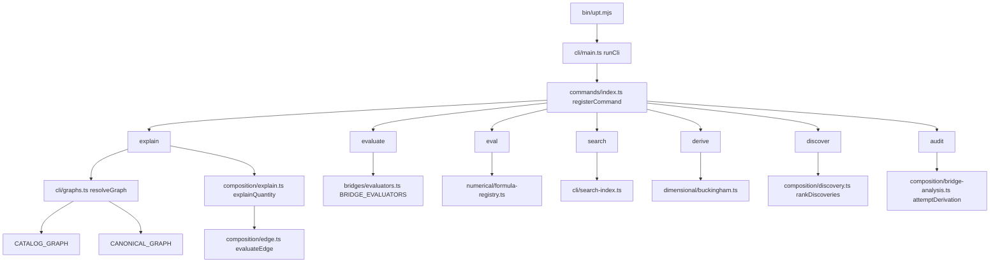

# Integration map

A reading of how the library actually runs, and where the same concept is implemented more than once. This is a measurement of the tree, for a later integration design. It does not choose that design.

**Measured on** `b1db6b66f101448b1e3a9c2f11c4b4e08f71260f` (`master` at the first measurement; package `5.0.0`). `src/` was not edited for that measurement. A second reading of that same `src/` tree, for the integration design, corrected the edit-distance row, the prefactor section (group table and the ideal-gas count), and the private RK4 list. The recommendations in section 6 were updated to match those corrections. They are still the recommendations that measurement made. The decisions are `docs/planning/v6.0.0-Design.md`. `bun run docs:deps` (`--include-tests`) was run again on that tree; `git diff -- docs/architecture/` of the generator outputs was empty, so the committed graph, unused analysis, and test-coverage report matched that run. The API-surface report is opt-in and is not a committed generator output; it was written to a temporary file with `--api-surface` and `--api-entry=src/index.ts`.

The temperature call graph below was re-read after the reading moved into `readNamedBinding`. Explain, eval, evaluate, discovery anchors, regime coordinates, and a path sweep call that function. It is the only caller of `alignTemperatureBinding`. `bindingInUnit` still rejects an energy whose dimension is not the declared unit. A path tolerance still uses `readBinding` (`path.ts:376`) and is not a temperature slot. `--sigma` still uses `bindingInUnit` with the difference reading.

The name table below was re-read after the three lists and the two distances moved into `src/composition/aliases.ts`. `NAME_TABLE` holds the synonym pairs, the formula spellings, the comparison targets, and the dimension renames. `editDistance` is optimal string alignment, and it is the only such function. Search indexes a trailing parenthetical as a gloss and does not combine that gloss with another field. Section 6 row 4 stays the recommendation it was measured as.

The sign section below was re-read after `applyCarrierSignPolicy` became the only caller of `assertSameCarrierSign`. The BE-70 domain does not call `sameCarrierSign`.

A later regeneration, after `docs:deps` learned `export * as`, the PhysJS table became a generated source file, the sound-speed test landed, the noun-phrase search test landed, `src/cli/temperature-bindings.ts` was deleted, the name table became one module, and the sign policy became one function, re-counted the unused-file and no-test rows. The sentence that `dependency-graph.json` `statistics` is 472 source files, 3560 exports, 1734 re-exports, 0 unused files, and 78 unused exports, and that `TEST_COVERAGE.md` is 672 test files and 10 source files with no test import (462 of 472, 97.9 percent), is the record from before `registerBridge` and BE-103–125. The same statistics after that registration are 478 source files, 3886 exports, 1921 re-exports, 0 unused files, and 78 unused exports. `TEST_COVERAGE.md` is 699 test files and 10 source files with no test import (468 of 478, 97.9 percent). `git ls-files 'src/**/*.ts' 'src/*.ts'` is 478. The generator's module file counts are atlas 72, bridges 132, composition 93, and the other modules are unchanged from the line below. The sentence that those registration statistics are the live counts is the record from before the JSON profiles. After that module, the same statistics are 479 source files, 3888 exports, 1925 re-exports, 0 unused files, and 76 unused exports. `TEST_COVERAGE.md` is 700 test files and 10 source files with no test import (469 of 479, 97.9 percent). `git ls-files 'src/**/*.ts' 'src/*.ts'` is 479. Composition is 94 files. The other module file counts are unchanged. Total lines of code are 103030. The sentence that names 102949 lines is the record from before the JSON profiles. After the classical RK4 steps call `solveODESystem`, the same statistics are 479 source files, 3888 exports, 1925 re-exports, 0 unused files, and 75 unused exports. `TEST_COVERAGE.md` is 701 test files and 10 source files with no test import (469 of 479, 97.9 percent). Total lines of code are 103013. The sentence that names 103030 lines and 76 unused exports is the record from before this call. The sentence that names 103013 lines, 3888 exports, 1925 re-exports, 75 unused exports, and 701 test files is the record from before one `MASS_DENSITY`. After that export, the same statistics are 479 source files, 3889 exports, 1939 re-exports, 0 unused files, and 74 unused exports. `TEST_COVERAGE.md` is 703 test files and 10 source files with no test import (469 of 479, 97.9 percent). Total lines of code are 102981. `metricParams` left the unused-export list because a test imports it. The sentence that names 102981 lines and 703 test files is the record from before a composition-table refusal became a pipeline result. After that result, the same statistics are 479 source files, 3889 exports, 1939 re-exports, 0 unused files, and 74 unused exports. `TEST_COVERAGE.md` is 704 test files and 10 source files with no test import (469 of 479, 97.9 percent). Total lines of code are 103006. Interfaces are 613. The counts atlas 70, bridges 129, and composition 91 are the record from before this registration. The five exports added with the generated table are `PHYSJS_COMMIT`, `PHYSJS_TOOLCHAIN`, `PHYSJS_MATHLIB`, `PHYSJS_PHYS_LIB`, and `PHYSJS_ENTRIES`. `sameCarrierSign`, `assertSameCarrierSign`, and `assertCarrierProductSign` are no longer exports, and `applyCarrierSignPolicy`, `resetCarrierSignPolicyCalls`, and `readCarrierSignPolicyCalls` are. The sentence that names 671 test files is the count from before the scalar-builder gate test. The sentence that names 670 test files is the count from before the name-table test. The sentence that names 669 test files is the count from before the temperature-owner test and the sign-policy test. The sentence that names 667 test files is the count from before the noun-phrase search test. The sentence that names 666 test files is the count from before the sound-speed test. The live duplicate-owner list is `docs/architecture/duplicate-owners.md`. The temperature scan, the name-table scan, and the sign scan are registered there. This map points there and does not copy its rows. The table below stays the first measurement. The two rows that measurement no longer describes are marked in the cells. The sentence that names 103006 lines, 704 test files, 3889 exports, 1939 re-exports, and 479 source files is the record from before the 6.0.0 public surface. After that surface, the same statistics are 480 source files, 3744 exports, 1792 re-exports, 0 unused files, and 74 unused exports. `TEST_COVERAGE.md` is 705 test files and 10 source files with no test import (470 of 480, 97.9 percent). `git ls-files 'src/**/*.ts' 'src/*.ts'` is 480, and `find src -name '*.ts'` is 480. Total lines of code are 102957, matching a second sum of `split` lines on those files. Interfaces are 613. Composition is 95 files, and `find src/composition -name '*.ts'` is 95. Atlas is 72 files and bridges is 132 files.

Anything below that was not opened in source, or that a second method did not confirm, is marked **INFERRED**.

---

## How the headline numbers were checked

`docs:deps` walks tracked `src/**/*.ts` with its own lexer. A second count used the filesystem and `git ls-files`, plus a separate `from` / `import()` walk that resolves `.js` specifiers to `.ts` files.

| Claim | Generator (`docs:deps`) | Second method | Agreement |
|---|---|---|---|
| TypeScript files under `src/` | 471 | `find` and `git ls-files 'src/**/*.ts' 'src/*.ts'`: 471 | yes |
| Modules | 13 | 12 directories plus the two root files `src/index.ts` (`entry`) and `src/cli-api.ts` (`root`) | yes |
| Lines | 99578 | 99111 physical lines. 467 files end in a newline. `split('\n').length` adds one segment per such file: 99111 + 467 = 99578 | yes, different definition |
| Circular dependencies | 0 runtime, 0 type-only | 2453 relative import edges, 0 unresolved, 0 cycles, 469 files appear in the walk | yes |
| Unused file | none. The first measurement listed `src/atlas/public.ts` | `dependency-graph.json` records `src/index.ts` depending on `./atlas/public.js`. The source is `export * as atlas from './atlas/public.js'` at `src/index.ts:1144` | yes |
| Unused exports | 78 | not re-derived name by name. One listed name is a parser false positive (below) | count matches the committed `unused-analysis.md`; the list is not a deletion list |
| Source files with no test import | 10 of 473 (97.9%), 667 test files. The first measurement was 11 of 471 (97.7%), 662 test files | the 10 paths are the generator's "no test file imports this module" list, not statement coverage. `src/atlas/public.ts` left the list because the namespace re-export is now an import edge | definition recorded, not re-derived |
| Public surface | 698 symbols, 611 `@public`, 3 `@internal`, 84 untagged, `undocumented: 20` | 698 symbols in the report; 21 have `documented: false`. The summary excludes `kind: 'namespace'` (`tools/create-dependency-graph/api-surface.ts:627`). The extra one is the `atlas` namespace | yes |
| API-walk external MathTS import | one: `src/numerical/gl4-integrator.ts` → `@danielsimonjr/mathts-functions` | the report's `external` array has that single object. Unresolved specifiers: 0 | yes |
| Files that load MathTS | — | 14 files contain `from`, `import()`, or `import.meta.resolve` of `@danielsimonjr/mathts-*` | the "about 16" figure matches mention sites if `src/cli/version.ts:52` (a string) and a comment in `src/atlas/witness-symbolic.ts` are counted with the 14 |
| `Math.*` in `src/` | — | 810 calls in code after comment stripping (`Math.abs` 209, `Math.PI` 143, `Math.sqrt` 106, `Math.max` 73, `Math.pow` 40, then `sin`/`exp`/`log`/`cos`/`min` and smaller). Raw text including comments: 845 in 174 files | a scan for all `Math.*` does not produce ~208. 209 is `Math.abs` alone |

Module file counts (both methods): atlas 70, bridges 129, canonical 19, cases 9, cli 55, composition 91, core 11, diff 3, dimensional 36, numerical 38, relations 8, plus entry 1 and root 1.

Generator statistics also recorded, and not separately re-summed: 3553 exports, 1734 re-exports, 583 type-only import edges, 61 classes, 560 interfaces, 849 functions.

Catalog sizes, counted from source text and from tests that pin `.length`:

| Registry | Count | Where |
|---|---|---|
| `BRIDGE_EQUATIONS` | 115, ids 11–125 with no gaps | The projection of `registerBridge`. `tests/bridges/catalog-integrity.test.ts` and `tests/bridges-index.test.ts` expect 115. Status fields: 79 `established`, 33 `speculative`, 3 `highly-speculative`. 92 ids 11–102, with 56 established, is the record from before BE-103–125 |
| `CANONICAL_EQUATIONS` | 109 | `id: 'CE-…'` in `src/canonical/entries/` (109 unique). The registry assembles them in `src/canonical/registry.ts`. The prose test compares product docs to `CANONICAL_EQUATIONS.length` and does not hardcode 109 |
| `CATALOG_GRAPH` | 106 | The edge projection of `registerBridge`. `tests/composition/compose-relation.test.ts` expects 106. 83 is the record from before BE-103–125 |
| Confrontations | 19 | `bridgeId` fields in `src/bridges/confrontations.ts`: 52, 23, 36, 37, 48, 51, 21, 35, 11, 55, 56, 58, 59, 60, 61, 62, 63, 64, 65. None of BE-103–125 is data-confronted |
| `BRIDGE_EVALUATORS` | 73 ids | `spec(n)` in `src/bridges/evaluators.ts`: 51, 52, and 55–125. 53 and 54 are absent. 50 ids, through 102, is the record from before BE-103–125 |
| `catalogFormalRef` ids | 96 | `CATALOG_FORMAL_REF_IDS` is derived from generated `be-*` keys. 73 is the record from before BE-103–125. `be-20` stays absent |
| PhysJS manifest entries | 106 | `formal/physjs/manifest.json` (`schema` `physjs-bridge-manifest/v1`, `commit` `d519c2c6504e7fbbd2cf6932f9e52981ce595a0f`). 10 `ab-*` plus 96 `be-*`. 83 entries at `03e8bb77c952f720bdd2730af2afc6a7f2d36243` is the record from before PhysJS #66 |
| Atlas `id: 'ab-…'` | 20 | seven family bridge files under `src/atlas/{oscillators,diffusion,waves}/` |

`src/bridges/index.ts` says `BRIDGE_EQUATIONS` is the projection of `registerBridge`. The sentences that the catalog has 77 entries, that BE-55–87 have no AST, and that 17 catalog bridges carry no `BridgeEdge`, are restated there as records from before later rows. The integrity test expects 115. The title that said "exactly 58" is the record from before BE-59 and the later rows.

---

## 1. Modules, entries, and runtime flow

### What each module is

| Module | Role | Public entry |
|---|---|---|
| `entry` (`src/index.ts`) | Package root. Re-exports the library surface. Does not re-export `MathTSEngine` | `package.json` `"."` |
| `root` (`src/cli-api.ts`) | Barrel the CLI injects as `CommandCtx.api`. The only runtime importer is `src/cli/main.ts` | not a package export |
| `cli` | Command registry and the six analysis commands below, plus 22 others | `bin/upt.mjs` → `dist/cli/main.js` |
| `bridges` | Catalog rows (`BRIDGE_EQUATIONS`), RHS ASTs, closed-form evaluators, confrontations | named exports from `src/index.ts` |
| `canonical` | Textbook L-layer equations the catalog is checked against | `CANONICAL_EQUATIONS` and accessors |
| `composition` | `Quantity` / `BridgeEdge` / `CATALOG_GRAPH` / `CANONICAL_GRAPH`, explain, discover, audit derivation | `explainQuantity`, graphs, `rankDiscoveries` |
| `dimensional` | SI dimension, `ExprNode`, validator, units, Buckingham-π | `validate`, `convertValue`, algebra |
| `numerical` | `TensorEngine` / `MathTSEngine`, formula parser, geodesics, GL4, curvature lowering | `MathTSEngine` only on the `numerical/mathts-engine` subpath |
| `atlas` | Relations between models (`ab-*`), evidence tags, witnesses, benchmark | namespace `atlas` from `src/atlas/public.ts`; full barrel on subpath `./atlas` → `src/atlas/index.ts` |
| `relations` | Shared relation vocabulary the atlas shims re-export | via atlas and `cli-api` |
| `cases` | Applied-case evaluators (`upt evaluate case-*`) | `APPLIED_CASES` |
| `core` | `UniversalTensor`, SI constants, labeled tensors | constants and tensor types |
| `diff` | Bridge gradients (AST via MathTS autograd, plus numerical fallback) | gradient helpers on the root where exported |

`MEMORY.md` is the stateless source map. This section is the call graph those names sit on.

### Dispatch

`bin/upt.mjs` loads `dist/cli/main.js` and assigns the returned code to `process.exitCode`. `runCli` is `src/cli/main.ts:62`. It imports `src/cli/commands/index.ts`, which side-effect-imports 28 command modules. Each calls `registerCommand` (`src/cli/command.ts`). `resolveCommand` is at `src/cli/command.ts:58`.

Registered names, from `src/cli/commands/index.ts`: `priority`, `audit`, `coverage`, `canonical`, `recover`, `connectors`, `predict`, `candidates`, `frontier`, `explain`, `symbolic`, `eval`, `derive`, `map`, `discover`, `confront`, `axes`, `evaluate`, `ground`, `probe`, `regime`, `path`, `atlas`, `chain`, `search`, `retrieve`, `metric`, `testplan`. Help and version are handled in `main.ts` before the registry. `chain` is registered and is not a data-bearing analysis of the graph: it refuses and cites the design note (see `NOTES.md`).

### `upt explain`

`run` is `src/cli/commands/explain.ts:247`. The command name is declared at line 363.

1. A `be-<n>` target is redirected through `auditCoverage` and the catalog before `explainQuantity` (`explain.ts` `bridgeRedirect`, around the start of `run`). **INFERRED** on the interior of `bridgeRedirect` beyond the call to `auditCoverage`; the function starts at `explain.ts:141` per a read of that region.
2. `resolveGraph` (`src/cli/graphs.ts:15`) reads `--source`. Default is `catalog` (`graphs.ts:20`). `canonical` uses `CANONICAL_GRAPH`. `both` concatenates the two graphs.
3. The target name goes through `resolveToCatalogName` (`src/composition/user-equation.ts:234`) and then `nearQuantityNames` (`src/composition/aliases.ts:134`, optimal string alignment at distance ≤ 1). A miss asks `searchNameWords` (`src/cli/search-index.ts`).
4. Inputs are `readNamedBinding` (`explain.ts:96`), which applies the temperature reading.
5. `explainQuantity` (`src/composition/explain.ts:339`) classifies identifiability, retrodicts, and calls `evaluateEdge` (`src/composition/edge.ts:313`).

Catalog edges and canonical edges share that function. The graph argument is what changes. Closed-form `BRIDGE_EVALUATORS` are not this path.

### `upt evaluate` and `upt eval`

These are different commands.

`upt evaluate` (`src/cli/commands/evaluate.ts:476`, name at 573) looks up `BRIDGE_EVALUATORS` and calls `evaluateBridge`. Inputs go through `resolveEvaluatorInputs` (`src/bridges/evaluator-inputs.ts`), which calls `bindingInUnit`. A missing id uses `missingEvaluatorMessage` (`src/bridges/evaluators.ts:577`): be-42 and be-16 have no id-keyed evaluator. Uncertainty for `--sigma` is `propagateEvaluatorUncertainty` (`evaluate.ts:161`), which calls MathTS `propagateUncertainty` and is a different function from `composition/uncertainty.ts`.

`upt eval` (`src/cli/commands/eval.ts` `name: 'eval'` at line 184) parses a user formula. `getFormulaParser` (`src/numerical/formula-registry.ts:20`) always returns the MathTS parser (`formula-registry.ts:25-26`). Bindings are `readNamedBinding` (`eval.ts:57`).

### `upt search`

`run` is `src/cli/commands/search.ts:49`. `buildSearchIndex` (`src/cli/search-index.ts:176`) indexes catalog rows, canonical equations, atlas families, both graphs' quantities, regime registrations, and applied cases. A trailing parenthetical on a catalog or canonical name is a gloss field (`titleAndGloss`, `search-index.ts:47`). For a catalog row the suggested command is chosen at `search-index.ts:188-192`:

- an id in `BRIDGE_EVALUATORS` → `upt evaluate be-<n>`
- otherwise a `catalogFormalRef` → `upt atlas be-<n>`
- otherwise → `upt explain be-<n>`

Matching is `matchEveryWord` (`search-index.ts:344`). Two or more words that share a field have to sit together there. A gloss does not combine with a non-gloss field, so `upt search "reynolds number"` matches nothing and `upt search "prandtl number"` names be-86 with the match labeled gloss. Words that never share a non-gloss field still match, so thermal noise still names be-58. Search does not rank by edit distance. Explain does, through the one `editDistance`.

### `upt derive`

`run` is `src/cli/commands/derive.ts:75`. Positional `name:dimension` arguments go through `parseDimensionSpec`. The dimensional step is `dimensionallyDetermines` (`src/dimensional/buckingham.ts:268`) and, when that does not determine a monomial, `buckinghamPi`. `--formula` parses with the MathTS parser, rewrites hyphens, and calls `compareWithCanonical` / `matchingCatalogEdges`. Exit class is `classifyDetermination` (`src/cli/determination.ts`).

### `upt discover`

`run` is `src/cli/commands/discover.ts:265`. `resolveGraph` selects the edge list. `rankDiscoveries` (`src/composition/discovery.ts:610`) builds a context and ranks link candidates from `proposeLinkCandidates` (`src/composition/bridge-analysis.ts`). `--derive` calls `deriveProposedBridges`. Anchor values use `readNamedBinding` (`src/cli/commands/_discovery-opts.ts:51`).

### `upt audit`

`run` is `src/cli/commands/audit.ts:38`. For each edge, `attemptDerivation` (`src/composition/bridge-analysis.ts:219`) and `dimensionalFreedom`. A dimensional sum returns `not-a-monomial` (`bridge-analysis.ts:223-224`). `coefficientUnset` returns `coefficient-unset` before any ratio check (`bridge-analysis.ts:226-228`). The comment on those lines says the evaluator still multiplies by 1.

### Library API versus the CLI barrel

`src/index.ts` exports the catalog, both graphs, `explainQuantity`, `evaluateBridge`, `rankDiscoveries`, dimensional validation, and the `atlas` namespace. `src/cli-api.ts` re-exports much of that and also the CLI-only helpers: `attemptDerivation`, `getFormulaParser`, `compareWithCanonical`, `readBinding`, `readNamedBinding`, the probe stack, and the atlas path/regime surface. Commands receive that object as `ctx.api`. They do not import `src/atlas/index.ts`.

---

## 2. Duplicated concepts

The import graph groups files by name and by edges. The splits below are the same idea implemented in more than one place.

### Unit parsing and temperature

One unit table lives in `src/dimensional/units.ts`: `parseUnit`, `convertValue`, and a MathTS check (`unit` / `toSI`) when the SI scale and the 7-base dimension agree. Affine degree Celsius, the gauss, and a few other spellings stay on the local table. `binding-value.ts` duplicates the Celsius offset (`CELSIUS_OFFSET_K` at `binding-value.ts:108`; the units module has the same offset).

`readBinding` (`binding-value.ts:359`) accepts a bare number, a number plus a unit, or an expression whose unit literals were spliced out and parsed by the MathTS formula parser. `bindingInUnit` (`binding-value.ts:414`) uses `convertValue` for a plain number-plus-unit and `readBinding` for an expression. `readNamedBinding` (`binding-value.ts:337`) applies `QUANTITY_CONVENTION_UNIT` (`src/dimensional/unit-convention.ts:21-31`: GeV energies, bit, nat, one entropy in J/K) and otherwise returns `readBinding`.

`alignTemperatureBinding` in `binding-value.ts` divides an energy by `k_B` when the binding name is `T`, `temperature`, `temp`, or `T_K`, and when `readNamedBinding` is given a declared unit whose dimension is temperature. The module comment at `binding-value.ts:13-15` states that rule. The only call is inside `readNamedBinding`. Callers: `upt eval` (`eval.ts:57`), `upt explain` (`explain.ts:96`), discovery and map anchors (`_discovery-opts.ts:51`), regime coordinates (`regime.ts` `parseAt`, `readNamedBinding` at `regime.ts:105`), a path sweep (`path.ts:188`), and `upt evaluate` (`evaluator-inputs.ts:49`, with the parameter's declared unit). A path `--at` uses that same `parseAt`. The scale prefers a bare or J/K `boltzmann-constant`, then `k_B`, then `kB`, then the CODATA value. `src/cli/temperature-bindings.ts` is gone. A path tolerance still uses `readBinding` (`path.ts:376`) and is not a temperature slot. `--sigma` still uses `bindingInUnit` because a sigma is a difference.

So `temperature=10eV` is kelvin on explain, eval, evaluate, a discovery anchor, a regime coordinate, and a path sweep. `bindingInUnit('10eV', 'K')` still throws.

### Quantity names and aliases

`NAME_TABLE` (`src/composition/aliases.ts:24`) is the name table.

| Record | What it maps |
|---|---|
| synonym pairs | `magnetic-field` / `magnetic-flux-density`, and `landauer-erasure-energy` / `erasure-energy`. `shareSynonyms` and `collapseSynonymGovernors` copy one spelling onto the other. `resolveToCatalogName` resolves either spelling to the one the catalog holds |
| formula spellings | `T` → `temperature`, read by `resolveToCatalogName` (`user-equation.ts:234`) |
| comparison targets | `CE-sound-speed` answers to `speed`. `speed` is not a synonym of `sound-speed`. `CE-schwarzschild-radius` answers to `schwarzschild-radius`. The Compton entries answer to the other Compton name. `compareWithCanonical` reads this list |
| dimension renames | `T` with a temperature dimension is `temperature`. `M` and `m_1` with a mass dimension are `mass`. `m_2` is `secondary-mass`. The rows are `DIMENSION_RENAMES` in `src/dimensional/formula-names.ts`, and `NAME_TABLE` includes that array. `canonicalQuantityName` (`src/canonical/normal-form.ts:67`) reads the array. A canonical file cannot import composition, so the rows stay in the dimensional tier and the layer allowlist does not grow. A time coordinate named `T` stays `T` |

`edge.aliases` stays on each `BridgeEdge`. `aliasesForTarget` (`aliases.ts:51`) and `rewriteInputKey` read them. An evaluator key such as `T_K` → `temperature` is that edge record, not a second table.

`editDistance` (`aliases.ts:92`) is optimal string alignment. An adjacent transposition is one edit, so `lenght` → `length` is distance 1 and `lxxgth` → `length` is distance 2. `nearQuantityNames` (`aliases.ts:134`) resolves at distance ≤ 1. `suggestQuantities` (`user-equation.ts:295`) calls that same function. Its longer cutoff, `max(1, ceil(length/2))`, and its containment rank stay suggestion-only (`rankByName`, `user-equation.ts:264`). Explain uses `nearQuantityNames` and, on a miss, the search word index.

`SOURCE_ALIAS_DISPOSITIONS` (`src/composition/compose.ts`) is composition name collisions. `FORMULA_NAMED` (`src/dimensional/formula-names.ts`) names constants for the formula parser (`m_p`, `e`), not graph quantities. Search words are `src/cli/search-index.ts`. A trailing parenthetical is a gloss. The printed line stays the full name.

The sentence that `QUANTITY_SYNONYMS`, `FORMULA_ALIASES`, and `ENTRY_TARGET_ALIASES` are three tables, and that `nearQuantityNames` is plain Levenshtein, is the first measurement.

### Sign rules

The shared type is `CarrierSignError` (`src/bridges/carrier-sign.ts:18-22`). `applyCarrierSignPolicy` (`carrier-sign.ts:79`) is the only caller of `assertSameCarrierSign` (`carrier-sign.ts:34`).

| Check | Where | Behavior |
|---|---|---|
| `assertSameCarrierSign` | `carrier-sign.ts:34` | throws when the product is negative. Only `applyCarrierSignPolicy` calls it |
| `sameCarrierSign` | `carrier-sign.ts:26-28` | boolean, product ≥ 0. `assertSameCarrierSign` uses it when both values are finite |
| `applyCarrierSignPolicy` | `carrier-sign.ts:79` | one policy. A monomial odd in both `charge` and `carrier-mobility` rejects opposite signs. An explicit pair is that check for the Einstein relation. Inputs the scalar AST is even in become absolute values |

A canonical edge calls the policy once, in `toEdge` (`canonical-graph.ts:479`), and then `makeEvaluate`. `evaluateEdge` calls that edge function, so explain and a direct `edge.evaluate` are the same call. BE-70 calls the policy once inside `evaluateEinsteinRelation` (`be70-einstein-relation.ts:62`). The edge domain (`applied-physicist.ts:355-363`) checks that μ and q are finite and that T and q are nonzero. It does not check the sign. Hall and cyclotron stay signed. Plasma frequency and Larmor radius stay positive magnitudes. Conductivity says `charge and carrier-mobility must have the same sign`. Einstein says `electrical-mobility (mu_m2_per_Vs) and carrier-charge (q_C) must have the same sign`. The sentence that BE-70 is checked twice, and that the Einstein message names `mu_m2_per_Vs` and `q_C` without the quantities, is the record from before this policy. Decision 8 puts that one call on the evaluator. The table in section 6 still names `evaluateEdge`, which is the recommendation that measurement made.

### Coefficients and prefactors

`CANONICAL_PREFACTORS` (`src/composition/canonical-prefactors.ts`) is the sourced numeric table. Canonical `makeEvaluate` (`canonical-graph.ts:411`) multiplies a recorded coefficient and `canonicalPrefactor(eq.id)` only when each is defined (`canonical-graph.ts:430-447`). `recordedDimensionlessCoefficient` (`canonical-graph.ts:210`) applies only when `restatesBridge` is set. `toEdge` sets `coefficientUnset` when the entry is dimensional and the numeric table has no prefactor. A dimensional entry in that state returns no number unless its group is bound. The sentence that the evaluator multiplies `canonicalPrefactor(eq.id) ?? 1` is the record from before this deletion.

A second table, `CANONICAL_GROUP_PREFACTORS`, holds a dimensionless group the numeric table does not (`CE-sound-speed`, group `gamma`, exponent `1/2`). `makeEvaluate` multiplies by `canonicalGroupPrefactor` when that input is present. Absent, the result is unset and `coefficientUnset` stays set. `forwardEvaluate` and `retrodictNode` copy the group from the ground truth because it is not a source. `CE-sound-speed`'s target quantity is `sound-speed`. The sentence that `makeEvaluate` does not call the group table, and the sentence that an unbound group leaves the leading factor at 1, are the record from before this reading.

`makeEvaluate` still starts from `eq.dimensional.monomial`. After `3e4fab87` (#397), a fully-quantitative dimensionless count on the scalar AST is a source in `formulaFactors`. `CE-ideal-gas` encodes `P = N k_B T / V`. Missing `N` does not return `k_B T / V`. With `N` the value includes that count. A null monomial that is a fully-quantitative product, quotient, or integer power is evaluated from the AST, so Hawking temperature keeps `8π` and Newton returns `G m₁ m₂ / r²`.

`attemptDerivation` returns `coefficient-unset` without comparing values when that flag is set (`bridge-analysis.ts:233-235`). Explain of that row prints no recovered number and says the factor is unset. The sentence that explain still prints the monomial times 1 is the record from before this deletion.

Catalog closed forms bake their factors inside each `be*.ts` evaluator. They do not read `canonicalPrefactor`. `upt eval` uses the CODATA scope in `src/cli/eval-numbers.ts` and does not read that table either.

`formulaShape` (`src/composition/formula-shape.ts`) classifies a sum of dimensionful terms. Audit uses it. The formally-proved filter reads the Lean kind, not this classification (`NOTES.md`).

### Bridge registration

A catalog id is a number on `BridgeEquationEntry`. The string form `be-<n>` is the graph id. Atlas ids are `ab-*` and are not catalog rows.

| Layer | Object | File | Joined by `getBridge`? |
|---|---|---|---|
| Catalog row | `BRIDGE_EQUATIONS` | `src/bridges/index.ts` | yes (`src/composition/descriptor.ts`) |
| RHS AST | `BRIDGE_RHS_BY_ID` | `src/bridges/rhs-registry.ts` (42 ids: 11–50, 53, 54, per the file header at `index.ts:18`) | yes |
| CLI evaluator | `BRIDGE_EVALUATORS` | `src/bridges/evaluators.ts` (50 ids) | no |
| Facade | `BridgeEquations.*` | `src/bridges/bridge-equations.ts` | no |
| Graph edge | `BridgeEdge` in `CATALOG_GRAPH` | `src/composition/catalog-graph.ts` and `src/composition/edges/` | yes, by `beId` |
| Canonical equation | `CanonicalEquation`, optional `restatesBridge` | `src/canonical/` | no |
| Formal reference | `catalogFormalRef(n)` | `src/atlas/catalog-formal-ref.ts` | no. The catalog row type has no `formalRef` field |
| Atlas bridge | `AtlasBridge` | `src/atlas/families.ts` and the three families | no. `getBridge` takes a numeric catalog id |

`restatesBridge` on canonical entries uses the numeric string (`'16'`, not `'be-16'`). Assignments of that field are five: `'16'` and `'29'` in `src/canonical/entries/thermo-nuclear-cosmo.ts`, and `'42'`, `'51'`, and `'52'` in `src/canonical/entries/relativity.ts`. be-83 has none. The earlier INFERRED mark was this list; a search for `restatesBridge:` assignments under `src/canonical/entries/` returns those five.

`be-16` (Landauer), checked in source:

- catalog row in `src/bridges/index.ts` (speculative)
- RHS in the registry
- `BRIDGE_EVALUATORS` includes 16. `evaluateRelation('be-16', { temperature: 300 })` is the public call. The sentence that there was no `BRIDGE_EVALUATORS` entry, and that the call was `BridgeEquations.landauerEnergy`, is the record from before the 6.0.0 surface.
- `be16Edge` in `src/composition/edges/calibration.ts`
- `CE-landauer` with `restatesBridge: '16'` in `src/canonical/entries/thermo-nuclear-cosmo.ts`
- `catalogFormalRef(16)`

The canonical target is `erasure-energy` (`src/canonical/entries/thermo-nuclear-cosmo.ts:99`, `restatesBridge: '16'` at line 120). The graph quantity is `landauer-erasure-energy` (`src/composition/quantities/common.ts:126-127`). `src/composition/canonical-compare.ts:208-209` records that split.

`be-83` (Thomson): catalog row, `BRIDGE_EVALUATORS` entry, `be83Edge` with aliases (`src/composition/edges/applied-physicist.ts`), `catalogFormalRef(83)`, no RHS in `BRIDGE_RHS_BY_ID`. The edge's `kind` is `law`. The catalog row's dependency on be-73 is a different fact from whether the edges compose.

`ab-spring-lc`: atlas bridge with `physjsFormalRef('ab-spring-lc')` (`src/atlas/oscillators/bridges-exact.ts`). It is not a catalog row and not a `CATALOG_GRAPH` edge (`src/composition/not-composable-seeds.ts`).

### `MASS_DENSITY`

`MASS_DENSITY` is `{L:-3, M:1, T:0, I:0, Theta:0, N:0, J:0}` in `src/dimensional/types.ts`. It is not a row of `NAMED_DIMENSIONS`, so `format()` does not gain a name. be-20 and `src/composition/quantities/_dims.ts` re-export that binding. The Friedmann validator, bridge 20's expected dimension, the vacuum-energy left-hand side, the loop-quantum density, the brane density, and the FLRW `rho` parameter use it. The sentence that seven files assign the same object, and that the graph reports be-20 and `_dims.ts` as two exports, is the record from before this export. Those seven files were `be-20-vacuum-energy.ts`, `_dims.ts`, `catalog-tranche.ts`, `bridge-check.ts`, `friedmann-equation.ts`, `be-19-quantum-bounce.ts`, and `be-54-randall-sundrum-brane.ts`. `BE54_DENSITY.dim` and `PARAM_DIM.rho` were the same exponents without the name, and they now name this export. The live scan is `docs/architecture/duplicate-owners.md`.

### `canonicalJson` and `captureEnvironment`

Both names are defined in `src/composition/canonical-json.ts`. The `record` profile keeps the bytes the CLI record hashed. The `probe` profile keeps Date-to-ISO and undefined-hole-to-null. The probe subpath re-exports those names as the probe profile. `docs/architecture/duplicate-owners.md` is the live scan. The sentence that each name had two definitions is the record from before this module.

`propagateUncertainty` is no longer two exports. The CLI function is `propagateEvaluatorUncertainty` (`evaluate.ts:161`). The graph-layer function remains `src/composition/uncertainty.ts:100`. The old duplicate-symbols note that lists both as `propagateUncertainty` describes an earlier tree.

### CLI plumbing that is already one registry

Top-level help is rendered from the command registry (`NOTES.md`). `--source` is `resolveGraph`. Known-relation text for derive and map is `describeKnownRelation`. Regime names come from `registerRegimeDomain`, not a list inside the regime command. Those were separate copies and now have one owner. The remaining CLI split is the binding and evaluator paths above.

---

## 3. MathTS boundary

MathTS packages are required dependencies (`package.json`, `MEMORY.md`). `getFormulaParserKind` returns `'mathts'` only (`formula-registry.ts:25-26`). There is no Path B parser (`formula-registry.ts:4-5`). `formula-contract.ts` is the shared function table and the `ln` builtin (`callBuiltinFunction` at `formula-contract.ts:127`), not a parser.

### Delegated

| UPT wrapper | MathTS symbol | File |
|---|---|---|
| `propagateUncertainty` | `propagateUncertainty` | `src/composition/uncertainty.ts:23` |
| `propagateEvaluatorUncertainty` | same | `src/cli/commands/evaluate.ts:8` |
| `mathTsRatio` / `convertValue` | `unit`, `toSiDimensionVector` | `src/dimensional/units.ts:26-27` |
| `nullSpace` inside Buckingham-π | `rationalNullspace`, `Fraction` | `src/dimensional/buckingham.ts:28-29` |
| `integrateGeodesic` | `solveODESystem` | `src/numerical/geodesic-integrator.ts:25` |
| null-ray `integrateRK4` | `solveODESystem` | `src/numerical/null-ray-integrator.ts:12` |
| `advanceGl4` | `gaussLegendre4` (re-exports `GL4_A/B/C`) | `src/numerical/gl4-integrator.ts:26,36` |
| 16-point nodes | `rootsLegendre` | `src/numerical/quadrature.ts:20` |
| formula parse and compile | `parse`, `compileExpr` | `src/numerical/formula-mathts.ts:21` |
| dimension parse of a formula string | `parse` | `src/numerical/formula-dimension.ts:16` |
| `MathTSEngine` | `Tensor`; dynamic `forwardGrad` / `reverseGrad` | `src/numerical/mathts-engine.ts` |
| `bridgeGradientAST` | dynamic autograd + tensor | `src/diff/bridge-ast-gradient.ts:214-216` |
| `simplifyExpr` | dynamic `parse` + `simplify` | `src/composition/expr-simplify.ts` |
| scalar-symbol filter | `parse` via `import.meta.resolve` | `src/composition/mathts-scalar-symbols.ts` |
| `evalExpr` | `createScalarBuilder`, `evaluateScalar` | `src/composition/expr-eval.ts` |

`src/composition/expr-eval.ts` imports `@danielsimonjr/mathts-expression`. No `src/` file imports `mathts-matrix`, `mathts-wasm`, `mathts-parallel`, or `mathts-workerpool`. Those packages are dependencies of the MathTS packages the library does import. The sentence that no `src/` file imports `mathts-expression` is the record from before this lowering. The API walk from `src/index.ts` follows static re-exports and reports only the `gl4-integrator.ts` import, because the other MathTS imports sit behind dynamic `import()`, behind the CLI (not the package root), or behind modules the walk did not follow as external edges. **INFERRED** on the exact reason each of the other files is absent from `external`; the report itself lists one specifier.

### Still local

| Algorithm | File | What remains local |
|---|---|---|
| `ExprNode` numeric interpreter | `src/composition/expr-eval.ts` | Leaf binding stays here: caller values, then `CONSTANTS`, then a spelled-out multiple of π. The arithmetic is `evaluateScalar`. The sentence that this file calls `Math.pow` and that `@danielsimonjr/mathts-expression@0.9.0` does not export `createScalarBuilder` is the record from before this lowering. `expr-simplify.ts` uses `evalExpr` as a numeric guard |
| Substitution | `src/composition/expr-subst.ts` | tree walk. No MathTS call |
| Simplify fallback | `src/composition/expr-simplify.ts` | returns the original AST when the dynamic import fails. MathTS is required, so that branch is a second implementation of "do nothing" |
| Unit table | `src/dimensional/units.ts` | parse, affine °C, gauss, bit-as-ln-2. MathTS confirms a ratio when dimensions agree |
| Buckingham setup | `src/dimensional/buckingham.ts` | rational exponent search and the matrix. The nullspace call is MathTS |
| Geodesic RHS and two private steppers | `schwarzschildCircularOrbit` (`src/numerical/spacetime-metrics.ts:634`, step at 695) and Kerr `integrateGeodesic` (same file, 1084, step at 1098) | both call `solveODESystem` with `dt`. The Schwarzschild step still pins θ = π/2 after each step. `src/numerical/geodesic-integrator.ts:191` calls `solveODESystem` as well. The loop at `geodesic-integrator.ts:235` samples that solution. The sentence that those two bodies were classical RK4 is the record from before this call |
| Witness steppers | `rk4Step` in `src/atlas/oscillators/pendulum-motion.ts:29` calls `solveODESystem` with `dt`. The crossing refinement still calls that step. `limit-witnesses.ts` and the Langevin moment in `src/atlas/diffusion/numerics.ts:236` do the same | the wave and heat loops in `waves/numerics.ts` and the diffusion heat step stay finite differences. The sentence that `limit-witnesses.ts` inlined its own RK4, and that Langevin used the weights at lines 237–243, is the record from before this call |
| GL4 driver | `src/numerical/gl4-integrator.ts` | `geodesicDeriv` and step halving around `gaussLegendre4` |
| Quadrature sum | `src/numerical/quadrature.ts` | affine map and the weighted sum; nodes come from MathTS |
| Christoffel / curvature lowering | `src/numerical/pderiv.ts`, `connection-lowering-helpers.ts`, `curvature-lowering-helpers.ts`, `lowering.ts` | pointwise numeric tensor algebra on the `TensorEngine` |
| Probe least squares | `src/composition/probe/study.ts` | `solveWeighted` (**INFERRED** that this is a local linear solve; the file was not re-read in the final pass) |

`src/numerical/formula-contract.ts` and the 810 `Math.*` calls are mostly `abs`, `PI`, `sqrt`, and trigonometry inside closed forms and metrics. Those are not a second computer-algebra system. The local computer-algebra and ODE pieces are the rows in the table.

---

## 4. PhysJS boundary

UPT does not run Lean for this system. The pin is the vendored manifest.

| Piece | Location |
|---|---|
| Vendored manifest | `formal/physjs/manifest.json`. `toolchain` `leanprover/lean4:v4.34.1`, `mathlib` `v4.34.1`, `physlib` `af484f78ee0701290595f8bf892b157b10d64940`, `commit` `d519c2c6504e7fbbd2cf6932f9e52981ce595a0f`, 106 entries. 83 entries at `03e8bb77c952f720bdd2730af2afc6a7f2d36243` is the record from before PhysJS #66 |
| Compiled copy | `src/atlas/physjs-entries.generated.ts`, written by `bun run physjs:table` from the vendored manifest. `physjsFormalRef` reads that table. `PHYSJS_COMMIT` is the manifest `commit` |
| Builder | `physjsFormalRef(key)` in `src/atlas/physjs-ref.ts`. Sets `system: 'lean4-physjs'` and `fidelity: 'sanity-lemmas'` |
| Catalog overlay | `catalogFormalRef` in `src/atlas/catalog-formal-ref.ts`. Ids are the generated `be-*` keys, 96 of them. The hand list of 73 is the record from before BE-103–125. The catalog row does not store the reference |
| Evidence | `deriveEvidence` (`src/atlas/derive-evidence.ts:250-254`) adds `formally-proved` for kind `bridge`, `formally-proved-property` for `property`, `formally-proved-cross-check` for `cross-check`. A reduction, a limit, and a derivation-step add none of those |
| Catalog evidence | `catalogEvidenceInput` (`derive-evidence.ts:303`) passes the reference only when it is a reviewed `lean4-physjs` reference of kind `bridge` |
| Gate | `bun run atlas:formal-gate` compares the manifest to the bridges (`tools/formalref-axiom-gate/gate.ts`) and does not run Lean for this system. `tests/atlas/physjs-manifest.test.ts` holds an `EXPECTED` list of the 83 keys |

Ten atlas bridges carry `physjsFormalRef('ab-…')` on the bridge object. The other manifest keys are catalog ids reached through `catalogFormalRef`.

`tests/atlas/physjs-manifest.test.ts` holds the manifest keys. The sentence that it holds 83 keys is the record from before PhysJS #66. `tests/atlas/physjs-be66-68.test.ts`, `tests/atlas/physjs-be69-73.test.ts`, `tests/bridges/be-77-87.test.ts`, and `tests/bridges/be-88-102.test.ts` read `manifest.commit`. The atlas-pendulum golden still prints the pin because it is a snapshot of the rendered reference. The runtime pair that must agree is the manifest `commit` and `PHYSJS_COMMIT`. A hand-edited theorem in the generated table fails the gate. BE-106's Stix index, BE-113's Landau residue, BE-116's transport integrals, and BE-125's mirror kinetic integral are hypotheses of those proofs. BE-109's equal-temperature current is `sqrt(16 π N k_B T / μ0)`. BE-116's catalog value is the kinetic closure.

`data/bridge-catalog.json` is emitted with the reference joined on (`scripts/emit-catalog-json.mjs`). That artifact is a third view of the same overlay.

---

## 5. Dead code, shims, and stale docs

### `src/atlas/public.ts` is reached

`docs:deps` records `export * as <name> from` as an internal dependency, the same way it records `export * from`. `unused-analysis.md` lists 0 unused files. `src/index.ts:1144` is the namespace facade `MEMORY.md` describes, and the dependency graph records that edge. The `./atlas` package subpath points at `src/atlas/index.ts`, which is the larger internal barrel. Two entry shapes, one implementation. The live duplicate-owner list is `docs/architecture/duplicate-owners.md`. The map does not copy its rows.

The same generator lists `BCS_GAP_RATIO` as an export of `src/bridges/confrontations.ts`. The only occurrence there is a quote string at `confrontations.ts:661`. The real export is `src/bridges/be62-bcs-gap.ts:23`. That unused-export row is a lexer false positive.

### Re-export shims

These files name a symbol whose body lives elsewhere. Each of the assign-and-reexport rows below is now `export { … } from`, which the graph marks `reExported`. The sentence that `composition-table.ts` assigns then re-exports, and that `regimeHolds`, `DimensionMismatchError`, `EngineCapabilityError`, `evaluateMetricInverse`, `DEFAULT_SEARCH_BUDGET`, `IDENTITY_BOUND`, `M_PROTON_SI`, `dim`, and `PHYSJS_COMMIT` are a second local declaration, is the record from before that change. `admitApproximation` stays `export function` in `src/atlas/regime.ts`. `getBridge` stays two functions.

| Shim | Body lives in |
|---|---|
| `src/atlas/composition-table.ts` | `src/relations/composition-table.ts` |
| `src/atlas/regime.ts` | `regimeHolds` from `src/relations/regime.ts`; `admitApproximation` stays here |
| `src/atlas/conventions.ts` | `src/relations/conventions.ts` |
| `src/dimensional/algebra.ts` | `DimensionMismatchError` from `errors.ts` |
| `src/numerical/tensor-engine.ts` | `EngineCapabilityError` from `errors.ts` |
| `src/numerical/index.ts` | `evaluateMetricInverse` from `metric-inverse.ts` |
| `src/composition/probe/search-budget.ts` | `DEFAULT_SEARCH_BUDGET` from `types.ts` |
| `src/atlas/path-bound.ts` | `IDENTITY_BOUND` from `error-algebra.ts` |
| `src/bridges/be67-alfven-speed.ts` | `M_PROTON_SI` from `core/constants.ts` |
| `src/canonical/entries/_l1-build.ts` | `dim` from `dimensional/ast-builders.ts` |
| `src/atlas/physjs-ref.ts` | `PHYSJS_COMMIT` from `physjs-entries.generated.ts` |
| `src/bridges/equations/be-20-vacuum-energy.ts` | `MASS_DENSITY` from `dimensional/types.ts` |
| `src/composition/quantities/_dims.ts` | `MASS_DENSITY` from `dimensional/types.ts` |

`tests/atlas/relations-shim.test.ts` checks the relations move. The shims are cycle breaks and public-surface stability, not a second physics implementation.

### Names the graph reports as locally declared in more than one file

A walk of `dependency-graph.json` that skips each file's `reExported` list reports 3 names. `command` is 28 command modules. `getBridge` is `src/atlas/bridge-record.ts` and `src/composition/descriptor.ts`. `BCS_GAP_RATIO` is `src/bridges/be62-bcs-gap.ts` and a citation quote in `src/bridges/confrontations.ts`. The sentence that this list is 16 names, and the later walk that still listed `MASS_DENSITY`, `COMPOSITION_TABLE`, `composeRelation`, `NO_COMPOSITE_CLAIM`, `regimeHolds`, `DimensionMismatchError`, `EngineCapabilityError`, `DEFAULT_SEARCH_BUDGET`, `IDENTITY_BOUND`, `M_PROTON_SI`, `evaluateMetricInverse`, `dim`, and `PHYSJS_COMMIT` as two files, is the record from before the re-exports. `canonicalJson` and `captureEnvironment` left an earlier list when both moved to `src/composition/canonical-json.ts`. Classification of the three that remain:

| Name | Files | Reading |
|---|---|---|
| `command` | 28 command modules | registration convention |
| `getBridge` | `bridge-record.ts` and `descriptor.ts` | two functions |
| `BCS_GAP_RATIO` | confrontations quote and `be62-bcs-gap.ts` | parser false positive plus one real constant |

`duplicate-symbols.md` previously said 5 names, 383 `src` files, and `totalSourceFiles` 1025. The 383/1025 figures are not in the current `dependency-graph.json` (`totalFiles` 471, `totalExports` 3553). `repo_map.py` is not in this repository; that file was corrected from this reading, not regenerated by `repo_map.py`.

### Ten files no test imports directly

From `TEST_COVERAGE.md`, which measures import edges from tests, not line coverage:

`src/cases/quadrature.ts`, `src/cli/commands/_atlas-route.ts`, `src/cli/conventions.ts`, `src/cli/determination.ts`, `src/cli/euler-guard.ts`, `src/cli/record-reach.ts`, `src/cli/record-tables.ts`, `src/cli/record.ts`, `src/cli/top-level-help.ts`, `src/dimensional/natural-units.ts`.

`src/atlas/public.ts` left this list when the generator began following `export * as`: tests that import the package root now reach the namespace and the modules it re-exports. The CLI modules are reached through `main.ts` and `cli-api.ts`, so a test of a command can exercise them without importing the file. That is a coverage-tool limit, not a proof the file is untested.

### Architecture docs that had drifted

Corrected in this change: the verification blocks and the current-count sentences in `OVERVIEW.md`, `ARCHITECTURE.md`, `COMPONENTS.md`, `API.md`, `DATAFLOW.md`, and `FILE_INVENTORY.md`, plus `duplicate-symbols.md`.

Still narrative, and not rewritten sentence by sentence: per-file component essays, historical audit reports under `docs/architecture/archive/`, and `PHYSICS_MAP.md`. Where those essays still say the catalog has 58 rows or that `Float64ReferenceEngine` exists, the essay is older than the tree. `class Float64ReferenceEngine` is absent under `src/`; `MathTSEngine` is the engine class (`src/numerical/mathts-engine.ts:57`). `ARCHITECTURE.md`'s statistics table was updated; a later paragraph that still names two engines should be read against that table.

`git ls-files '*.ts' '*.tsx'` on this checkout is 1206 files (472 under `src/`). That is not the old repo_map total of 1025, and it is not the generator's 672 test files (the generator's test count is the files it classified as tests). The sentence that names 1205 files and 671 test files is the count from before the scalar-builder gate test. The sentence that names 1201 files and 473 under `src/` is the count from before the name-table test. The sentence that names 1204 files is the count from before that test was merged with the sign policy. Those numbers stay in this map so they are not collapsed into one.

---

## 6. Integration targets

Each row names a single owner that could hold the concept, and the break a unification would cause. The decisions are `docs/planning/v6.0.0-Design.md`. Where that note chooses a different owner than the row below, the note is the decision and this table stays the recommendation it was measured as.

| # | Unify | Proposed owner | Expected break |
|---|---|---|---|
| 1 | Temperature and unit reading (`alignTemperatureBinding`, `readNamedBinding`, `bindingInUnit`, `convertValue`) | `readNamedBinding` in `src/numerical/binding-value.ts`, called by eval, explain, evaluate, and anchors | Those commands, a discovery anchor, a regime coordinate, and a path sweep divide an energy on a temperature name by `k_B`. A joule binding on a non-temperature name stays joules. `bindingInUnit` alone still rejects an energy in a kelvin unit |
| 2 | The three ways a bridge is evaluated: `BRIDGE_EVALUATORS` / `BridgeEquations`, `BridgeEdge.evaluate`, canonical `makeEvaluate` | one evaluate function keyed by catalog id or canonical id, with edges and the CLI map as projections that copy alias keys | input names change for callers that pass `T_K` or `q_C` without going through the alias projection. `upt eval` stays a user-formula command and is not this function |
| 3 | Catalog row, RHS, graph edge, canonical `restatesBridge`, formalRef overlay | extend `getBridge` / `BRIDGE_DESCRIPTORS` so a missing edge, a missing canonical partner, and the formalRef are fields of one record | `getBridge` grows fields. Catalog `status`, edge `confidence`, and derived evidence stay different facts on that record. Adding a bridge becomes one registration instead of four edits. Atlas `ab-*` stays a separate registry: those bridges relate models, and `not-composable-seeds.ts` says they are not quantity edges |
| 4 | Alias tables and the two edit distances. `suggestQuantities` is optimal string alignment plus containment; `nearQuantityNames` is Levenshtein ≤ 1 | `src/composition/aliases.ts` as the only name table, and one distance (the transposition-aware one, so `lenght` still resolves). Search and explain both read it | a typo only the longer rank accepts today may resolve differently. Containment stays a suggestion rank and does not become identity. Formula `T` and canonical-hash renaming move to that table |
| 5 | Sourced prefactor versus the unset-1 the canonical evaluator multiplies. Includes `CANONICAL_GROUP_PREFACTORS`, which `makeEvaluate` never reads. `CE-ideal-gas`'s `N` is already a `formulaFactors` source after #397 | one prefactor result (sourced number, sourced group, or unset). `makeEvaluate` and `attemptDerivation` both honor unset, and the numeric value is the AST | explain of an unset row stops printing a value computed with 1. A group with no bound value is unset. Ideal-gas `N` is already required. Audit labels can stay |
| 6 | Local `ExprNode` eval, substitution, and the simplify no-op, plus the private RK4 loops | MathTS for numeric value and ODE steps; the UPT AST remains the dimension-carrying tree. Geodesic stepping lives in `geodesic-integrator.ts` | golden numbers in witness results, Kerr geodesics inside `spacetime-metrics.ts`, and any guard that depends on JavaScript `Math.pow` move. The simplify fallback that returns the input AST goes away if MathTS is required |
| 7 | The two `canonicalJson` implementations and the two `captureEnvironment` implementations | one serializer module with two named profiles (`record`, `probe`) | merging the profiles without naming them changes record fingerprints or probe hashes. Keeping two profiles avoids that break and removes the second algorithm |
| 8 | BE-70's domain predicate and `assertSameCarrierSign`, beside the canonical monomial check | `assertCarrierProductSign` invoked once from `evaluateEdge` | error text may name one pair of variables. Hall and cyclotron stay signed. The public `CarrierSignError` class stays |
| 9 | Hand-copied PhysJS entries (`PHYSJS_ENTRIES`, test SHA constants, golden URLs) | `formal/physjs/manifest.json` as the only pin; generate the TypeScript table | `physjsFormalRef` stays. `bun run physjs:table` writes the table and `WORKFLOWS.md` no longer says to copy an entry. A hand-edited theorem fails `atlas:formal-gate`. The pendulum golden still prints the pin |
| 10 | Atlas re-export shims and the generator's blindness to `export * as` | keep `src/relations/` as the vocabulary owner; teach `docs:deps` to follow `export * as`, or stop listing `public.ts` as unused | no physics API break. `export * as atlas` stays the package namespace. The generator now records that form: `public.ts` is out of `unused-analysis.md` and out of the "no test import" list. The assign-and-reexport shims are still two local definitions |

Targets 1 and 5 are the ones a user can hit today with one command that disagrees with another command about the same quantity. Targets 2 and 3 are why a fix in one registry does not land in the others. Target 6 is the owner's "delegate math to MathTS" boundary that is still open. Targets 7–10 are real duplicates with a smaller user-visible surface.

Search routing for a catalog bridge with no evaluator (issues 391 and 392 in the round-6 notes) already goes through `buildSearchIndex`. It is not a separate target. Explain's edit distance is target 4.
