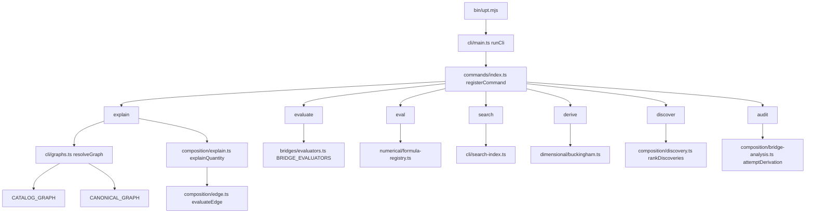

# Integration map

A reading of how the library actually runs, and where the same concept is implemented more than once. This is a measurement of the tree, for a later integration design. It does not choose that design.

**Measured on** `b1db6b66f101448b1e3a9c2f11c4b4e08f71260f` (`master` at the first measurement; package `5.0.0`). `src/` was not edited for that measurement. A second reading of that same `src/` tree, for the integration design, corrected the edit-distance row, the prefactor section (group table and the ideal-gas count), and the private RK4 list. The recommendations in section 6 were updated to match those corrections. They are still the recommendations that measurement made. The decisions are `docs/planning/v6.0.0-Design.md`. `bun run docs:deps` (`--include-tests`) was run again on that tree; `git diff -- docs/architecture/` of the generator outputs was empty, so the committed graph, unused analysis, and test-coverage report matched that run. The API-surface report is opt-in and is not a committed generator output; it was written to a temporary file with `--api-surface` and `--api-entry=src/index.ts`.

The temperature call graph below was re-read after `b193d5e0` (#395). That patch calls `alignTemperatureBinding` from explain, discovery anchors, regime coordinates, and path sweeps. The headline counts in the table were not re-derived on that commit. `upt evaluate` still does not call `alignTemperatureBinding`.

A later regeneration, after `docs:deps` learned `export * as`, the PhysJS table became a generated source file, the sound-speed test landed, and the noun-phrase search test landed, re-counted the unused-file and no-test rows. `dependency-graph.json` `statistics` is 473 source files, 3560 exports, 1735 re-exports, 0 unused files, and 78 unused exports. `git ls-files 'src/**/*.ts' 'src/*.ts'` is 473. `TEST_COVERAGE.md` is 669 test files and 10 source files with no test import (463 of 473, 97.9 percent). The five exports added with the generated table are `PHYSJS_COMMIT`, `PHYSJS_TOOLCHAIN`, `PHYSJS_MATHLIB`, `PHYSJS_PHYS_LIB`, and `PHYSJS_ENTRIES`. The sentence that names 667 test files is the count from before the noun-phrase search test. The sentence that names 666 test files is the count from before the sound-speed test. The live duplicate-owner list is `docs/architecture/duplicate-owners.md`. This map points there and does not copy its rows. The table below stays the first measurement. The two rows that measurement no longer describes are marked in the cells.

Anything below that was not opened in source, or that a second method did not confirm, is marked **INFERRED**.

---

## How the headline numbers were checked

`docs:deps` walks tracked `src/**/*.ts` with its own lexer. A second count used the filesystem and `git ls-files`, plus a separate `from` / `import()` walk that resolves `.js` specifiers to `.ts` files.

| Claim | Generator (`docs:deps`) | Second method | Agreement |
|---|---|---|---|
| TypeScript files under `src/` | 471 | `find` and `git ls-files 'src/**/*.ts' 'src/*.ts'`: 471 | yes |
| Modules | 13 | 12 directories plus the two root files `src/index.ts` (`entry`) and `src/cli-api.ts` (`root`) | yes |
| Lines | 99578 | 99111 physical lines. 467 files end in a newline. `split('\n').length` adds one segment per such file: 99111 + 467 = 99578 | yes, different definition |
| Circular dependencies | 0 runtime, 0 type-only | 2453 relative import edges, 0 unresolved, 0 cycles, 469 files appear in the walk | yes |
| Unused file | none. The first measurement listed `src/atlas/public.ts` | `dependency-graph.json` records `src/index.ts` depending on `./atlas/public.js`. The source is `export * as atlas from './atlas/public.js'` at `src/index.ts:1144` | yes |
| Unused exports | 78 | not re-derived name by name. One listed name is a parser false positive (below) | count matches the committed `unused-analysis.md`; the list is not a deletion list |
| Source files with no test import | 10 of 473 (97.9%), 667 test files. The first measurement was 11 of 471 (97.7%), 662 test files | the 10 paths are the generator's "no test file imports this module" list, not statement coverage. `src/atlas/public.ts` left the list because the namespace re-export is now an import edge | definition recorded, not re-derived |
| Public surface | 698 symbols, 611 `@public`, 3 `@internal`, 84 untagged, `undocumented: 20` | 698 symbols in the report; 21 have `documented: false`. The summary excludes `kind: 'namespace'` (`tools/create-dependency-graph/api-surface.ts:627`). The extra one is the `atlas` namespace | yes |
| API-walk external MathTS import | one: `src/numerical/gl4-integrator.ts` → `@danielsimonjr/mathts-functions` | the report's `external` array has that single object. Unresolved specifiers: 0 | yes |
| Files that load MathTS | — | 14 files contain `from`, `import()`, or `import.meta.resolve` of `@danielsimonjr/mathts-*` | the "about 16" figure matches mention sites if `src/cli/version.ts:52` (a string) and a comment in `src/atlas/witness-symbolic.ts` are counted with the 14 |
| `Math.*` in `src/` | — | 810 calls in code after comment stripping (`Math.abs` 209, `Math.PI` 143, `Math.sqrt` 106, `Math.max` 73, `Math.pow` 40, then `sin`/`exp`/`log`/`cos`/`min` and smaller). Raw text including comments: 845 in 174 files | a scan for all `Math.*` does not produce ~208. 209 is `Math.abs` alone |

Module file counts (both methods): atlas 70, bridges 129, canonical 19, cases 9, cli 55, composition 91, core 11, diff 3, dimensional 36, numerical 38, relations 8, plus entry 1 and root 1.

Generator statistics also recorded, and not separately re-summed: 3553 exports, 1734 re-exports, 583 type-only import edges, 61 classes, 560 interfaces, 849 functions.

Catalog sizes, counted from source text and from tests that pin `.length`:

| Registry | Count | Where |
|---|---|---|
| `BRIDGE_EQUATIONS` | 92, ids 11–102 with no gaps | `id:` fields in `src/bridges/index.ts`; `tests/bridges/catalog-integrity.test.ts:95` and `tests/bridges-index.test.ts:41` expect 92. Status fields: 56 `established`, 33 `speculative`, 3 `highly-speculative` |
| `CANONICAL_EQUATIONS` | 109 | `id: 'CE-…'` in `src/canonical/entries/` (109 unique). The registry assembles them in `src/canonical/registry.ts`. The prose test compares product docs to `CANONICAL_EQUATIONS.length` and does not hardcode 109 |
| `CATALOG_GRAPH` | 83 | comment at `src/composition/catalog-graph.ts:41-43`; `tests/composition/compose-relation.test.ts:102` expects 83; 83 `export const …: BridgeEdge` declarations under `src/composition/` |
| Confrontations | 19 | `bridgeId` fields in `src/bridges/confrontations.ts`: 52, 23, 36, 37, 48, 51, 21, 35, 11, 55, 56, 58, 59, 60, 61, 62, 63, 64, 65 |
| `BRIDGE_EVALUATORS` | 50 ids | `spec(n)` in `src/bridges/evaluators.ts`: 51, 52, and 55–102. 53 and 54 are absent from that list |
| `catalogFormalRef` ids | 73 | numeric literals in `CATALOG_FORMAL_REF_IDS` |
| PhysJS manifest entries | 83 | `formal/physjs/manifest.json` (`schema` `physjs-bridge-manifest/v1`, `commit` `03e8bb77c952f720bdd2730af2afc6a7f2d36243`). 10 `ab-*` plus 73 `be-*` |
| Atlas `id: 'ab-…'` | 20 | seven family bridge files under `src/atlas/{oscillators,diffusion,waves}/` |

`src/bridges/index.ts:16-20` still says the catalog has 77 entries and that BE-55–87 have no AST. `src/bridges/index.ts:240-249` still says 17 catalog bridges carry no `BridgeEdge`. Those comments are older than the 92-row array and the 83-edge graph. The test title at `tests/bridges/catalog-integrity.test.ts:89` still says "exactly 58" while the assertion is 92.

---

## 1. Modules, entries, and runtime flow

### What each module is

| Module | Role | Public entry |
|---|---|---|
| `entry` (`src/index.ts`) | Package root. Re-exports the library surface. Does not re-export `MathTSEngine` | `package.json` `"."` |
| `root` (`src/cli-api.ts`) | Barrel the CLI injects as `CommandCtx.api`. The only runtime importer is `src/cli/main.ts` | not a package export |
| `cli` | Command registry and the six analysis commands below, plus 22 others | `bin/upt.mjs` → `dist/cli/main.js` |
| `bridges` | Catalog rows (`BRIDGE_EQUATIONS`), RHS ASTs, closed-form evaluators, confrontations | named exports from `src/index.ts` |
| `canonical` | Textbook L-layer equations the catalog is checked against | `CANONICAL_EQUATIONS` and accessors |
| `composition` | `Quantity` / `BridgeEdge` / `CATALOG_GRAPH` / `CANONICAL_GRAPH`, explain, discover, audit derivation | `explainQuantity`, graphs, `rankDiscoveries` |
| `dimensional` | SI dimension, `ExprNode`, validator, units, Buckingham-π | `validate`, `convertValue`, algebra |
| `numerical` | `TensorEngine` / `MathTSEngine`, formula parser, geodesics, GL4, curvature lowering | `MathTSEngine` only on the `numerical/mathts-engine` subpath |
| `atlas` | Relations between models (`ab-*`), evidence tags, witnesses, benchmark | namespace `atlas` from `src/atlas/public.ts`; full barrel on subpath `./atlas` → `src/atlas/index.ts` |
| `relations` | Shared relation vocabulary the atlas shims re-export | via atlas and `cli-api` |
| `cases` | Applied-case evaluators (`upt evaluate case-*`) | `APPLIED_CASES` |
| `core` | `UniversalTensor`, SI constants, labeled tensors | constants and tensor types |
| `diff` | Bridge gradients (AST via MathTS autograd, plus numerical fallback) | gradient helpers on the root where exported |

`MEMORY.md` is the stateless source map. This section is the call graph those names sit on.

### Dispatch

`bin/upt.mjs` loads `dist/cli/main.js` and assigns the returned code to `process.exitCode`. `runCli` is `src/cli/main.ts:62`. It imports `src/cli/commands/index.ts`, which side-effect-imports 28 command modules. Each calls `registerCommand` (`src/cli/command.ts`). `resolveCommand` is at `src/cli/command.ts:58`.

Registered names, from `src/cli/commands/index.ts`: `priority`, `audit`, `coverage`, `canonical`, `recover`, `connectors`, `predict`, `candidates`, `frontier`, `explain`, `symbolic`, `eval`, `derive`, `map`, `discover`, `confront`, `axes`, `evaluate`, `ground`, `probe`, `regime`, `path`, `atlas`, `chain`, `search`, `retrieve`, `metric`, `testplan`. Help and version are handled in `main.ts` before the registry. `chain` is registered and is not a data-bearing analysis of the graph: it refuses and cites the design note (see `NOTES.md`).

### `upt explain`

`run` is `src/cli/commands/explain.ts:247`. The command name is declared at line 363.

1. A `be-<n>` target is redirected through `auditCoverage` and the catalog before `explainQuantity` (`explain.ts` `bridgeRedirect`, around the start of `run`). **INFERRED** on the interior of `bridgeRedirect` beyond the call to `auditCoverage`; the function starts at `explain.ts:141` per a read of that region.
2. `resolveGraph` (`src/cli/graphs.ts:15`) reads `--source`. Default is `catalog` (`graphs.ts:20`). `canonical` uses `CANONICAL_GRAPH`. `both` concatenates the two graphs.
3. The target name goes through `resolveToCatalogName` (`src/composition/user-equation.ts`) and then `nearQuantityNames` (`src/composition/aliases.ts:76`, edit distance). A miss asks `searchNameWords` (`src/cli/search-index.ts`).
4. Inputs are `readNamedBinding` (`explain.ts:92`), then `alignTemperatureBinding` (`explain.ts:109`) with `kelvinScale` from `src/cli/temperature-bindings.ts`.
5. `explainQuantity` (`src/composition/explain.ts:339`) classifies identifiability, retrodicts, and calls `evaluateEdge` (`src/composition/edge.ts:313`).

Catalog edges and canonical edges share that function. The graph argument is what changes. Closed-form `BRIDGE_EVALUATORS` are not this path.

### `upt evaluate` and `upt eval`

These are different commands.

`upt evaluate` (`src/cli/commands/evaluate.ts:476`, name at 573) looks up `BRIDGE_EVALUATORS` and calls `evaluateBridge`. Inputs go through `resolveEvaluatorInputs` (`src/bridges/evaluator-inputs.ts`), which calls `bindingInUnit`. A missing id uses `missingEvaluatorMessage` (`src/bridges/evaluators.ts:577`): be-42 and be-16 have no id-keyed evaluator. Uncertainty for `--sigma` is `propagateEvaluatorUncertainty` (`evaluate.ts:161`), which calls MathTS `propagateUncertainty` and is a different function from `composition/uncertainty.ts`.

`upt eval` (`src/cli/commands/eval.ts:112`, name at 196) parses a user formula. `getFormulaParser` (`src/numerical/formula-registry.ts:20`) always returns the MathTS parser (`formula-registry.ts:25-26`). Bindings are `readBinding` then `alignTemperatureBinding` (`eval.ts:60-69`).

### `upt search`

`run` is `src/cli/commands/search.ts:44`. `buildSearchIndex` (`src/cli/search-index.ts:141`) indexes catalog rows, canonical equations, atlas families, both graphs' quantities, regime registrations, and applied cases. For a catalog row the suggested command is chosen at `search-index.ts:153-157`:

- an id in `BRIDGE_EVALUATORS` → `upt evaluate be-<n>`
- otherwise a `catalogFormalRef` → `upt atlas be-<n>`
- otherwise → `upt explain be-<n>`

Matching is `matchEveryWord` (word index). Explain's edit-distance helper is a second nearness path and is not what search ranks with.

### `upt derive`

`run` is `src/cli/commands/derive.ts:75`. Positional `name:dimension` arguments go through `parseDimensionSpec`. The dimensional step is `dimensionallyDetermines` (`src/dimensional/buckingham.ts:268`) and, when that does not determine a monomial, `buckinghamPi`. `--formula` parses with the MathTS parser, rewrites hyphens, and calls `compareWithCanonical` / `matchingCatalogEdges`. Exit class is `classifyDetermination` (`src/cli/determination.ts`).

### `upt discover`

`run` is `src/cli/commands/discover.ts:265`. `resolveGraph` selects the edge list. `rankDiscoveries` (`src/composition/discovery.ts:610`) builds a context and ranks link candidates from `proposeLinkCandidates` (`src/composition/bridge-analysis.ts`). `--derive` calls `deriveProposedBridges`. Anchor values use `readNamedBinding` (`src/cli/commands/_discovery-opts.ts:46`) and then `alignTemperatureBinding` (`_discovery-opts.ts:60`).

### `upt audit`

`run` is `src/cli/commands/audit.ts:38`. For each edge, `attemptDerivation` (`src/composition/bridge-analysis.ts:219`) and `dimensionalFreedom`. A dimensional sum returns `not-a-monomial` (`bridge-analysis.ts:223-224`). `coefficientUnset` returns `coefficient-unset` before any ratio check (`bridge-analysis.ts:226-228`). The comment on those lines says the evaluator still multiplies by 1.

### Library API versus the CLI barrel

`src/index.ts` exports the catalog, both graphs, `explainQuantity`, `evaluateBridge`, `rankDiscoveries`, dimensional validation, and the `atlas` namespace. `src/cli-api.ts` re-exports much of that and also the CLI-only helpers: `attemptDerivation`, `getFormulaParser`, `compareWithCanonical`, `readBinding`, `alignTemperatureBinding`, the probe stack, and the atlas path/regime surface. Commands receive that object as `ctx.api`. They do not import `src/atlas/index.ts`.

---

## 2. Duplicated concepts

The import graph groups files by name and by edges. The splits below are the same idea implemented in more than one place.

### Unit parsing and temperature

One unit table lives in `src/dimensional/units.ts`: `parseUnit`, `convertValue`, and a MathTS check (`unit` / `toSI`) when the SI scale and the 7-base dimension agree. Affine degree Celsius, the gauss, and a few other spellings stay on the local table. `binding-value.ts` duplicates the Celsius offset (`CELSIUS_OFFSET_K` at `binding-value.ts:108`; the units module has the same offset).

`readBinding` (`binding-value.ts:359`) accepts a bare number, a number plus a unit, or an expression whose unit literals were spliced out and parsed by the MathTS formula parser. `bindingInUnit` (`binding-value.ts:414`) uses `convertValue` for a plain number-plus-unit and `readBinding` for an expression. `readNamedBinding` (`binding-value.ts:337`) applies `QUANTITY_CONVENTION_UNIT` (`src/dimensional/unit-convention.ts:21-31`: GeV energies, bit, nat, one entropy in J/K) and otherwise returns `readBinding`.

`alignTemperatureBinding` (`binding-value.ts:48-75`) divides an energy by `k_B` when the binding name is `T`, `temperature`, `temp`, or `T_K`. The module comment at `binding-value.ts:13-15` states that rule for a temperature name. Callers after `b193d5e0`: `upt eval` (`eval.ts:66-69`), `upt explain` (`explain.ts:109`, after `readNamedBinding` at `explain.ts:92`), discovery and map anchors (`_discovery-opts.ts:60`), regime coordinates (`regime.ts` `parseAt`, `alignTemperatureBinding` at `regime.ts:122` after `readBinding` at `regime.ts:108`), and a path sweep (`path.ts:189`). A path `--at` uses that same `parseAt` (`path.ts:1121`). The scale is `kelvinScale` in `src/cli/temperature-bindings.ts`, which reads `boltzmannBindingScale`. `upt evaluate` uses `bindingInUnit` with the evaluator's declared unit (`evaluator-inputs.ts:44`) and does not call `alignTemperatureBinding`. A path tolerance still uses `readBinding` (`path.ts:377`) and is not a temperature slot.

So `temperature=10eV` is kelvin on explain, eval, a discovery anchor, a regime coordinate, and a path sweep, and a dimension error on evaluate. That remaining evaluate rejection is the split issue 386 still has on `upt evaluate`.

### Quantity names and aliases

| Table | File | What it maps |
|---|---|---|
| `QUANTITY_SYNONYMS` | `src/composition/aliases.ts:12-14` | one pair today: `magnetic-field` / `magnetic-flux-density`. `shareSynonyms`, `collapseSynonymGovernors` |
| `edge.aliases` | on each `BridgeEdge`; read by `aliasesForTarget` (`aliases.ts:17`) and `rewriteInputKey` | evaluator key → quantity name (`T_K` → `temperature`, and the be-83 keys) |
| `FORMULA_ALIASES` / `resolveToCatalogName` | `src/composition/user-equation.ts` | formula spellings, including underscore and hyphen folding |
| `canonicalQuantityName` | `src/canonical/normal-form.ts` | structural-hash renaming (`T` plus a temperature dimension → `temperature`) |
| `ENTRY_TARGET_ALIASES` | `src/composition/canonical-compare.ts` | compare-target names |
| `SOURCE_ALIAS_DISPOSITIONS` | `src/composition/compose.ts` | composition name collisions |
| `nearQuantityNames` | `aliases.ts:53-83` | plain Levenshtein. Returns only when the distance is ≤ 1, and returns 2 immediately when the lengths differ by more than 1. Explain uses it (`explain.ts`) |
| `suggestQuantities` | `user-equation.ts:262-335` | a second edit distance: optimal string alignment (an adjacent transposition is one edit, so `lenght` → `length` is distance 1). The rank also allows distance up to `max(1, ceil(length/2))` and then containment. Confirmed in `rankByName`; the earlier INFERRED mark was this algorithm |
| `FORMULA_NAMED` | `src/dimensional/formula-names.ts` | constant names for the formula parser (`m_p`, `e`), not graph quantities |
| Search words | `src/cli/search-index.ts` | word index over the registries above |

Explain therefore consults edit distance and, on a miss, the search word index. Search does not consult edit distance.

### Sign rules

The shared type is `CarrierSignError` (`src/bridges/carrier-sign.ts:18-22`).

| Check | Where | Behavior |
|---|---|---|
| `assertSameCarrierSign` | `carrier-sign.ts:34-36` | throws when the product is negative. `evaluateEinsteinRelation` calls it with the evaluator's parameter names |
| `sameCarrierSign` | `carrier-sign.ts:26-28` | boolean, product ≥ 0. The BE-70 edge domain predicate uses it |
| `assertCarrierProductSign` | `carrier-sign.ts:48-59` | throws only when the monomial is an odd integer power of both `charge` and `carrier-mobility`. Canonical `makeEvaluate` calls it (`canonical-graph.ts:316`, `canonical-graph.ts:443`) |

Hall and cyclotron monomials are not odd in both names, so the canonical check returns. BE-70 is checked twice: the edge domain and the evaluator. Explain of a canonical conductivity edge hits the monomial check. `upt evaluate be-70` hits `assertSameCarrierSign`. The messages name different variables (`charge` / `carrier-mobility` versus `mu_m2_per_Vs` / `q_C`).

### Coefficients and prefactors

`CANONICAL_PREFACTORS` (`src/composition/canonical-prefactors.ts`) is the sourced numeric table. Canonical `makeEvaluate` (`canonical-graph.ts:419`) multiplies `constFactor * recorded * (canonicalPrefactor(eq.id) ?? 1)` (`canonical-graph.ts:444`). `recordedDimensionlessCoefficient` (`canonical-graph.ts:212`) applies only when `restatesBridge` is set. `toEdge` sets `coefficientUnset` when the entry is dimensional and the numeric table has no prefactor (`canonical-graph.ts:487-488`).

A second table, `CANONICAL_GROUP_PREFACTORS`, holds a dimensionless group the numeric table does not (`CE-sound-speed`, group `gamma`, exponent `1/2`). `makeEvaluate` multiplies by `canonicalGroupPrefactor` when that input is present (`canonical-graph.ts:445-450`). Absent, the leading factor stays 1 and `coefficientUnset` stays set. `forwardEvaluate` and `retrodictNode` copy the group from the ground truth because it is not a source. `CE-sound-speed`'s target quantity is `sound-speed`. The sentence that `makeEvaluate` does not call the group table is the record from before that reading.

`makeEvaluate` still starts from `eq.dimensional.monomial`. After `3e4fab87` (#397), a fully-quantitative dimensionless count on the scalar AST is a source in `formulaFactors`. `CE-ideal-gas` encodes `P = N k_B T / V`. Missing `N` does not return `k_B T / V`. With `N` the value includes that count. A null monomial that is a fully-quantitative product, quotient, or integer power is evaluated from the AST, so Hawking temperature keeps `8π` and Newton returns `G m₁ m₂ / r²`.

`attemptDerivation` returns `coefficient-unset` without comparing values when that flag is set (`bridge-analysis.ts:226-228`). The recovered explain value can still be the monomial times 1. That is the fermi-energy behavior recorded in `NOTES.md`: the audit says COEFFICIENT UNSET and explain still prints a number.

Catalog closed forms bake their factors inside each `be*.ts` evaluator. They do not read `canonicalPrefactor`. `upt eval` uses the CODATA scope in `src/cli/eval-numbers.ts` and does not read that table either.

`formulaShape` (`src/composition/formula-shape.ts`) classifies a sum of dimensionful terms. Audit uses it. The formally-proved filter reads the Lean kind, not this classification (`NOTES.md`).

### Bridge registration

A catalog id is a number on `BridgeEquationEntry`. The string form `be-<n>` is the graph id. Atlas ids are `ab-*` and are not catalog rows.

| Layer | Object | File | Joined by `getBridge`? |
|---|---|---|---|
| Catalog row | `BRIDGE_EQUATIONS` | `src/bridges/index.ts` | yes (`src/composition/descriptor.ts`) |
| RHS AST | `BRIDGE_RHS_BY_ID` | `src/bridges/rhs-registry.ts` (42 ids: 11–50, 53, 54, per the file header at `index.ts:18`) | yes |
| CLI evaluator | `BRIDGE_EVALUATORS` | `src/bridges/evaluators.ts` (50 ids) | no |
| Facade | `BridgeEquations.*` | `src/bridges/bridge-equations.ts` | no |
| Graph edge | `BridgeEdge` in `CATALOG_GRAPH` | `src/composition/catalog-graph.ts` and `src/composition/edges/` | yes, by `beId` |
| Canonical equation | `CanonicalEquation`, optional `restatesBridge` | `src/canonical/` | no |
| Formal reference | `catalogFormalRef(n)` | `src/atlas/catalog-formal-ref.ts` | no. The catalog row type has no `formalRef` field |
| Atlas bridge | `AtlasBridge` | `src/atlas/families.ts` and the three families | no. `getBridge` takes a numeric catalog id |

`restatesBridge` on canonical entries uses the numeric string (`'16'`, not `'be-16'`). Assignments of that field are five: `'16'` and `'29'` in `src/canonical/entries/thermo-nuclear-cosmo.ts`, and `'42'`, `'51'`, and `'52'` in `src/canonical/entries/relativity.ts`. be-83 has none. The earlier INFERRED mark was this list; a search for `restatesBridge:` assignments under `src/canonical/entries/` returns those five.

`be-16` (Landauer), checked in source:

- catalog row in `src/bridges/index.ts` (speculative)
- RHS in the registry
- `BridgeEquations.landauerEnergy`, and no `BRIDGE_EVALUATORS` entry (`evaluators.ts:572-574`)
- `be16Edge` in `src/composition/edges/calibration.ts`
- `CE-landauer` with `restatesBridge: '16'` in `src/canonical/entries/thermo-nuclear-cosmo.ts`
- `catalogFormalRef(16)`

The canonical target is `erasure-energy` (`src/canonical/entries/thermo-nuclear-cosmo.ts:99`, `restatesBridge: '16'` at line 120). The graph quantity is `landauer-erasure-energy` (`src/composition/quantities/common.ts:126-127`). `src/composition/canonical-compare.ts:208-209` records that split.

`be-83` (Thomson): catalog row, `BRIDGE_EVALUATORS` entry, `be83Edge` with aliases (`src/composition/edges/applied-physicist.ts`), `catalogFormalRef(83)`, no RHS in `BRIDGE_RHS_BY_ID`. The edge's `kind` is `law`. The catalog row's dependency on be-73 is a different fact from whether the edges compose.

`ab-spring-lc`: atlas bridge with `physjsFormalRef('ab-spring-lc')` (`src/atlas/oscillators/bridges-exact.ts`). It is not a catalog row and not a `CATALOG_GRAPH` edge (`src/composition/not-composable-seeds.ts`).

### `MASS_DENSITY`

Seven local definitions, same seven exponents `{L:-3, M:1, T:0, I:0, Theta:0, N:0, J:0}`:

| File | Export? |
|---|---|
| `src/bridges/equations/be-20-vacuum-energy.ts:66` | exported |
| `src/composition/quantities/_dims.ts:18` | exported; quantities import this one |
| `src/composition/edges/catalog-tranche.ts:68` | local |
| `src/dimensional/bridge-check.ts:63` | local |
| `src/dimensional/friedmann-equation.ts:163` | local |
| `src/bridges/equations/be-19-quantum-bounce.ts:72` | local |
| `src/bridges/equations/be-54-randall-sundrum-brane.ts:58` | local |

The dependency graph reports the two exported names as a duplicate. The five `const` copies are the same shape and are invisible to that report.

### `canonicalJson` and `captureEnvironment`

| Name | Definitions | Difference |
|---|---|---|
| `canonicalJson` | `src/cli/record.ts:94-105` and `src/composition/probe/serialize.ts` | Record joins arrays by hand. Probe runs `JSON.stringify` after a walk that turns `Date` into an ISO string and an `undefined` array hole into `null`. Record has no `Date` case |
| `captureEnvironment` | `src/cli/record.ts:117-126` and `src/composition/probe/run-manifest.ts:18-23` | Record stores UPT version, parser, simplifier, peers, and constant-table hashes. Probe stores Node version, platform, and arch |

`propagateUncertainty` is no longer two exports. The CLI function is `propagateEvaluatorUncertainty` (`evaluate.ts:161`). The graph-layer function remains `src/composition/uncertainty.ts:100`. The old duplicate-symbols note that lists both as `propagateUncertainty` describes an earlier tree.

### CLI plumbing that is already one registry

Top-level help is rendered from the command registry (`NOTES.md`). `--source` is `resolveGraph`. Known-relation text for derive and map is `describeKnownRelation`. Regime names come from `registerRegimeDomain`, not a list inside the regime command. Those were separate copies and now have one owner. The remaining CLI split is the binding and evaluator paths above.

---

## 3. MathTS boundary

MathTS packages are required dependencies (`package.json`, `MEMORY.md`). `getFormulaParserKind` returns `'mathts'` only (`formula-registry.ts:25-26`). There is no Path B parser (`formula-registry.ts:4-5`). `formula-contract.ts` is the shared function table and the `ln` builtin (`callBuiltinFunction` at `formula-contract.ts:127`), not a parser.

### Delegated

| UPT wrapper | MathTS symbol | File |
|---|---|---|
| `propagateUncertainty` | `propagateUncertainty` | `src/composition/uncertainty.ts:23` |
| `propagateEvaluatorUncertainty` | same | `src/cli/commands/evaluate.ts:8` |
| `mathTsRatio` / `convertValue` | `unit`, `toSiDimensionVector` | `src/dimensional/units.ts:26-27` |
| `nullSpace` inside Buckingham-π | `rationalNullspace`, `Fraction` | `src/dimensional/buckingham.ts:28-29` |
| `integrateGeodesic` | `solveODESystem` | `src/numerical/geodesic-integrator.ts:25` |
| null-ray `integrateRK4` | `solveODESystem` | `src/numerical/null-ray-integrator.ts:12` |
| `advanceGl4` | `gaussLegendre4` (re-exports `GL4_A/B/C`) | `src/numerical/gl4-integrator.ts:26,36` |
| 16-point nodes | `rootsLegendre` | `src/numerical/quadrature.ts:20` |
| formula parse and compile | `parse`, `compileExpr` | `src/numerical/formula-mathts.ts:21` |
| dimension parse of a formula string | `parse` | `src/numerical/formula-dimension.ts:16` |
| `MathTSEngine` | `Tensor`; dynamic `forwardGrad` / `reverseGrad` | `src/numerical/mathts-engine.ts` |
| `bridgeGradientAST` | dynamic autograd + tensor | `src/diff/bridge-ast-gradient.ts:214-216` |
| `simplifyExpr` | dynamic `parse` + `simplify` | `src/composition/expr-simplify.ts` |
| scalar-symbol filter | `parse` via `import.meta.resolve` | `src/composition/mathts-scalar-symbols.ts` |

No `src/` file imports `mathts-expression`, `mathts-matrix`, `mathts-wasm`, `mathts-parallel`, or `mathts-workerpool`. Those packages are dependencies of the MathTS packages the library does import. The API walk from `src/index.ts` follows static re-exports and reports only the `gl4-integrator.ts` import, because the other MathTS imports sit behind dynamic `import()`, behind the CLI (not the package root), or behind modules the walk did not follow as external edges. **INFERRED** on the exact reason each of the other 13 files is absent from `external`; the report itself lists one specifier.

### Still local

| Algorithm | File | What remains local |
|---|---|---|
| `ExprNode` numeric interpreter | `src/composition/expr-eval.ts` | `+ - * / ^`, transcendentals, `Math.abs`, `Math.pow`. No MathTS call. `expr-simplify.ts` uses this interpreter as a numeric guard |
| Substitution | `src/composition/expr-subst.ts` | tree walk. No MathTS call |
| Simplify fallback | `src/composition/expr-simplify.ts` | returns the original AST when the dynamic import fails. MathTS is required, so that branch is a second implementation of "do nothing" |
| Unit table | `src/dimensional/units.ts` | parse, affine °C, gauss, bit-as-ln-2. MathTS confirms a ratio when dimensions agree |
| Buckingham setup | `src/dimensional/buckingham.ts` | rational exponent search and the matrix. The nullspace call is MathTS |
| Geodesic RHS and two private steppers | `schwarzschildCircularOrbit` (`src/numerical/spacetime-metrics.ts:633`, loop at 694) and Kerr `integrateGeodesic` (same file, 1087) | both are classical RK4. `src/numerical/geodesic-integrator.ts:191` is a third geodesic stepper and calls `solveODESystem`. The loop at `geodesic-integrator.ts:235` samples that solution; it is not a fourth stepper |
| Witness steppers | `rk4Step` in `src/atlas/oscillators/pendulum-motion.ts:23`, also called from `position-translation.ts`, `phase-carriage.ts`, and `norm-transport-witness.ts`. `limit-witnesses.ts:80` and `:139` inline their own RK4 and do not call `rk4Step`. Langevin moments in `src/atlas/diffusion/numerics.ts:237-243` | fixed-step RK4. The wave and heat loops in `waves/numerics.ts` and the diffusion heat step are finite differences, not this stepper |
| GL4 driver | `src/numerical/gl4-integrator.ts` | `geodesicDeriv` and step halving around `gaussLegendre4` |
| Quadrature sum | `src/numerical/quadrature.ts` | affine map and the weighted sum; nodes come from MathTS |
| Christoffel / curvature lowering | `src/numerical/pderiv.ts`, `connection-lowering-helpers.ts`, `curvature-lowering-helpers.ts`, `lowering.ts` | pointwise numeric tensor algebra on the `TensorEngine` |
| Probe least squares | `src/composition/probe/study.ts` | `solveWeighted` (**INFERRED** that this is a local linear solve; the file was not re-read in the final pass) |

`src/numerical/formula-contract.ts` and the 810 `Math.*` calls are mostly `abs`, `PI`, `sqrt`, and trigonometry inside closed forms and metrics. Those are not a second computer-algebra system. The local computer-algebra and ODE pieces are the rows in the table.

---

## 4. PhysJS boundary

UPT does not run Lean for this system. The pin is the vendored manifest.

| Piece | Location |
|---|---|
| Vendored manifest | `formal/physjs/manifest.json`. `toolchain` `leanprover/lean4:v4.34.1`, `mathlib` `v4.34.1`, `physlib` `af484f78ee0701290595f8bf892b157b10d64940`, `commit` `03e8bb77c952f720bdd2730af2afc6a7f2d36243`, 83 entries |
| Compiled copy | `src/atlas/physjs-entries.generated.ts`, written by `bun run physjs:table` from the vendored manifest. `physjsFormalRef` reads that table. `PHYSJS_COMMIT` is the manifest `commit` |
| Builder | `physjsFormalRef(key)` at `src/atlas/physjs-ref.ts:342`. Sets `system: 'lean4-physjs'` and `fidelity: 'sanity-lemmas'` |
| Catalog overlay | `catalogFormalRef` at `src/atlas/catalog-formal-ref.ts:42`. 73 ids. The catalog row does not store the reference |
| Evidence | `deriveEvidence` (`src/atlas/derive-evidence.ts:250-254`) adds `formally-proved` for kind `bridge`, `formally-proved-property` for `property`, `formally-proved-cross-check` for `cross-check`. A reduction, a limit, and a derivation-step add none of those |
| Catalog evidence | `catalogEvidenceInput` (`derive-evidence.ts:303`) passes the reference only when it is a reviewed `lean4-physjs` reference of kind `bridge` |
| Gate | `bun run atlas:formal-gate` compares the manifest to the bridges (`tools/formalref-axiom-gate/gate.ts`) and does not run Lean for this system. `tests/atlas/physjs-manifest.test.ts` holds an `EXPECTED` list of the 83 keys |

Ten atlas bridges carry `physjsFormalRef('ab-…')` on the bridge object. The other manifest keys are catalog ids reached through `catalogFormalRef`.

`tests/atlas/physjs-manifest.test.ts`, `tests/atlas/physjs-be66-68.test.ts`, `tests/atlas/physjs-be69-73.test.ts`, `tests/bridges/be-77-87.test.ts`, and `tests/bridges/be-88-102.test.ts` read `manifest.commit`. The atlas-pendulum golden still prints the pin because it is a snapshot of the rendered reference. The runtime pair that must agree is the manifest `commit` and `PHYSJS_COMMIT`. A hand-edited theorem in the generated table fails the gate.

`data/bridge-catalog.json` is emitted with the reference joined on (`scripts/emit-catalog-json.mjs`). That artifact is a third view of the same overlay.

---

## 5. Dead code, shims, and stale docs

### `src/atlas/public.ts` is reached

`docs:deps` records `export * as <name> from` as an internal dependency, the same way it records `export * from`. `unused-analysis.md` lists 0 unused files. `src/index.ts:1144` is the namespace facade `MEMORY.md` describes, and the dependency graph records that edge. The `./atlas` package subpath points at `src/atlas/index.ts`, which is the larger internal barrel. Two entry shapes, one implementation. The live duplicate-owner list, which does not yet register a scan, is `docs/architecture/duplicate-owners.md`.

The same generator lists `BCS_GAP_RATIO` as an export of `src/bridges/confrontations.ts`. The only occurrence there is a quote string at `confrontations.ts:661`. The real export is `src/bridges/be62-bcs-gap.ts:23`. That unused-export row is a lexer false positive.

### Re-export shims

These files exist so atlas (and a few other barrels) can name a symbol whose body lives elsewhere:

| Shim | Body lives in |
|---|---|
| `src/atlas/composition-table.ts` | `src/relations/composition-table.ts` (assigned, then re-exported, so the graph treats the names as local) |
| `src/atlas/regime.ts` | `regimeHolds` assigned from `src/relations/regime.ts`; other names are `export { … } from` |
| `src/atlas/conventions.ts` | `src/relations/conventions.ts` |
| `src/dimensional/algebra.ts:19` | `export { DimensionMismatchError }` from `errors.ts` |
| `src/numerical/tensor-engine.ts:15` | `export { EngineCapabilityError }` from `errors.ts` |
| `src/numerical/index.ts:34` | `export { evaluateMetricInverse }` |
| `src/composition/probe/search-budget.ts:11` | `export { DEFAULT_SEARCH_BUDGET }` from `types.ts` |
| `src/atlas/path-bound.ts` | `export { IDENTITY_BOUND }` from `error-algebra.ts` |
| `src/bridges/be67-alfven-speed.ts:21` | `export { M_PROTON_SI }` from `core/constants.ts` |
| `src/canonical/entries/_l1-build.ts:17` | `export { dim }` from `dimensional/ast-builders.ts` |

`tests/atlas/relations-shim.test.ts` checks the relations move. The shims are cycle breaks and public-surface stability, not a second physics implementation, except where the atlas file also contains local logic (`admitApproximation` stays in `src/atlas/regime.ts`).

### Names the graph reports as locally declared in more than one file

16 names, after removing names that appear only because a barrel re-exports them (`reExported` in the JSON). Classification from reading the definitions:

| Name | Files | Reading |
|---|---|---|
| `command` | 28 command modules | registration convention |
| `MASS_DENSITY` | be-20 and `_dims.ts` | same dimension, two exports; five more local copies above |
| `canonicalJson` | `cli/record.ts`, `probe/serialize.ts` | different edge cases |
| `captureEnvironment` | `cli/record.ts`, `probe/run-manifest.ts` | different schemas |
| `COMPOSITION_TABLE`, `composeRelation`, `NO_COMPOSITE_CLAIM` | atlas shim and `relations/` | same bindings |
| `regimeHolds` | atlas shim and `relations/regime.ts` | same binding |
| `DimensionMismatchError` | `algebra.ts` re-export and `errors.ts` | same class |
| `EngineCapabilityError` | `tensor-engine.ts` re-export and `errors.ts` | same class |
| `DEFAULT_SEARCH_BUDGET` | `search-budget.ts` re-export and `types.ts` | same value |
| `IDENTITY_BOUND` | `path-bound.ts` re-export and `error-algebra.ts` | same value |
| `M_PROTON_SI` | `be67-alfven-speed.ts` re-export and `core/constants.ts` | same value |
| `evaluateMetricInverse` | `numerical/index.ts` re-export and `metric-inverse.ts` | same function |
| `dim` | `_l1-build.ts` re-export and `ast-builders.ts` | same function |
| `BCS_GAP_RATIO` | confrontations quote and `be62-bcs-gap.ts` | parser false positive plus one real constant |

`duplicate-symbols.md` previously said 5 names, 383 `src` files, and `totalSourceFiles` 1025. The 383/1025 figures are not in the current `dependency-graph.json` (`totalFiles` 471, `totalExports` 3553). `repo_map.py` is not in this repository; that file was corrected from this reading, not regenerated by `repo_map.py`.

### Ten files no test imports directly

From `TEST_COVERAGE.md`, which measures import edges from tests, not line coverage:

`src/cases/quadrature.ts`, `src/cli/commands/_atlas-route.ts`, `src/cli/conventions.ts`, `src/cli/determination.ts`, `src/cli/euler-guard.ts`, `src/cli/record-reach.ts`, `src/cli/record-tables.ts`, `src/cli/record.ts`, `src/cli/top-level-help.ts`, `src/dimensional/natural-units.ts`.

`src/atlas/public.ts` left this list when the generator began following `export * as`: tests that import the package root now reach the namespace and the modules it re-exports. The CLI modules are reached through `main.ts` and `cli-api.ts`, so a test of a command can exercise them without importing the file. That is a coverage-tool limit, not a proof the file is untested.

### Architecture docs that had drifted

Corrected in this change: the verification blocks and the current-count sentences in `OVERVIEW.md`, `ARCHITECTURE.md`, `COMPONENTS.md`, `API.md`, `DATAFLOW.md`, and `FILE_INVENTORY.md`, plus `duplicate-symbols.md`.

Still narrative, and not rewritten sentence by sentence: per-file component essays, historical audit reports under `docs/architecture/archive/`, and `PHYSICS_MAP.md`. Where those essays still say the catalog has 58 rows or that `Float64ReferenceEngine` exists, the essay is older than the tree. `class Float64ReferenceEngine` is absent under `src/`; `MathTSEngine` is the engine class (`src/numerical/mathts-engine.ts:57`). `ARCHITECTURE.md`'s statistics table was updated; a later paragraph that still names two engines should be read against that table.

`git ls-files '*.ts' '*.tsx'` on this checkout is 1201 files (473 under `src/`). That is not the old repo_map total of 1025, and it is not the generator's 667 test files (the generator's test count is the files it classified as tests). Both numbers are in this map so they are not collapsed into one.

---

## 6. Integration targets

Each row names a single owner that could hold the concept, and the break a unification would cause. The decisions are `docs/planning/v6.0.0-Design.md`. Where that note chooses a different owner than the row below, the note is the decision and this table stays the recommendation it was measured as.

| # | Unify | Proposed owner | Expected break |
|---|---|---|---|
| 1 | Temperature and unit reading (`alignTemperatureBinding`, `readNamedBinding`, `bindingInUnit`, `convertValue`) | `readNamedBinding` in `src/numerical/binding-value.ts`, called by eval, explain, evaluate, and anchors | Explain, a discovery anchor, a regime coordinate, and a path sweep already divide an energy on a temperature name by `k_B`. `upt evaluate` of a kelvin parameter written as `10eV` still rejects that energy. A joule binding on a non-temperature name stays joules |
| 2 | The three ways a bridge is evaluated: `BRIDGE_EVALUATORS` / `BridgeEquations`, `BridgeEdge.evaluate`, canonical `makeEvaluate` | one evaluate function keyed by catalog id or canonical id, with edges and the CLI map as projections that copy alias keys | input names change for callers that pass `T_K` or `q_C` without going through the alias projection. `upt eval` stays a user-formula command and is not this function |
| 3 | Catalog row, RHS, graph edge, canonical `restatesBridge`, formalRef overlay | extend `getBridge` / `BRIDGE_DESCRIPTORS` so a missing edge, a missing canonical partner, and the formalRef are fields of one record | `getBridge` grows fields. Catalog `status`, edge `confidence`, and derived evidence stay different facts on that record. Adding a bridge becomes one registration instead of four edits. Atlas `ab-*` stays a separate registry: those bridges relate models, and `not-composable-seeds.ts` says they are not quantity edges |
| 4 | Alias tables and the two edit distances. `suggestQuantities` is optimal string alignment plus containment; `nearQuantityNames` is Levenshtein ≤ 1 | `src/composition/aliases.ts` as the only name table, and one distance (the transposition-aware one, so `lenght` still resolves). Search and explain both read it | a typo only the longer rank accepts today may resolve differently. Containment stays a suggestion rank and does not become identity. Formula `T` and canonical-hash renaming move to that table |
| 5 | Sourced prefactor versus the unset-1 the canonical evaluator multiplies. Includes `CANONICAL_GROUP_PREFACTORS`, which `makeEvaluate` never reads. `CE-ideal-gas`'s `N` is already a `formulaFactors` source after #397 | one prefactor result (sourced number, sourced group, or unset). `makeEvaluate` and `attemptDerivation` both honor unset, and the numeric value is the AST | explain of an unset row stops printing a value computed with 1. A group with no bound value is unset. Ideal-gas `N` is already required. Audit labels can stay |
| 6 | Local `ExprNode` eval, substitution, and the simplify no-op, plus the private RK4 loops | MathTS for numeric value and ODE steps; the UPT AST remains the dimension-carrying tree. Geodesic stepping lives in `geodesic-integrator.ts` | golden numbers in witness results, Kerr geodesics inside `spacetime-metrics.ts`, and any guard that depends on JavaScript `Math.pow` move. The simplify fallback that returns the input AST goes away if MathTS is required |
| 7 | The two `canonicalJson` implementations and the two `captureEnvironment` implementations | one serializer module with two named profiles (`record`, `probe`) | merging the profiles without naming them changes record fingerprints or probe hashes. Keeping two profiles avoids that break and removes the second algorithm |
| 8 | BE-70's domain predicate and `assertSameCarrierSign`, beside the canonical monomial check | `assertCarrierProductSign` invoked once from `evaluateEdge` | error text may name one pair of variables. Hall and cyclotron stay signed. The public `CarrierSignError` class stays |
| 9 | Hand-copied PhysJS entries (`PHYSJS_ENTRIES`, test SHA constants, golden URLs) | `formal/physjs/manifest.json` as the only pin; generate the TypeScript table | `physjsFormalRef` stays. `bun run physjs:table` writes the table and `WORKFLOWS.md` no longer says to copy an entry. A hand-edited theorem fails `atlas:formal-gate`. The pendulum golden still prints the pin |
| 10 | Atlas re-export shims and the generator's blindness to `export * as` | keep `src/relations/` as the vocabulary owner; teach `docs:deps` to follow `export * as`, or stop listing `public.ts` as unused | no physics API break. `export * as atlas` stays the package namespace. The generator now records that form: `public.ts` is out of `unused-analysis.md` and out of the "no test import" list. The assign-and-reexport shims are still two local definitions |

Targets 1 and 5 are the ones a user can hit today with one command that disagrees with another command about the same quantity. Targets 2 and 3 are why a fix in one registry does not land in the others. Target 6 is the owner's "delegate math to MathTS" boundary that is still open. Targets 7–10 are real duplicates with a smaller user-visible surface.

Search routing for a catalog bridge with no evaluator (issues 391 and 392 in the round-6 notes) already goes through `buildSearchIndex`. It is not a separate target. Explain's edit distance is target 4.
