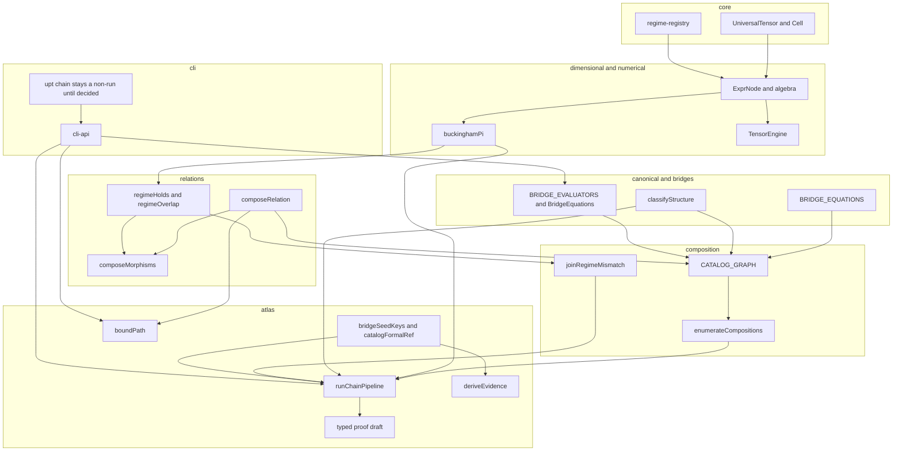

# Refactor and integration phase

This note specifies a refactor-and-integration phase for the library as it
stands after the layering refactor and the bridge-discovery pipeline. It
changes no code, no public export, and no cell of the composition table.
Approval is recorded outside this file. Landing the note does not authorize
a step. A step becomes work when Daniel accepts this note and an `ACTIVE.md`
task names that step. Publishing the package is the owner's job and is not
part of any step.

Live pins, evidence counts, and package version stay in `NOTES.md`. Figures
below were read from the source while this note was written. They are
evidence for the findings. They are not a second status ledger, and nothing
in CI checks them.

The note builds on, and does not replace:

- `docs/planning/Layering-Refactor-Design.md` — the tier order and the
  shrink-only allowlist.
- `docs/planning/Bridge-Discovery-Pipeline-Design.md` — seeds, enumeration,
  the Buckingham filter, the structural classifier, chain order, the proof
  stub, and the internal orchestrator.
- `docs/planning/Regime-Aware-Join-Gate-Design.md` — the join on a shared
  quantity name.
- `docs/planning/Atlas-API-Review.md` — what may move onto the public atlas
  namespace. Tier 2 stays deferred.
- `docs/planning/MathTS-Formula-Integration-Design-Note.md` — Path A and
  Path B parsers behind one `FormulaParser`.
- `docs/architecture/duplicate-symbols.md` — the five exported-name groups
  the dependency tool already reports.
- `docs/architecture/ARCHITECTURE.md` and `docs/architecture/OVERVIEW.md` —
  the module map. Where a sentence in those files disagrees with the source
  cited below, the source wins and the sentence is a finding, not a plan to
  restate the prose.

## What this keeps

The layer order stays the one in the layering note. `tools/layer-order` may
only shrink. A step that needs a new upward edge is the wrong shape and
stops. The allowlist at the time of this note is three upward edges and no
cycle: `src/canonical/linkage.ts` to `src/composition/expr-eval.ts`, and
`src/core/labeled-tensor.ts` to `src/dimensional/errors.ts` and to
`src/numerical/tensor-engine.ts`.

Evidence tags stay derived. `deriveEvidence` is the only way a tag appears.
No step calls it on a chain candidate. A chain stays provisional until a
PhysJS proof exists. UPT does not run Lean. A bridge is proved when the
proof is in PhysJS and the formal-reference procedure in `WORKFLOWS.md` has
vendored it.

The composition table stays the under-approximation in
`src/relations/composition-table.ts`. A silent cell stays silent. Widening a
cell is a reviewed act of its own.

The public atlas surface stays the one namespace in `src/atlas/public.ts`.
No step edits that file or adds a name to the package barrel. Promoting the
deferred Tier 2 set remains the owner decision already open in
`docs/planning/Atlas-API-Review.md`.

Product A (`src/composition/discovery.ts`) and Product B
(`src/composition/probe/`) stay what they are. The chain pipeline stays a
third question. It does not enter either module.

`@danielsimonjr/mathts-*` stays a family of optional peers. No step
republishes, repackages, or vendors MathTS. The zero-dependency engines stay:
Path B in `src/numerical/formula.ts` and `Float64ReferenceEngine` in
`src/numerical/float64-engine.ts`. They exist so the package runs when the
peers are absent. The conformance suites are the lockstep. Collapsing either
pair into the MathTS implementation would make a peer mandatory, which this
phase does not do.

Bare `e` stays the elementary charge. `E` stays energy. Euler's number stays
`exp(x)`.

## Executive summary

The core is in place and layered. `src/dimensional/` is the dimension vector
and the `ExprNode` grammar. `src/numerical/` evaluates it. `src/relations/`
is the vocabulary of relation types, the composition table, π-group regimes,
and a category of morphisms. Above that sit four records that answer four
questions: the catalog row (`BridgeEquationEntry`), the quantity edge
(`BridgeEdge`), the model route (`AtlasBridge`), and the tensor cell
(`BridgeEquation` / `Cell`). The layering refactor removed import cycles.
The pipeline steps landed as separate modules and one internal orchestrator,
`runChainPipeline` in `src/atlas/chain-pipeline.ts`.

What did not land is the joint. The relation table, the category, the
quantity graph, the regime join, the proof overlay, and the CLI each have a
working local contract. They do not share a result type, and one of them
discards the other's refusal. `composeMorphisms` has a test and no
production caller. `upt chain` names the orchestrator and returns exit 2
without calling it, which is what the pipeline note required. The root
barrel re-exports on the order of five hundred names. Two functions named
`propagateUncertainty` implement different contracts. The CLI recomputes the
weak-field cut the graph edge already encodes, and several commands import
past `src/cli-api.ts`.

The phase is a sequence of small internal steps that make those contracts
meet, plus an explicit decision about the public surface. The default
sequence does not require a 2.0.0. A shrink or rename of the root barrel
does, and that shrink is not a step until Daniel says so.

Rough size, `src/` only, comments included: about 420 TypeScript files and
about 92 000 lines. The large areas are `src/bridges/` (91 files, about
16 000 lines), `src/composition/` outside the probe (58 files, about 14 000),
`src/numerical/` (39 files, about 11 000), `src/cli/commands/` (32 files,
about 9 000), `src/atlas/` outside the families (35 files, about 8 000), and
`src/dimensional/` (36 files, about 7 000). Tests are about 600 files and
about 84 000 lines. `src/relations/` is about 1 000 lines and has one test
file, `tests/relations/category.test.ts`.

## How the parts fit today

A catalog id is a row in `BRIDGE_EQUATIONS` (`src/bridges/index.ts`, about
2 800 lines). Its PhysJS reference, when it has one, is not on that row. It
is `catalogFormalRef` in `src/atlas/catalog-formal-ref.ts`. `upt atlas`
prints that reference. The catalog path does not pass it to `deriveEvidence`,
so a catalog reference does not light `formally-proved`. An atlas bridge
(`ab-*`) carries its own `formalRef`, and `deriveEvidence` lights the tag
only for kind `bridge`.

A quantity edge is a `BridgeEdge` on `CATALOG_GRAPH`
(`src/composition/catalog-graph.ts`). Some of those edges also carry a
`relation` of type `RelationType`. The model route is a separate graph:
`findPath`, `findAtlasPath`, and `boundPath` in `src/atlas/path-bound.ts`,
reached from `upt path` through `src/cli/commands/_atlas-route.ts`. A path
warrant is not a substituted formula.

`runChainPipeline` does this, and only this:

1. `bridgeSeedKeys` (`src/atlas/physjs-ref.ts`) selects manifest keys whose
   derived kind is `bridge`.
2. `enumerateCompositions` (`src/composition/enumerate.ts`) walks pairs.
   `composeEdges` must accept the pair. `composeSymbolic` must accept it or
   the pair is `notSubstitutable` and is not a proof target.
3. `buckinghamFilter` (`src/composition/buckingham-filter.ts`) calls
   `dimensionallyDetermines` and `buckinghamPi`. It names a
   `PhysJS.Dimensional` theorem as a string. It does not call Lean.
4. `matchChain` (`src/composition/chain-match.ts`) calls `classifyStructure`
   (`src/canonical/structural.ts`): confirmation, restatement, or a
   provisional `chain-` id.
5. `joinRegimeMismatch` (`src/composition/chain-regime.ts`) runs only when
   the class is provisional. A confirmation or a restatement skips the gate.
6. `orderChainCandidates` (`src/composition/chain-candidate.ts`) orders the
   survivors.
7. `emitProofTarget` (`src/atlas/proof-target.ts`) returns a string: Lean
   comments, then a JSON object between two marker lines. `leanProof` is the
   string `absent`. Nothing is written to the catalog or the manifest.

`composeMorphisms` (`src/relations/category.ts`, 46 lines) is not in that
list. `boundPath` is not in that list. `deriveEvidence` is not in that list.
`upt chain` (`src/cli/commands/chain.ts`) is not in that list: it prints that
the orchestrator stays internal and returns 2.

## Findings, by impact

### 1. A relation-table refusal is erased, and the comment that says the table never runs is false

`composeEdges` applies the composition table only when both operands carry
`relation` (`src/composition/compose.ts`, the block that begins at the
overlay comment). A silent cell throws `UndefinedCompositionError`. A table
result of `approximation` also throws that error, because an edge relation
carries no norm transport and the function refuses to invent a bound.

The comment in that block says every edge in `CATALOG_GRAPH` carries no
`relation`, so the block is skipped and today's compositions are
byte-identical. Nine edges in the graph files do carry `relation`:

| Edge file | Relation type on the edge |
|---|---|
| `src/composition/edges/catalog-quantum.ts` | `coarse-graining` (the master edge) |
| `src/composition/edges/calibration.ts` | `derivation` on the lensing, perihelion, and Shapiro edges; `coarse-graining` on the Zurek edge |
| `src/composition/edges/catalog-tranche.ts` | `derivation` on two edges |
| `src/composition/edges/proved-seeds.ts` | `derivation` on the quantum-Hall and Josephson edges |

`enumerateCompositions` catches every throw from `composeEdges`. It records
`CompositionAliasError` on `requiresDisposition`. Every other throw, including
`UndefinedCompositionError`, hits the same `continue` as a junction or
dimension refusal (`src/composition/enumerate.ts`, the `try` around
`composeEdges`). A pair the table declines, and a pair whose dimensions
disagree, leave the same empty trace. The pipeline then never sees the pair,
so the Buckingham filter, the structural classifier, and the regime gate
cannot say why it is absent.

`derivation` followed by `derivation` is a defined cell, so two derivation
edges that also meet on a quantity still compose. The defect is the silent
cell and the approximation cell, not every pair.

`composeMorphisms` delegates to `composeRelation` and does not read
`source` or `target`. Two morphisms that do not meet still compose. Nothing
under `src/` calls it except the module itself. `tests/relations/category.test.ts`
is the caller. The pipeline note's step 4 asked for this module. The
orchestrator never builds a `CategoryMorphism`.

Impact: the category layer and the equation layer can disagree, and the
disagreement is invisible in `runChainPipeline`'s result.

### 2. One chain is four shapes, and the proof target is a string

The same survivor is re-encoded at each step:

| Step | Type | Kinds |
|---|---|---|
| `classifyStructure` / `matchChain` | `ChainConfirmation`, `ChainRestatement`, `ChainProvisional` in `src/canonical/structural.ts` | `confirmation`, `restatement`, `provisional` |
| `orderChainCandidates` | `ChainCandidate` in `src/composition/chain-candidate.ts` | `confirmation`, `restatement`, `unique-monomial`, `unfixed-shape` |
| `buckinghamFilter` | `BuckinghamFilterRecord` | always `derivation-step`, plus a theorem name or null |
| `runChainPipeline` | `ChainPipelineResult` in `src/atlas/chain-pipeline.ts` | `confirmation`, `restatement`, `stub`, or a `ChainRegimeMismatch` |
| `emitProofTarget` | `string` | comments, then JSON between `PROOF-TARGET-DRAFT-BEGIN` and `PROOF-TARGET-DRAFT-END` |

`toCandidate` in `chain-pipeline.ts` is the adapter from the classifier's
three kinds to the orderer's four. `emit` is the adapter from those four to
the pipeline's four, and it calls `emitProofTarget` for anything that is not
a confirmation or a restatement. The regime mismatch is appended after the
ordered list and is not a `ChainCandidate`.

The draft object inside the string uses the manifest's field names (`key`,
`bridgeId`, `theorem`, `covers`, `coverage`, `leanProof`, `axioms`) and is
not a value of the manifest schema. A reader that wants the draft parses the
markers. `chain-pipeline.ts` also has its own `collectSymbols` over
`ExprNode`. Two more private walkers of that shape live in
`src/numerical/formula.ts` and `src/composition/compose-symbolic.ts`.

Impact: a change to one kind list does not fail the others at compile time.
The PhysJS handoff is text, so a field drift is a string drift.

### 3. Proof links, the catalog, the pipeline, and the CLI are four doors

They are supposed to meet, and each door is locally honest:

- Atlas bridges derive `formally-proved` from a reviewed `formalRef`.
- Catalog equations keep the reference on the atlas overlay. Printing it
  from `upt atlas` does not derive the tag. `src/cli/commands/atlas.ts`
  imports `catalogFormalRef` from `src/atlas/catalog-formal-ref.ts` directly.
- The pipeline emits a skeleton whose own text says it is not a `formalRef`.
- `upt chain` does not call `runChainPipeline`.

`src/atlas/physjs-ref.ts` is about 1 000 lines and is the compiled copy of
the vendored manifest plus `bridgeSeedKeys` and `physjsTheorem`. The seed
rule and the theorem check are the right joint between the pipeline and
PhysJS. The missing joint is the one between a survivor and a reference: a
stub cannot become a reference inside this repository, and nothing in the
result type says which PhysJS key would have to exist before it could.

The regime gate, the composition table, and `(K, δ)` are three more doors
on the same pair of edges. `joinRegimeMismatch` reads the catalog category
through `tensorIndexComponent`, the gated scale and force axes, and
`regimeOverlap`. It does not read `composeRelation`. `boundPath` reads
`composeRelation` and declared norm transports. It does not read
`CATALOG_GRAPH`. A quantity chain and a model route can both be "a
composition" in prose and be different functions with different refusals.

Impact: a reader can confirm a catalog id, refuse a regime, and still have
no relation-type claim and no proof. That split is intended for the stub.
It is not intended that the relation-type claim be dropped on the floor
before the stub exists.

### 4. Three regime vocabularies, one word

| Vocabulary | Module | What a regime is |
|---|---|---|
| Tensor-cell registry | `src/core/regime-registry.ts` (about 280 lines) | A named value on a scale, force, symmetry, information, topology, or dimension axis, with provenance |
| π-group regime | `src/relations/regime.ts` (about 400 lines) | Inequalities on Buckingham groups. `regimeHolds` is tri-state. `regimeOverlap` reports overlap, nested, or disjoint |
| Quantity attributes | `src/composition/quantity.ts` and `src/composition/axes.ts` | Scale and force on a `Quantity`, gated by `GATE_AXES` |

`src/atlas/regime.ts` re-exports the π-group half and keeps
`admitApproximation`, which is generic over `AtlasBridge`. The join gate
consults the category letter, the quantity attributes, and `regimeOverlap`.
It does not consult the cell registry. The cell registry does not consult
π-groups. Sharing the English word without a shared type is how a later
edit "fixes" one regime and leaves the other two.

Impact: medium. Unifying the three into one type would invent physics. The
defect is the missing glossary at the type level, so a caller can see which
function they are holding.

### 5. The CLI reimplements library decisions, and exit codes are per command

`src/cli-api.ts` (about 200 lines) is the barrel `MEMORY.md` describes as
the only door from a command to library internals. These commands also
import a library module themselves:

| Command module | Direct import |
|---|---|
| `src/cli/commands/atlas.ts` | `catalogFormalRef` |
| `src/cli/commands/recover.ts` | `scanCompositionRecovery` |
| `src/cli/commands/metric.ts` | `src/numerical/spacetime-metrics.ts` |
| `src/cli/commands/eval.ts` | `readBinding`, `UnitError`, `builtinFormulaDimensionChecker` |
| `src/cli/commands/evaluate.ts` | `bindingInUnit`, `missingEvaluatorMessage`, `C_SI`, `G_SI` |
| `src/cli/commands/regime.ts`, `path.ts` | `readBinding` |
| `src/cli/commands/map.ts` | composition and atlas types, plus `withCatalogEvidence` |

`upt path` itself calls `boundPath` through `_atlas-route.ts`. The 1 400
lines in `src/cli/commands/path.ts` are presentation and `--at` handling,
not a second router. `src/cli/commands/_atlas-map.ts` is about 1 400 lines
of the same kind for `upt map` and `upt atlas`.

Two decisions are re-derived in the command:

- `propagateUncertainty` in `src/cli/commands/evaluate.ts` (about line 157,
  through the curvature and correlation block) takes an arbitrary evaluator,
  pairwise correlations, and a curvature ratio. `propagateUncertainty` in
  `src/composition/uncertainty.ts` takes a `BridgeEdge`, independent sigmas,
  and an optional `ApproximationBound` that it reports separately and does
  not fold into the variance. The CLI function does not call the library
  function. The library function is a public root export. The CLI function
  is not. `docs/architecture/duplicate-symbols.md` already names this pair.
- `weakFieldDomainNote` in `evaluate.ts` recomputes `r_s = 2GM/c²` and the
  cut `b ≤ 10 r_s` from `G_SI` and `C_SI`. The lensing edge's `domain`
  predicate in `src/composition/edges/calibration.ts` already encodes
  `b ≥ 10 r_s`. The command prints the number and a warning and returns 0.
  The edge, asked the same point, refuses the domain. Both behaviors are
  written down. They are not one function.

Exit codes are `UsageError` → 2, `CliError` → 1, `EXIT_CHECK_FAILED` → 3
(`src/cli/errors.ts`). `runCli` maps only those two classes
(`src/cli/main.ts`). Anything else escapes. Commands then wrap `Error` in
different classes:

- `upt derive` wraps a bad `name:dimension` token as `UsageError` (exit 2).
- `upt evaluate` wraps a non-numeric value as `CliError` (exit 1) and a
  missing `=` as `UsageError` (exit 2). `upt eval` now matches that split.
- `upt metric` catches every non-`UsageError` from the geodesic branch and
  rethrows `UsageError` (`src/cli/commands/metric.ts`). A non-positive Kerr
  mass and an `|a|` above the bound become exit 2, the code the rest of the
  CLI uses for a malformed invocation. A failed check that ran is exit 3 on
  `upt path`, `upt regime`, `upt derive`, and `upt map`.

`upt chain` returning 2 is a deliberate non-run, not a malformed flag. It
shares the code the parser uses for an unknown command.

Impact: medium for a script author. The library and the command can both be
right about their own contract and still disagree about a number or an exit
code.

### 6. The public surface is large, and the names collide

`src/index.ts` is about 980 lines. A count of distinct names in its export
lists, read for this note, is about 500. `src/atlas/public.ts` exports 24
names. `src/atlas/index.ts` exports about 200, and `package.json` exposes
that file as `universal-physics-tensor/atlas`. The probe subpath exposes
`src/composition/probe/index.ts`. `MathTSEngine` stays on
`universal-physics-tensor/numerical/mathts-engine`, which is the right
split and stays.

Names that a caller can confuse because they are all public or all easy to
import:

| Name | Where it lives | What it does |
|---|---|---|
| `compose` | `src/core/tensor.ts`, root export | Cell factory |
| `composeEdges` | `src/composition/compose.ts`, root export | Quantity-edge composition |
| `composeSymbolic` | `src/composition/compose-symbolic.ts`, root export | Substitutes scalar formulas |
| `composeRelation` | `src/relations/composition-table.ts`, atlas public | Table lookup |
| `composeMorphisms` | `src/relations/category.ts`, not public | Table lookup again, ignoring endpoints |
| `composeBounds`, `composeBoundPath` | `src/atlas/error-algebra.ts`, atlas public | `(K, δ)` algebra |

`BridgeEquation` is the runtime tensor record. `BridgeEquationEntry` is the
catalog row. `BridgeEdge` is the graph edge. `AtlasBridge` is the model
relation. `BridgeCell` is the cell-union member. `BridgeEquations` is the
facade of evaluator methods (`src/bridges/bridge-equations.ts`).
`BRIDGE_EVALUATORS` / `evaluateBridge` (`src/bridges/evaluators.ts`) is a
smaller registry: the closed-form and spacetime bridges the CLI evaluates.
The facade and the registry are different sets. The missing-evaluator
message points at a method on the facade when the registry has no row. That
split is documented. It is still two dispatch tables for "evaluate this
bridge."

`canonicalJson` is exported from `src/cli/record.ts` and from
`src/composition/probe/serialize.ts` with different `Date` and `undefined`
behavior. `captureEnvironment` is two different schemas, which
`duplicate-symbols.md` already calls benign.

Fifty-three exported classes match `*Error`, each name unique. The set is
wide. It is not internally duplicated by name. The CLI's two classes are the
only ones `runCli` catches.

The generated unused report (`docs/architecture/unused-analysis.md`) lists
one file and on the order of eighty exports that no other file imports.
`src/atlas/public.ts` is that file, and `src/index.ts` reaches it with
`export * as atlas`. The walker does not count that form, so the file is not
unused. A public name with no in-repo importer is the package surface, not
dead code. This phase does not delete from that list. The production symbol
with a test and no other caller is `composeMorphisms`, which finding 1
covers.

Impact: medium, and mostly an owner decision. Adding names has been the
compatible direction. Removing or renaming a root export is a major bump.
This note does not propose the removal.

### 7. MathTS and PhysJS are wrapped where the seam is clean, and re-derived where it is a string

Clean seams, which this phase leaves alone:

- `src/numerical/formula-mathts.ts` (about 200 lines) implements
  `FormulaParser` over `@danielsimonjr/mathts-functions`. Path B
  (`formula.ts`, about 400 lines) is the recursive-descent fallback. The
  registry picks Path A when the peer loads. Accepted divergences (factorial,
  `erf`, `gamma`, juxtaposition) stay the ones the architecture note already
  lists.
- `src/numerical/mathts-engine.ts` (about 230 lines) adapts
  `@danielsimonjr/mathts-tensor`. `Float64ReferenceEngine` (about 770 lines)
  is the zero-dependency `TensorEngine`, including its own dual-number
  forward mode. Both sit behind one interface and one conformance suite.
- `src/composition/expr-simplify.ts` (about 420 lines) renders an `ExprNode`
  and calls the MathTS simplifier, then checks dimension, symbol set, and a
  numeric probe. That is a use of MathTS, not a second simplifier.
- `src/composition/probe/generator.ts` calls `dimensionallyDetermines`. It
  does not reimplement the null space. `buckinghamFilter` does the same.

String seams, which are the integration debt:

- `buckinghamFilter` stores a theorem name (`PhysJS.Dimensional.monomial_form`
  and the three sibling names). PhysJS proves the shape for a hypothesized
  exponent vector. UPT chooses the vector in TypeScript. Nothing in the
  filter result is a `formalRef`, and passing that string to `deriveEvidence`
  would be asserting evidence. The pipeline correctly does not do that.
- `emitProofTarget` checks seed theorem names against `physjsTheorem` and
  then emits text. The check is real. The artifact is not a manifest entry.

Impact: low if the peers stay optional and the string seam stays unlabeled
as proof. High if a later change treats the theorem string as a reference.
This phase forbids that treatment.

### 8. Tests cover the pieces and do not cover the joint

About 600 test files. Atlas, bridges, composition, CLI, dimensional, and
numerical each have a large suite. The chain has
`tests/atlas/chain-pipeline.test.ts`,
`tests/atlas/chain-pipeline-catalog.test.ts`,
`tests/composition/chain-regime.test.ts`,
`tests/composition/chain-candidate.test.ts`,
`tests/atlas/proof-target.test.ts`, and
`tests/cli/chain-command.test.ts`. Those tests pin the local contracts,
including that `upt chain` returns 2 and does not write the catalog.

Gaps, as absences of a failing control rather than as a coverage percentage:

- No test distinguishes `UndefinedCompositionError` from a dimension
  mismatch inside `enumerateCompositions`. Both disappear.
- `composeMorphisms` is tested against `composeRelation` and is not tested
  against an adjacent pair of real edges, because it never sees edges.
- `tests/relations/` is one file. The π-group regime is tested from
  `tests/atlas/`, through the re-export. A break in `src/relations/regime.ts`
  fails those atlas tests. A reader looking for the relations suite finds
  the category wrapper only.
- CI runs `bun run test:probe-coverage` with thresholds on
  `tests/composition/probe`. The rest of `src/` has `bun run test:coverage`
  and no threshold in `.github/workflows/ci.yml`. A probe-only gate does not
  see `chain-pipeline.ts`.
- `tests/cli/exit-codes.test.ts` pins the contracts that already exist. It
  does not pin the Kerr geodesic branch in `metric.ts` to the same table.

`tests/api/` guards the public namespace, closure under type references, and
the optional-peer absence. Those stay the gate for any export step. This
phase's default steps do not add an export, so those tests should stay
green without being edited. A step that wants to edit them is an export
step and stops for the owner.

## Target architecture

The tiers stay in the layering order. Arrows are "may call", matching that
order. The new joint is a single internal chain result that carries the
relation-table answer, the dimensional shape, the structural class, and the
regime gate as fields of one value. The CLI reads that value only if a later
owner decision adds a command. The proof draft is a typed object the string
renderer prints. It becomes a `formalRef` only through the PhysJS procedure,
outside this phase.

`deriveEvidence` stays off the pipeline arrow. `Cell` regimes stay off the
join-gate arrow until an owner decision says a cell axis is a π-group, which
this note does not say. MathTS stays behind `TensorEngine` and
`FormulaParser` and is not a node in the chain.

## Sequenced plan

Each step is one pull request, mergeable on its own, and safe to stop after.
A later step does not start by assuming an earlier step widened the
composition table or the public barrel. Tests are written to fail on the
tree before the production change, per the law in `AGENTS.md`.

### Step 1 — Record why a pair was not a proof target

Scope. `enumerateCompositions` gains an internal classification of the
throws it already catches, or a sibling function the pipeline can call that
returns the same pairs plus a refusal list. `UndefinedCompositionError` is
its own list. `CompositionAliasError` stays `requiresDisposition`. A
dimension or junction failure stays the silent non-pair it is today.
`EnumerationReport` on the root barrel does not gain a required field in
this step. A new field on that public type waits for an owner decision.

Risk. Low if the new list is additive and `proofTargets` is unchanged.
Medium if a pair that throws today is moved onto `proofTargets`. This step
does not move pairs.

Tests. A fixture pair whose relations are a silent cell appears on the
refusal list and not on `proofTargets`. A fixture pair that fails
`equals` on the dimension appears on neither the refusal list nor
`proofTargets`. A `derivation` then `derivation` pair that already composes
stays a proof target when it is substitutable. The silent-cell fixture must
fail before the list exists.

Public API. Unchanged.

### Step 2 — One internal chain result

Scope. Replace the adapters in `toCandidate` and `emit` with one internal
type that can carry the classifier kind, the order key, the filter theorem,
the regime mismatch, and the edge ids together. `orderChainCandidates` can
keep its four-kind order key as a function of that type. Confirmation and
restatement still skip the regime gate, as the join-gate note requires.
`ChainPipelineResult` may remain the orchestrator's return type if it
becomes a view of the internal type rather than a second encoding.

Risk. Low. All of these types are `@internal`. Golden output of
`runChainPipeline(CATALOG_GRAPH)` stays the oracle: the same confirmations,
restatements, stubs, and regime rejections, in the same order.

Tests. The existing chain-pipeline catalog test is the oracle. A new test
builds one internal value and checks that the order key and the rendered
kind agree. It fails if `toCandidate` and `emit` can still drift.

Public API. Unchanged.

### Step 3 — Category composition checks that the morphisms meet

Scope. `composeMorphisms` returns `no-composite-claim` when
`first.target` is not `second.source`, and otherwise returns
`composeRelation` as it does now. The pipeline records that result on the
internal chain value from step 2. It does not throw, and it does not drop a
pair that `composeSymbolic` accepted. Endpoint identity is string equality
on the ids the caller stored. This step does not invent object ids for
quantity edges.

Risk. Medium for callers of `composeMorphisms` that relied on endpoint
blindness. The only caller is the category test, which must be updated in
the same pull request and must have failed first on a non-adjacent pair.
The pipeline's set of stubs does not change.

Tests. Adjacent morphisms match `composeRelation` on every cell, including
the silent ones. A non-adjacent pair returns `no-composite-claim` even when
the table cell is `derivation`. The pipeline test shows the recorded field
and an unchanged stub list.

Public API. Unchanged. `composeMorphisms` stays off `src/atlas/public.ts`
and off the root barrel.

### Step 4 — A typed proof draft, string as a rendering

Scope. `emitProofTarget` builds a typed object with the fields it already
puts in the JSON (`key`, `bridgeId`, `theorem`, `covers`, `coverage`,
`leanProof`, `axioms`) and renders the comment block from that object.
`leanProof` stays `absent`. The markers stay so existing golden text can be
compared. The object is not written to `formal/physjs/manifest.json` and is
not passed to `deriveEvidence`. `physjsManifestProblems` may be called on a
copy the test builds. The production orchestrator still does not write.

Risk. Low if the rendered string is golden-tested and unchanged. Medium if
the renderer "cleans up" a comment and the golden file moves without a
physics reason.

Tests. The existing proof-target test fails if the object and the string
disagree. A mutation that sets `leanProof` to a complete marker still fails
the manifest problem check, as it does now.

Public API. Unchanged.

### Step 5 — One expression-leaf walk

Scope. One internal walker over scalar `ExprNode` leaves, used by
`governingOf` in `chain-pipeline.ts` and by the symbol collector in
`compose-symbolic.ts`. The formula parser's walk over its own parse `Node`
stays in `formula.ts`: that tree is not an `ExprNode`. Tensor and curvature
node kinds stay ignored by the scalar walk, which is what `governingOf`
does today (`default: return`).

Risk. Low. A wrong default arm that starts visiting tensor nodes would
change Buckingham inputs. The test must show a curvature node contributes
no governing symbol.

Tests. A scalar formula with a nested transcendental yields the same name
set from both call sites. A tensor-kind node yields none. The test fails
before the shared walker exists, by importing a walker that is not there
yet, or by duplicating the assertion against a temporary exported helper
that the old copies do not use. Prefer a characterization test on
`governingOf`'s current output, then switch the implementation and show a
mutated walker fails it.

Public API. Unchanged.

### Step 6 — Rename the CLI uncertainty helper

Scope. The function in `src/cli/commands/evaluate.ts` gets a name that is
not `propagateUncertainty`. Behavior, correlations, and the curvature ratio
stay. It still does not call the graph-layer function: the contracts differ,
and folding them is a physics decision this step does not make.
`docs/architecture/duplicate-symbols.md` is generated; this step does not
hand-edit it. The next `bun run docs:deps` drops the name from the duplicate
group if the generator keys on the export name.

Risk. Low. Tests that import the CLI function must be updated in the same
pull request. A search at the time of this note found no such import. The
public `propagateUncertainty` stays the graph-layer function.

Tests. The CLI evaluate uncertainty cases still pass under the new name. A
test that imports the old CLI name fails to compile, which is the red
control.

Public API. Unchanged.

### Step 7 — Commands go through `cli-api`

Scope. The direct imports in the table under finding 5 become re-exports on
`src/cli-api.ts`, and the command modules import types and values from that
barrel or from other CLI modules. `src/cli-api.ts` stays off the root
barrel. No behavior change.

Risk. Low, and mechanical. A cycle through the barrel is the failure mode.
`cli-api` already imports the root index. A command that imported `cli-api`
while `cli-api` imported the command would cycle. Commands keep importing
the barrel; the barrel does not import commands.

Tests. Existing CLI tests. `bun run layer:check` stays green. The allowlist
does not grow.

Public API. Unchanged.

### Step 8 — Name the three regimes in one module

Scope. A short internal module under `src/relations/` that exports nothing
but type aliases and a comment naming the three vocabularies in finding 4,
each pointing at its existing function. No value conversion. No new
`Regime` type. The join gate's behavior is unchanged.

Risk. Low, provided the module does not import `src/atlas/` or
`src/core/` in a way that adds an upward edge. It may name the core
registry in a comment and import only `relations` types. If a type alias
requires importing `src/core/regime-registry.ts`, that import is upward
under the layering note and the step stops. The glossary is then a comment
in `src/relations/regime.ts` instead of a new import.

Tests. A test lists the three names and fails if a fourth export appears.
It does not assert that the three are equal.

Public API. Unchanged.

### Step 9 — Exit-code alignment for the metric geodesic, only with a failing test of today's code

Scope. `upt metric` geodesic failures that are a bad value (non-positive
mass, `|a|` above the bound) become `CliError` (exit 1). A missing
subcommand argument stays `UsageError` (exit 2). This step is independent
of steps 1–8 and can land first. It changes a CLI contract that a script
could have pinned.

Risk. Medium, because it is a behavior change. The red test is the current
exit code, recorded, then the assertion is updated only after that failure
is in the pull request's history as the reason. Do not "fix" other exit
codes in the same pull request.

Tests. `tests/cli/exit-codes.test.ts` gains the Kerr cases. The first
commit of the test expects today's exit 2 and fails once the command
returns 1, or the test is written against the desired code and shown red
on unchanged `metric.ts` before the edit. Either order satisfies the
fail-first rule if the red output is kept.

Public API. The library barrel is unchanged. The CLI contract changes.
That is a minor, with a changelog line, if Daniel treats the CLI as
additive-compatible when the docs and the tests move together. It is not
a 2.0.0 by itself. If Daniel treats every exit-code change as breaking,
this step waits. That choice is an open question below.

### Held out of the sequence

These are real, and they are not steps of this phase:

- A `upt chain` that calls `runChainPipeline`. The pipeline note left the
  orchestrator internal. Step 1's refusal list is what a future read-only
  command would print. The command itself waits for an owner decision.
- Shrinking or renaming the root barrel. `docs/planning/Atlas-API-Review.md`
  already owns the promotion question. Demotion is the inverse and needs
  its own decision.
- Merging `BridgeEquations` with `BRIDGE_EVALUATORS`. Worth doing only
  after the message and the registry agree about which ids evaluate. That
  is a behavior change for `evaluateBridge` and a public-surface edit.
- Merging the two `propagateUncertainty` contracts. Correlations and a
  deterministic bound are different objects. Folding them repeats the
  mistake the graph-layer function's comment already retracts.
- Replacing Path B or `Float64ReferenceEngine` with MathTS. That makes a
  peer mandatory.
- Republishing or repackaging MathTS.
- Running Lean, writing a manifest, or calling `deriveEvidence` on a stub.
- Widening the composition table.
- Unifying cell regimes with π-groups.
- Editing `src/composition/discovery.ts` or `src/composition/probe/`.

## Semver

The default sequence does not need a 2.0.0.

Steps 1 through 8 add no root export, remove no root export, and do not
change `src/atlas/public.ts`. They are patch-level inside the 1.x line, or
a minor if the changelog wants them visible. They ship as ordinary
pull requests. They do not require a major tag.

Step 9 changes a CLI exit code. It still does not need a 2.0.0 unless
Daniel rules that CLI exit codes are a frozen contract. The recommendation
here is a minor, one command, with the red test in the history.

A 2.0.0 is the right major if, and only if, a later owner decision does one
of these:

- removes or renames a name on `src/index.ts` or `src/atlas/public.ts`;
- changes `composeEdges` so a pair that succeeds today throws;
- changes `enumerateCompositions` so `proofTargets` or `all` lose a pair
  the current tests pin;
- makes a MathTS peer a required dependency.

None of those are steps above. The barrel-shrink question in
`docs/planning/Atlas-API-Review.md` remains the nearest reason to open a
major, and it is still deferred.

## Open questions for Daniel

1. Should a silent composition-table cell stay indistinguishable from a
   dimension mismatch, or should step 1's refusal list become the permanent
   record? The recommendation is the refusal list, without dropping any
   pair the pipeline already returns.
2. Does `upt chain` stay a non-run that exits 2, or should a later note
   specify a read-only report that prints the pipeline result and writes
   nothing? This note does not specify that command.
3. Is the root barrel frozen at its current names until a 2.0.0, and is
   that 2.0.0 the Atlas API review's Tier 2 decision rather than this
   phase? The recommendation is yes: this phase does not touch the barrel.
4. Do the three regime vocabularies stay three, with step 8 only naming
   them? The recommendation is yes.
5. Are CLI exit codes a frozen contract? If they are, step 9 waits for a
   major. If they are not, step 9 is a minor limited to the metric
   geodesic.
6. Should the two uncertainty functions ever share an implementation? The
   recommendation is no. They should stop sharing a name, which is step 6,
   and keep both contracts.
7. Is `composeMorphisms` worth keeping once it checks endpoints, or should
   the pipeline call `composeRelation` and delete the category wrapper?
   The recommendation is to keep it and make the endpoint check real,
   because the pipeline note already placed the category in `src/relations/`.
   Deleting it is an alternative Daniel can choose instead of step 3.
8. The comment in `composeEdges` that says no catalog edge carries
   `relation` is false. Confirm that correcting the comment and recording
   the nine edges is in scope for step 1, and that those nine relations
   stay. This note does not remove them.

## Amendment proposal

The text below is the proposal. This pull request does not edit `ACTIVE.md`
or `ROADMAP.md`. Those files change only after Daniel accepts a step and
the corresponding task is filed.

### Proposed `ACTIVE.md` tasks

File these under open tasks, easiest first, and only the steps Daniel
accepts. Each line is the task title. The body of the task points back at
this note's step and does not restate the design.

1. Record composition-table refusals from enumeration as their own list,
   without changing which pairs are proof targets. Design:
   `docs/planning/refactor-integration-phase.md`, step 1.
2. Use one internal chain-result type in the classifier, the orderer, and
   the orchestrator. Design: step 2.
3. Make category composition refuse morphisms that do not meet, and record
   that result on the chain without dropping proof targets. Design: step 3.
4. Build the proof-target draft as a typed object and render the existing
   text from it. Design: step 4.
5. Share one scalar expression-leaf walk between the chain pipeline and
   symbolic composition. Design: step 5.
6. Rename the CLI uncertainty helper so it is not the public uncertainty
   function. Design: step 6.
7. Move command-module library imports onto the CLI barrel. Design: step 7.
8. Name the three regime vocabularies from the relations layer without
   merging them and without a new upward edge. Design: step 8.
9. Map a bad Kerr geodesic value to exit 1, after a test that fails on
   today's exit 2. Design: step 9. Hold this task if exit codes are frozen.

Leave these unfiled until a separate owner decision:

- A read-only chain command.
- Any edit to the root barrel or to `src/atlas/public.ts`.
- Merging the evaluator facade with the evaluator registry.
- Any MathTS packaging change.

### Proposed `ROADMAP.md` paragraph

Place this after the phase list, as direction rather than as a new phase
number. Do not renumber Phases 0–6. Do not mark a phase met in that file.

> Integration of the catalog, the quantity graph, the relation table, the
> regime join, the proof overlay, and the CLI is a refactor phase specified
> in `docs/planning/refactor-integration-phase.md`. It is authorized only by
> open tasks in `ACTIVE.md` that name a step of that note. It does not
> reopen Phases 0–6, does not widen the composition table, does not add a
> public export, and does not republish the MathTS packages. A major version
> is in scope only for a later decision that removes or renames a public
> export or makes a MathTS peer mandatory.

## What this note does not do

It does not move a module, delete an export, or add a command. It does not
claim a coverage percentage, a cycle count beyond the allowlist cited above,
or a catalog count. Those live in `NOTES.md` and in the generated
architecture reports. It does not authorize PhysJS work. A proof target
becomes a proof in that repository, then a vendored reference through
`WORKFLOWS.md`, and only then an evidence tag.
