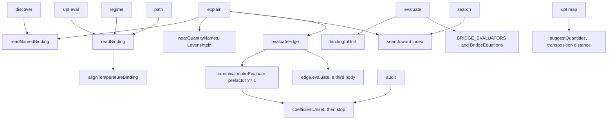
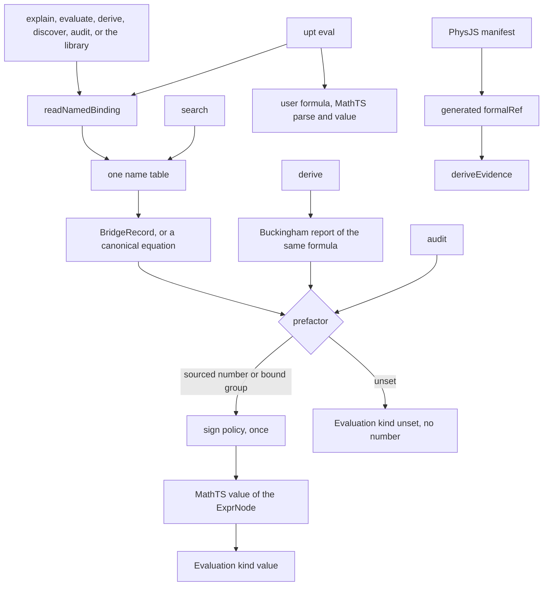

# v6.0.0 Design — one owner for each concept

This is the integration design for the 6.0.0 break. The filename matches the other release designs in this directory (`v0.8.0-Design.md` and the rest).

It chooses the target. `docs/architecture/INTEGRATION_MAP.md` remains the measurement of the duplicated concepts and does not become a second copy of these decisions. Counts, pins, and what has landed stay in `NOTES.md`.

The owner accepted this note on 2026-10-04. The resolutions are Decisions (owner, 2026-10-04). A phase is an `ACTIVE.md` task. Publishing the package is the owner's job and is not a phase.

The note builds on, and where they disagree with the source the source wins:

- `docs/architecture/INTEGRATION_MAP.md` — the ten targets and the call graph.
- `docs/planning/Layering-Refactor-Design.md` — the tier order. It still holds. This design adds no upward edge.
- `docs/planning/refactor-integration-phase.md` — the joint the layering left open. The 2.0.0 MathTS migration it describes has landed (`getFormulaParserKind` is `mathts` only; `Float64ReferenceEngine` is absent). What it still asks for, and this design keeps, is one composition rule and a recorded refusal.
- `docs/planning/MathTS-Formula-Integration-Design-Note.md` — one mathematics, with the UPT `ExprNode` kept for dimensions. Path B is gone. The `e` divergence that note accepted (MathTS Euler versus a free `e`) is closed: bare `e` is the elementary charge, `E` is energy, and Euler's number is `exp(x)`.
- `docs/planning/root-cause-analysis-2026-10-03.md` — a shared token is not an identity, and a name is not a private list in each command.
- `docs/planning/Catalog-FormalRef-Design-Note.md` and the `lean4-physjs` procedure in `WORKFLOWS.md` — a bridge is proved only when PhysJS Lean states it and `deriveEvidence` reads a reviewed `formalRef` of kind `bridge`.

`src/` is unchanged by this note.

## What was checked, and what the map had wrong

The map was read against `src/` on the tree it measured. These statements in the map were incomplete. They are corrected in the map. The decisions below use the corrected reading.

- `suggestQuantities` is optimal string alignment: an adjacent transposition is one edit, and the rank also allows a longer distance plus containment. `nearQuantityNames` is plain Levenshtein and stops at distance 1. The map had marked the transposition claim INFERRED.
- `restatesBridge` is set on five canonical entries: `16`, `29`, `42`, `51`, `52`.
- `CANONICAL_GROUP_PREFACTORS` sources √γ for `CE-sound-speed`. `makeEvaluate` never reads it. `canonical-compare.ts` does.
- `CE-ideal-gas` stores `N` on the scalar AST and omits `N` from the monomial `makeEvaluate` evaluates. Compare has a separate widening for that count. Explain does not.
- Classical RK4 is not two loops. Schwarzschild and Kerr each have one in `spacetime-metrics.ts`. Witnesses call `rk4Step` from several oscillator files, and `limit-witnesses.ts` inlines two more loops that do not call `rk4Step`. The wave and heat loops are finite differences.
- `upt regime` and `upt path` called `readBinding` (`regime.ts` `parseAt`, the path sweep, and the path tolerance) and did not call `alignTemperatureBinding` on the tree this note first measured. PR #395, since merged, calls `alignTemperatureBinding` from explain, discovery anchors, regime coordinates, and path sweeps. `upt evaluate` still does not. The map's temperature paragraph is that later reading.

The map's account of the three evaluation paths, the four bridge writings, the temperature split, the `?? 1` multiply, the two JSON writers, the two BE-70 checks, the hand-copied PhysJS table, the atlas shims, and the generator's blindness to `export * as` matches the source.

## Round 6

Issues 386–392 are the plasma and space dogfood. PR #395, for issue 386, has merged. It calls `alignTemperatureBinding` from explain, discovery anchors, regime coordinates, and path sweeps, adds `kelvinScale` in `src/cli/temperature-bindings.ts`, and leaves `upt evaluate` rejecting an energy in a declared kelvin slot.

That PR preserves the reading this design keeps, and it is the patch this design does not keep. The reading: an energy on a temperature name is `k_B T`. The scale is the bound `boltzmann-constant` when that binding is a bare number or already J/K, otherwise `k_B`, then `kB`, then the CODATA value. A bare number on those names stays kelvin. A length on those names is an error.

Issues 387–392 have no fix PR. They are consequences of the decisions below, so they do not become six more patches:

| Issue | What it is | Decision |
|---|---|---|
| 386 | explain stores joules in a kelvin slot; evaluate rejects the same energy | 1 |
| 387 | ideal-gas explain returns `k_B T / V` and drops `N` | 5 |
| 388 | plasma frequency changes sign with `q` | 8 |
| 389 | Larmor radius changes sign with `q` | 8 |
| 390 | `sound-speed` is not the target of `CE-sound-speed`; `gamma` does not resolve | 4 and 5 |
| 391 | `reynolds number` hits the Reynolds analogy | 4 |
| 392 | a missing Debye length is answered with the phonon family | 4 |

## The core

UPT's core is the tensor and the dimensional calculus on it. A quantity has a dimension. A relation between quantities is an `ExprNode`: a dimension-carrying tree the validator can accept or reject. A rank-6 cell is one such relation placed on the tensor's axes. Categories and functors sit above that. They say how relations compose. They do not compute a number and they do not store a second formula.

MathTS owns the mathematics: arithmetic, simplification, SI scale, uncertainty, automatic differentiation, and ordinary differential steps. PhysJS owns the Lean proofs and the manifest. UPT does not run Lean. A tag `formally-proved` appears only when `deriveEvidence` is given a reviewed `formalRef` of kind `bridge` from that manifest.

Three regime words stay three types. The cell-registry regime, the π-group regime, and the quantity's scale and force attributes are different claims. Merging them would invent a physics they do not share. The refactor note already says this. A caller names which one it holds.

`upt eval` stays a user-formula command. It is not a bridge lookup. `upt chain` stays a refusal that cites the pipeline design. The chain orchestrator stays internal. Product A (`discovery`) and Product B (`probe`) stay two products.

## Who owns what

The tier order is unchanged:

```text
core
  → dimensional | numerical
  → relations
  → canonical | bridges | cases | diff
  → composition
  → atlas
  → cli
```

A tier may import an earlier tier. `bridges/` does not import `composition/`. `bridges/` and `composition/` do not import `src/atlas/index.ts`. They may import an atlas leaf. The layer-order allowlist only shrinks.

| Concept | Owner | What the others hold |
|---|---|---|
| Tensor, cell, law and bridge runtime types | `src/core/` | |
| `Dimension`, the `ExprNode` grammar, `validate` | `src/dimensional/` | The tree is not a numeric interpreter |
| Named dimensions, including one `MASS_DENSITY` | `src/dimensional/` | Bridge and quantity files import it |
| Unit spellings that are a physics convention (affine °C, gauss, bit as ln 2) | `src/dimensional/units.ts` | MathTS confirms an SI ratio when the scale and the 7-base dimension agree |
| `readNamedBinding` | `src/numerical/binding-value.ts` | Every command and the library call this. No second alignment step |
| Lowering an `ExprNode` to a number, and the ODE driver | `src/numerical/`, calling MathTS | No local `+ - * / ^` interpreter and no local RK4 |
| Relation vocabulary, composition table, π-group regime | `src/relations/` | Atlas re-exports it. Atlas keeps `admitApproximation`, which is generic on an atlas bridge |
| Textbook equation (`CE-*`), `restatesBridge` as a foreign key | `src/canonical/` | The key is checked. The formula is not copied into an evaluator |
| One `BridgeRecord` per catalog id (`be-*`) | `src/bridges/`, registered once | The catalog array, the RHS map, the graph edge, and the CLI evaluator map are projections |
| Sign policy | a field on that record, enforced by one function in `src/bridges/carrier-sign.ts` | Called once from the evaluator |
| Sourced prefactor | one result on the canonical equation: a number, a group, or unset | The evaluator multiplies a sourced number. Unset yields no number |
| Quantity names, aliases, evaluator keys, one edit distance | `src/composition/aliases.ts` | Search's word index reads this table. It is not a second resolver |
| Explain, discover, audit, edge projection | `src/composition/` | They call the one evaluator |
| Model relations (`ab-*`), evidence, witnesses | `src/atlas/` | Not catalog rows and not quantity edges |
| `formalRef` lookup | generated from `formal/physjs/manifest.json` into the atlas leaf the lookup already uses | Authors do not hand-copy the table |
| Commands | `src/cli/` | No private unit rule, name table, or formula |
| Proofs | PhysJS | The vendored manifest is the pin |

`getBridge` today joins three hand-written registries and says it is not a source of truth. That join is a detector of drift. The target deletes the extra writings, and `getBridge` reads the record plus the two projections that are actually different facts: the canonical foreign key, and the formal reference joined from the manifest. Catalog `status`, edge `confidence`, and derived evidence stay three facts on that view.

## Data flow

### Before

A command picks a reader, a name table, and an evaluator. Audit can say the coefficient is unset while explain multiplies by 1.



### After

Bindings, names, the factor, the sign, and the number each happen once. `upt eval` joins the reader and MathTS and does not look up a record.



`explain` resolves the name, classifies identifiability on the record's formula, and calls the evaluator. `evaluate` is the same call keyed by catalog id. `search` matches words against the name table and against a gloss field that is not the title. `derive` reports whether the declared dimensions determine a monomial, then compares a supplied formula with the record through `classifyStructure`. `discover` ranks links on the projected graph. `audit` reads the same prefactor result the evaluator used. The formally-proved filter reads the Lean kind from `deriveEvidence`, which is the rule already in force.

The library call is `evaluateRelation`. `explainQuantity`, `evaluateEdge`, and a projected `BridgeEdge.evaluate` call it. A graph edge does not carry a private formula.

## Decisions

### 1. One temperature and unit reader

`readNamedBinding(name, raw)` is the only reader. A temperature name is `T`, `temperature`, `temp`, or `T_K`, and any parameter whose declared dimension is temperature. An energy on that name is divided by the Boltzmann scale from PR #395. Any other dimension on that name is an error. A joule binding on a name that is not a temperature stays joules. Affine °C, the gauss, and the bit stay on the unit table. The Celsius offset lives in that table once.

`alignTemperatureBinding`, `kelvinScale`, and a temperature branch inside `bindingInUnit` are deleted. `upt evaluate be-76 T_K=10eV` follows the same reading as `upt eval` and `upt explain`.

Rejected: leave `upt evaluate` rejecting an energy, which is what PR #395 preserves. The convention would still depend on which command the user typed.

Rejected: store the joule magnitude in the kelvin slot. That is issue 386.

Rejected: reject every energy on a temperature name, including `upt eval`. The eval reading is the one the dogfood and the notes already treat as the rule.

### 2. One evaluator

`evaluateRelation(id, bindings)` loads the record, reads bindings with decision 1, applies decisions 5 and 8, and lowers the record's `ExprNode` through MathTS. The result is:

```ts
type Evaluation =
  | { readonly kind: 'value'; readonly value: number; readonly dimension: Dimension }
  | { readonly kind: 'unset'; readonly formula: string };
```

`Dimension` is already public. A missing input, a domain failure, and a sign failure throw. A sum of dimensionful terms still returns `kind: 'value'` when the tree evaluates. The audit's `not-a-monomial` label stays an audit fact.

`BRIDGE_EVALUATORS`, each `evaluate*` body, `BridgeEquations`, and canonical `makeEvaluate` do not contain arithmetic. During the move they are one-line projections. The removal phase deletes the projections that are public names. `edge.evaluate` is the projection on the edge.

Ids the CLI registry omits (the equation modules for 11–50, 53, and 54, including Landauer) go through the same function. A missing id is an unknown id. The special sentences that point be-16 and be-42 at `BridgeEquations` go away because those ids evaluate.

Rejected: a facade that tries the closed form, then the edge, then the canonical monomial. Three bodies would remain and could still disagree.

Rejected: keep the closed forms and delete the graph. The graph is what composition walks. The tree is what both evaluation and composition need.

Rejected: evaluate the Buckingham monomial and treat the tree as documentation. That is the ideal-gas drop of `N`, and it is the plasma-frequency sign, because √(q²) and the monomial `q` are not the same formula.

### 3. One bridge registry

An author calls `registerBridge` once, in `src/bridges/`. The record holds the catalog metadata, the `ExprNode`, the aliases, the sign policy, and the optional relation and regime. `BRIDGE_EQUATIONS`, `BRIDGE_RHS_BY_ID`, `CATALOG_GRAPH`, and the evaluator map are built from those records. `restatesBridge` stays on the canonical equation. A check fails when that id's normal form is not a restatement of the record. `formalRef` is not a field the author types. It is joined from the generated manifest table. `deriveEvidence` is still the only way a tag appears.

Atlas `ab-*` stays a separate registry. Those bridges relate models. `not-composable-seeds.ts` says they are not quantity edges. They keep `physjsFormalRef(key)` against the same generated table.

Catalog `status`, edge `confidence`, and derived evidence stay different facts. A kind-`bridge` reference lights `formally-proved` on the catalog path and on the edge path. A derivation-step, a property, and a cross-check do not light that tag. An unadjudicated row stays `proposed`. This is the rule already in `WORKFLOWS.md`.

Rejected: extend `getBridge` and add another consistency test across four hand-written files. That is the current descriptor. It detects drift after the author has already edited four places.

Rejected: put `ab-*` in the catalog registry. A functor between models is not a quantity edge.

### 4. One name table and one edit distance

`src/composition/aliases.ts` is the only name table. It holds quantity synonyms, edge aliases, evaluator keys, formula spellings, and canonical-hash renames (`T` with a temperature dimension is the temperature quantity). Search, explain, map, derive, and evaluate read it.

The one distance is optimal string alignment, the algorithm `suggestQuantities` uses, because `lenght` → `length` is one edit there and two edits in plain Levenshtein. Resolution accepts distance ≤ 1 under that algorithm. The longer cutoff and the containment rank are suggestion only. A shared token does not resolve a name. A hyphen token shorter than three letters stays dropped from a suggestion query. An explicit one-letter search stays.

Consequences for the round-6 names:

- `erasure-energy` is an alias of the quantity `landauer-erasure-energy`. Both spellings resolve. `--source=both` does not pretend they are two quantities.
- `CE-sound-speed`'s target is the quantity `sound-speed`. The generic quantity `speed` stays a speed. `gamma` is that equation's group name and resolves.
- `debye-length` is not an alias of `CE-debye-frequency` or of be-89. A miss suggests names within one edit. It does not offer `upt search debye`.
- Search indexes a parenthetical as a gloss field. Every query word must hit the same field. `reynolds number` does not match a title `Reynolds analogy` plus a gloss `(Prandtl number 1)`. `prandtl number` matches the gloss and the hit is labeled as a gloss.

Rejected: standardize on Levenshtein ≤ 1. That drops the transposition the suggestion rank was written to catch.

Rejected: make containment into resolution. `debye-length` would keep resolving to a phonon row.

Rejected: alias `speed` to `sound-speed`. A flow velocity is a speed.

### 5. A sourced factor, or unset

The prefactor of a canonical equation is one result:

- a sourced number, including a sourced 1
- a sourced group, which multiplies only when that group is bound
- unset

`canonicalPrefactor(id) ?? 1` is deleted. `recorded * tabled` with a default of 1 is deleted. `makeEvaluate` and `attemptDerivation` and `evaluateRelation` all see the same result. Unset produces `kind: 'unset'` and no numeric value. Explain omits `recoveredValue` and says the factor is unset. Audit keeps the COEFFICIENT UNSET label.

`CE-ideal-gas` evaluates the AST, so `N` is an input. Without `N` the result is a missing input. With `N` the value is `N k_B T / V`.

`CE-sound-speed` multiplies by √γ when `gamma` is bound. Unbound, the result is unset. The group table is not a second channel the evaluator ignores.

A sourced 1, such as the simple-harmonic entry whose table sources the 1, stays a value. `CE-plasma-frequency`'s sourced 1 stays a value, and decision 8 fixes its sign.

Rejected: print the monomial times 1 and add a warning. The printed number is what the dogfood trusted.

Rejected: write the missing physics factor into the table as 1. That asserts a source the table does not have.

Rejected: leave √γ in a table only compare reads. Explain and compare would still be two factors.

### 6. MathTS owns the numeric tree and the ODE step

The `ExprNode` stays the dimension-carrying tree in `src/dimensional/`. Its numeric value is a lowering to MathTS, then MathTS's evaluator. Substitution of a bound name can stay a tree walk. Simplification calls MathTS. If that call fails, the operation fails. The branch that returns the input tree unchanged is deleted.

Every classical RK4 step calls MathTS `solveODESystem` with `dt`, which is the call `integrateGeodesic` in `geodesic-integrator.ts` already makes. That includes both loops in `spacetime-metrics.ts`, `rk4Step`, the two inlined loops in `limit-witnesses.ts`, and the Langevin moment step. The pendulum witness's crossing refinement stays. It locates a root of the step. It is not a second stepper.

Finite-difference schemes for the wave equation and the heat equation stay. They are discretizations of those witnesses' partial differential equations.

`Math.*` inside a closed form disappears with that closed form. `Math.*` inside a metric component or a geometry predicate is not a second computer-algebra system and is not this move.

Rejected: a local interpreter kept "for when MathTS is down." MathTS is a required dependency. A fallback that succeeds by doing nothing is a second implementation.

Rejected: move the `ExprNode` grammar into MathTS. Dimensions are UPT's. MathTS does not own the validator.

### 7. One JSON canonicalizer, two profiles

One module implements canonical JSON. It has two named profiles, `record` and `probe`, because the two callers hash different schemas. The probe profile keeps its `Date`-to-ISO rule and its `undefined`-hole-to-`null` rule. The record profile keeps the bytes it hashes today. `captureEnvironment` is two named profiles of one collector: the record profile stores the UPT version, the parser, the peers, and the constant-table hashes; the probe profile stores the Node version, the platform, and the architecture.

The probe subpath keeps the names `canonicalJson` and `captureEnvironment` as the probe profile. They are re-exports of the one module.

Rejected: one profile for both callers. Record fingerprints and probe hashes would change under a merge that was only trying to delete a second algorithm.

### 8. One sign check

The record carries a sign policy. The evaluator calls one function once.

| Policy | Meaning | Where it applies |
|---|---|---|
| `same-sign` | a negative product of the two named quantities throws `CarrierSignError` | Einstein relation, and any formula odd in both `charge` and `carrier-mobility` (electrical conductivity) |
| `signed` | the value keeps the sign of the charge | Hall, cyclotron |
| `magnitude` | the value is the absolute value | plasma frequency, whose formula is √(q²); Larmor radius, which is a length |
| `none` | no sign rule | the rest |

A zero factor stays zero. The message names the quantity and, in parentheses, the key the user typed, so a caller can see both `charge` and `q_C`. BE-70's domain predicate and `assertSameCarrierSign` are this call. They are not two checks.

Hall and cyclotron stay signed. `PhysJS.EinsteinRelation.diffusion_eq` is unchanged. This policy is the evaluator's domain. It is not a new Lean theorem.

Rejected: a second check on the edge domain and a third in the canonical monomial, with different variable names in the message. That is the current BE-70 split.

Rejected: take the absolute value of every formula that is odd in charge. That would unsign the cyclotron frequency, which is the sense of gyration.

### 9. The manifest is the only PhysJS pin

`formal/physjs/manifest.json` is the pin. A generator writes the TypeScript table `physjsFormalRef` reads, and writes nothing else an author is asked to keep in sync. `PHYSJS_COMMIT` is that file's `commit`. Tests that need the commit read the manifest. `atlas:formal-gate` still fails on a wrong commit, theorem, key, axiom list, or coverage phrase. `WORKFLOWS.md` gains the generate step and loses the hand-copied table. The generated file is committed. A dirty generate fails the docs gate.

`physjsFormalRef` stays. Authors of `ab-*` and the catalog join call it. They do not paste a theorem.

Rejected: keep the hand-copied table and add a diff test. The test is the right gate after generation. It is not a reason to keep typing the entries.

### 10. Shims and the generator

`src/relations/` owns the vocabulary. An atlas file that only repeats it uses `export { … } from`, which the generator already records as a re-export. `admitApproximation` stays in `src/atlas/regime.ts`. `export * as atlas` stays the package namespace. `src/atlas/public.ts` stays the single public list.

`docs:deps` follows `export * as` the way it follows `export * from` and `export { … } from`. `src/index.ts` then depends on `src/atlas/public.ts`, and the unused-file report stops listing it for that reason. The assign-and-reexport pattern (`const X = importedX; export const X`) is what makes the graph report a second local definition. Those assignments become `export { X } from` where the tier order allows, which it does: atlas may import relations.

`MASS_DENSITY` is one export in `src/dimensional/`. The seven copies import it. The dimension is `{L:-3, M:1, T:0, I:0, Theta:0, N:0, J:0}`.

Rejected: delete `src/atlas/public.ts` to silence the unused report. The namespace facade is the public surface `MEMORY.md` describes.

Rejected: leave the generator blind and document that `public.ts` is a false positive. A false positive in the unused list is how a later deletion removes the public surface.

### Composition, from the refactor note

`composeEdges` consults the composition table when both edges carry a relation. A silent cell and an approximation cell throw, and the throw is the pair's recorded result. `enumerateCompositions` does not drop that throw on the same path as a dimension mismatch. `composeMorphisms` is not given a production caller in this design. The quantity-graph composition is the production path. The category function stays the table's typed face, and it still does not invent a source and a target the table does not have.

Rejected: one merged regime type, and one merged chain type, in this same break. The refactor note is right that those merges invent physics or a kind-list that nothing consumes. They are not the ten targets.

## Public API of 6.0.0

The owner is the only user. Breaking is allowed. Intermediate phases may keep a removed name as a one-line projection. The phase that bumps the package to 6.0.0 deletes the projections. Do not tag a release from a middle phase. npm `5.0.0` stays the published release until the owner publishes 6.0.0.

The package exports that exist today are the root `.`, `./numerical/mathts-engine`, `./probe`, and `./atlas`. A public `evaluate*` stays only while its cluster is blocked on the MathTS builder. It is then the record's single body, and it is removed when that cluster lowers. The list below is the removal once that block is gone.

### Removed from the package root

`BRIDGE_EVALUATORS`, `evaluateBridge`, and `BridgeEquations`.

These functions, and each one's `*Inputs` and `*Result` types:

`evaluateGravitationalLensing`, `evaluatePerihelionPrecession`, `evaluateQuantumHall`, `evaluateCasimir`, `evaluateUnruh`, `evaluateJohnsonNyquist`, `evaluateACJosephson`, `evaluateFractionalQH`, `evaluateWiedemannFranz`, `evaluateBCSGap`, `evaluateChandrasekharMass`, `evaluateEddingtonLuminosity`, `evaluateJeansMass`, `evaluateRadiationPressure`, `evaluateAlfvenSpeed`, `evaluateTolmanEhrenfest`, `evaluateFastMagnetosonic`, `evaluateEinsteinRelation`, `evaluateClapeyron`, `evaluateGravitationalRedshift`, `evaluateKelvinPeltier`, `evaluateMagneticPressure`, `evaluateLondonPenetration`, `evaluatePlasmaBeta`, `evaluateHagenPoiseuille`, `evaluateEulerBuckling`, `evaluatePullIn`, `evaluateMottGurney`, `evaluateChildLangmuir`, `evaluateShockleyDiode`, `evaluateThomsonCoefficient`, `evaluateFourPointSheet`, `evaluateShotNoise`, `evaluateReynoldsAnalogy`, `evaluateCapacitorNoise`, `evaluateFermiSea`, `evaluateDebyeCutoff`, `evaluateDebyeHeat`, `evaluateEinsteinSolid`, `evaluateSommerfeldHeat`, `evaluateCurieWeiss`, `evaluatePauliParamagnetism`, `evaluateGinzburgLandau`, `evaluateUpperCritical`, `evaluateAmbegaokarBaratoff`, `evaluateBcsJump`, `evaluateMassAction`, `evaluateLyddaneSachsTeller`, `evaluateBktJump`, `evaluateLandauerConductance`.

`BridgeEquations` methods removed with the object: `decoherenceRate`, `thermalDeBroglie`, `einsteinTrace`, `ryuTakayanagi`, `ryuTakayanagiNatural`, `coarseningLength`, `coarseningLengthSquared`, `landauerEnergy`, `spinDensitySquared`, `higgsMass`, `quantumBounce`, `cosmologicalConstantDensity`, `kssBound`, `topologicalEntanglementEntropy`, `sykResistivity`, `fretEfficiency`, `intrinsicInformation`, `dnaTunneling`, `effectiveTemperature`, `onsagerEntropyProduction`, `jarzynski`, `bekensteinBound`, `flmFirstLaw`, `benincasaDowker`, `qrfOverlap`, `hertzMillis`, `kibbleZurek`, `crossingEquation`, `gwSpeedRatio`, `shapiroDelay`, `mondForce`, `betaG`, `betaLambda`, `compositeHiggs`, `swampland`, `hawkingTemperature`, `erEprBound`, `softHairCharge`, `tcc`, `weinbergVilenkinP`, `bbnDark`, `grwLocalization`, `quantumDarwinism`, `wfTimeSymmetry`, `yangMillsBeta`, `randallSundrumH2`, `gravitationalLensing`, `perihelionPrecession`, `quantumHall`, `casimir`, `unruh`, `johnsonNyquist`, `acJosephson`, `fractionalQuantumHall`, `wiedemannFranz`, `bcsGap`, `chandrasekharMass`, `eddingtonLuminosity`, `jeansMass`, `radiationPressure`, `alfvenSpeed`, `tolmanEhrenfest`, `fastMagnetosonic`, `einsteinRelation`, `clapeyron`, `gravitationalRedshift`, `kelvinPeltier`, `magneticPressure`, `londonPenetration`, `plasmaBeta`, `hagenPoiseuille`, `eulerBuckling`, `pullIn`, `mottGurney`, `childLangmuir`, `shockleyDiode`, `thomsonCoefficient`, `fourPointSheet`, `shotNoise`, `reynoldsAnalogy`, `capacitorNoise`, `fermiSea`, `debyeCutoff`, `debyeHeat`, `einsteinSolid`, `sommerfeldHeat`, `curieWeiss`, `pauliParamagnetism`, `ginzburgLandau`, `upperCritical`, `ambegaokarBaratoff`, `bcsJump`, `massAction`, `lyddaneSachsTeller`, `bktJump`, `landauerConductance`.

Migration: `evaluateRelation('be-70', { mu_m2_per_Vs: 0.14, T_K: 300, q_C: -1.602176634e-19 })`. The same call accepts the quantity names (`carrier-mobility`, `temperature`, `charge`). A sourced value is `kind: 'value'`. The old per-bridge result objects (`D_m2_per_s`, `mu_V_per_K`, and the rest) are gone. Read `value`.

These constants stay, re-exported on their own: `VON_KLITZING_SI`, `JOSEPHSON_CONSTANT_SI`, `LORENZ_NUMBER_SI`, `BCS_GAP_RATIO`, `LANE_EMDEN_OMEGA3`, `THOMSON_CROSS_SECTION_SI`, `M_PROTON_SI`, `alfvenProtonOnlyDensity`, `tolmanTemperatureAt`.

`CarrierSignError` stays.

### Behavior breaks on names that stay

| Call | Break |
|---|---|
| `evaluateEdge` | Still returns `number` when the factor is sourced. When the factor is unset it throws `CoefficientUnsetError` instead of returning the monomial times 1. The new error is public, because `evaluateEdge` is public. |
| `explainQuantity` | `recoveredValue` is absent when the factor is unset and inputs were supplied. A field `coefficient: 'sourced' \| 'group' \| 'unset'` is added so that absence is not confused with "no inputs". Adding the field is compatible. Omitting the old number is the break. |
| `evaluateEdge` / `explainQuantity` sign | Plasma frequency and Larmor radius are non-negative. Opposite signs of charge and mobility throw once. The message names the quantity and the typed key. |
| `suggestQuantities` | Distance ≤ 1 under optimal string alignment, then the suggestion rank. Containment does not outrank a one-edit typo. |
| Projected `be*Edge` constants | They stay importable. Their `evaluate` calls `evaluateRelation`. A caller passing an alias key still works. |

`CATALOG_GRAPH`, `BRIDGE_EQUATIONS`, `explainQuantity`, `rankDiscoveries`, `composeEdges`, and the `atlas` namespace stay. `BRIDGE_EQUATIONS` entries may gain a joined `formalRef` derived from the manifest. That addition is compatible. The row still does not store a hand-written reference.

### CLI breaks

| Command | Break |
|---|---|
| `upt evaluate be-76 T_K=10eV` | Converts as `k_B T`. PR #395 still rejects this. |
| `upt explain` of an unset coefficient | No recovered number. The sentence says the factor is unset. |
| `upt explain` ideal gas | `N` is required. The value is `N k_B T / V`. |
| `upt explain sound-speed` | Uses `CE-sound-speed`. `gamma` binds. Unbound `gamma` is unset. |
| `upt explain plasma-frequency` with negative charge | The positive magnitude. |
| `upt explain larmor-radius` with negative charge | The positive length. Cyclotron stays signed. |
| `upt evaluate be-16` and `upt evaluate be-42` | Run the one evaluator. They no longer send the user to `BridgeEquations`. |
| `upt search "reynolds number"` | No hit on be-86. |
| `upt explain debye-length` | A miss. It does not suggest the phonon rows. |
| `upt search landau` | Unchanged: `landau` is still a prefix of `landauer`, and the note still says so. |

`upt eval` keeps the temperature reading it has. Its help stays a user-formula command.

### Not a public break

The probe subpath's `canonicalJson` and `captureEnvironment` keep their names and their bytes, as the probe profile. The `./atlas` namespace list is unchanged. `MathTSEngine` stays on `./numerical/mathts-engine` and stays off the package root. Witness golden files may change when a stepper moves to `solveODESystem`. Those files are generated by `atlas:witness-results`. They are not the package API. A change in a golden is recorded in the phase that regenerates it.

## MathTS work that has to land first

No MathTS change is required for the ODE move or the unit scale. `solveODESystem` with `dt` is already what the geodesic integrator calls. `unit` and `toSiDimensionVector` are already what `convertValue` calls.

The scalar lowering is the possible prerequisite. Phase 6 starts by reading the installed `@danielsimonjr/mathts-expression` and `@danielsimonjr/mathts-functions` for a public way to build a scalar expression node (`+`, `-`, `*`, `/`, `^`, `exp`, `ln`, `log`, the trig and hyperbolic functions, `abs`) without printing a string and parsing it. Printing is refused because a bare `e` would be ambiguous between the elementary charge and Euler's number, and because Euler's number is only `exp(x)`.

If that builder exists, UPT lowers the tree to it and deletes the arithmetic in `evalExpr`. If it does not exist, add a public scalar-expression builder for those operations in `danielsimonjr/MathTS` (packages `@danielsimonjr/mathts-*`) before deleting that arithmetic. Publishing those packages is the owner's job. UPT does not add a new local interpreter and does not encode a closed form as a string to be parsed. Until the installed packages export the builder, the closed-form functions stay in place, and no new closed form is added. Unset-versus-1 (decision 5) does not wait on this builder: refusing to multiply by 1 is a deletion.

The crossing refinement in the pendulum witness does not need a new MathTS root finder. It stays in the witness.

Finite-difference witnesses do not need a MathTS PDE solver.

## Implementation phases

Each phase is one reviewable pull request, except phase 6, which is one pull request per cluster. Each phase proves its new test red on the parent tree, then makes it green. Where practical the phase mutates the new owner and shows the new test fails, so the old tests are not the only net.

A phase does not bump `package.json` and does not tag. The changelog entry for each phase says it is part of the unreleased 6.0.0 break. The last phase is the removal and the 6.0.0 section.

Layer order is checked in every phase. The allowlist does not grow.

### Phase 0 — the generator sees `export * as`

Teach `docs:deps` to record `export * as <name> from` as an internal dependency, the way it records `export * from` and `export { … } from`.

Tests: a fixture module that is imported only by `export * as` is not reported unused. The same fixture with the line removed is unused. `src/atlas/public.ts` leaves the unused-file list for this reason.

Done when: `bun run docs:deps` is clean against the committed architecture docs, and the fixture fails if the new regex is reverted.

### Phase 1 — generate the PhysJS table

A script reads `formal/physjs/manifest.json` and writes the table `physjsFormalRef` reads. `WORKFLOWS.md` replaces the hand-copy step with the generate step. The gate is unchanged in what it rejects.

Tests: editing a theorem in the generated file without editing the manifest fails the gate. A manifest entry with no bridge still fails. Tests that hardcoded the commit string read the manifest.

Done when: the generated file matches a fresh run, and deleting a key from the generated file fails the gate.

### Phase 2 — `readNamedBinding` is the only reader

Move the PR #395 scale rule into `readNamedBinding`. If that PR has merged, delete `src/cli/temperature-bindings.ts` and the extra call sites in the same change. `upt evaluate` of a kelvin parameter written as an energy converts. A joule on a non-temperature name stays a joule. A metre on a temperature name throws.

Tests: explain, evaluate, eval, a discovery anchor, `parseAt`, and a path sweep of `temperature=10eV` agree on the kelvin value. `temperature=1m` fails on each. `energy=10eV` on a non-temperature name stays joules. A control builds a binding through `bindingInUnit` alone and shows it is not the path evaluate uses.

Done when: a source scan finds `alignTemperatureBinding` and `TEMPERATURE_BINDING_NAMES` only inside `binding-value.ts`, and that function is called from `readNamedBinding` only.

### Phase 3 — one name table, one distance

Move the alias lists into `aliases.ts`. Resolution uses optimal string alignment at distance ≤ 1. Search glosses are a separate field. Apply the Landauer alias, the Debye-length miss, and the Reynolds gloss rule. Leave the sound-speed target rename to phase 5, so the name does not start resolving to the monomial that drops γ.

Tests: `lenght` resolves to `length`. A transposition the old Levenshtein path rejected now resolves, and a distance-2 typo does not. `erasure-energy` and `landauer-erasure-energy` are one quantity. `upt explain debye-length` suggests nothing from the phonon family. `upt search "reynolds number"` exits 1. `upt search "prandtl number"` names be-86 and says the match is the gloss. `landau` still reports the prefix of `landauer`.

Done when: a source scan finds a single `editDistance`, and `FORMULA_ALIASES`, `ENTRY_TARGET_ALIASES`, and `QUANTITY_SYNONYMS` are not separate tables.

### Phase 4 — one sign policy

The record's policy is enforced once. Plasma frequency and Larmor radius use `magnitude`. Hall and cyclotron use `signed`. Einstein and conductivity use `same-sign`.

Tests: opposite signs throw `CarrierSignError` and the function that throws is invoked once (the test counts calls). Both signs negative yield a positive diffusivity and a positive conductivity. Zero stays zero. Plasma frequency at negative `q` equals the positive-`q` value. Larmor at negative `q` equals the positive-`q` length. Cyclotron at negative `q` stays negative. A mutated policy that takes the absolute value of the cyclotron frequency fails the cyclotron test.

Done when: `assertSameCarrierSign` has no caller except the one policy function, and the BE-70 edge domain does not call `sameCarrierSign` on its own.

### Phase 5 — the factor and the AST

Delete `?? 1`. Unset yields `kind: 'unset'`. Evaluate `CE-ideal-gas` from its AST so `N` is required. Point `CE-sound-speed` at the quantity `sound-speed` and multiply by √γ when `gamma` is bound. Explain of an unset row prints no recovered number.

This phase may call the existing `evalExpr` for the AST. It does not add arithmetic. Phase 6 replaces that call with the MathTS lowering and then deletes the arithmetic.

Tests: a fermi-energy explain with the usual copper inputs has no recovered number and says the factor is unset. The simple-harmonic entry whose table sources 1 still returns a number. Ideal gas without `N` throws a missing input. Ideal gas with `N` equals `N k_B T / V` on a fixture, and a control with `N` omitted does not equal `k_B T / V`. Sound speed at `gamma=1.4` equals √(1.4 P / ρ). Unbound `gamma` is unset. Audit still lists the unsourced rows as COEFFICIENT UNSET.

Done when: `canonicalPrefactor` is never combined with `?? 1`, and `canonicalGroupPrefactor` is called from the evaluator.

### Phase 6 — one evaluator, by cluster

First commit: determine whether MathTS exposes the scalar builder in the MathTS section. If it does not, add that builder in `danielsimonjr/MathTS` before this phase lowers a tree. Publishing MathTS is the owner's job. UPT does not print a formula and parse it. Until the installed packages export the builder, the closed forms stay in place and no new closed form is added. Phases 7–11 can still land while that export is absent.

Then one pull request per cluster. Each encodes or reuses the `ExprNode`, lowers it, and deletes that cluster's JavaScript body. The clusters follow the files that exist: equation modules 11–50 and 53–54; the closed forms 51, 52, and 55–102; the canonical equations not covered by phase 5. A cluster whose tree cannot yet lower stays on its single body, and the record points at that body. It does not keep a second copy beside an AST.

Tests, per cluster: the lowered value matches the deleted function on that cluster's existing numeric fixture. Mutating the tree changes the value, and the test fails if it does not. `evaluateEdge` on an alias key matches `evaluateRelation` on the quantity name. be-16 and be-42 evaluate by id.

Done when: a catalog id has one numeric body, and `BridgeEquations` methods are one-line projections or already removed.

### Phase 7 — one registration

`registerBridge` is the authoring site. The catalog array, the RHS map, the edge list, and the evaluator map are projections. `getBridge` reads the record, the canonical foreign key, and the generated formal reference. The five `restatesBridge` links fail the build when the normal forms diverge. Stale comments that quote an older catalog size are rewritten to describe the projection, or deleted. They do not gain a new hardcoded size.

Tests: a fixture record appears in all four projections. A second hand-written `BRIDGE_EQUATIONS` array fails the scan. A `restatesBridge` whose tree is not a restatement fails. An `ab-*` id is rejected by `registerBridge`.

Done when: adding a bridge in the test fixture does not require editing a fifth list, and `src/atlas/` families are untouched except for the import of the generated table.

### Phase 8 — JSON profiles

One serializer, two profiles. Move the functions. Keep the probe export names.

Tests: a record fixture hashes to the same digest as the old record function, including a nested key order. A probe fixture with a `Date` and an array hole hashes to the same digest as the old probe function. A third `canonicalJson` definition fails the scan.

Done when: those two names are defined in one module.

### Phase 9 — ODE steps

Replace each classical RK4 body with `solveODESystem` and `dt`. Regenerate witness artifacts with `atlas:witness-results` when a golden moves, and record the delta in the changelog. The crossing refinement stays.

Tests: a linear oscillator matches the exact solution at the step size the witness uses, for both the old loop and `solveODESystem`, on one fixture, before the old loop is deleted. Schwarzschild circular-orbit radial drift and the Kerr sample stay inside the tolerance their existing tests already pin. A scan fails on a remaining `(h / 6) * (k1` pattern under `src/`.

Done when: that pattern is gone, and the finite-difference wave and heat functions still exist.

### Phase 10 — one `MASS_DENSITY`, re-exports instead of assignments

Export `MASS_DENSITY` from `src/dimensional/`. Replace the seven copies with imports. Replace assign-and-reexport shims with `export { … } from`. Leave `admitApproximation` where it is.

Tests: the dimension object is identical at each old site (one assertion per old file, comparing `equals` against the single export). The dependency graph no longer lists `COMPOSITION_TABLE`, `regimeHolds`, `IDENTITY_BOUND`, and the other pure re-exports as two local definitions. `admitApproximation` is still defined in `src/atlas/regime.ts`.

Done when: a scan finds one `export const MASS_DENSITY`.

### Phase 11 — a composition refusal is a result

`enumerateCompositions` records a composition-table refusal separately from a dimension mismatch. The pair is visible in the pipeline result. `composeMorphisms` gains no new caller.

Tests: a silent cell produces the table's error in the result and does not look like a dimension failure. A defined `derivation`-then-`derivation` cell that also meets on a quantity still composes. A control pair whose dimensions disagree is still the dimension failure.

Done when: the `catch` around `composeEdges` does not send `UndefinedCompositionError` down the dimension path.

### Phase 12 — the 6.0.0 surface

Delete the public names in the break list once `evaluateRelation` covers them. A cluster still blocked on the MathTS builder keeps its public function until that cluster's phase-6 pull request deletes the body. Export `evaluateRelation`, `Evaluation`, and `CoefficientUnsetError`. Keep the constants listed above. Set `package.json` to 6.0.0 and follow the release order in `WORKFLOWS.md` only through the changelog and the version-stamped artifacts. Do not tag and do not publish.

Tests: the package-surface test fails if a removed name is exported, and fails if `evaluateRelation` or `CoefficientUnsetError` is missing. A type-reference check still passes: `Evaluation` names only public types. The existing closed-under-type-references test is extended before the export is added, and that extension is shown red on an untagged fixture first.

Done when: the root export list matches this note's break list, and `bun run package:check` passes.

## Guard rails

The rails land inside the phase that makes them true. Each one is a test that fails when a second owner reappears. A comment in a design doc is not a rail.

1. **Source scans** in `tests/architecture/single-owner.test.ts`, added by the phase that creates the single owner:
   - `alignTemperatureBinding` and the temperature-name set exist only in `binding-value.ts`, and only `readNamedBinding` applies them.
   - one `function editDistance`.
   - one `export const MASS_DENSITY`.
   - one module defines `canonicalJson`.
   - no `canonicalPrefactor(…) ?? 1`.
   - no second classical RK4 pattern.
   - `registerBridge` is the only builder of a catalog id. A hand-maintained `BRIDGE_EQUATIONS` literal outside the projection fails.
   - `assertSameCarrierSign` has one caller.
2. **Generator.** `docs:deps` follows `export * as`. The docs-fresh job already fails when `docs/architecture/` drifts from a fresh run. That job is what keeps the unused-file claim honest after phase 0.
3. **Integration scan.** `docs:deps` gains a duplicate-owner section, written to a generated file under `docs/architecture/`, listing the scan hits above. docs-fresh fails when the committed file disagrees with a fresh scan. The narrative map keeps the call graph and points at that generated file for the live duplicate list. The map does not restate the scan's rows.
4. **Formal gate.** Unchanged in force. A generated table that drifts from `formal/physjs/manifest.json` fails `atlas:formal-gate`. A hand-edited theorem in the generated file fails it.
5. **Red first.** A new scan assertion is committed only after it has failed on the parent tree. The phase's commit message says how it failed.

`audit:plans` reads `- [ ]` lines in `ACTIVE.md` and fails when a line's backticked symbols are already shipped and the line is not future work. Phases in this note are headings, not checkboxes, so that tool does not treat the design as a ledger.

## Open questions

Resolved by Decisions (owner, 2026-10-04).

1. **PR #395's evaluate rejection.** This note converts `upt evaluate` of an energy in a kelvin slot. #395 keeps the rejection on purpose. Confirm the conversion.
2. **Larmor magnitude.** Plasma frequency follows √(q²), which is already the non-negative formula. Larmor's encoded monomial is odd in `q`, and the length is non-negative only by the `magnitude` policy. Confirm that policy for the radius. Cyclotron stays signed either way.
3. **Deprecation window.** The removal list is one phase, with no alias left behind. Confirm that no notebook of yours needs `BridgeEquations.landauerEnergy` or `evaluateEinsteinRelation` kept as a one-line projection after 6.0.0.
4. **`N` in the ideal gas.** The AST types `N` as dimensionless, and the comment calls it a count. This note requires `N` as that input. Confirm that `N` stays dimensionless rather than becoming amount of substance.
5. **MathTS builder.** If the installed packages have no public scalar-node builder, phase 6 waits on a MathTS issue. Confirm that wait, against encoding the closed forms as strings and parsing them with the charge convention forced off.

## Decisions (owner, 2026-10-04)

The owner accepted this note. The five open questions are closed as follows.

1. **`upt evaluate` converts.** An energy given in a kelvin slot is read through `readNamedBinding`, the same `k_B T` reading as `upt eval` and `upt explain`. The rejection PR #395 kept on `upt evaluate` is not the rule.
2. **Larmor is a magnitude.** The Larmor radius uses the `magnitude` policy, so the length is non-negative. Cyclotron frequency stays `signed`. Plasma frequency stays `magnitude`.
3. **No compatibility shims.** `BridgeEquations`, `evaluateEinsteinRelation`, and the other per-bridge APIs in the removal list are deleted. Nothing keeps them as a one-line projection after 6.0.0. The owner is the only user.
4. **Ideal-gas `N` stays dimensionless.** The AST input stays a count. It does not become an amount of substance. Without `N` the evaluation is a missing input. With `N` the value is `N k_B T / V`.
5. **Add the MathTS builder first.** If `@danielsimonjr/mathts-expression` and `@danielsimonjr/mathts-functions` have no public scalar-expression builder for `+`, `-`, `*`, `/`, `^`, `exp`, `ln`, `log`, the trig and hyperbolic functions, and `abs`, add that builder in `danielsimonjr/MathTS` before phase 6 lowers a tree. Do not make phase 6 wait on a filed issue, and do not encode a closed form as a string. Publishing the MathTS packages is the owner's job.
